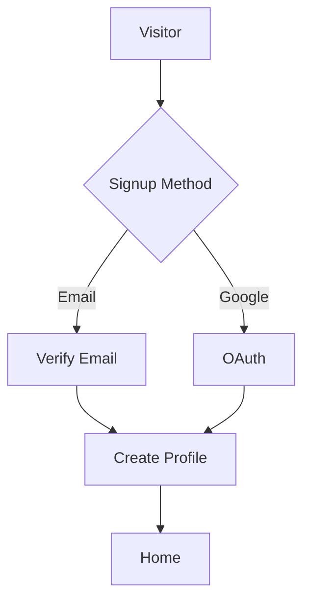
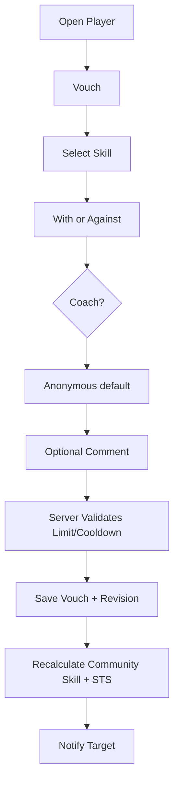
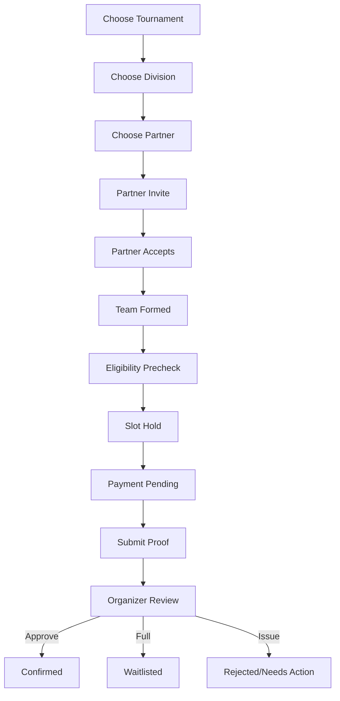

# VouchPlay Master Product & Code Execution Handover v1.2

_(File retains its `…v1.1.md` name; content is v1.2 — see Changelog.)_

**Status:** LOCKED FOR EXECUTION — Phases 0–1 built (see §0Z Current Build Status)  
**Owner:** JT Consulting & Analytics Inc.  
**Founders / Product Leads:** Jasper Adjarani, Tane Valdez  
**Product:** VouchPlay  
**Logo assets:** D:\claude_\P006b_PlayerProfiling\vouchplay_v2\logo_
**Primary launch:** Mobile-first web application / PWA  
**Native target:** Android and iOS after web/PWA stabilization  
**Document purpose:** Single source of truth for product, UX, data model, backend, frontend, business rules, security, testing, deployment, and phased code execution.

**sources**
Local project folder: D:\claude_\P006b_PlayerProfiling\vouchplay_v2
GitHub repo: https://github.com/jasperandrewadjarani-hub/vouchplay_v2
Vercel project: `vouchplayph` (jasperandrewadjarani-hub) — **LIVE:** https://vouchplayph.vercel.app (also https://vouchplay-v2.vercel.app)
Supabase project: https://supabase.com/dashboard/project/itrosesiywpbaxtmucbb
Gmail account (for SMTP): vouchplay@gmail.com

---

# 0Z. Current Build Status — as of 2026-09-05

> Living status block. Update this whenever a phase completes. Full detail lives in
> `notes.md`; `CLAUDE.md` / `AGENTS.md` hold agent working rules + deploy gotchas.

**Live:** https://vouchplayph.vercel.app (public, connected to Supabase). Auto-deploys on push to
`main`; `vouchplayph.vercel.app` is currently a manual alias — re-alias after each deploy (or promote
it to a project domain) until it's made a permanent production domain.

**Phase 0 — Foundations: ✅ DONE.** npm-workspaces monorepo (`apps/web` + `packages/{config,core,db,
ui,validation,analytics}`), Next.js + React 19 + Tailwind v4 + TS strict, locked theme tokens +
dark/light toggle, app shell (5 tabs, header, sidebar, bottom nav), PWA manifest, ESLint/Prettier/
Vitest, GitHub Actions CI.

**Phase 1 — Database, Auth, Permissions: ✅ core DONE.**
- DB migrations applied to Supabase (`0001_core_identity`, `0002_seed_system_settings`):
  `profiles`, `user_roles`, `role_applications`, `identity_verifications`, `system_settings`,
  `audit_logs` (append-only); `updated_at` + new-user triggers; SECURITY DEFINER authz helpers
  (`has_global_role`/`is_admin`/`is_staff`); RLS on all user-facing tables; 21 seeded settings.
- Auth LIVE + verified end-to-end on production: email 6-digit OTP code (Gmail Custom SMTP),
  password login, **Google login**, `/auth/callback`, profile onboarding, route guards.
- Supabase Auth config: "Confirm email" OFF (OTP is the verification), Email OTP length 6, Magic-link
  template emits `{{ .Token }}`, redirect allowlist set for both prod domains + localhost.
- **Still open within Phase 1 (do early in/around Phase 2):** `supabase gen types` → `@vouchplay/db`;
  seed JT admin accounts; RLS/role-spoofing test pass; Admin MFA framework; avatar upload on
  onboarding (needs `avatars` bucket); reset-link landing page (`/me/settings/password`).

**Deploy constraint (see CLAUDE.md):** pinned to **Next.js 15** to dodge a Vercel×Next-16 deploy bug;
root `vercel.json` + root-level `next` dep make monorepo detection work. Revert to Next 16 only per
the documented exit plan.

**Deviations from this document (approved by JT):** transactional email uses **Gmail SMTP** for the
pilot (not a dedicated provider — §34A.11), behind the `EmailProvider` interface; switch before scale.

**Ops flags:** Supabase org is **over-quota** (projects restricted from 21 Sep 2026 if not cleared);
Google consent screen shows the Supabase project domain (cosmetic; needs paid custom domain to rebrand).

**Next:** Phase 2 — Player Directory & Profile.

---

# 0. Executive Directive

This document replaces fragmented product notes and should be treated as the authoritative implementation handover for VouchPlay v1.

The build team or coding agent must not invent alternative product rules where this document is explicit. Where a value is expected to change operationally, it must be implemented as an **Admin-configurable setting**, not hardcoded.

The execution priority is:

1. Correctness of trust, identity, permissions, and tournament state.
2. Prevention of vouch abuse and sandbagging manipulation.
3. Mobile-first usability.
4. Organizer efficiency.
5. Auditability.
6. Scalability without premature infrastructure complexity.
7. Native-app readiness without duplicating the backend.

VouchPlay is not merely a social profile directory. Its core loop is:

> **Create a player profile → receive credible community vouches → build a trusted skill profile → join clubs and tournaments → allow organizers to make better eligibility decisions → generate more verified playing history → improve the player profile.**

The core differentiator is the **community-backed skill profile and tournament eligibility decision-support system**.

The system must never automatically label a person a "sandbagger" or "smurf." It may flag a **Potential Skill Mismatch**, **Low Confidence**, **Historical Skill Mismatch**, or **Unusual Vouch Activity** for organizer/admin review.

---

# 1. Product Definition

## 1.1 What VouchPlay Is

VouchPlay is a social sports platform where a player's skill reputation and credibility are supported by community vouches rather than only self-declaration.

Players can:

- Create and maintain a public player profile.
- Self-rate their skill.
- Receive skill vouches from other players.
- Request vouches.
- Give limited vouches within rolling 24-hour limits.
- Leave attributed vouch comments.
- Build a community skill profile.
- Join, own, or help manage clubs.
- Discover tournaments.
- Express interest in tournaments.
- Find or invite partners.
- Register for tournament divisions.
- Represent clubs.
- Receive sponsorship/recruitment offers from clubs.
- Display achievements and community-endorsed skill tags.
- Report abuse or request skill review.
- Block other users.

Approved Coaches can give higher-credibility vouches.

Approved Organizers can create and manage tournaments.

Club Owners and Club Admins can manage clubs, memberships, recruitment, and sponsorship offers.

JT Admins can verify identity/roles/clubs, manage moderation, configure scoring parameters, oversee tournaments, and maintain system integrity.

## 1.2 Primary Problems Solved

1. Sandbagging and smurfing in tournaments.
2. Self-declared skill levels with little evidence.
3. Tournament eligibility disputes and protests.
4. Lack of a centralized player directory/profile.
5. Difficulty finding partners for tournaments.
6. Fragmented club membership and recruitment.
7. Difficulty organizing tournament registration and eligibility.
8. Lack of a reusable historical player record.
9. Difficulty exporting structured participant data to tournament systems.

## 1.3 Product Principle

VouchPlay provides **evidence and decision support**. Final tournament classification remains under organizer authority unless a hard eligibility rule is violated.

---

# 2. Locked Scope by Release

## 2.1 V1 / MVP — Must Build

### Identity & Access
- Email/password signup with email verification.
- Google login.
- Account linking where possible.
- Forgot/reset password.
- Change password.
- Change email with re-verification.
- Logout and logout-all-sessions.
- Account deactivation.
- Account deletion request and workflow.
- Apple Sign In before native iOS launch.

### Player Profiles
- Avatar.
- First name.
- Last name.
- Nickname / IGN.
- City.
- Sex.
- Date of birth or age source.
- Self-rated skill.
- Facebook profile link.
- Looking for Partner status.
- Open for Sponsorship status.
- Club affiliations.
- Role badges.
- Skill verification badge.
- Identity verification badge.
- Community skill.
- Skill Trust Score.
- Vouch distribution.
- Vouch comments.
- Achievements.
- Skill tags.
- Public sharing URL.

### Vouching
- Daily/rolling 24-hour limits.
- Player/Coach weight differences.
- Anonymous-by-default rating identity.
- Non-anonymous option.
- Comments always attributed.
- Played With / Played Against.
- Coach vouch toggle, only enabled for approved coaches.
- One active skill vouch per voucher→vouchee pair.
- Vouch update replaces prior active rating.
- Vouch cooldown.
- Vouch history.
- Request a vouch.
- Anti-abuse flags.
- Admin invalidation.
- Score recalculation.

### Clubs
- Create club.
- Pending/verified/unverified/suspended/inactive states.
- Request to join.
- Invite/recruit player.
- Sponsorship offer.
- Leave club.
- Owner/Admin/Member roles.
- Club members.
- Club public page.
- Club privacy.
- Active/inactive.
- Verification request.
- Ownership transfer.
- Admin assignment.
- Club deletion workflow.

### Tournaments
- Organizer application.
- Tournament creation.
- Tournament photo.
- Venue.
- Date/time.
- Registration opening/closing.
- Divisions.
- Fees.
- Max slots.
- Co-organizers.
- Club co-organizer option.
- Public sharing URL.
- Interested list.
- Looking-for-partner list.
- Partner invitations.
- Team formation.
- Multiple entries.
- Club representation.
- Payment proof flow.
- Approval/rejection/waitlist.
- Eligibility evaluation.
- Skill mismatch review.
- Club lock.
- Registration lock.
- Participant/team export.
- Tournament announcements.
- Tournament lifecycle.

### Safety & Moderation
- Report player.
- Report comment.
- Report club.
- Report tournament.
- Request skill review.
- Block player.
- Moderation queue.
- Admin actions.
- Appeals/support path.
- Audit logs.

### Admin
- User search.
- Manual verification.
- Role approval/revocation.
- Club verification.
- Tournament override.
- Vouch configuration.
- Vouch invalidation.
- Report/moderation management.
- Fraud flags.
- System settings.
- Analytics.
- Audit log.
- Global announcements.
- Maintenance/feature flags.

### Notifications
- In-app notifications.
- Email notifications for critical events.
- Notification preferences.
- Deep links.
- Push-ready abstraction.

### Public Access
Non-users can view:
- Public player profiles.
- Public club pages.
- Public tournament pages.

If a non-user attempts to:
- vouch,
- request vouch,
- join a club,
- partner,
- register for tournament,
- recruit/sponsor,
- interact with protected features,

the signup/login gate is shown and the original action is resumed after authentication.

---

## 2.2 Phase 2

- Native Expo mobile application.
- Apple Sign In.
- Native push notifications.
- Verified-match vouch weighting.
- Automated result imports.
- Tournament scoring/bracket integration.
- Vouch freshness/decay if required by data.
- Advanced vouch-ring detection.
- Advanced sponsorship workflows.
- **Gamified player bidding** (clubs bid points to represent/sponsor players; §16A).
- **Home leaderboards** (top players / most bidded / top clubs with medals; §6.1).
- Club Pro features.
- Organizer paid tiers.
- Payment gateway integration.
- QR player/tournament profiles.
- Rich share cards.
- Enhanced performance history.
- Inter-city rankings only if data quality supports it.
- Direct messaging only after moderation capacity exists.

## 2.3 Explicitly Not Required for V1

- Open social feed.
- Real-time chat/DM.
- Money transfer between clubs and players.
- Sports betting.
- Public "sandbagger" labels.
- DUPR or other third-party rating references.
- Full tournament live-scoring engine.
- Microservices.
- Elasticsearch/OpenSearch.
- Redis unless later justified by load.
- Blockchain/NFT features.

---

# 3. Canonical Vocabulary

Use these names consistently in database, API, UI, documentation, and analytics.

## 3.1 Skill Bands

Canonical order:

0. Newbie
1. Beginner
2. Novice
3. Low Intermediate
4. High Intermediate
5. Advanced
6. Pro

`Open` is **not** a skill level. It is an eligibility type.

`Age-Defined` is **not** a skill level. It is an eligibility rule.

Tournament defaults should generally start at Beginner, not Newbie, but Newbie remains a valid profile skill.

## 3.2 Verification Terms

**Identity Verified**  
JT/VouchPlay has verified the identity of the user.

**Skill Verified**  
The player meets the system's configured community-evidence threshold.

**Verified by VouchPlay**  
An administrative manual skill-verification override. This must never fabricate or change the calculated STS.

## 3.3 Skill Metrics

**Self-Rated Skill**  
The player's own declared level.

**Community Skill Level (CSL)**  
The community's weighted consensus level.

**Skill Trust Score (STS)**  
A 0.0–5.0 confidence score describing the strength and consistency of evidence behind the Community Skill Level.

These three values must never be conflated.

---

# 4. Roles & Permission Model

VouchPlay uses one account per person. A user does **not** "log in as organizer."

Roles are additive permissions.

## 4.1 Global Roles

- `PLAYER` — automatic for every registered account.
- `COACH` — approved by JT Admin.
- `ORGANIZER` — approved by JT Admin.
- `MODERATOR` — JT staff role.
- `SUPPORT` — JT staff support role.
- `ADMIN` — JT administrative role.
- `SUPER_ADMIN` — highest JT authority.

## 4.2 Contextual Roles

Contextual roles are relationships, not global roles:

- Club Owner.
- Club Admin.
- Club Member.
- Tournament Owner/Organizer.
- Tournament Co-organizer.

## 4.3 Permission Matrix

| Capability | Player | Coach | Organizer | Club Owner/Admin | Moderator | Admin | Super Admin |
|---|---:|---:|---:|---:|---:|---:|---:|
| View public profiles | ✓ | ✓ | ✓ | ✓ | ✓ | ✓ | ✓ |
| Edit own profile | ✓ | ✓ | ✓ | ✓ | ✓ | ✓ | ✓ |
| Vouch | ✓ | ✓ | ✓ | ✓ | ✓ | ✓ | ✓ |
| Use coach-weight vouch | — | ✓ | If Coach too | If Coach too | If Coach too | Configurable | Configurable |
| Create club | ✓ | ✓ | ✓ | ✓ | ✓ | ✓ | ✓ |
| Manage owned club | Owner only | Owner only | Owner only | ✓ | — | ✓ | ✓ |
| Apply as Coach | ✓ | — | ✓ | ✓ | ✓ | — | — |
| Apply as Organizer | ✓ | ✓ | — | ✓ | ✓ | — | — |
| Create tournament | — | — | ✓ | If Organizer | — | ✓ | ✓ |
| Manage own tournament | — | — | ✓ | If assigned | — | ✓ | ✓ |
| Review reports | — | — | Limited tournament skill review only | Club-specific limited | ✓ | ✓ | ✓ |
| See anonymous voucher identity | — | — | — | — | Moderation need only | ✓ | ✓ |
| Verify identity | — | — | — | — | — | ✓ | ✓ |
| Approve roles | — | — | — | — | — | ✓ | ✓ |
| Change system config | — | — | — | — | — | Limited | ✓ |
| Manage Admin roles | — | — | — | — | — | — | ✓ |

All authorization must be enforced server-side and through database row-level security where appropriate.

---

# 5. Information Architecture & Navigation

## 5.1 Primary Mobile Navigation

Locked to five tabs:

1. **Home**
2. **Players**
3. **Clubs**
4. **Tournaments**
5. **Me**

Do not use Settings as a primary bottom-navigation item.

## 5.2 Header

Default mobile header:

- VouchPlay logo: upper left.
- Notification bell: upper right (profile avatar may sit beside it when signed in).
- Contextual overflow `•••`: only where relevant.

Profile is accessed from **Me**, not duplicated permanently in the header.

### 5.2.1 Logo treatment (design refinement, 2026-09-05)

- **Enlarge the header logo** — make the VouchPlay wordmark visibly bigger/more prominent than the
  current build (still fitting a ~56px header; scale up the mark, don't overflow the bar).
- Directly **below the logo**, add **very small but legible** microcopy: **"by JT Consulting &
  Analytics"** (roughly 9–10px, `text-foreground-muted`, non-wrapping). The logo + this line form one
  clickable unit that links to the JT Facebook page (`https://www.facebook.com/61590234100280/`).
- Keep the mark crisp in both themes (use the transparent logo asset in `logo_/`).
- Position is **confirmed upper-left** (locked IA); the notification bell / profile avatar stay
  upper-right.

## 5.3 Me Section

Contains:

- My Profile.
- Edit Profile.
- My Vouches / Vouch History.
- Vouch Requests.
- My Clubs.
- My Tournaments.
- Partner Requests.
- Sponsorship/Recruitment Offers.
- Coach application.
- Organizer application.
- Role tools.
- Settings.
- Privacy.
- Notification preferences.
- Help / FAQ.
- About.
- Terms.
- Community Guidelines.
- Contact Support.
- Delete/Deactivate Account.
- Logout.

All JT branding in About may link to:

`https://www.facebook.com/61590234100280/`

### 5.3.1 Where About & FAQ live (discoverability)

**About** and **FAQ** are reached from **Me → Help / FAQ** and **Me → About** (this section), and
their full content is specified in **§29**. They are **not** yet built (planned Phase 12 / late
Phase 1 legal-pages pass) — routes `/about` and `/faq` (and `/terms`, `/privacy`) currently render
placeholder stubs.

To make them easy to find, also surface them in:
- the **Me** list (primary home — grouped under a "Help & About" or Settings group),
- the header **•••** overflow on relevant pages (About · FAQ · Contact Support), and
- a small **footer** on public pages (About · FAQ · Terms · Privacy · "by JT Consulting & Analytics").

## 5.4 Desktop / Tablet Adaptation

At large widths:

- Bottom nav becomes left sidebar.
- Main content uses centered max-width layout.
- Context panels may appear to the right.
- Do not create a separate desktop product architecture.

---

# 6. Home Dashboard

Home is a personalized utility dashboard with a light **gamified spotlight** on top — not a social feed.

Sections are prioritized dynamically:

1. Profile / skill summary.
2. Action-required cards.
3. **Bidding spotlight** — top players currently being bid on (see §16A).
4. **Leaderboards** — top players, most-bidded players, top clubs (with medals). See §6.1.
5. Upcoming tournament registrations.
6. Partner requests.
7. Vouch requests.
8. Club activity.
9. Tournament discovery.
10. Recent vouches/comments.
11. System/organizer announcements.

Example action cards:

- "2 vouch requests waiting."
- "Partner invitation for PZZ Cup 2027."
- "Payment proof rejected — resubmit."
- "Your team was promoted from the waitlist."
- "Your Coach application was approved."
- "🔥 3 clubs are bidding to sponsor you — review offers."

## 6.1 Leaderboards & Bidding Spotlight (2026-09-05)

The Home button surfaces **leaderboards** and a **bidding spotlight**, integrated into the existing
card layout (a horizontally-scrollable "podium" row + tappable leaderboard cards), not a separate
screen.

**Leaderboards (medal styling 🥇🥈🥉 for the top 3):**
- **Top Players** — ranked by an **engagement/credibility composite**, NOT raw STS. Suggested inputs:
  verified-match/tournament participation, achievements/medals, Skill-Verified status, number of
  distinct credible vouchers, and bidding interest — deliberately excluding a raw "highest STS"
  ranking to avoid incentivizing vouch manipulation (handover gamification guardrail).
- **Most Bidded** — players with the most/highest active bids (see §16A). This is the headline
  gamified metric.
- **Top Clubs** — ranked by club activity: verified members, players sponsored/recruited via winning
  bids, tournament participation, medals won by represented players.

**Bidding spotlight:** a "🔥 Hot right now" row of players receiving active bids, each card showing the
current top bid, number of bidding clubs, and a countdown to bid close — tap to view the player and
(if it's you) to accept/decline.

**Rules & guardrails:**
- Leaderboards are **scoped** (by city/region and by tournament where relevant), refreshed on a cadence
  (not real-time), and cache-first per §34A. Never rank by raw STS or expose internal effective weights.
- Bidding uses **reputation/points, not money** in V1 (see §16A) — no real-currency wagering.
- Respect privacy/visibility: a player can opt out of appearing in public leaderboards (profile
  setting); minors and restricted/suspended accounts are excluded.
- Admin can hide/reset leaderboards and exclude flagged accounts.

Leaderboards + bidding are **Phase 2+ / a dedicated gamification sub-phase** — foundational player
directory & profiles (Phase 2) land first, then bidding (§16A), then leaderboards read from it.

---

# 7. Account Creation & Authentication

## 7.1 Signup Methods

### Option A — Email
- Enter email.
- Send one-time verification email/code through custom SMTP.
- Verify email.
- Set password.
- Continue to profile creation.

### Option B — Google
- OAuth via Google.
- If email is new, create account.
- If email maps to an existing account, link identity where safe.
- Continue to profile completion if required fields are missing.

### Native iOS
Add Apple Sign In before App Store launch.

## 7.2 Login

- Email + password.
- Google.
- Apple when enabled.

## 7.3 Required Profile Fields

- First Name `required`
- Last Name `required`
- Nickname / IGN `required`
- Sex `required`
- Self-Rated Skill `required`

Recommended required operational field:
- City `required for V1 launch region`, but Admin can later make optional.

Optional:
- Profile picture.
- Facebook profile.
- Bio.

## 7.4 Sex & Age Privacy

Sex is stored for tournament eligibility. V1 supports:
- Male
- Female

Public display can be controlled by a profile visibility setting. Tournament organizers can still access sex when required for eligibility.

Store `date_of_birth` rather than a permanently stored integer age. Displayed age is calculated.

User can hide age publicly. Organizers may access age only when needed for an age-defined division.

## 7.5 Account Recovery & Safety

Must support:
- Forgot password.
- Password reset.
- Email change and re-verification.
- Session revocation.
- Logout all devices.
- Deactivate account.
- Delete account.
- Merge/duplicate-account support through Admin.
- Impersonation report.

---

# 8. Player Directory

## 8.1 Player Card

Keep cards concise.

Default contents:
- Avatar.
- First + Last Name.
- Nickname/IGN.
- Sex icon if visible.
- City if visible.
- Community Skill Level if available; otherwise Self-Rated Skill with clear label.
- Skill Verified badge where applicable.
- STS.
- Up to 3 club icons.
- Important status badges.
- Vouch button.

Do not render empty fields.

## 8.2 Status Badges

- Looking for Partner.
- Open for Sponsorship.
- Coach.
- Organizer.
- Club Owner where contextually useful.
- Identity Verified.
- Skill Verified.

## 8.3 Club Icon Interaction

Clicking the club-icon stack opens a compact sheet/modal:
- club name,
- verified status,
- relationship: Owner/Admin/Member,
- clickable club page.

## 8.4 Search & Filters

Players:
- Name.
- Nickname/IGN.
- City.
- Community skill.
- Self-rated skill.
- Skill Verified.
- Identity Verified.
- Club.
- Sex.
- Looking for Partner.
- Open for Sponsorship.
- Coach.

Default sort:
1. relevant search match,
2. verified/high-confidence profiles,
3. recent activity,
without presenting an explicit popularity leaderboard.

---

# 9. Player Profile

## 9.1 Profile Header

Show:
- Avatar.
- Name.
- Nickname.
- City.
- Role badges.
- Identity verification.
- Skill verification.
- Community Skill Level.
- STS.
- Self-Rated Skill.
- Club stack.
- Status badges.

Primary actions:
- Vouch.
- Request a Vouch.
- Request to Partner.
- Share.

Contextual actions:
- Recruit Player — club owner/admin.
- Sponsor Player — club owner/admin.
- Request Skill Review.
- Report.
- Block.

## 9.2 Skill Distribution

Show vouch distribution by skill band.

Example:

- Beginner — 2
- Novice — 6
- Low Intermediate — 18
- High Intermediate — 5
- Advanced — 0

Each row can display up to several voucher icons.

For anonymous vouchers:
- generic anonymous avatar icon.

For public vouchers:
- actual avatar.

Clicking the icon group opens the voucher list permitted by visibility rules.

## 9.3 Vouch Comments

Comments are always attributed to their author.

Display:
- commenter identity.
- role badge.
- date.
- comment.
- report action.

Do not reveal an anonymous rating solely because the user left a comment. The comment author is visible, but the exact skill rating remains subject to the rating's visibility setting.

## 9.4 Achievements

Support two classes.

### Official Achievements
Issued by:
- system,
- verified organizer,
- admin.

Examples:
- Tournament Champion.
- Runner-up.
- Bronze.
- MVP.
- Sportsmanship.
- Tournament Participant.

Official achievements use a verified issuer label.

### Community Achievement Claims
Player may add a claim.
Other players can endorse/thumbs-up.
Clearly label these as community claims, not official tournament records.

## 9.5 Skill Tags

Community-endorsed playing traits:

Examples:
- Fast Hands.
- Strong Defense.
- Court IQ.
- Dinking.
- Serve.
- Returns.
- Drives.
- Resets.
- Speed-ups.
- Communication.

Skill tags are not part of the Community Skill Level calculation in V1.

---

# 10. Vouch Engine

This is a core domain module and must be implemented with dedicated unit tests.

## 10.1 Vouch Form

Fields:
- Skill Level `required`.
- Played With / Played Against `required`.
- Vouch as Coach toggle:
  - enabled only if user has approved Coach role,
  - default OFF,
  - when OFF, normal-player weight applies,
  - when ON, coach weight applies.
- Anonymous toggle:
  - default ON.
- Optional comment.
- Submit.

Help text must clearly state:
- anonymous refers to the rating's public attribution,
- VouchPlay Admin may still inspect identity for safety,
- comments are never anonymous,
- one active skill vouch exists per player pair.

## 10.2 Locked Vouch Rules

- Cannot vouch for yourself.
- Voucher and target must both be active accounts.
- One active vouch per `voucher_id + target_id`.
- Updating an existing vouch replaces the previous active value.
- Every revision is stored in history.
- Vouch updates are subject to cooldown.
- Suspended/restricted accounts cannot issue new vouches.
- Invalidated vouches do not affect calculations.
- Blocked users cannot initiate new interactions with each other.
- Rate limits enforced server-side.
- Admin can invalidate vouch with reason.
- Admin cannot silently edit another user's vouch.
- No public display of raw internal effective weights.

## 10.3 Default Rolling 24-Hour Limits

Admin-configurable:

- Normal Player: `5`
- Coach: `20`

The system uses a rolling 24-hour window, not a calendar-day reset.

Updating an existing vouch counts as one vouch action.

## 10.4 Default Vouch Update Cooldown

Admin-configurable default:

`30 days`

Admin may override for moderation/data correction.

## 10.5 Vouch Weight Model

Default weights:

| Vouch Source | Weight |
|---|---:|
| Normal player | 1.00 |
| Identity Verified player | 1.25 |
| Approved Coach using Coach toggle | 2.00 |
| Identity Verified Coach using Coach toggle | 2.50 |

Important:
- `Skill Verified` status does **not** increase vouch weight. This avoids a circular scoring system.
- Facebook profile does not increase skill weight.
- Uploaded ID does not directly increase skill; identity verification affects the source credibility weight.
- Organizer role does not automatically increase skill-vouch weight.

Weights are stored in Admin settings and copied to each vouch calculation snapshot for auditability.

## 10.6 Community Skill Level Calculation

Convert skill bands to ordinal values:

- Newbie = 0
- Beginner = 1
- Novice = 2
- Low Intermediate = 3
- High Intermediate = 4
- Advanced = 5
- Pro = 6

For all active, non-invalidated vouches:

1. Determine effective vouch weight.
2. Sort ratings by ordinal skill.
3. Compute **weighted median**.
4. Weighted median becomes the `Community Skill Level`.
5. Also calculate a weighted mean for internal diagnostics only.
6. Store visible distribution counts by skill level.

Reason for weighted median:
- prevents extreme opposite ratings from producing a misleading middle average,
- resists outliers better than arithmetic mean.

## 10.7 Skill Trust Score (STS) Calculation

STS measures confidence in the community assessment, not skill.

Default range:
`0.0–5.0`

Inputs:

### A. Evidence Count Component
`count_component = min(unique_active_vouchers / 5, 1.0)`

### B. Evidence Weight Component
`weight_component = min(sum_effective_weights / 7.5, 1.0)`

### C. Agreement Component
Determine weighted absolute distance of all ratings from weighted median.

`dispersion = weighted_mean(abs(rating_ordinal - weighted_median))`

`agreement_component = max(0, 1 - min(dispersion / 2.0, 1))`

### Final

`STS = round(5 * (0.50*count_component + 0.25*weight_component + 0.25*agreement_component), 1)`

Clamp to `0.0–5.0`.

## 10.8 Skill Verified Rule

Default system requirement:

- STS >= `3.0`
- at least `2 unique active vouchers`

Both values are Admin-configurable.

If automatic condition is true:
`skill_verification_type = COMMUNITY`

If Admin manually verifies:
`skill_verification_type = ADMIN_OVERRIDE`

Admin override does not change calculated STS.

## 10.9 Manual Verification Display

If community-verified:

`✓ Skill Verified`

If manually verified but STS is below community threshold:

`✓ Verified by VouchPlay`

The profile must still show the real calculated STS.

## 10.10 Algorithm Versioning

Store:
- `algorithm_version`,
- component values,
- calculated_at,
- input vouch count,
- input weight sum.

Initial version:
`STS_V1`

Never alter historical calculation semantics without incrementing algorithm version.

---

# 11. Vouch Fraud & Abuse Controls

## 11.1 V1 Hard Controls

- rolling vouch limit,
- one active vouch per pair,
- cooldown,
- server-side permissions,
- email verification,
- duplicate-account tools,
- block controls,
- account restrictions,
- vouch invalidation,
- full vouch revision history.

## 11.2 V1 Risk Flags

Generate internal fraud flags for:
- sudden rating spike,
- unusually high reciprocal-vouch ratio,
- many vouches from newly created accounts,
- many vouches from a single club in a short period,
- repeated downward/upward coordinated rating pattern,
- many identities sharing suspicious technical signals where legally and technically appropriate,
- Coach with unusually extreme rating distribution.

Risk flags do not automatically punish or alter public scores unless a vouch is invalidated through moderation.

## 11.3 Fraud Flag Workflow

`OPEN → REVIEWING → CLEARED / ACTION_TAKEN`

Possible actions:
- dismiss,
- warn,
- invalidate selected vouches,
- restrict vouching,
- suspend account,
- ban account.

All actions require reason and audit log.

---

# 12. Request a Vouch

Player can request a vouch from another user.

Rules:
- cannot request from self,
- cannot spam blocked users,
- configurable request rate limit,
- duplicate pending request to same player is prevented,
- request may include optional short message,
- recipient receives notification,
- request deep-links to target profile + vouch modal,
- requester is notified when request is fulfilled,
- recipient may dismiss.

Default request limit:
`10 per rolling 24 hours`

Admin-configurable.

---

# 13. Identity Verification

## 13.1 Purpose

Identity verification confirms a real-person identity. It does not directly prove skill.

## 13.2 V1 Flow

- User uploads permitted identification.
- User provides verification consent.
- Private verification record is created.
- Admin reviews.
- Approve / reject / request resubmission.
- Public profile shows only verification status, never ID details.

## 13.3 Sensitive Storage Rule

Identity-document files must use a private bucket.

Default retention:
- delete original ID image `30 days after final verification decision`, unless legal or dispute retention requires otherwise.
- keep minimal verification metadata and audit record.

Admin-configurable retention, subject to legal review.

---

# 14. Skill Review vs Report

These are separate systems.

## 14.1 Request Skill Review

Use when a player believes another player's displayed/community skill is materially inaccurate.

Fields:
- target player,
- optional tournament context,
- reason,
- optional evidence,
- submitter identity stored,
- not publicly displayed.

Possible review statuses:
`OPEN → UNDER_REVIEW → RESOLVED_NO_CHANGE / RESOLVED_ADMIN_NOTE / RESOLVED_VOUCH_ACTION / CLOSED`

Organizers may submit tournament-context skill reviews.

## 14.2 Report

Use for:
- harassment,
- impersonation,
- abusive content,
- fake account,
- spam,
- fraud,
- inappropriate behavior,
- other policy violation.

Reports are never anonymous to Admin.

## 14.3 Blocking

A player may block another player.

Blocking prevents:
- new vouch request,
- partner invitation,
- recruitment/sponsorship invitation,
- direct future interaction channels.

Existing public vouches remain unless separately invalidated.

---

# 15. Clubs

## 15.1 Club Lifecycle

Statuses:
- `PENDING_VERIFICATION`
- `VERIFIED`
- `UNVERIFIED`
- `ACTIVE`
- `INACTIVE`
- `SUSPENDED`
- `DELETED`

Verification and operational status should be modeled separately internally:
- `verification_status`
- `activity_status`

## 15.2 Club Creation

Any active Player can create a club.

Required:
- Club name.
- City/location.
- Club image/logo if available.
- Description.
- Owner.

Optional:
- social links,
- contact,
- privacy.

Creation immediately creates owner membership.

Verification request goes to Admin.

## 15.3 Club Roles

- Owner.
- Admin.
- Member.

Only one primary Owner at a time.

Owner can:
- transfer ownership,
- add/remove Club Admin,
- approve members,
- remove members,
- recruit,
- sponsor,
- edit,
- set privacy,
- set active/inactive,
- request deletion.

## 15.4 Membership Lifecycle

`REQUESTED → APPROVED / REJECTED`

or

`INVITED → ACCEPTED / DECLINED / EXPIRED`

or

`ACTIVE → LEFT / REMOVED`

## 15.5 Club Public Page

Show:
- club logo,
- name,
- location,
- verified status,
- description,
- member count,
- owners/admins,
- player icon stack,
- active tournaments where relevant,
- Join / Leave button,
- Share.

Click player icon stack → searchable member list → player profiles.

## 15.6 Privacy

Default:
`PUBLIC`

Possible:
- PUBLIC.
- APPROVAL_REQUIRED.

Fully hidden clubs are not part of V1 unless JT later enables.

## 15.7 Club Delete

Owner must:
- re-enter password for password-based accounts or reauthenticate OAuth,
- confirm deletion.

Deletion is soft-delete first.

If owner is the only owner and active obligations exist, deletion may be blocked until resolved.

---

# 16. Recruitment & Sponsorship

## 16.1 Recruitment

Club Owner/Admin may send recruitment offer.

States:
`SENT → ACCEPTED / DECLINED / CANCELLED / EXPIRED`

Accepting recruitment may:
- create club membership directly, or
- create approved membership awaiting user confirmation.

Default behavior:
Acceptance creates active membership.

## 16.2 Sponsorship

V1 sponsorship is an offer/relationship record, not a money-transfer system.

Fields:
- club,
- player,
- optional tournament,
- offer note,
- status.

States:
`SENT → ACCEPTED / DECLINED / CANCELLED / COMPLETED`

A player can set:
`Open for Sponsorship = true/false`

---

# 16A. Gamified Player Bidding (2026-09-05)

A gamified extension of Recruitment (§16.1) and Sponsorship (§16.2): instead of a single private
offer, **multiple clubs place competing bids** to secure a player, and **the player accepts one**.
This drives engagement, powers the Home **bidding spotlight** and **"Most Bidded" leaderboard** (§6.1),
and feeds tournament **club representation** (§22).

## 16A.1 What a bid is

A bid is a club's competing offer to a player for either:
- **Representation** — the player represents the club in a specific tournament (feeds §22 club
  representation on acceptance), and/or
- **Sponsorship** — the club sponsors the player (covers entry fee / gear / support), with an offer note.

Bids are **points-based, never money** in V1 (reputation/soft-currency only — no real-currency
wagering, escrow, or transfer; this keeps V1 out of gambling/payments regulation). A club spends from a
**bid budget** of points (allocated by Admin / earned through activity — exact economy is an Admin
setting, §30.7). Losing/withdrawn bids **refund** the club's points.

## 16A.2 Actors & eligibility

- Only a **verified, active club** can bid; only its **Owner/Admin** may place/raise/withdraw bids.
- A club cannot bid on a **suspended/restricted** player, nor on its own owner where that would be a
  conflict (configurable).
- A player must have **`open_for_bids = true`** (extends `open_for_sponsorship`) to receive bids; they
  can scope it (global, or per-tournament / per-division).
- Bids may be **tournament-scoped** (tied to a `tournament_id`, and optionally a division), or open.

## 16A.3 Bid lifecycle

Per-bid status:

`PLACED → LEADING / OUTBID → ACCEPTED / DECLINED / WITHDRAWN / EXPIRED / REFUNDED`

Per-player "auction" for a given (player, tournament) context:

`OPEN (accepting bids) → CLOSED (player accepted one, or all declined/expired)`

Rules:
- New higher bids mark previous bids **OUTBID** (points held until the auction closes, then refunded to
  non-winners). Enforce a **minimum increment** (Admin setting).
- The **player chooses** — they may accept the top bid, accept a **lower** bid (preference is allowed;
  it's their representation), or decline all. There is no auto-award purely by highest points.
- **Acceptance is transactional** (§35.3): it closes the auction, creates the winning
  representation/sponsorship record (via §16 `club_offers` + §22 representation), debits the winning
  club's points, refunds losing clubs, and notifies everyone.
- **Close/expiry:** each auction has a deadline; a tournament-scoped auction must close no later than
  `tournament.club_lock_at` (§22.5). Expiry refunds all held points.
- Blocking (§14.3) prevents a blocked club owner from bidding on a player.

## 16A.4 Anti-abuse (reuses §11 patterns)

- Per-club bid rate limits + cooldowns; minimum increment; max concurrent bids (Admin settings).
- Flag suspicious patterns: rings of clubs inflating a player, a club and player colluding to farm
  points, wash-bidding (bid/withdraw loops). Flags go to the moderation/fraud queue (§11.3); they don't
  auto-punish.
- Every bid, raise, withdraw, accept, decline, refund is **audited** (§30.8).

## 16A.5 UI/UX integration

- **Player profile (§9):** an **"Open for Bids"** toggle and, when open, a **Bids** panel showing
  incoming bids ranked, with Accept / Decline per bid and a countdown to close. Reuses the existing
  offer-card and status-chip components (§33.4).
- **Club owner/admin:** on a player profile, a **"Place bid / Raise bid"** action (points picker +
  representation/sponsorship type + optional tournament/division + note); a **My Bids** view under the
  club and under **Me → Sponsorship/Recruitment Offers**.
- **Home (§6.1):** bidding spotlight ("🔥 Hot right now") + "Most Bidded" leaderboard.
- **Tournament page:** where a tournament is in scope, show which players are open for bids for it.
- Respect privacy: a player may hide bid counts publicly while still receiving them.

## 16A.6 Notifications (extends §27)

- Player: new bid received; you were out-bid-adjacent updates; bid you hold expiring; auction closing soon.
- Club: your bid is leading / was out-bid; player accepted / declined your bid; auction expired; points refunded.

## 16A.7 Data

New entity `player_bids` (see §36.18A). It references `clubs`, `profiles` (player), optional
`tournaments`/`divisions`, carries points/status/expiry, and on acceptance links to the created
`club_offers` / representation record. Bid points ledger is captured via `audit_logs` (and, if the
economy grows, a dedicated `club_points_ledger` in a later phase).

## 16A.8 Scope / phasing

Bidding is **not V1-MVP-critical**; it is a **gamification sub-phase after Phase 2** (needs players,
clubs, and tournament representation to exist first). Build order: player directory/profiles (Phase 2)
→ clubs (Phase 5) → tournaments + representation (Phase 6–7) → **bidding (§16A)** → **leaderboards
(§6.1)** which read from bidding + participation. Keep it points-only in V1; a real-money/sponsorship-
marketplace is explicitly out of scope (§2.3) until legal/payments review.

---

# 17. Tournament Core

## 17.1 Organizer Requirement

Only users with approved `ORGANIZER`, `ADMIN`, or `SUPER_ADMIN` permission may create tournaments.

A Player may apply for Organizer role from:
- Profile/Me,
- Tournament Create entry point.

## 17.2 Tournament Lifecycle

Locked states:

1. `DRAFT`
2. `PUBLISHED`
3. `REGISTRATION_OPEN`
4. `REGISTRATION_CLOSED`
5. `LOCKED`
6. `LIVE`
7. `COMPLETED`
8. `ARCHIVED`

Alternate terminal:
- `CANCELLED`

Rules:
- Draft is organizer-only.
- Published may be visible before registration opens.
- Registration Open accepts registration actions.
- Registration Closed disallows new registrations but organizer can manage pending.
- Locked freezes team/club/division changes except organizer override.
- Live indicates event is underway.
- Completed permits results/achievements.
- Archived is historical.
- Cancelled triggers participant notification.

## 17.3 Tournament Fields

Required:
- Name.
- Cover photo.
- Venue.
- City/location.
- Start date/time.
- End date/time.
- Organizer owner.
- Description.
- Registration open/close.
- Terms/rules.
- Visibility.
- Contact.

Optional:
- social links,
- sponsor content,
- external map,
- payment instructions,
- registration notes.

## 17.4 Co-organizers

Organizer may assign:
- another approved Organizer,
- a verified club.

If a club is assigned, default access is granted to that club's Owner, with explicit confirmation.

Co-organizer permissions should be granular:
- view registrations,
- approve registrations,
- manage payments,
- edit tournament,
- send announcements,
- export,
- manage divisions.

Tournament owner cannot be removed by a co-organizer.

---

# 18. Tournament Division Model

Do not hardcode division names.

A division is assembled from attributes.

## 18.1 Fields

- `name_override` optional.
- `skill_policy`
- `minimum_skill` optional.
- `maximum_skill` optional.
- `format`
- `sex_classification`
- `minimum_age` optional.
- `maximum_age` optional.
- `team_size`
- `capacity_teams`
- `fee_amount`
- `currency`
- `registration_open`
- `registration_close`
- `skill_verified_required`
- `minimum_sts` optional.
- `organizer_approval_required`
- `max_entries_per_player` inherited/override.
- `status`

## 18.2 Skill Policy

Values:
- `BAND` — bounded by skill.
- `OPEN` — no skill restriction.
- `CUSTOM` — organizer-defined rules.

Default bands:
- Beginner.
- Novice.
- Low Intermediate.
- High Intermediate.
- Advanced.
- Pro.

## 18.3 Format

- Singles.
- Doubles.

Doubles default.

Architecture supports future team formats.

## 18.4 Sex Classification

- Men.
- Women.
- Mixed.
- Genderless.

Mixed Doubles default rule in V1:
- one Male + one Female.

Genderless:
- no sex restriction.

## 18.5 Age Rules

Age is an independent eligibility rule.

Examples:
- 55+.
- 18–34.
- Open age.

Age is calculated at tournament start date.

---

# 19. Tournament Discovery / Player View

Tournament card:
- cover,
- name,
- date,
- city,
- registration status,
- organizer,
- divisions summary,
- slots status where useful.

Tournament page:
- details,
- dates,
- venue,
- organizer,
- rules,
- divisions,
- fees,
- registration windows,
- interested-player icon stack,
- joining/team icon stack,
- announcements,
- share.

Primary actions:
- Interested.
- Join Tournament.
- Looking for Partner for this Tournament.
- Share.

## 19.1 Interested

User can:
- mark Interested,
- optionally select one or more divisions.

Interested is not a registration and does not reserve a slot.

Interested lists can be filtered by division.

Organizers should not receive a notification for every Interest action by default.

---

# 20. Partner Finder

## 20.1 Looking for Partner

Player can enable:
- global `Looking for Partner`,
- tournament-specific,
- division-specific.

Tournament partner finder shows compatible players only by default.

Filters:
- division,
- skill,
- sex,
- club,
- verified,
- city,
- STS.

## 20.2 Partner Invitation

States:
`SENT → ACCEPTED / DECLINED / CANCELLED / EXPIRED`

Fields:
- inviter,
- invitee,
- tournament,
- division,
- proposed club representation,
- note.

## 20.3 Compatibility

Before invitation:
- validate division format,
- sex eligibility,
- age eligibility where possible,
- account active status,
- no conflicting locked team.

## 20.4 Simultaneous Cross-Invite

If A invites B and B independently invites A for the same tournament/division before either responds:

- system detects reciprocal pending invitation,
- automatically merges into one accepted partnership,
- creates team,
- notifies both.

This operation must be transactional.

## 20.5 Team Formation

When invitation is accepted:
- lock both players into a team for that specific tournament division.
- player may have other teams in other divisions if tournament allows.

A team is division-specific.

---

# 21. Tournament Registration State Machine

Registration statuses:

1. `INTEREST_ONLY`
2. `PARTNER_PENDING`
3. `TEAM_FORMED`
4. `PAYMENT_PENDING`
5. `PAYMENT_SUBMITTED`
6. `UNDER_REVIEW`
7. `CONFIRMED`
8. `WAITLISTED`
9. `REJECTED`
10. `WITHDRAWN`
11. `CANCELLED`
12. `REFUNDED`

Not every registration traverses every state.

## 21.1 Doubles Default Flow

`TEAM_FORMED → PAYMENT_PENDING → PAYMENT_SUBMITTED → UNDER_REVIEW → CONFIRMED`

If full:
`UNDER_REVIEW → WAITLISTED`

## 21.2 Singles Default Flow

Team consists of one player.

`PAYMENT_PENDING → PAYMENT_SUBMITTED → UNDER_REVIEW → CONFIRMED`

## 21.3 Multiple Entries

Allowed by default.

Tournament setting:
`max_divisions_per_player`

Default:
`3`

Admin/Organizer configurable per tournament.

System warns for schedule conflict risk but does not automatically block unless organizer enables conflict blocking.

## 21.4 Duplicate Prevention

Block:
- duplicate same player in same division,
- duplicate same pair in same division,
- conflicting partner teams in same division,
- registration after lock/close unless organizer override.

---

# 22. Club Representation in Tournaments

Club representation is **player-specific per tournament**, not a single team-level club field.

A player may represent **multiple clubs in the same tournament**.

## 22.1 Organizer-Controlled Maximum

Tournament setting:

`max_clubs_per_player`

Default:

`3`

Rules:
- Organizer may configure the maximum for that tournament.
- Allowed operational range in V1: `1–10`.
- Default is `3`.
- The maximum applies to each player across the tournament, not separately per division.
- A player's selected club set may be reused across multiple divisions.
- A player may choose fewer clubs than the maximum, including no club if the tournament allows independent/unaffiliated representation.
- Organizer may configure `club_representation_required = true/false`; default `false`.

## 22.2 Eligibility of a Represented Club

By default, a player may select only clubs where the player has an `ACTIVE` membership at the time of selection.

Organizer/Admin may manually approve an exception, but:
- the exception requires a reason,
- the exception is audited,
- it does not create a permanent club membership.

A verified club badge is displayed where applicable, but club verification is not required for representation unless the tournament enables:

`verified_clubs_only = true`

Default:
`false`

## 22.3 Player-Level Representation

Each player on a doubles team may represent a different set of clubs.

Example:

```text
Team 018
Player A: Club Alpha, Club Bravo, Club Charlie
Player B: Club Delta, Club Alpha
```

Do not force both partners to use the same club list.

The team UI may display a deduplicated combined club stack for convenience, but the source of truth remains the player-level representation records.

## 22.4 Ordering

Players may order their represented clubs:

1. Primary represented club.
2. Secondary represented club.
3. Tertiary represented club.
4. Additional slots if organizer raises the maximum.

Order is stored as `display_order`.

This ordering is primarily for display/export. V1 does not automatically allocate points, money, or tournament awards among multiple clubs unless a tournament-specific scoring module explicitly defines such logic.

## 22.5 Club Lock

Club selections can be changed until:

`tournament.club_lock_at`

After lock:
- player cannot change represented clubs,
- only organizer/co-organizer with appropriate permission may modify,
- reason is required,
- audit event is created,
- affected player is notified.

Club representation does not alter permanent club membership.

## 22.6 UI Requirements

During registration and from the player's tournament registration page:

- show eligible clubs with logo + name,
- allow multi-select up to `max_clubs_per_player`,
- show `x of n clubs selected`,
- allow drag/reorder or explicit Primary/Secondary/Tertiary ordering,
- show lock deadline,
- disable editing after club lock,
- show organizer override history where appropriate.

Organizer registration tables must support:
- filter by any represented club,
- see all clubs represented by each player,
- export all club representations.

---

# 23. Tournament Slot Reservation & Concurrency

Critical operations must be transactional.

## 23.1 Default Slot Hold

When a valid team is formed and begins registration:

- create a temporary slot hold for `30 minutes`.
- Admin-configurable.

If payment proof is submitted before expiry:
- hold remains while organizer reviews, default review grace `24 hours`.

If hold expires without payment submission:
- release slot,
- notify team,
- move registration to `PAYMENT_PENDING_EXPIRED` internally or back to actionable state,
- promote waitlist if appropriate.

## 23.2 Capacity Rule

Confirmed + valid active holds must never exceed division capacity.

Use database transaction / locking strategy.

Do not rely on frontend counts.

## 23.3 Waitlist

Waitlist maintains ordered entries:
- default order by eligible completed registration timestamp.
- organizer may manually reprioritize with reason and audit log.

On slot release:
- next valid waitlisted team is promoted,
- team gets notification,
- receives configurable response/payment deadline.

---

# 24. Payment Model

## 24.1 V1 Payment Strategy

V1 uses an abstract payment layer with **manual proof submission** as the default implementation.

Organizer configures:
- fee per division,
- currency,
- payment instructions,
- accepted payment labels/methods,
- payment deadline.

## 24.2 Payment Fields

- registration/team.
- amount due.
- amount submitted.
- method.
- payer name.
- transaction reference.
- proof image/file.
- submitted_at.
- verification status.
- verified_by.
- verified_at.
- rejection reason.
- refund status.

## 24.3 Payment Status

- `NOT_REQUIRED`
- `PENDING`
- `SUBMITTED`
- `VERIFIED`
- `REJECTED`
- `REFUNDED`
- `PARTIALLY_REFUNDED`

V1 does not need partial payment unless explicitly enabled by Admin.

## 24.4 Organizer Review

Organizer can:
- verify,
- reject with reason,
- request resubmission,
- mark refunded.

All payment changes are auditable.

## 24.5 Future Gateway

Backend must implement a `PaymentProvider` interface so a payment gateway can be added without changing registration domain logic.

---

# 25. Tournament Eligibility Engine

This is the primary anti-sandbagging decision-support module.

## 25.1 Eligibility Result

Each player and team receives:

- `ELIGIBLE`
- `REVIEW`
- `SKILL_MISMATCH`
- `INELIGIBLE_HARD_RULE`

## 25.2 Hard Rules

Automatic hard-rule failure can include:
- wrong sex for sex-restricted division,
- age outside division range,
- registration closed/locked,
- account suspended,
- duplicate/conflicting registration,
- invalid team size.

Organizer cannot silently bypass a hard rule. Override, if permitted, requires explicit reason and audit log.

## 25.3 Skill Evaluation

Inputs:
- Community Skill Level.
- STS.
- Skill Verified status.
- Self-Rated Skill.
- Historical tournament divisions/results when available.
- division skill policy.
- division min/max skill.
- division minimum STS.
- division Skill Verified requirement.

## 25.4 Default Rules

If community skill is within band and evidence threshold is met:
`ELIGIBLE`

If community skill appears within band but:
- STS is below required threshold,
- not enough evidence,
- Skill Verified required but missing,

then:
`REVIEW`

If Community Skill Level is above the division maximum:
`SKILL_MISMATCH`

If historical tournament evidence materially conflicts with entered division:
add flag:
`HISTORICAL_SKILL_MISMATCH`

If recent vouch activity is suspicious:
add flag:
`UNUSUAL_VOUCH_ACTIVITY`

## 25.5 Organizer UI

Example:

**Potential Skill Mismatch**

- Entered Division: Novice
- Community Skill: Low Intermediate
- STS: 4.3 / 5
- Active Vouchers: 23
- Weighted distribution available

Actions:
- Approve.
- Reclassify.
- Request Skill Review.
- Reject.

Every override requires optional/required reason according to action and creates audit log.

## 25.6 No Automated Defamation

Never show:
- "sandbagger",
- "smurf",
- "cheater"

as a system-generated label.

Use neutral evidence-based wording.

---

# 26. Organizer Dashboard

Sections:

## 26.1 Overview
- total registrations,
- confirmed teams,
- pending payments,
- waitlist count,
- divisions nearing capacity,
- eligibility review count,
- revenue/payment summary,
- announcement status.

## 26.2 Tournament Setup
- profile,
- venue,
- dates,
- rules,
- registration windows,
- visibility,
- cover.

## 26.3 Divisions
- create,
- edit,
- clone,
- archive,
- capacity,
- fees,
- eligibility.

## 26.4 Registrations
Filter by:
- division,
- status,
- player,
- team,
- club,
- payment,
- eligibility.

Bulk actions:
- approve,
- reject,
- waitlist,
- send message,
- export.

## 26.5 Payments
- pending,
- submitted,
- rejected,
- verified,
- refunded.

## 26.6 Waitlist
- ordered list,
- promote,
- reprioritize,
- deadline.

## 26.7 Eligibility
- review queue,
- skill mismatch flags,
- low-confidence flags,
- historical mismatch,
- suspicious activity.

## 26.8 Participants
Search/filter all players and teams.

## 26.9 Communications
Organizer announcements:
- tournament-wide,
- division-specific,
- registration-status-specific.

## 26.10 Co-organizers
Assign/revoke granular permissions.

## 26.11 Export / Tournament-System Handover

Organizers can download the **current tournament state** at any time, subject to authorization.

Required export types:

1. **Tournament System XLSX** — canonical operational handover.
2. **Normalized XLSX** — human-readable workbook.
3. **CSV** — flat exports by entity.

The export must support, at minimum:
- tournament configuration,
- divisions,
- players,
- teams,
- team members,
- all represented clubs per player,
- registration status,
- eligibility status/flags,
- payment status,
- waitlist status/position,
- partner/team confirmation state where applicable,
- Community Skill,
- STS,
- Skill Verified,
- Identity Verified where organizer is authorized,
- timestamps needed by the tournament backend.

### 26.11.1 Canonical Tournament-System XLSX Compatibility

The existing JT tournament-system workbook is the **canonical compatibility contract** for the Tournament System XLSX export.

Execution-time reference supplied by JT:

```text
D:\claude\_\P006b_PlayerProfiling\vouchplay_v2\sample_data\_\tournament_googlesheets_sample.xlsx
```

This master-plan environment cannot access that Windows-local file. Therefore, the code-execution agent must inspect the workbook **before implementing the compatibility adapter**.

Required implementation workflow:

1. Locate the sample workbook at the supplied path or its repository-relative equivalent.
2. Read workbook structure programmatically.
3. Record:
   - exact sheet names,
   - exact sheet order if downstream code depends on it,
   - header rows,
   - column names,
   - column order,
   - required blank/placeholder columns,
   - data types,
   - date/time formats,
   - boolean/status encodings,
   - formulas if any,
   - named ranges/tables if any,
   - required IDs/keys,
   - allowed status values.
4. Add the sample workbook to automated-test fixtures if licensing/privacy permits; otherwise create a schema-only sanitized fixture with identical structure.
5. Implement a dedicated adapter:
   `TournamentSystemXlsxExporter`.
6. Add a structural compatibility test that fails if:
   - required sheet is missing,
   - header changes,
   - required column order changes,
   - status encoding changes,
   - required data type changes.
7. Never silently change the canonical export schema because VouchPlay's internal database changes.

### 26.11.2 Export Architecture

Do not couple database tables directly to worksheet columns.

Use:

```text
Domain Entities
    ↓
TournamentExportSnapshot
    ↓
Export Mapping / Adapter
    ├── TournamentSystemXlsxExporter
    ├── NormalizedXlsxExporter
    └── CsvExporter
```

`TournamentExportSnapshot` is an immutable point-in-time DTO generated inside a consistent database transaction/read snapshot.

This prevents the export from mixing records from different moments while registrations are changing.

### 26.11.3 Current-State Semantics

"Current tournament" export means the export reflects the system state at `exported_at`.

Include export metadata:
- tournament ID,
- tournament name,
- export ID,
- exported_at UTC,
- event timezone,
- exported_by,
- schema version,
- VouchPlay version,
- tournament-system adapter version.

If the canonical workbook has no metadata sheet/columns, metadata may be stored in a dedicated compatibility-safe location or in a companion normalized export without breaking the downstream tournament importer.

### 26.11.4 Multi-Club Export

Because a player can represent multiple clubs, the exporter must preserve **all** selected clubs.

Internal normalized representation:

```text
player_id
club_id
club_name
display_order
```

For a flat sheet, map according to the canonical workbook after inspection.

Preferred fallback if the sample supports ordinary columns:

```text
Club 1
Club 2
Club 3
...
Club N
```

where `N = tournament.max_clubs_per_player`.

Do not concatenate clubs into a single field if the downstream tournament system expects separate fields.

### 26.11.5 Minimum Normalized XLSX Sheets

If the organizer selects the human-readable Normalized XLSX, use:

- `Tournament`
- `Divisions`
- `Players`
- `Teams`
- `Team Members`
- `Player Clubs`
- `Registrations`
- `Payments`
- `Waitlist`
- `Eligibility`

The canonical Tournament System XLSX may use a different structure and must follow the sample exactly.

### 26.11.6 Export Performance

Exports may become large and must not repeatedly query the database per row.

Requirements:
- fetch in bounded bulk queries,
- no N+1 queries,
- generate one export snapshot,
- select only required columns,
- stream or buffer within platform memory limits,
- for large exports, generate asynchronously through the job/export queue and store the completed file in a private short-retention bucket,
- return a signed download link,
- do not regenerate an identical export repeatedly within a short window unless underlying data changed.

Default export-cache rule:
- hash `(tournament_id + tournament_data_version + export_type + schema_version)`,
- if an identical completed export already exists and is less than 5 minutes old, reuse it,
- organizer may force refresh.

### 26.11.7 Privacy

Exports must respect organizer authorization and privacy rules.

Do not include:
- identity documents,
- payment-proof images,
- moderation evidence,
- hidden profile data unrelated to tournament operation.

Contact email may be included only where organizer access is lawful/required.

## 26.12 Audit Log
Organizer-visible audit for tournament actions.

---

# 27. Notifications

Every notification record should include:
- recipient,
- type,
- title,
- body,
- deep-link route,
- actor if applicable,
- related entity,
- read status,
- created_at.

## 27.1 Player Notifications

- vouch received,
- vouch comment received,
- vouch request,
- partner invite,
- partner accepted,
- partner declined,
- reciprocal team formed,
- registration created,
- payment due,
- payment proof submitted,
- payment verified,
- payment rejected,
- waitlisted,
- promoted from waitlist,
- registration confirmed,
- registration rejected,
- organizer reclassification,
- tournament changed,
- tournament cancelled,
- tournament announcement,
- club join accepted/rejected,
- club invitation,
- recruitment offer,
- sponsorship offer,
- Coach application result,
- Organizer application result,
- skill review resolution if appropriate,
- moderation/account action,
- account/security event.

## 27.2 Club Owner/Admin Notifications

- join request,
- member accepted invite,
- member leaves,
- recruit accepted/declined,
- sponsorship accepted/declined,
- club verification result,
- club moderation action,
- club assigned to tournament,
- ownership/admin change.

## 27.3 Organizer Notifications

- registration submitted,
- payment submitted,
- team withdrawal,
- division capacity threshold,
- waitlist created,
- eligibility review required,
- skill review tied to tournament,
- co-organizer invitation response,
- critical partner/team issue.

Do not notify organizer for every "Interested" click by default.

## 27.4 Admin Notifications

- role application,
- club verification request,
- identity verification request,
- report,
- skill review,
- fraud flag,
- account appeal,
- deletion/privacy request,
- critical moderation backlog.

## 27.5 Channels

V1:
- in-app.
- email for critical events.

Architecture:
- push notification adapter.

Later:
- web push.
- native push.

Users can configure non-critical preferences.

Critical security/account messages cannot be fully disabled.

---

# 28. Public Pages, Sharing & SEO

Public routes:

- `/players/[slug]`
- `/clubs/[slug]`
- `/tournaments/[slug]`

Requirements:
- server-rendered metadata,
- canonical URL,
- Open Graph image,
- social preview,
- clean title/description,
- no private data leakage.

Share actions:
- copy link,
- native share API where supported.

Future share-card types:
- My VouchPlay Profile.
- Looking for Partner.
- Team Registered.
- Tournament Registration Open.
- Achievement.

---

# 29. FAQ & About

## 29.1 FAQ Must Cover

- What is VouchPlay?
- What is a vouch?
- Is a vouch anonymous?
- Are comments anonymous?
- What is Community Skill?
- What is STS?
- What does Skill Verified mean?
- What does Identity Verified mean?
- Can I change my vouch?
- What happens if someone rates me incorrectly?
- How do I request a skill review?
- How do I become a Coach?
- How do I become an Organizer?
- How do tournament eligibility checks work?
- Can organizers override a mismatch?
- How do I create/join a club?
- How do I find a partner?
- What is sponsorship?
- How is my information used?
- How do I delete my account?
- What is club bidding, and how do I accept a bid? (see §16A)
- Are bids real money? (No — reputation points only in V1.)
- How are the Home leaderboards ranked? (engagement/medals/bidding — not raw STS; see §6.1)
- Can I hide from leaderboards / turn off bids?

## 29.2 Skill Explanation

Present canonical hierarchy and plain-language descriptions.

Do not reference DUPR.

## 29.3 About

Include:
- VouchPlay mission.
- Developed by JT Consulting & Analytics Inc.
- founders/product leads.
- JT logo.
- JT link.

---

# 30. Admin Control Center

## 30.1 Users
- search,
- inspect profile,
- verify identity,
- manual skill verification,
- restrict,
- suspend,
- ban,
- restore,
- merge duplicate accounts,
- revoke sessions,
- view role history.

## 30.2 Roles
- Coach applications.
- Organizer applications.
- Approve.
- Reject with reason.
- Revoke.
- Expire if future policy requires.

## 30.3 Clubs
- verification.
- suspend.
- reinstate.
- ownership transfer.
- delete/restore.

## 30.4 Tournaments
Admin has organizer-equivalent access plus:
- override ownership if necessary,
- suspend/cancel tournament,
- resolve severe disputes.

## 30.5 Vouches
- inspect anonymous source identity,
- review revisions,
- invalidate,
- reinstate,
- inspect calculation contribution,
- trigger recalculation.

## 30.6 Moderation
- reports,
- skill reviews,
- fraud flags,
- content actions,
- appeals,
- internal notes.

## 30.7 System Settings

At minimum:

| Setting | Default |
|---|---:|
| Player vouches / rolling 24h | 5 |
| Coach vouches / rolling 24h | 20 |
| Vouch request / rolling 24h | 10 |
| Vouch update cooldown days | 30 |
| Normal vouch weight | 1.00 |
| Identity Verified weight | 1.25 |
| Coach weight | 2.00 |
| Identity Verified Coach weight | 2.50 |
| Skill Verified minimum STS | 3.0 |
| Skill Verified minimum unique vouchers | 2 |
| Default max divisions/player | 3 |
| Default max clubs/player/tournament | 3 |
| Club representation required | false |
| Verified clubs only | false |
| Slot hold minutes | 30 |
| Submitted-payment review grace | 24h |
| Identity file retention after decision | 30 days |

Also:
- maintenance mode,
- signup enabled,
- role applications enabled,
- club creation enabled,
- feature flags,
- announcement banner.

## 30.8 Audit

Every sensitive Admin action creates immutable audit entry with:
- actor,
- action,
- entity,
- previous value snapshot,
- new value snapshot,
- reason,
- IP/device context if permitted,
- timestamp.

---

# 31. Analytics

## 31.1 Growth
- total users,
- active users,
- new users,
- city distribution,
- profile completion,
- identity verified,
- skill verified.

## 31.2 Vouching
- vouches/day/week/month,
- unique vouchers,
- average vouches/player,
- requests,
- Coach vouches,
- skill distribution,
- STS distribution,
- update rate,
- invalidation rate.

## 31.3 Tournaments
- tournaments created,
- published,
- registration conversion,
- interested→registered conversion,
- confirmed teams,
- waitlists,
- withdrawals,
- payments,
- eligibility review rate,
- mismatch rate.

## 31.4 Clubs
- active clubs,
- verified clubs,
- members/club,
- joins,
- recruitment acceptance,
- sponsorship acceptance.

## 31.5 Safety
- reports,
- skill reviews,
- fraud flags,
- suspension actions,
- resolution time.

## 31.6 North Star Metric

Primary suggested North Star:
**Number of Skill-Verified Active Player Profiles**

Secondary:
**Confirmed Tournament Registrations supported by VouchPlay eligibility data**

---

# 32. Monetization Architecture

V1 may launch free, but code should support plans later.

Recommended long-term model:

### Players
Core profile/vouching: free.

### Clubs
Basic: free.
Potential Pro:
- branded pages,
- advanced member tools,
- analytics,
- recruitment tools.

### Organizers
Primary monetization:
- per-tournament fee,
- Organizer Pro,
- advanced eligibility analytics,
- advanced export,
- branded tournament page,
- processing fee,
- tournament-system integration.

Do not put player skill visibility behind a paywall in early network-building stages.

---

# 33. UI/UX Design System

## 33.1 Product Style

Brand:
- Cyberpunk.
- Gamified.
- Crisp.
- Premium.
- Sports-tech.
- Dark and light themes.
- Minimal visual clutter.
- High legibility.

Cyberpunk should be expressed through:
- restrained neon accents,
- edges/glow on high-value elements,
- motion,
- badges,
- data visualization,
- typography hierarchy.

Do not:
- place glow around every card,
- overload screens with gradients,
- use low-contrast neon text,
- sacrifice readability for theme.

## 33.2 Locked Theme Tokens

These may later be refined to match the official logo, but initial implementation can use:

### Dark
- Background: `#080D17`
- Surface 1: `#101827`
- Surface 2: `#162033`
- Primary Blue: `#2D7CFF`
- Electric Cyan: `#42E8FF`
- Neon Lime accent: `#B8FF4A`
- Danger: `#FF4D67`
- Warning: `#FFBE3D`
- Success: `#4DE48A`
- Text Primary: `#F4F7FB`
- Text Secondary: `#9AA8BC`

### Light
- Background: `#F6F8FC`
- Surface: `#FFFFFF`
- Surface Muted: `#EDF2F8`
- Primary Blue: `#246BEB`
- Cyan accent: `#00AFC7`
- Lime accent: `#75B900`
- Danger: `#D73D52`
- Text Primary: `#111827`
- Text Secondary: `#5B6575`

Semantic meaning takes priority over decorative neon.

## 33.3 Typography

Use a modern sans-serif optimized for UI.

Rules:
- one primary UI family,
- optional display family for marketing/header only,
- minimum body text 14–16px,
- strong numeric treatment for STS and skill data,
- no all-caps paragraphs.

## 33.4 Core Components

Build reusable components:
- AppShell.
- BottomNav.
- DesktopSidebar.
- Header.
- PlayerCard.
- ClubCard.
- TournamentCard.
- SkillBadge.
- STSBadge.
- VerificationBadge.
- RoleBadge.
- StatusChip.
- AvatarStack.
- SkillDistribution.
- EmptyState.
- SearchBar.
- FilterSheet.
- VouchModal.
- ConfirmationSheet.
- ActionMenu.
- NotificationItem.
- MetricCard.
- DataTable.
- AuditTimeline.
- Stepper.
- PaymentProofUploader.
- EligibilityBanner.
- ModerationCaseCard.
- Skeleton.
- ErrorState.
- OfflineBanner.
- BrandLockup (enlarged logo + "by JT Consulting & Analytics" microcopy, links to JT FB — §5.2.1).
- LeaderboardCard + MedalBadge (🥇🥈🥉) — Home leaderboards (§6.1).
- BidCard + BidModal + BidSpotlightRow — gamified player bidding (§16A, §6.1).

## 33.5 Mobile Interaction

Prefer:
- bottom sheets,
- full-screen forms for complex flows,
- sticky primary CTA,
- large touch targets,
- progressive disclosure.

Avoid crowded horizontal button rows.

## 33.6 Accessibility

Minimum target:
- WCAG 2.2 AA where applicable.
- Keyboard support.
- Visible focus states.
- Screen-reader labels.
- Contrast compliance.
- Do not rely on color alone.
- Reduced-motion preference.
- Accessible form errors.

---

# 34. Full-Stack Architecture

## 34.1 Architecture Decision

**Modular monolith for V1.**

Do not build microservices.

### Core Stack

- **Language:** TypeScript.
- **Web/PWA:** Next.js App Router.
- **UI:** React.
- **Styling:** Tailwind CSS.
- **Accessible component primitives:** Radix UI / shadcn-style components.
- **Database:** PostgreSQL via Supabase.
- **Authentication:** Supabase Auth.
- **Storage:** Supabase Storage.
- **Realtime:** Supabase Realtime only where useful.
- **Backend/API:** Next.js server runtime with versioned `/api/v1` routes and shared domain services.
- **Validation:** Zod.
- **Forms:** React Hook Form + Zod.
- **Data access:** Supabase server client plus typed repository/domain layer.
- **Analytics:** PostHog or equivalent product analytics.
- **Error monitoring:** Sentry.
- **Email:** Supabase custom SMTP using a transactional email provider.
- **Deployment:** Vercel + Supabase managed services.
- **CI/CD:** GitHub Actions.
- **Native later:** Expo React Native consuming the same `/api/v1` backend.

Use current stable supported versions at implementation start. Avoid pinning the architecture document to short-lived minor versions.

## 34.2 Why This Stack

- fast to ship,
- strong PostgreSQL foundation,
- managed auth/storage,
- SEO-friendly public pages,
- PWA capable,
- one language across stack,
- native reuse through API,
- low operations burden for JT,
- sufficient for early Philippine rollout,
- extraction path exists if scale later requires a dedicated API service.

## 34.3 Monorepo Structure

```text
vouchplay/
  apps/
    web/
      app/
      components/
      features/
      api/
      public/
      tests/
  packages/
    core/
      auth/
      players/
      vouches/
      clubs/
      tournaments/
      tournament-exports/
      payments/
      notifications/
      moderation/
      admin/
    db/
      migrations/
      seeds/
      types/
    ui/
    config/
    validation/
    analytics/
  docs/
    MASTER_HANDOVER.md
    API.md
    DATA_MODEL.md
    RUNBOOK.md
  supabase/
    migrations/
    seed.sql
  .github/
    workflows/
```

When mobile begins:

```text
apps/
  mobile/
```

## 34.4 Domain Boundaries

Business logic must live in domain services, not React components.

Domains:
- Identity/Auth.
- Player.
- Skill/Vouch.
- Club.
- Tournament.
- Registration.
- Tournament Export.
- Payment.
- Notification.
- Moderation.
- Admin.
- Analytics.

---

# 34A. Platform Limits, Caching, Egress & Cost-Control Architecture

This section is mandatory. VouchPlay must be designed to remain efficient under Supabase, Vercel, Google, email-provider, browser, and database limits.

**Principle:** Do not optimize only after hitting quotas. Every high-frequency code path must have a documented query, egress, invocation, and cache strategy.

Platform quotas change. Values below are an operational snapshot verified on **5 September 2026** and must never be duplicated as immutable business rules. Before production launch and major scale events, re-check official provider documentation.

Official references:
- Supabase billing/quotas: `https://supabase.com/docs/guides/platform/billing-on-supabase`
- Supabase egress: `https://supabase.com/docs/guides/platform/manage-your-usage/egress`
- Supabase Edge Function limits: `https://supabase.com/docs/guides/functions/limits`
- Supabase Auth rate limits: `https://supabase.com/docs/guides/auth/rate-limits`
- Vercel limits: `https://vercel.com/docs/limits`
- Vercel CDN cache: `https://vercel.com/docs/caching/cdn-cache`
- Gmail API quotas: `https://developers.google.com/workspace/gmail/api/reference/quota`
- Google OAuth production readiness: `https://developers.google.com/identity/protocols/oauth2/production-readiness/policy-compliance`

## 34A.1 Current Platform Baseline — Supabase

As of the verification date:

Supabase organization quotas include approximately:

| Resource | Free | Pro/Team |
|---|---:|---:|
| Unified uncached egress | 5 GB | 250 GB included |
| Cached egress | 5 GB | 250 GB included |
| Database size | 500 MB/project | 8 GB/project included |
| Storage | 1 GB | 100 GB included |
| Edge Function invocations | 500,000 | 2,000,000 included |
| Realtime messages | 2,000,000 | 5,000,000 included |
| Realtime peak connections | 200 | 500 included |

Current Supabase Edge Function hosted limits include:
- 256 MB memory,
- approximately 150s max wall-clock on Free,
- approximately 400s on paid plans,
- 2s CPU time per request,
- 150s idle timeout.

VouchPlay architecture therefore locks this rule:

> **Supabase Edge Functions are not the default application API layer.**

Use them only when there is a clear deployment advantage such as a Supabase-local webhook/cron integration. Do not mirror Next.js API functionality in Edge Functions.

Avoid Edge-Function-to-Edge-Function fan-out. Prefer:
- shared libraries,
- one batched function,
- one database RPC/transaction,
- one queue worker.

## 34A.2 Supabase Egress Rules

Supabase egress is generated by Database, Auth, Storage, Edge Functions, Realtime and other services.

Mandatory rules:

1. **Never use `select(*)` in production list endpoints.**
2. Create explicit DTO projections for:
   - PlayerCard,
   - PlayerProfilePublic,
   - ClubCard,
   - TournamentCard,
   - OrganizerRegistrationRow.
3. Use cursor pagination.
4. Default page sizes:
   - public cards: `20`,
   - organizer tables: `50`,
   - hard API maximum: `100` unless an export endpoint.
5. Avoid returning full mutation rows when only ID/status is required.
6. Aggregate on the database instead of downloading rows to count them in JavaScript.
7. Use indexed joins/views/RPCs instead of N+1 client queries.
8. Thumbnails are separate from originals.
9. Private files use signed URLs only when opened.
10. Do not preload private payment/identity/report files in list views.
11. Avoid periodic full-table refreshes.
12. Do not subscribe to broad Realtime tables.

Engineering payload budgets:
- ordinary JSON list response target: `< 100 KB compressed`,
- individual public profile payload target: `< 75 KB compressed` excluding images,
- player-card avatar target: `< 100 KB`,
- club/tournament thumbnail target: `< 200 KB`,
- originals may be larger but are not loaded in card lists.

## 34A.3 Database Read Strategy

Use a **read-model approach** for high-frequency views.

Examples:
- `player_skill_profiles` already stores calculated Community Skill/STS.
- maintain/retrieve profile summary fields without recalculating vouches on every read.
- use database views/RPCs for PlayerCard and OrganizerRegistrationRow.
- use aggregate counters where repeated exact counts are expensive.

Do not calculate STS on profile GET.

STS recalculation occurs on relevant writes:
- vouch created,
- vouch changed,
- vouch invalidated/reinstated,
- voucher identity-verification weight changes,
- Coach-role weight changes where the vouch used Coach weighting,
- algorithm/config migration.

If many players require recalculation after a global weight change:
- enqueue batched recalculation,
- process in chunks,
- store algorithm version,
- do not recalculate the entire population within one HTTP request.

## 34A.4 Database Connection Management

Vercel is serverless and can create concurrent function instances.

Rules:
- use Supabase's supported connection pooler/Supavisor for serverless database connections where direct SQL connections are used,
- prefer Supabase HTTP/PostgREST/RPC where appropriate,
- never instantiate an uncontrolled direct PostgreSQL pool per request,
- keep transactions short,
- do not hold DB transactions open while calling email/storage/third-party APIs,
- perform external side effects after commit through jobs/events.

## 34A.5 Cache Classification

Every GET/read endpoint must be classified as one of:

1. `PUBLIC_IMMUTABLE`
2. `PUBLIC_REVALIDATED`
3. `AUTHENTICATED_PRIVATE`
4. `REALTIME_OPERATIONAL`
5. `SENSITIVE_NO_STORE`

### Public Immutable
Examples:
- hashed JS/CSS,
- app icons,
- versioned assets.

Policy:
`Cache-Control: public, max-age=31536000, immutable`

### Public Revalidated
Examples:
- public player profile,
- public club,
- public tournament page,
- discovery lists.

Use Vercel/Next.js cache with tag-based invalidation and `stale-while-revalidate` semantics.

Recommended starting TTLs:

| Resource | Fresh CDN TTL | Stale/revalidate |
|---|---:|---:|
| Player public summary | 60s | 5 min |
| Club public page | 120s | 10 min |
| Tournament before registration/live | 120s | 10 min |
| Tournament registration open | 30s | 2 min |
| Tournament live | 15–30s | 60s |
| Discovery lists | 30–60s | 5 min |
| FAQ/About | 1 day | 7 days |

Use cache tags such as:
- `player:{id}`,
- `club:{id}`,
- `tournament:{id}`,
- `division:{id}`,
- `players:list:{filterHash}` where useful.

On mutation, invalidate the smallest relevant tag set.

Do not purge all application caches for one player's vouch.

### Authenticated Private
Examples:
- Home dashboard,
- Me,
- organizer dashboard where user-specific authorization changes output.

Default:
`private, no-store` at shared CDN level.

May use safe short-lived per-request memoization or browser/query cache, but never allow one user's authorized response to become shared CDN content.

### Sensitive No Store
Examples:
- identity verification evidence,
- payment proof,
- moderation evidence,
- account/admin security records.

Always:
`Cache-Control: private, no-store`

### Realtime Operational
Examples:
- live organizer registration status,
- notifications.

Use targeted subscriptions/events. Do not combine frequent polling plus Realtime for the same data.

## 34A.6 Client Query Cache

Use a client query cache where appropriate.

Defaults:
- deduplicate identical in-flight requests,
- stale time for ordinary authenticated reference data: `30–60s`,
- refetch on explicit mutation/invalidation,
- do not refetch every mounted component independently,
- suspend background refetch when browser tab is hidden,
- use exponential backoff for transient failures,
- stop retrying non-retryable 4xx errors.

Avoid rendering the same profile card component with each card independently fetching clubs/vouch counts. List endpoint must return the card DTO in one bulk request.

## 34A.7 Realtime Strategy

Use Supabase Realtime only where it materially replaces polling.

Recommended V1:
- notification badge/channel,
- organizer registration dashboard for the currently open tournament,
- selected live tournament operational views if needed.

Do not:
- subscribe every user to all player changes,
- subscribe every PlayerCard,
- subscribe globally to every tournament.

For lists/discovery:
- cache + revalidation is preferred.

When tab becomes hidden:
- pause/unsubscribe non-critical live channels where feasible.

## 34A.8 Storage & Image Egress

Use Supabase Storage as source-of-truth media storage.

Rules:
- avatars: create/store optimized display variants,
- club logo: standard thumbnail sizes,
- tournament cover: standard responsive variants,
- use modern compressed formats where pipeline permits,
- strip unnecessary metadata from public images,
- never deliver original multi-megabyte uploads to a 48px avatar.

Application upload limits should be tighter than provider limits:

| File | V1 App Limit |
|---|---:|
| Avatar | 5 MB upload |
| Club logo | 5 MB |
| Tournament cover | 10 MB |
| Payment proof | 10 MB |
| ID verification | 10 MB |
| Report evidence image | 10 MB |

Compress/resize public media after upload.

Do not create unbounded arbitrary image widths. Define a small allowed set of display sizes to reduce Vercel/Supabase image transformation churn.

## 34A.9 Vercel Cost & Invocation Rules

Current Vercel limits/pricing evolve, but the verified 2026 documentation shows:
- Hobby includes approximately 1 million function invocations and 100 GB Fast Data Transfer,
- Pro uses usage-based function resources and includes approximately 1 TB Fast Data Transfer,
- function invocations, active CPU, provisioned memory, ISR reads/writes and image transformations are independently metered.

Rules:

1. Prefer static generation/ISR/CDN for public content.
2. Do not SSR an unchanged public page on every request.
3. Avoid middleware that performs DB/Auth/API work on every asset/page request.
4. Middleware should perform only lightweight routing/security decisions.
5. Combine related server reads into one route/server operation.
6. Do not create one Vercel Function invocation per row/item.
7. Avoid internal HTTP calls from one Vercel route to another route in the same app; call shared domain services directly.
8. Parallelize independent I/O with bounded concurrency.
9. Do not perform long exports/recalculations in a user's request if they can be queued.
10. Large jobs use job records/workers with resumable chunks.
11. Set explicit function duration only where needed; do not normalize long timeouts across all functions.
12. Enable Vercel Spend Management/budgets for production.
13. Review top invocation routes monthly and after every major tournament.

## 34A.10 Image Optimization on Vercel

`next/image` or equivalent optimization must use:
- explicit `sizes`,
- a constrained list of widths,
- constrained quality values,
- long cache TTL for stable images,
- immutable/versioned source paths when images change.

Avoid generating dozens of width × quality × format combinations for each avatar.

For small already-optimized SVG/logo assets, do not unnecessarily route through expensive transformations.

## 34A.11 Email Architecture — Do Not Use Gmail as the Primary Transactional Transport

Production VouchPlay email should use a transactional SMTP provider through Supabase custom SMTP.

Examples:
- Resend,
- Postmark,
- SendGrid,
- another provider approved by JT.

Reason:
- Supabase built-in email sending is intentionally heavily rate-limited for development,
- consumer Gmail has daily sending limits,
- Workspace Gmail also has sending limits,
- Gmail API calls have quota-unit limits,
- transactional email requires bounce/delivery handling and predictable throughput.

Locked rule:

> **Google Sign-In does not authorize VouchPlay to Gmail.**

For login, request only the minimum identity scopes required by the authentication implementation, typically:
- `openid`
- `email`
- `profile`

Do not request Gmail read/send scopes for V1.

This avoids unnecessary sensitive/restricted Google API scope verification and reduces security exposure.

## 34A.12 Gmail / Google Quota Snapshot

If Gmail API is ever intentionally added later, current documented limits include:
- `1,200,000` quota units/minute/project,
- `6,000` quota units/minute/user/project,
- current daily billing threshold `80,000,000` quota units/project,
- `messages.send` consumes `100` quota units,
- `500` recipients maximum per Gmail API email message.

Google also recommends truncated exponential backoff for quota errors.

Consumer Gmail currently documents approximately:
- 500 outgoing messages/day.

Google Workspace commonly documents:
- up to approximately 2,000 outgoing messages/day for many work/school accounts.

These are not acceptable as VouchPlay's scalable transactional-email capacity.

## 34A.13 Email Queue, Batching & Deduplication

All non-auth email notifications go through an outbox/job queue.

Do not send email directly inside the transaction that approves a registration.

Flow:

```text
Domain transaction commits
    ↓
notification/outbox record
    ↓
worker claims batch
    ↓
provider API/SMTP
    ↓
delivery result stored
```

Requirements:
- idempotency key,
- retry count,
- next_attempt_at,
- dead-letter status,
- exponential backoff + jitter,
- provider response ID,
- bounce/complaint state when provider supports webhook feedback.

Deduplicate:
- repeated identical tournament-change email within a short window,
- repeated notification caused by retry.

Digest non-critical high-volume activity rather than sending an email for every event.

In-app notification remains the source of immediate low-cost notifications.

## 34A.14 Google OAuth Limits & Production Rules

Use separate Google Cloud projects/clients for:
- development/testing,
- production.

Production:
- verified JT/VouchPlay domain,
- correct homepage,
- Privacy Policy,
- Terms link,
- HTTPS redirect URIs,
- only minimum scopes,
- current support/developer contact emails.

Do not store Google access/refresh tokens unless an actual Google API feature requires them.

Google login via Supabase Auth should produce the VouchPlay session; the application should not repeatedly call Google profile APIs on normal page loads.

## 34A.15 External API Resilience

Every third-party call must define:
- connect/request timeout,
- maximum retries,
- retryable statuses,
- exponential backoff + jitter,
- idempotency behavior,
- circuit-break/fallback behavior where relevant.

Never retry indefinitely.

Respect:
- `429`,
- `Retry-After`,
- provider-specific quota response headers.

## 34A.16 Background Job Batching

Batch:
- STS recalculations after config changes,
- notification email sends,
- fraud scanning,
- export generation,
- retention cleanup.

Default batch size:
`100 records`

Configurable after production profiling.

Do not create one scheduled function invocation per user/player.

One scheduled worker should claim a bounded batch.

## 34A.17 Tournament Peak-Traffic Mode

Tournament registration openings create burst traffic.

Before a major event:
- warm/cache tournament public pages,
- ensure division queries are indexed,
- verify pooler usage,
- enable spending alerts,
- verify email provider capacity,
- test final-slot concurrency,
- avoid synchronous non-essential analytics,
- use in-app notification over immediate email where possible.

At registration opening:
- public read pages should be CDN-served where possible,
- availability counts are fetched from a compact endpoint,
- registration mutation is transactional,
- mutation response should not contain the entire tournament object.

## 34A.18 Internal Performance Budgets

Targets for V1:

| Operation | Target |
|---|---|
| Public card/list DB queries | <= 2 server DB round trips |
| Ordinary mutation | 1 transactional domain operation + async outbox |
| Player profile public query | <= 3 server DB round trips; preferably 1 composed read |
| Organizer registration page | bulk query, never per-row calls |
| STS page read | 0 recomputation |
| Export | bounded bulk queries, 0 per-row DB calls |
| Notification send | batched |
| Search | indexed, paginated |

These are engineering budgets, not user-facing SLAs.

## 34A.19 Usage Telemetry & Alerts

Track at least:
- Supabase egress.
- Supabase DB size.
- Storage size.
- Realtime messages/connections.
- Auth MAU.
- Edge Function invocations if any.
- Vercel function invocations.
- Vercel active CPU.
- Vercel provisioned memory.
- Fast Data Transfer.
- ISR reads/writes.
- image optimization transformations.
- email sends.
- email bounces/complaints.
- Google API quota usage if enabled.

Operational thresholds:
- `50%`: informational.
- `70%`: investigate growth driver.
- `85%`: operational alert.
- `95%`: critical capacity/cost action.

Configure provider spend caps/budget alerts where supported.

## 34A.20 Cache Correctness Rules

Cost savings never override correctness for:
- capacity,
- payment,
- eligibility decision,
- account/role permission,
- moderation,
- current registration state.

For these:
- writes and authoritative decisions always hit transactional server logic,
- cached public summaries may be stale briefly,
- mutation response returns authoritative result,
- relevant cache tags invalidate after commit.

Never determine "last slot available" from a CDN-cached number.

## 34A.21 Data Versioning for Efficient Invalidations

Maintain lightweight version/update timestamps such as:
- `profiles.public_version`,
- `clubs.public_version`,
- `tournaments.public_version`,
- `tournaments.registration_version`,
- `tournaments.export_data_version`.

Increment only when relevant underlying data changes.

Use version values for:
- cache keys,
- export reuse,
- ETags,
- stale-data detection.

This avoids expensive broad cache purges and duplicate exports.

## 34A.22 Conditional HTTP Requests

For appropriate public API responses:
- generate `ETag` from resource/version,
- honor `If-None-Match`,
- return `304 Not Modified` with no body where valid.

Use this for read-heavy public data that cannot always be fully CDN-cached.

## 34A.23 Polling Fallback

If Realtime is unavailable or not justified:
- do not poll faster than necessary,
- ordinary status page: `30–60s`,
- live organizer view: `10–15s` only if explicitly needed,
- pause when tab hidden,
- add jitter,
- back off on errors/429.

Prefer user-triggered refresh for low-priority screens.

## 34A.24 Logging Cost Discipline

Do not log:
- full API payloads by default,
- identity documents,
- payment proof contents,
- auth tokens,
- entire exports,
- full vouch/comment bodies in routine info logs.

Use:
- request ID,
- entity IDs,
- action,
- status,
- timing,
- error code.

Sample successful high-volume requests if logging volume becomes material, but never sample required audit logs.

## 34A.25 Provider-Limit Regression Tests

Add tests/static checks for:
- list endpoints require pagination,
- public list queries do not use `select(*)`,
- private routes declare no-store/private behavior,
- export generator performs bounded query count,
- email domain events create outbox records rather than direct email calls,
- Google OAuth scope list excludes Gmail scopes,
- no broad Realtime subscription is mounted globally,
- STS is not recomputed on GET.

## 34A.26 Production Plan Guidance

Development may use free tiers.

Before a public tournament pilot, review whether production should be on paid tiers based on:
- Supabase project pausing behavior,
- expected MAU,
- storage,
- egress,
- concurrent Realtime use,
- support/recovery needs,
- Vercel transfer/function usage.

Do not discover plan restrictions for the first time during registration opening.

---

# 35. Backend Rules

## 35.1 API

All non-trivial client mutations should use versioned server APIs:

`/api/v1/...`

Public read endpoints may use server components directly where appropriate, but domain behavior must still be centralized.

## 35.2 API Conventions

- JSON.
- typed request/response contracts.
- Zod validation.
- standardized error envelope.
- authentication middleware.
- authorization inside service.
- idempotency key for critical writes.
- pagination.
- cache classification for every GET.
- explicit field projection / DTO.
- rate limiting.
- audit hooks.

Example error:

```json
{
  "error": {
    "code": "DIVISION_FULL",
    "message": "This division currently has no available slots.",
    "requestId": "..."
  }
}
```

## 35.3 Critical Transactional Operations

Must execute atomically:
- accept reciprocal partner invite,
- form team,
- reserve final division slot,
- promote waitlist,
- merge accounts,
- approve identity/role with audit,
- invalidate vouch + recalculate target score,
- change tournament lock-sensitive fields.

## 35.4 Server-Side Authorization

Never trust:
- hidden UI,
- role stored only in client,
- route guard alone.

Every mutation checks permissions on server.

## 35.5 Time

Store all timestamps in UTC.

Display in user/event timezone.

Tournament stores IANA timezone.

Default launch timezone:
`Asia/Manila`

---

# 36. Database Design

Use UUID primary keys unless a strong reason requires otherwise.

Use:
- `created_at`,
- `updated_at`,
- soft-delete fields where history matters,
- foreign keys,
- unique constraints,
- check constraints,
- indexes,
- RLS.

Below is the minimum logical schema.

---

## 36.1 `profiles`

```text
id uuid PK -> auth.users.id
first_name text
last_name text
nickname text
slug text UNIQUE
city text
sex enum(male,female)
date_of_birth date
avatar_path text
bio text
self_rated_skill smallint
facebook_url text
looking_for_partner boolean
open_for_sponsorship boolean
profile_visibility jsonb
account_status enum(active,restricted,suspended,banned,deactivated)
created_at timestamptz
updated_at timestamptz
deleted_at timestamptz nullable
```

Indexes:
- lower(last_name),
- lower(first_name),
- lower(nickname),
- city,
- self_rated_skill,
- account_status.

---

## 36.2 `user_roles`

```text
id uuid PK
user_id uuid FK
role enum(coach,organizer,moderator,support,admin,super_admin)
status enum(active,revoked)
approved_by uuid nullable
approved_at timestamptz
revoked_by uuid nullable
revoked_at timestamptz nullable
reason text nullable
UNIQUE(user_id, role) where active
```

---

## 36.3 `role_applications`

```text
id uuid PK
user_id uuid FK
role_requested enum(coach,organizer)
answers jsonb
evidence jsonb
status enum(pending,reviewing,approved,rejected,withdrawn)
reviewed_by uuid
review_reason text
created_at
updated_at
```

---

## 36.4 `identity_verifications`

```text
id uuid PK
user_id uuid FK
document_type text
document_storage_path text PRIVATE
status enum(pending,reviewing,approved,rejected,resubmit_required)
submitted_at
reviewed_at
reviewed_by
review_reason
document_delete_after
document_deleted_at
```

---

## 36.5 `vouches`

```text
id uuid PK
voucher_id uuid FK
target_id uuid FK
skill_level smallint
interaction_type enum(with,against)
visibility enum(anonymous,public)
used_coach_weight boolean
effective_weight numeric
weight_rule_version text
status enum(active,withdrawn,invalidated)
created_at
updated_at
invalidated_by uuid nullable
invalidation_reason text nullable
UNIQUE(voucher_id,target_id) WHERE status='active'
CHECK(voucher_id <> target_id)
```

---

## 36.6 `vouch_revisions`

Immutable history.

```text
id uuid PK
vouch_id uuid FK
previous_skill_level
new_skill_level
previous_visibility
new_visibility
previous_weight
new_weight
changed_by
change_type enum(created,updated,withdrawn,invalidated,reinstated)
created_at
```

---

## 36.7 `vouch_comments`

```text
id uuid PK
vouch_id uuid FK
author_id uuid FK
target_id uuid FK
body text
status enum(active,hidden,removed)
created_at
updated_at
```

Comments are always publicly attributed when visible.

---

## 36.8 `vouch_requests`

```text
id uuid PK
requester_id
recipient_id
message text nullable
status enum(pending,fulfilled,dismissed,cancelled,expired)
created_at
fulfilled_at
```

---

## 36.9 `player_skill_profiles`

Cached calculation snapshot.

```text
player_id uuid PK
community_skill_level smallint nullable
weighted_mean numeric nullable
sts numeric(2,1)
unique_voucher_count int
effective_weight_sum numeric
agreement_component numeric
count_component numeric
weight_component numeric
skill_verified boolean
verification_type enum(none,community,admin_override)
algorithm_version text
calculated_at timestamptz
```

Recompute after any relevant vouch/identity/role change.

---

## 36.10 `skill_distribution_snapshots`

Optional if historical analytics is desired from V1.

```text
id uuid
player_id
counts jsonb
weighted_counts jsonb
algorithm_version
created_at
```

---

## 36.11 `skill_tags`

```text
id uuid
name text UNIQUE
slug text UNIQUE
active boolean
```

## 36.12 `player_skill_tag_votes`

```text
id uuid
player_id
tag_id
voter_id
created_at
UNIQUE(player_id, tag_id, voter_id)
```

---

## 36.13 `achievements`

```text
id uuid
type enum(official,community_claim)
title
description
issuer_type enum(system,organizer,admin,self)
issuer_id uuid nullable
tournament_id uuid nullable
division_id uuid nullable
issued_at
verification_status
```

## 36.14 `player_achievements`

```text
id uuid
player_id
achievement_id
placement text nullable
created_at
```

## 36.15 `achievement_endorsements`

For community claims.

```text
achievement_id
user_id
created_at
UNIQUE(achievement_id,user_id)
```

---

## 36.16 `clubs`

```text
id uuid
name
slug UNIQUE
description
city
logo_path
privacy enum(public,approval_required)
verification_status enum(pending,verified,unverified,rejected)
activity_status enum(active,inactive,suspended,deleted)
created_by
created_at
updated_at
deleted_at
```

---

## 36.17 `club_memberships`

```text
id uuid
club_id
user_id
role enum(owner,admin,member)
status enum(requested,invited,active,rejected,declined,left,removed,expired)
created_at
approved_at
ended_at
UNIQUE(club_id,user_id) for active/pending states as appropriate
```

---

## 36.18 `club_offers`

```text
id uuid
club_id
player_id
offer_type enum(recruitment,sponsorship)
tournament_id nullable
message text
status enum(sent,accepted,declined,cancelled,expired,completed)
created_by
created_at
updated_at
```

---

## 36.18A `player_bids`

Gamified competing bids from clubs for a player (see §16A). Points-based, never money in V1.

```text
id uuid PK
player_id uuid FK -> profiles.id        -- the player being bid on
club_id uuid FK -> clubs.id             -- the bidding club
bid_type enum(representation, sponsorship)
tournament_id uuid FK nullable          -- tournament-scoped bid (optional)
division_id uuid FK nullable
points int                              -- bid amount in reputation points (>=0), not money
message text nullable                    -- offer note
status enum(placed, leading, outbid, accepted, declined, withdrawn, expired, refunded)
expires_at timestamptz nullable
placed_by uuid FK -> profiles.id        -- club owner/admin who placed it
accepted_offer_id uuid FK nullable      -- club_offers row created on acceptance
created_at timestamptz
updated_at timestamptz
```

Constraints / notes:
- one active bid per `(player_id, club_id, tournament_id)` in `placed`/`leading`/`outbid` states;
  raising replaces the amount and writes history.
- `CHECK (points >= 0)`; minimum-increment enforced in the domain service (Admin setting).
- acceptance is transactional (§35.3): closes the auction, creates `club_offers`/representation,
  debits the winner, refunds losers, audits all moves.
- indexes: `(player_id, status)`, `(club_id, status)`, `(tournament_id, status)`, `(player_id, points desc)`
  for the "Most Bidded" leaderboard.
- RLS: player sees bids on themselves; club owner/admin sees their club's bids; public sees only
  aggregate counts where the player allows it; full identities to Admin/moderation.

---

## 36.19 `tournaments`

```text
id uuid
name
slug UNIQUE
cover_path
description
venue_name
address_text
city
timezone
start_at
end_at
registration_open_at
registration_close_at
club_lock_at
registration_lock_at
status enum(draft,published,registration_open,registration_closed,locked,live,completed,archived,cancelled)
visibility enum(public,unlisted)
owner_organizer_id
terms_text
payment_instructions
max_divisions_per_player int default 3
max_clubs_per_player int default 3
club_representation_required boolean default false
verified_clubs_only boolean default false
created_at
updated_at
```

---

## 36.20 `tournament_organizers`

```text
id uuid
tournament_id
user_id
source_club_id nullable
permissions jsonb
status enum(invited,active,declined,removed)
created_at
```

---

## 36.21 `divisions`

```text
id uuid
tournament_id
name_override
skill_policy enum(band,open,custom)
minimum_skill smallint nullable
maximum_skill smallint nullable
format enum(singles,doubles)
sex_classification enum(men,women,mixed,genderless)
minimum_age int nullable
maximum_age int nullable
team_size int
capacity_teams int
fee_amount numeric
currency char(3)
skill_verified_required boolean
minimum_sts numeric nullable
organizer_approval_required boolean
registration_open_at nullable
registration_close_at nullable
status enum(draft,open,closed,locked,cancelled)
created_at
updated_at
```

---

## 36.22 `tournament_interests`

```text
id uuid
tournament_id
player_id
division_id nullable
created_at
UNIQUE(tournament_id,player_id,division_id)
```

---

## 36.23 `partner_invitations`

```text
id uuid
tournament_id
division_id
inviter_id
invitee_id
message nullable
status enum(sent,accepted,declined,cancelled,expired,merged)
expires_at
created_at
updated_at
```

---

## 36.24 `teams`

```text
id uuid
tournament_id
division_id
status enum(forming,formed,locked,withdrawn,disbanded)
created_at
updated_at
UNIQUE constraints as needed to prevent duplicate pair/team in same division
```

---

## 36.25 `team_members`

```text
id uuid
team_id
player_id
member_order smallint
confirmed_at
created_at
UNIQUE(team_id,player_id)
```

Ensure a player cannot be on two active teams in the same division.

---

## 36.25A `tournament_player_club_representations`

Source of truth for multi-club representation.

```text
id uuid PK
tournament_id uuid FK
player_id uuid FK
club_id uuid FK
display_order smallint
membership_verified_at_selection boolean
organizer_override boolean default false
override_reason text nullable
created_by uuid
created_at timestamptz
updated_at timestamptz
UNIQUE(tournament_id, player_id, club_id)
UNIQUE(tournament_id, player_id, display_order)
CHECK(display_order >= 1)
```

Business constraints enforced in domain service / transactional RPC:
- count per `(tournament_id, player_id)` must not exceed `tournaments.max_clubs_per_player`,
- default selectable clubs require active membership,
- `display_order` must be contiguous after save,
- no edits after `club_lock_at` except authorized organizer/Admin override,
- representation records are independent of division/team membership,
- removing a club membership after tournament lock does not silently rewrite historical tournament representation; flag for organizer review if necessary.

Recommended indexes:
- `(tournament_id, player_id)`,
- `(tournament_id, club_id)`,
- `(player_id, club_id)`.

---

## 36.26 `registrations`

```text
id uuid
tournament_id
division_id
team_id
status enum(
  team_formed,
  payment_pending,
  payment_submitted,
  under_review,
  confirmed,
  waitlisted,
  rejected,
  withdrawn,
  cancelled,
  refunded
)
eligibility_status enum(eligible,review,skill_mismatch,ineligible_hard_rule)
eligibility_snapshot jsonb
slot_hold_expires_at nullable
review_grace_expires_at nullable
submitted_at nullable
confirmed_at nullable
reviewed_by nullable
review_reason nullable
created_at
updated_at
UNIQUE(team_id,division_id)
```

---

## 36.27 `registration_events`

Immutable state history.

```text
id uuid
registration_id
actor_id nullable
event_type
from_status
to_status
metadata jsonb
created_at
```

---

## 36.28 `payments`

```text
id uuid
registration_id
amount_due
amount_submitted
currency
method
payer_name
transaction_reference
proof_storage_path PRIVATE/controlled
status enum(not_required,pending,submitted,verified,rejected,refunded,partially_refunded)
submitted_at
verified_by
verified_at
rejection_reason
created_at
updated_at
```

---

## 36.29 `waitlist_entries`

```text
id uuid
registration_id
division_id
position_rank numeric
status enum(waiting,promoted,expired,removed)
promoted_at nullable
response_deadline nullable
created_at
```

---

## 36.30 `tournament_announcements`

```text
id uuid
tournament_id
division_id nullable
audience enum(all,confirmed,waitlisted,pending,division)
title
body
created_by
published_at
```

---

## 36.31 `eligibility_evaluations`

```text
id uuid
registration_id
player_id
result
flags jsonb
community_skill
sts
skill_verified
historical_summary jsonb
rules_snapshot jsonb
algorithm_version
created_at
```

Keep historical decisions reproducible.

---

## 36.32 `skill_reviews`

```text
id uuid
requester_id
target_player_id
tournament_id nullable
division_id nullable
reason
evidence jsonb
status
reviewed_by
resolution
created_at
updated_at
```

---

## 36.33 `reports`

```text
id uuid
reporter_id
target_type enum(player,comment,club,tournament)
target_id
reason_code
details
evidence jsonb
status enum(open,reviewing,resolved,dismissed)
assigned_to
resolution
created_at
updated_at
```

---

## 36.34 `blocks`

```text
blocker_id
blocked_id
created_at
PRIMARY KEY(blocker_id,blocked_id)
```

---

## 36.35 `fraud_flags`

```text
id uuid
subject_type enum(user,vouch,cluster,coach)
subject_id
flag_type
severity
evidence jsonb
status enum(open,reviewing,cleared,action_taken)
reviewed_by
resolution
created_at
updated_at
```

---

## 36.36 `notifications`

```text
id uuid
recipient_id
type
title
body
deep_link
actor_id nullable
entity_type nullable
entity_id nullable
read_at nullable
created_at
```

---

## 36.37 `notification_preferences`

```text
user_id PK
preferences jsonb
updated_at
```

---

## 36.38 `support_tickets`

```text
id uuid
user_id nullable
category
subject
body
status enum(open,pending_user,pending_staff,resolved,closed)
assigned_to nullable
created_at
updated_at
```

---

## 36.39 `system_settings`

```text
key text PK
value jsonb
updated_by
updated_at
```

---

## 36.40 `audit_logs`

Append-only.

```text
id uuid
actor_id nullable
actor_role
action
entity_type
entity_id
before_snapshot jsonb nullable
after_snapshot jsonb nullable
reason nullable
request_id
created_at
```

No normal application role may update/delete audit entries.

---

# 37. Database Security / RLS

Supabase RLS must be enabled on user-accessible tables.

Principles:

- Public can read only explicitly public profile/club/tournament fields.
- Users can update only their own profile fields.
- Private identity/payment evidence is never public.
- Vouch identity visibility is enforced at query layer.
- Anonymous voucher identity is visible only to authorized moderation/admin services.
- Club management writes require club role.
- Tournament management writes require tournament permission.
- Admin service operations use protected server credentials only.
- Never expose service-role keys to browser.

Create database views or server DTOs for:
- public player profile,
- organizer player view,
- admin player view.

Do not reuse one overprivileged query everywhere.

---

# 38. Storage Buckets

## Public / Controlled Public
- avatars.
- club logos.
- tournament covers.
- public achievement media.

## Private
- identity verification documents.
- payment proof.
- report evidence.
- skill-review evidence.
- support attachments.

Use:
- MIME validation,
- file-size limits,
- generated object names,
- signed URLs for private content,
- server authorization before issuing signed URLs.

---

# 39. Search

V1 uses PostgreSQL:
- trigram indexes,
- normalized text,
- full-text where useful.

No external search service initially.

Search domains:
- players,
- clubs,
- tournaments.

Support typo-tolerant matching where practical.

---

# 40. API Surface

Representative endpoints; exact routing can be refined without changing domain behavior.

## Auth / Me
```text
GET    /api/v1/me
PATCH  /api/v1/me/profile
POST   /api/v1/me/deactivate
POST   /api/v1/me/delete-request
GET    /api/v1/me/notifications
PATCH  /api/v1/me/notification-preferences
```

## Players
```text
GET    /api/v1/players
GET    /api/v1/players/:id
POST   /api/v1/players/:id/vouches
PATCH  /api/v1/vouches/:id
POST   /api/v1/vouches/:id/withdraw
POST   /api/v1/players/:id/vouch-requests
POST   /api/v1/players/:id/skill-review
POST   /api/v1/players/:id/block
DELETE /api/v1/players/:id/block
```

## Clubs
```text
POST   /api/v1/clubs
GET    /api/v1/clubs
GET    /api/v1/clubs/:id
PATCH  /api/v1/clubs/:id
POST   /api/v1/clubs/:id/join
POST   /api/v1/clubs/:id/invite
POST   /api/v1/clubs/:id/recruit
POST   /api/v1/clubs/:id/sponsor
POST   /api/v1/clubs/:id/leave
POST   /api/v1/clubs/:id/transfer-ownership
```

## Tournaments
```text
POST   /api/v1/tournaments
GET    /api/v1/tournaments
GET    /api/v1/tournaments/:id
PATCH  /api/v1/tournaments/:id
POST   /api/v1/tournaments/:id/publish
POST   /api/v1/tournaments/:id/interest
POST   /api/v1/tournaments/:id/divisions
POST   /api/v1/tournaments/:id/announcements
GET    /api/v1/tournaments/:id/organizer-dashboard
```

## Partner / Registration
```text
POST   /api/v1/divisions/:id/partner-invitations
POST   /api/v1/partner-invitations/:id/accept
POST   /api/v1/partner-invitations/:id/decline
POST   /api/v1/registrations
POST   /api/v1/registrations/:id/payment-proof
POST   /api/v1/registrations/:id/withdraw
GET    /api/v1/registrations/:id/eligibility
```

## Organizer
```text
POST   /api/v1/organizer/registrations/:id/approve
POST   /api/v1/organizer/registrations/:id/reject
POST   /api/v1/organizer/registrations/:id/waitlist
POST   /api/v1/organizer/registrations/:id/reclassify
POST   /api/v1/organizer/payments/:id/verify
POST   /api/v1/organizer/payments/:id/reject
POST   /api/v1/organizer/tournaments/:id/exports
GET    /api/v1/organizer/tournaments/:id/exports/:exportId
GET    /api/v1/organizer/tournaments/:id/exports/:exportId/download
```

## Admin
```text
GET    /api/v1/admin/users
POST   /api/v1/admin/users/:id/verify-identity
POST   /api/v1/admin/users/:id/manual-skill-verify
POST   /api/v1/admin/users/:id/restrict
POST   /api/v1/admin/users/:id/suspend
POST   /api/v1/admin/vouches/:id/invalidate
GET    /api/v1/admin/moderation
GET    /api/v1/admin/fraud-flags
GET    /api/v1/admin/settings
PATCH  /api/v1/admin/settings/:key
GET    /api/v1/admin/audit
```

---

# 41. Background Jobs

Use scheduled jobs with secured server endpoints or Supabase scheduling.

Jobs:
- expire partner invitations,
- expire slot holds,
- expire waitlist promotion deadlines,
- recalculate skill profiles if queued,
- delete expired identity documents,
- send email notification batches,
- generate fraud flags,
- generate/reuse tournament export files,
- expire old export files,
- clean abandoned uploads,
- analytics aggregation.

Every job must be idempotent.

---

# 42. Notifications Architecture

Create one domain function:

`dispatchNotification(event)`

It writes in-app notification first.

Channel adapters:
- `InAppChannel`
- `EmailChannel`
- future `WebPushChannel`
- future `ExpoPushChannel`

Business logic raises domain events; it does not directly send email from UI routes.

Examples:
- `VouchReceived`
- `PartnerInviteAccepted`
- `PaymentRejected`
- `WaitlistPromoted`

---

# 43. Frontend Architecture

Organize by feature, not only by page.

Example:

```text
features/
  players/
    components/
    hooks/
    api/
    schemas/
  vouches/
  clubs/
  tournaments/
  organizer/
  admin/
```

## 43.1 State

Use:
- server state from Next.js/server API.
- lightweight client state only when necessary.
- URL query parameters for shareable filters.
- avoid global state for data that belongs on server.

## 43.2 Forms

Every form:
- shared Zod schema where feasible,
- inline validation,
- disabled/loading state,
- idempotent mutation for critical flow,
- user-friendly error.

## 43.3 Optimistic UI

Safe:
- mark notification read.
- Interest toggle.

Do not optimistically finalize:
- payments,
- team formation,
- final slot reservation,
- role approval,
- skill verification.

---

# 44. PWA Requirements

V1 web app must be installable where supported.

Include:
- manifest.
- app icons.
- standalone display.
- theme colors.
- splash-compatible assets.
- service worker.
- cached app shell.
- graceful offline screen.

Offline writes:
- do not queue sensitive tournament/payment/vouch mutations silently.
- show clear "Internet connection required" message.

---

# 45. Security Requirements

Minimum security baseline:

- strict TypeScript.
- secure session handling.
- server-side authorization.
- RLS.
- rate limiting.
- CSRF protection where applicable.
- XSS-safe rendering.
- parameterized database access.
- secure file upload validation.
- admin MFA.
- least privilege.
- secrets in managed environment variables.
- no service key in client bundle.
- audit logs.
- session revocation.
- dependency scanning.
- security headers.
- Content Security Policy.
- backup/recovery.
- protected staging/production access.

## 45.1 Admin MFA

Required before public launch for:
- Admin.
- Super Admin.

Recommended for Organizer later.

## 45.2 Rate Limits

At minimum:
- login attempts,
- signup,
- password reset,
- vouch,
- vouch request,
- report submission,
- partner invite,
- join requests,
- public search.

Use account + IP/device-aware limits where appropriate and privacy-compliant.

---

# 46. Privacy & Data Governance

Before production:
- Privacy Notice.
- Terms of Service.
- Community Guidelines.
- Consent records.
- Support/privacy contact.
- Data-retention policy.
- Account deletion flow.
- Data export process.
- Security incident procedure.
- Privacy impact assessment.
- Philippine privacy compliance review.
- App-store privacy disclosures.

High sensitivity:
- identity docs,
- date of birth/age,
- sex,
- moderation evidence,
- payment proof.

Use data minimization.

Do not expose private profile fields to public APIs.

---

# 47. Moderation Policy Requirements

Moderation actions:
- no action.
- content hide.
- content removal.
- warning.
- vouch restriction.
- account restriction.
- temporary suspension.
- permanent ban.

Every action:
- reason code,
- internal notes,
- actor,
- timestamp.

Provide appeal/support path for material account actions.

---

# 48. Duplicate Account & Merge Logic

Admin merge tool required.

Merge decision:
- select surviving account.
- reassign club memberships.
- reassign tournament history.
- migrate achievements.
- migrate valid vouches carefully.
- prevent duplicate voucher→target pair collisions.
- merge OAuth identities where provider supports.
- preserve audit trail.
- deactivate duplicate account.

Never merge automatically solely by similar name.

---

# 49. Tournament History

Even before live scoring exists, store:
- tournament participation,
- division,
- team,
- final registration status,
- organizer-issued result/placement where available.

This history feeds:
- profile achievements,
- organizer review,
- future verified match system,
- future anti-sandbagging evidence.

---

# 50. Historical Skill Mismatch Advisory

When a player has trustworthy historical records:

Examples of flags:
- repeated podiums above entered division,
- recent participation in higher division,
- organizer-confirmed historical skill classification above current entry.

V1 may expose these as advisory flags if data exists.

Do not invent score equivalencies.

---

# 51. Support Operations

In-app Help:
- FAQ.
- Contact Support.
- Report a Problem.

Support ticket categories:
- Login.
- Profile.
- Vouch.
- Skill Review.
- Club.
- Tournament.
- Payment.
- Safety.
- Verification.
- Other.

Every ticket gets:
- reference ID,
- status,
- timestamps.

---

# 52. Observability

Use:
- Sentry for errors/performance.
- structured server logs.
- request IDs.
- PostHog or equivalent for product events.

Track critical domain events:
- signup_completed,
- profile_completed,
- vouch_created,
- skill_verified,
- club_created,
- tournament_published,
- partner_team_formed,
- registration_confirmed,
- payment_verified,
- eligibility_mismatch_flagged.

Never put sensitive identity/payment document contents into analytics.

---

# 53. Testing Strategy

## 53.1 Unit Tests

Mandatory for:
- STS calculation.
- weighted median.
- weight selection.
- Skill Verified threshold.
- vouch limit.
- cooldown.
- eligibility rules.
- age calculation.
- mixed-team eligibility.
- permissions.
- waitlist ordering.
- slot-hold logic.
- max clubs per player/tournament.
- club lock behavior.
- export mapping/version/hash logic.

## 53.2 Integration Tests

- auth + profile.
- vouch create/update/recalculate.
- role approval affecting Coach weight.
- club join.
- partner invitation.
- reciprocal invite merge.
- registration capacity transaction.
- payment verification.
- waitlist promotion.
- organizer override.
- moderation invalidation.
- account merge.
- player multi-club representation.
- club-lock organizer override.
- Tournament System XLSX structural compatibility adapter.
- export snapshot consistency and reuse.

## 53.3 End-to-End

Use Playwright for web.

Critical E2E:
1. New user → verify → profile.
2. User vouches another player.
3. Coach vouch.
4. Skill reaches verification threshold.
5. Create club → Admin verifies.
6. Organizer application → Admin approves.
7. Create tournament.
8. Create division.
9. Two players partner.
10. Submit payment.
11. Organizer sees eligibility.
12. Organizer confirms.
13. Division full → next registration waitlisted.
14. Withdrawal → waitlist promoted.
15. Player selects multiple represented clubs within tournament maximum.
16. Organizer locks club representation.
17. Organizer exports current tournament through the Tournament System XLSX adapter.
18. Report content → Moderator resolves.

## 53.4 Permission Abuse Tests

Must prove:
- non-Coach cannot spoof Coach vouch.
- normal user cannot use Admin endpoint.
- club admin cannot edit another club.
- organizer cannot edit another tournament unless assigned.
- public cannot access private payment proof.
- organizer cannot see anonymous voucher identity.
- Admin can only through authorized moderation path.
- suspended user cannot vouch/register.

## 53.5 Accessibility

Automated + manual:
- keyboard.
- screen reader smoke test.
- contrast.
- focus.
- modal traps.
- form labels.

## 53.6 Performance

Launch targets:
- public pages performant on mid-range mobile.
- paginated lists.
- image optimization.
- no unbounded queries.
- indexes verified using query plans.

---

# 54. Coding Standards

- TypeScript `strict`.
- ESLint.
- Prettier.
- no `any` without documented exception.
- named domain types.
- Zod at external boundaries.
- domain service tests.
- no business rules duplicated in UI.
- no direct client writes to privileged tables.
- no magic numeric business values; use config/settings.
- migrations committed.
- seed data versioned.
- feature flags for incomplete features.
- no TODO shipped on critical permissions/security.
- no unbounded production list queries.
- no N+1 DB/API calls in list/export paths.
- no direct transactional email sends from domain transactions; use outbox/jobs.
- no broad shared-cache of authenticated/private responses.
- no Gmail scopes for Google Sign-In.
- no STS recalculation on read.
- all high-frequency GET endpoints document cache classification.

---

# 55. Git & CI/CD

Branches:
- `main` production.
- short-lived feature branches.

Pull request checks:
- lint.
- typecheck.
- unit tests.
- integration tests where practical.
- build.
- migration validation.

Deployment:
- preview for PR.
- staging from designated branch/tag.
- production from approved main release.

No manual production database edits unless emergency, and any emergency change must be backfilled into migration history.

---

# 56. Environments

## Development
- local Supabase or isolated dev project.
- fake/test email.
- seed users.

## Staging
- production-like.
- separate database/storage.
- test payment proofs.
- representative tournament data.

## Production
- locked secrets.
- MFA.
- backups.
- monitoring.
- limited admin access.

Never share database between staging and production.

---

# 57. Backups & Recovery

Minimum:
- managed PostgreSQL backups.
- documented restore process.
- storage retention strategy.
- export critical settings.
- test restore before public launch.

Target initial:
- daily database backup.
- point-in-time recovery if plan permits.
- quarterly recovery drill, then adjust.

---

# 58. Execution Order — Code Handover Plan

The coding team/agent must execute phases in this order unless a blocker is documented.

---

## Phase 0 — Repository & Foundations

### Build
- monorepo.
- Next.js app.
- Tailwind.
- UI primitives.
- Supabase local/project setup.
- TypeScript strict.
- lint/format.
- CI.
- environment config.
- Sentry.
- analytics skeleton.
- base design tokens.
- PWA manifest.
- route layout.

### Gate
- CI green.
- dev/staging working.
- theme switch works.
- authenticated and public shells exist.

---

## Phase 1 — Database, Auth, Permissions

### Build
- core enums.
- profiles.
- roles.
- applications.
- identity verification.
- settings.
- audit.
- auth email.
- Google OAuth.
- profile onboarding.
- server authorization helpers.
- RLS.
- Admin MFA framework.

### Gate
- user signup/login works.
- role spoofing tests fail safely.
- profile completion works.
- Admin can approve role.
- audit entry created.

---

## Phase 2 — Player Directory & Profile

### Build
- public player routes.
- search.
- filters.
- PlayerCard.
- Player Profile.
- visibility rules.
- public sharing.
- status badges.
- block.

### Gate
- non-user can browse safe fields.
- private fields never exposed.
- login gate resumes protected action.

---

## Phase 3 — Vouch Engine

### Build
- vouches.
- revisions.
- comments.
- request vouch.
- rolling limits.
- cooldown.
- weights.
- STS_V1.
- Community Skill.
- Skill Verified.
- Admin override.
- vouch history.
- fraud flag framework.
- recalculation queue.

### Gate
- deterministic unit tests.
- one active pair vouch.
- update replaces.
- Coach toggle permissions.
- STS snapshots auditable.
- anonymous source protected.

This phase must be stable before tournament eligibility.

---

## Phase 4 — Safety & Moderation

### Build
- skill review.
- reports.
- comment reports.
- block.
- moderation queue.
- actions.
- fraud flags.
- appeals/support path.

### Gate
- public UGC can be reported.
- Admin can resolve.
- audit immutable.
- restricted user enforcement works.

---

## Phase 5 — Clubs

### Build
- create club.
- club page.
- verification.
- membership.
- ownership/admin.
- recruitment.
- sponsorship.
- leave.
- privacy.
- deletion.

### Gate
- ownership permissions.
- verification.
- invitation/request state machine.
- transfer ownership tested.

---

## Phase 6 — Tournament Setup

### Build
- Organizer role.
- tournament CRUD.
- lifecycle.
- divisions.
- co-organizers.
- public page.
- interested.
- announcements.
- clone division.
- search/discovery.

### Gate
- only approved organizer can create.
- state transitions validated.
- division rule builder works.

---

## Phase 7 — Partner, Team & Registration

### Build
- partner finder.
- partner invitations.
- reciprocal merge.
- team.
- multiple entries.
- club representation.
- registration lifecycle.
- capacity.
- slot holds.
- waitlist.

### Gate
- concurrency test on final slot.
- conflicting partnership blocked.
- reciprocal invite merge atomic.
- waitlist promotion correct.

---

## Phase 8 — Payments

### Build
- organizer payment config.
- proof upload.
- payment status.
- verification/rejection.
- slot review grace.
- refund marking.
- secure proof access.

### Gate
- private files protected.
- payment review audited.
- rejection/resubmit flow works.

---

## Phase 9 — Eligibility / Anti-Sandbagging

### Build
- eligibility engine.
- team evaluation.
- Community Skill mismatch.
- low confidence.
- historical advisory.
- organizer review UI.
- reclassification.
- override reason.
- eligibility snapshots.

### Gate
- same inputs produce same result.
- skill mismatch never auto-labels misconduct.
- organizer decisions are auditable.
- historical snapshot remains reproducible.

---

## Phase 10 — Organizer Dashboard & Export

### Build
- overview.
- registrations.
- bulk actions.
- payments.
- waitlist.
- eligibility queue.
- participant search.
- communications.
- co-organizers.
- current-state export snapshot.
- Tournament System XLSX compatibility adapter.
- Normalized XLSX.
- CSV.
- export job/cache/reuse logic.
- signed private downloads.

Before coding the Tournament System XLSX adapter, inspect:

```text
D:\claude\_\P006b_PlayerProfiling\vouchplay_v2\sample_data\_\tournament_googlesheets_sample.xlsx
```

or its repository-relative equivalent.

### Gate
- realistic tournament can be operated from dashboard.
- export matches source records.
- canonical XLSX structural compatibility test passes against the sample/sanitized fixture.
- all represented clubs export correctly.
- export uses bounded bulk queries with no N+1 pattern.
- identical recent export may be safely reused based on tournament export data version.
- permissions granular.

---

## Phase 11 — Notifications

### Build
- notification table.
- event dispatcher.
- in-app center.
- email adapter.
- preferences.
- deep links.
- batch jobs.

### Gate
- critical flows generate correct notification exactly once.
- deep links land on intended item.
- user preferences honored.

---

## Phase 12 — Achievements, Skill Tags, History

### Build
- official achievements.
- community claims.
- endorsements.
- skill tags.
- tournament history.
- profile display.

### Gate
- official/community distinction clear.
- only authorized issuer can create official result.

---

## Phase 13 — Admin, Analytics, Support

### Build
- complete Admin control center.
- account merge.
- system settings.
- analytics dashboards.
- support tickets.
- global announcement.
- feature flags.

### Gate
- operational staff can manage system without database access.
- sensitive actions audited.
- Super Admin-only settings enforced.

---

## Phase 14 — Hardening & Beta

### Build/Test
- load testing.
- security review.
- accessibility.
- mobile-device QA.
- PWA install.
- SEO.
- backups.
- restore test.
- legal/privacy pages.
- data deletion.
- logging review.
- rate-limit tuning.
- Supabase/Vercel/email usage dashboards and alert thresholds.
- cache-hit/egress review.
- export peak-load test.
- Google OAuth scope review.

### Gate
No public beta until:
- critical security issues = 0.
- critical permission issues = 0.
- P0/P1 defects = 0.
- backup restore tested.
- moderation path staffed.
- privacy/terms published.

---

## Phase 15 — Pilot Launch

Recommended sequence:
1. JT internal alpha.
2. Closed Zamboanga player beta.
3. Seed Coaches and clubs.
4. Onboard founding player group.
5. Pilot with one real tournament.
6. Collect workflow metrics.
7. Fix.
8. Zamboanga public launch.
9. Regional rollout.

---

## Phase 16 — Native Apps

After PWA stability:
- Expo app.
- shared API.
- shared domain types.
- Apple Sign In.
- Google Sign In.
- native push.
- deep links.
- app-store privacy/UGC requirements.
- account deletion.
- store submission.

Do not duplicate backend business logic in native app.

---

# 59. Seed / Beta Strategy

Avoid cold-start.

Before public launch seed:
- JT Admin accounts.
- trusted Coaches.
- known Organizers.
- verified local clubs.
- real upcoming tournaments.
- founding local players.

Suggested initial target:
`100–300 legitimate local player profiles`

Encourage:
- profile completion,
- credible vouches,
- partner discovery,
- club membership.

Do not seed fake vouches.

---

# 60. Data Migration / Import

Admin should support future import of player/tournament data.

Rules:
- imported players without accounts are `CLAIMABLE_PROFILE` only if this feature is intentionally enabled.
- do not create public personal profiles from third-party data without lawful basis.
- imported tournament results require source metadata.

A future `Claim Profile` flow may:
- verify email/identity,
- attach existing historical record.

Not required for initial V1 unless JT already has lawful participant data and privacy approval.

---

# 61. Feature Flags

At minimum:
- coach_applications.
- organizer_applications.
- club_creation.
- sponsorship.
- community_achievements.
- historical_mismatch.
- payment_proofs.
- public_profiles.
- registration.
- maintenance_mode.

Use Admin controls.

---

# 62. UX State Requirements

Every important screen must implement:

- loading.
- empty.
- error.
- success.
- permission denied.
- offline.
- restricted-account.
- deleted/unavailable entity.

Do not render blank screens.

Examples:
- No vouches yet → explain how to request first vouch.
- No tournaments → show discovery empty state.
- Division full → show waitlist option.
- Skill insufficient evidence → show "Community rating still forming."

---

# 63. Copy & Terminology Rules

Use:
- "Vouch"
- "Community Skill"
- "Skill Trust Score"
- "Skill Verified"
- "Identity Verified"
- "Potential Skill Mismatch"
- "Request Skill Review"
- "Looking for Partner"

Avoid system-generated accusatory labels:
- sandbagger,
- smurf,
- fake player,
- cheater,

unless quoting a user's report reason inside moderation.

---

# 64. Key User Flows

## 64.1 Signup



## 64.2 Vouch



## 64.3 Doubles Registration



---

# 65. Definition of Done for Every Feature

A feature is not done until:

- UI complete.
- responsive.
- dark/light tested.
- server validation.
- authorization.
- database constraints.
- audit where required.
- error states.
- analytics event where relevant.
- unit/integration tests.
- accessibility check.
- loading/empty state.
- documentation updated.
- no critical console/server errors.

---

# 66. Release Blockers

Do not launch publicly if any remain:

- ability to see anonymous voucher identity as normal user/organizer.
- ability to bypass role checks.
- ability to exceed tournament capacity through race condition.
- private ID/payment evidence exposed.
- account deletion absent.
- reports/blocking absent.
- broken email verification.
- no audit for Admin moderation.
- incorrect STS calculation.
- untested backups.
- P0/P1 security flaw.

---

# 67. Coding-Agent Handover Protocol

Any AI coding agent or development team receiving this document must follow these rules:

1. Read this document before generating schema or UI.
2. Create database migrations before feature code where schema is required.
3. Do not hardcode Admin-configurable values.
4. Keep business logic in shared domain services.
5. Write tests for business rules before or with implementation.
6. Do not alter canonical skill ordering.
7. Do not merge Identity Verification and Skill Verification.
8. Do not make Skill Verified status increase vouch weight.
9. Do not expose anonymous voucher identity outside moderation/admin.
10. Do not implement tournament capacity solely in frontend.
11. Do not bypass audit for sensitive actions.
12. Do not create microservices for V1.
13. Do not build native backend logic separately.
14. Maintain `/api/v1` compatibility once native development begins.
15. Update this master document/changelog when a product rule is intentionally changed.
16. Stop execution if a requested code change conflicts with a locked trust/security rule and surface the conflict explicitly.
17. For every high-frequency endpoint, document cache class, query count expectation, selected fields, and invalidation trigger.
18. Never implement the Tournament System XLSX compatibility adapter by guessing the workbook schema; inspect the supplied canonical sample first.
19. Treat provider quotas as operational configuration/monitoring inputs, not hardcoded product logic.
20. Prefer batching, bulk reads, cache reuse, and event/outbox processing over per-row function/API invocations.

---

# 68. Recommended First Development Tickets

## EPIC 0 — Foundation
- VP-001 Initialize monorepo.
- VP-002 Configure Next.js/TypeScript/Tailwind.
- VP-003 Configure Supabase local/staging.
- VP-004 Configure CI.
- VP-005 Implement design tokens/dark-light.
- VP-006 Add Sentry/analytics shell.
- VP-007 Add PWA manifest.

## EPIC 1 — Identity
- VP-101 Auth schema and profile migration.
- VP-102 Email signup.
- VP-103 Google OAuth.
- VP-104 Profile onboarding.
- VP-105 Role tables.
- VP-106 RLS baseline.
- VP-107 Audit log.
- VP-108 Admin role approval.

## EPIC 2 — Player
- VP-201 Player directory.
- VP-202 Player card.
- VP-203 Player profile.
- VP-204 Player search/filter.
- VP-205 Public profile metadata.
- VP-206 Profile visibility.

## EPIC 3 — Vouch
- VP-301 Vouch schema.
- VP-302 Vouch API.
- VP-303 Vouch modal.
- VP-304 Limits/cooldown.
- VP-305 Weight resolver.
- VP-306 Weighted median.
- VP-307 STS_V1.
- VP-308 Skill verification.
- VP-309 Vouch revisions.
- VP-310 Vouch comments.
- VP-311 Request vouch.
- VP-312 Admin invalidation.

Then proceed in the phase order above.

---

# 69. Risk Register

| Risk | Impact | Mitigation |
|---|---|---|
| Vouch collusion | High | limits, one-active-vouch, fraud flags, admin invalidation |
| Low network density | High | seed clubs/coaches/players/tournaments |
| Skill disputes | High | evidence UI, neutral mismatch wording, organizer final decision |
| Duplicate accounts | Medium/High | linking, merge tool, identity verification |
| Tournament oversubscription | High | transactional slot holds |
| Organizer overload | High | bulk actions, filters, dashboard |
| UGC abuse | High | report/block/moderation before launch |
| Sensitive-data exposure | Critical | private buckets, RLS, least privilege |
| Premature complexity | Medium | modular monolith |
| Native duplication | Medium | API-first domain boundary |
| Payment disputes | Medium | proof history, audit, clear states |
| Algorithm mistrust | High | transparent distribution + versioned calculation |
| Score gaming after algorithm changes | Medium | settings audit + algorithm versioning |
| PWA limitations | Low/Medium | mobile-first web first, Expo later |
| Supabase/Vercel usage spike | High | cache-first public reads, usage alerts, batching, spend controls |
| Egress/image cost growth | Medium/High | explicit projections, thumbnails, CDN, pagination, no original images in lists |
| Email quota exhaustion | High | dedicated transactional provider, outbox, rate limits, digesting |
| Canonical export drift | High | adapter version, workbook fixture, structural compatibility tests |
| N+1 query/function explosion | High | bulk DTO queries, bounded query-count tests, no per-row API calls |

---

# 70. Success Criteria for V1

Product should be considered validated when a real tournament can complete this full workflow:

1. Players sign up.
2. Profiles are searchable.
3. Players vouch one another.
4. Community Skill and STS calculate correctly.
5. Clubs form.
6. Organizer creates tournament/divisions.
7. Players express interest.
8. Players find/invite partners.
9. Teams form.
10. Eligibility engine evaluates.
11. Payment proof is submitted.
12. Organizer verifies.
13. Registrations are confirmed/waitlisted.
14. Organizer handles mismatch cases.
15. Participant export works.
16. Notifications guide users.
17. Reports/moderation work.
18. Audit trail explains sensitive decisions.

If the platform can do this reliably on mobile devices during a real event, V1 is operationally meaningful.

---

# 71. Final Product Positioning

VouchPlay should present itself as:

> **A community-powered sports identity and tournament platform where your playing profile is built by the people you actually play with.**

The product should make tournament organizers more confident without pretending an algorithm is infallible.

Its long-term data advantage comes from combining:

- community skill vouches,
- identity trust,
- verified coaches,
- club relationships,
- tournament entries,
- verified match history,
- organizer-confirmed results,
- longitudinal skill history.

That combination is what can make VouchPlay progressively harder to game and more valuable with every tournament.

---

# 72. Locked Decisions Summary

The following are locked for V1 unless JT explicitly revises this master plan:

- One account, additive roles.
- Five primary tabs: Home, Players, Clubs, Tournaments, Me.
- Canonical skill order: Newbie → Beginner → Novice → Low Intermediate → High Intermediate → Advanced → Pro.
- Community Skill and STS are separate metrics.
- Skill Verified and Identity Verified are separate.
- Skill Verified status does not increase vouch weight.
- Facebook does not increase skill trust.
- Identity verification may increase source weight.
- Default vouch weights: 1.00 / 1.25 / 2.00 / 2.50.
- Normal vouch limit 5/rolling 24h.
- Coach limit 20/rolling 24h.
- Vouch request limit 10/rolling 24h.
- Update cooldown 30 days.
- One active vouch per player pair.
- STS_V1 formula defined in this document.
- Skill Verified default: STS >= 3.0 and >=2 unique vouchers.
- Anonymous rating identity is hidden publicly but visible to authorized Admin moderation.
- Vouch comments are always attributed.
- Organizers do not see anonymous voucher identity by default.
- "Request Skill Review" is separate from misconduct Report.
- Club ownership is contextual, not global.
- Tournament lifecycle and registration lifecycle are state machines.
- Multiple tournament entries allowed by default; max 3 divisions/player.
- A player may represent multiple clubs per tournament.
- Default max represented clubs/player/tournament = 3; organizer configurable 1–10.
- Club representation is player-level, not a single team-level `club_id`.
- Tournament System XLSX export must be adapter-compatible with JT's canonical sample workbook.
- Public read paths are cache-first where safe; private/sensitive paths are never shared-cached.
- STS and other expensive derived data are recomputed on relevant writes, not on reads.
- Transactional email uses a dedicated SMTP/email provider; Google Sign-In does not request Gmail scopes.
- Default slot hold 30 minutes.
- Manual payment proof is V1 payment implementation.
- Eligibility engine is decision support.
- Skill mismatch is not automatic misconduct.
- Organizer override requires audit.
- Modular monolith.
- Next.js + TypeScript + PostgreSQL/Supabase.
- PWA first.
- Expo native later.
- No microservices in V1.
- Security, moderation, privacy, and account deletion are launch requirements, not post-launch extras.
- Gamified player bidding (§16A) is **points-based, never real money** in V1.
- Home leaderboards (§6.1) are **never ranked by raw STS or internal effective weights**; they use
  engagement/participation/medals/bidding, are scope-limited, and honor a player opt-out.

---

# 73. Change Control

This file is the source of truth.

Any change to:
- STS,
- skill hierarchy,
- permissions,
- tournament states,
- verification semantics,
- privacy behavior,
- registration logic,
- payment states,
- moderation authority,
- club representation limits/semantics,
- canonical tournament export mapping,
- caching/egress policies that affect correctness,

must be documented in a new version.

Recommended format:

```text
v1.0 — Initial locked execution handover
v1.1 — Minor product-rule revision
v2.0 — Breaking domain or architecture revision
```

Maintain a changelog at the bottom.

---

# Changelog

## v1.2 (2026-09-05)
- Added **§0Z Current Build Status** — Phases 0–1 built and LIVE (https://vouchplayph.vercel.app);
  Supabase migrations applied; email-OTP + password + Google auth verified; Next-15 deploy workaround;
  Gmail-SMTP deviation; open Phase-1 items; ops flags (Supabase over-quota).
- Added **§16A Gamified Player Bidding** — clubs place competing **points-based** (not money) bids to
  represent/sponsor a player; player accepts one; transactional acceptance; anti-abuse; notifications;
  phasing (post-Phase-2 gamification sub-phase). Added `player_bids` entity (§36.18A).
- Reworked **§6 Home** — added **§6.1 Leaderboards & Bidding Spotlight**: Top Players (engagement/medals,
  NOT raw STS), **Most Bidded**, Top Clubs (medals 🥇🥈🥉); bidding "🔥 Hot right now" spotlight; privacy
  opt-out + guardrails against STS-manipulation.
- **Logo aesthetics (§5.2.1):** enlarge the header wordmark; add very-small "by JT Consulting &
  Analytics" microcopy beneath it, linking to JT Facebook; new `BrandLockup` component.
- **About & FAQ location (§5.3.1):** clarified they live under **Me** (Help/FAQ + About), full content
  in §29; surfaced via Me + `•••` overflow + public footer; currently placeholder stubs.
- Added FAQ entries (§29.1), Phase-2 scope items (§2.2), and UI components (§33.4: LeaderboardCard,
  MedalBadge, BidCard, BidModal, BidSpotlightRow, BrandLockup).
- Note: leaderboards remain **scoped, cache-first, and never ranked by raw STS or effective weights**,
  per the gamification guardrail.

## v1.1
- Added mandatory platform-limit, caching, egress, compute and invocation optimization architecture.
- Added Supabase egress/Auth/Realtime/Edge Function operational guidance and current quota snapshot.
- Added Vercel CDN/cache/function/transfer/image optimization cost controls.
- Locked cache classification and narrow tag-invalidation strategy.
- Locked write-triggered STS recalculation instead of read-time recomputation.
- Added serverless database connection/pooling rules and N+1 prevention.
- Added email outbox/batching/retry/deduplication architecture.
- Locked transactional email to a dedicated provider rather than Gmail.
- Locked Google Sign-In to minimum identity scopes; Gmail scopes excluded from V1.
- Added Gmail API and Gmail/Workspace quota guidance for any future integration.
- Added provider usage telemetry thresholds and tournament peak-traffic controls.
- Changed tournament club representation from one club/team to multiple clubs/player/tournament.
- Added organizer-configurable `max_clubs_per_player`, default 3, allowed V1 range 1–10.
- Added `tournament_player_club_representations` entity and club-lock rules.
- Removed single team `club_id` as source of truth.
- Expanded organizer export to current-state Tournament System XLSX, normalized XLSX and CSV.
- Added `TournamentSystemXlsxExporter` adapter requirement using JT's canonical sample workbook as the compatibility contract.
- Added immutable export snapshot, schema versioning, export reuse/cache, privacy rules and structural fixture tests.
- Updated APIs, jobs, tests, execution phases, coding standards, system settings and locked decisions.

## v1.0
- Consolidated original VouchPlay concept.
- Locked product scope.
- Separated Community Skill, STS, Identity Verification, and Skill Verification.
- Defined STS_V1.
- Defined vouch weight model.
- Defined anti-abuse controls.
- Defined role model.
- Defined clubs.
- Defined tournament/division/registration/payment state models.
- Defined anti-sandbagging eligibility engine.
- Defined organizer and admin tooling.
- Defined notifications.
- Defined privacy, moderation, and security requirements.
- Defined full-stack architecture.
- Defined logical database schema.
- Defined API conventions.
- Defined UI/UX system.
- Defined test, deployment, beta, and native rollout plan.
- Marked document LOCKED FOR EXECUTION.

