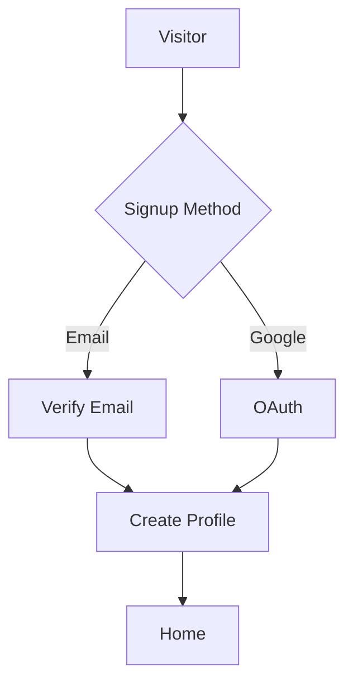
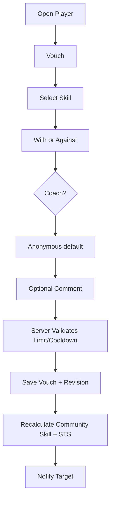
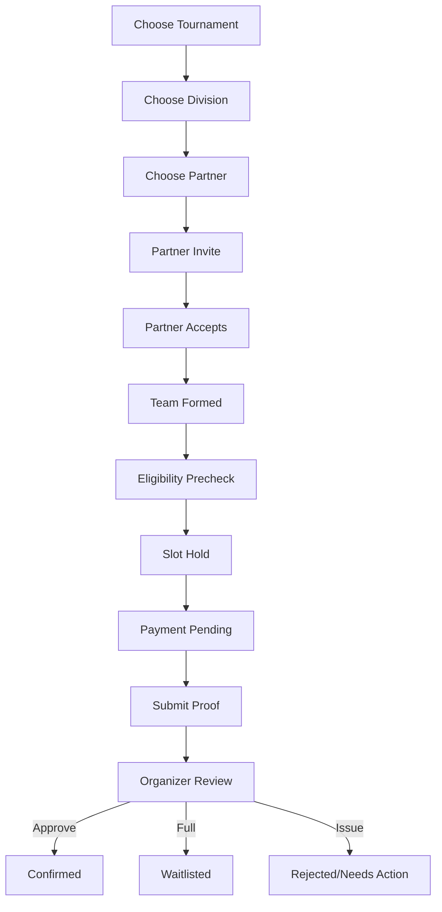

Warning: truncated output (original token count: 52712)
Total output lines: 6749

# VouchPlay Master Product & Code Execution Handover v1.51

_(File retains its `…v1.1.md` name; content is v1.51 - see Changelog.)_

**Status:** LOCKED FOR EXECUTION - Phases 0–13 built; Pilot Prep in progress (see §0Z)
**Owner:** JT Consulting & Analytics Inc.  
**Founders / Product Leads:** Jasper Adjarani, Tane Valdez  
**Product:** VouchPlay  
**Logo assets:** D:\claude_\P006b_PlayerProfiling\vouchplay_v2\logo_
**Primary launch:** Mobile-first web application / PWA  
**Native target:** Android and iOS after web/PWA stabilization  
**Document purpose:** Single source of truth for product, UX, data model, backend, frontend, business rules, security, testing, deployment, and phased code execution.

**sources**
Local project folder: D:\claude_\P006b_PlayerProfiling\vouchplay_v2
GitHub repo: https://github.com/jasperandrewadjarani-hub/vouchplay_v2
Vercel project: `vouchplayph` (jasperandrewadjarani-hub) - **LIVE:** https://vouchplayph.vercel.app (also https://vouchplay-v2.vercel.app)
Supabase project: https://supabase.com/dashboard/project/itrosesiywpbaxtmucbb
Gmail account (for SMTP): vouchplay@gmail.com

---

# 0Z. Current Build Status - as of 2026-09-08

> Living status block. Update this whenever a phase completes. Full detail lives in
> `notes.md`; `CLAUDE.md` / `AGENTS.md` hold agent working rules + deploy gotchas.

**Live:** https://vouchplayph.vercel.app (public, connected to Supabase). Auto-deploys on push to
`main`; `vouchplayph.vercel.app` and `vouchplay-v2.vercel.app` are configured production project
domains. Verify both domains after each production deploy; manual re-aliasing is only a fallback if
Vercel does not attach the project domain automatically.

**Phase 0 - Foundations: ✅ DONE.** npm-workspaces monorepo (`apps/web` + `packages/{config,core,db,
ui,validation,analytics}`), Next.js + React 19 + Tailwind v4 + TS strict, locked theme tokens +
dark/light toggle, app shell (5 tabs, header, sidebar, bottom nav), PWA manifest, ESLint/Prettier/
Vitest, GitHub Actions CI.

**Phase 1 - Database, Auth, Permissions: ✅ core DONE.**
- DB migrations applied to Supabase (`0001_core_identity`, `0002_seed_system_settings`):
  `profiles`, `user_roles`, `role_applications`, `identity_verifications`, `system_settings`,
  `audit_logs` (append-only); `updated_at` + new-user triggers; SECURITY DEFINER authz helpers
  (`has_global_role`/`is_admin`/`is_staff`); RLS on all user-facing tables; 21 seeded settings.
- Auth LIVE + verified end-to-end on production: email 6-digit OTP code (Gmail Custom SMTP),
  password login, **Google login**, `/auth/callback`, profile onboarding, route guards.
- Supabase Auth config: "Confirm email" OFF (OTP is the verification), Email OTP length 6, Magic-link
  template emits `{{ .Token }}`, redirect allowlist set for both prod domains + localhost.
- Phase-1 leftovers now handled in/around Phase 2: DB types hand-authored in `@vouchplay/db`
  (`supabase gen types` deferred - CLI/token unavailable); avatar upload on onboarding + `avatars`
  bucket (created live); `/me/settings/password` reset landing; RLS/role-spoofing verification
  (`scripts/verify-rls.mjs`, 6/6); Admin MFA framework (`lib/auth/mfa.ts` + `/me/settings/security`).
  **Still pending a manual SQL paste (`scripts/apply-0003-and-admin.sql`):** migration 0003
  (`public_player_facts` + storage policies) and the JT admin grant - dashboard automation is
  classifier-blocked.

**Phase 2 - Player Directory & Profile: ✅ DONE (live).** Public `/players` directory (concise
PlayerCard, §8.4 search/filters, pagination, no STS ranking) and `/players/[slug]` profile (header,
skill-distribution/comments/achievements/skill-tags sections, §28 sharing metadata). RLS-safe DTO
projections (no `select(*)`), cache-first reads with tag invalidation (§34A), server-side authz.
**Gate met + verified live:** non-users browse safe fields; hidden fields never sent; the Vouch/
Request gate routes to signup and **resumes after auth** (`?intent=…` + a sanitized `next` threaded
through the whole auth flow). Public badge facts (Coach/Organizer/ID-Verified) currently read
server-side via the service client with a boolean-only projection; the RLS-clean `public_player_facts()`
swap is ready to switch on once migration 0003 is applied.

**Deploy constraint (see CLAUDE.md):** pinned to **Next.js 15** to dodge a Vercel×Next-16 deploy bug;
root `vercel.json` + root-level `next` dep make monorepo detection work. Revert to Next 16 only per
the documented exit plan.

**Deviations from this document (approved by JT):** transactional email uses **Gmail SMTP** for the
pilot (not a dedicated provider - §34A.11), behind the `EmailProvider` interface; switch before scale.

**Ops flags:** Supabase org is **over-quota** (projects restricted from 21 Sep 2026 if not cleared);
Google consent screen shows the Supabase project domain (cosmetic; needs paid custom domain to rebrand).

**Pilot demand signal + Admin Clubs + home hierarchy: staged (migration 0019 pending Jasper SQL
Editor application).** Interest is a planning signal only: a user chooses a standard demand division
before one signed-in-player or privacy-minimized anonymous-browser interest is recorded. Anonymous
interest uses a random first-party HTTP-only cookie represented in storage only by an HMAC; it is not
device fingerprinting and cookie resets can raise the estimate. Public detail shows aggregate counts,
public opted-in signed-in avatar stack only, and an aggregate per-division dialog-never anonymous or
per-division identity. It never creates registration, a reservation, eligibility, a real tournament
division, or marketing consent. `/admin/clubs` adds a discoverable AAL2 Admin management surface while
keeping existing Staff actions/audit controls. Home now leads with concise action cards before rankings;
dark is the OS-independent default (while an explicit user choice remains respected).

**Tournament experience refinement: staged (migration 0020 pending Jasper SQL Editor application).**
Copy never uses em dashes and helper text stays concise. Interest confirmation is plain and never
overclaims. Demand and registration meters are separate, accessible, and capacity-based where a real
division capacity exists. Player division cards progressively disclose evidence guidance and unify
division facts, partner selection, and registration controls. Public tournament discovery stays first
for organizers; private managed records are opt-in and default-hide draft, cancelled, and archived.
Payment QR is a private signed image for the existing manual proof-and-review workflow, not a gateway
or payment confirmation.

**Registration-first refinement: live (migration 0021 applied and verified on 2026-09-08).**
Signed-in players see an existing entry immediately after tournament details. Tournament cards show
separate interest and joining counts plus a text-and-icon viewer cue. Divisions stay collapsed until
opened. Player cancellation and division changes are bounded, auditable, and payment-safe; a partner
is never replaced unilaterally after registration. Co-organizer eligibility uses an existence check,
so multiple qualifying roles do not trigger a false rejection.

**Next execution slice: tournament reliability and registration flexibility, planned only.** Before
Phase 14 work, reproduce and correct the organizer Payment QR save/disappear failure and the
long-idle browser client error. Preserve private normalized QR storage, manual proof-and-review, and
the bounded mobile resume model. Make the existing tournament-wide club representation lock usable by
organizers: players may update their eligible representation after payment or confirmation until the
single all-divisions deadline, with reasoned organizer/Admin override only after lock. Restore the
locked multiple-entry rule for distinct divisions while blocking duplicate active same-division teams.
Make **My registrations (N)** collapsed by default and audit Home copy for concise canonical wording.
This slice does not add a payment gateway, recruiting, sponsorship, bidding, or partner-matching
recommendations. Its full handover is
`docs/PHASE_13_5_TOURNAMENT_RELIABILITY_AND_REGISTRATION_FLEXIBILITY_HANDOVER.md`.

**Phase 3 - Vouch Engine: ✅ DONE (live).** STS_V1 in `@vouchplay/core` (weighted-median CSL,
STS components, Skill-Verified, effective weights) - pure/deterministic, 11 unit tests incl.
hand-computed cases. Migration 0004 applied (vouches, revisions, comments, requests,
player_skill_profiles, blocks, fraud_flags + RLS; anonymous voucher identity never public - public
skill data via the safe `player_skill_profiles` aggregate). `submitVouch`/`withdrawVouch`/
`requestVouch` enforce every locked rule server-side (self/active/block/coach-toggle/one-active-per-
pair/rolling-limit/cooldown, revisions); recompute-on-write; live vouch form + CSL/STS/Skill-Verified
on cards+profile + real distribution/comments. Pipeline smoke-tested against the live DB
(insert → recompute → public read = correct values, then cleaned up). Deferred: fraud-flag detectors
(§11.2 table shipped), admin invalidate UI (Phase 30), block-management UI (Phase 4 - block already
enforced in the vouch path).

**UI/UX:** a bold-sporty polish pass shipped across the whole app (gradient/glow tokens + utilities,
hero headers, hover-lift cards, gradient nav indicators, real home hero, branded auth) - layered on
the locked §33.2 palette, theme-aware, reduced-motion safe.

**Phase 4 - Safety & Moderation: ✅ BUILT + live (§14, §11.3, §30.6, §47).** Reports (player + vouch
comment; reporter always stored - never anon to admin), Skill Review (separate; submitter stored,
never public; organizer tournament-context), Block/Unblock (enforced across vouch + request; Phase-5
initiation points reuse the same guard), a staff-gated moderation queue (`/staff` + `/staff/moderation`:
reports · skill reviews · fraud flags · support) behind `requireStaffPage` + `requireStaffMfa`, with
actions dismiss/warn/invalidate-vouch/restrict-vouching/restrict-account/suspend/ban/lift + hide/
remove/restore comment + raise/review fraud flag - **each writes an immutable `audit_logs` row**.
Restricted/suspended enforced server-side (`account_status` + timed `suspended_until`/
`vouching_restricted_until`); banned/suspended already 404 publicly. Appeals/support via
`/me/support`. **Anonymous voucher identity exposed only through the staff-gated
`getVouchAuthorForModeration` path** (§37, §4.5). Migration `0005_safety_moderation` **applied**
(verify 3/5/6/2). Evidence in V1 = optional text note + link in `evidence` jsonb (private-bucket file
evidence §38 deferred, approved by JT). Fraud-flag detectors (§11.2) deferred - manual raise + review
shipped. Gates green; live on `vouchplayph.vercel.app`.

**Phase 5 - Clubs core: ✅ BUILT + live (§15).** Scope: Clubs CORE only (recruitment/sponsorship §16
+ bidding §16A deferred). `clubs` + `club_memberships` (§36.16–36.17) with separate verification /
activity status, `is_club_*()` RLS helpers, single-owner + single-live-membership constraints.
`/clubs` directory, `/clubs/[slug]` public page (§15.5), `/clubs/new`, `/clubs/[slug]/manage`
(members + settings + owner danger zone). Server actions cover create / join (public-instant vs
approval) / leave / approve-reject-remove / role changes / ownership transfer / privacy / activity /
soft-delete - all authz'd server-side via active membership. Admin club **verification** + suspend/
reinstate added to the `/staff` queue (Clubs tab), each audit-logged. Player cards/profiles show real
club stacks. Logos reuse the public `avatars` bucket (`club-logos/` prefix). Migration
`0006_clubs` written (`scripts/apply-0006.sql`) - **apply pending** (code degrades gracefully until
it lands). Deferred: §16 offers, §16A bids, manager-initiated invites, delete re-auth (typed-name
confirm used). Migration `0006_clubs` **applied** (verify 2/3/3). Gates green; live.

**Phase 6 - Tournament Setup: ✅ BUILT + live (§17–§19).** Organizer role application (`/me`) + admin
approval in the `/staff` Role-apps queue grants `organizer`; only approved organizers/admins create
tournaments (action + page guard + RLS). `tournaments` + `divisions` + `tournament_organizers` +
`tournament_interests` + `tournament_announcements` (§36.19–36.22, §36.30) + `is_tournament_organizer()`
+ RLS (public reads non-draft; organizers see drafts). Server-enforced lifecycle state machine
(§17.2); attribute-assembled division rule-builder (§18) with add/edit/clone/status; co-organizers
(§17.4) with granular permission jsonb; interested toggle; announcements; cover uploads (public bucket,
`tournament-covers/` prefix). UI: `/tournaments` discovery, `/tournaments/[slug]` public page (§19),
`/tournaments/new`, `/tournaments/[slug]/manage`. Migration `0007_tournaments` written
(`scripts/apply-0007.sql`) - **apply pending** (reads degrade to empty, writes error until it lands).
Deferred: registration/partner/teams/club-representation (Phase 7), payments (Phase 8), eligibility
(Phase 9), §16 offers, §16A bids. Migration `0007_tournaments` **applied** (verify 5/1/8). Gates green; live.

**Phase 7 - Partner, Team & Registration: ✅ BUILT + live (§20–§23).** `partner_invitations`, `teams`,
`team_members`, `tournament_player_club_representations`, `registrations`, `registration_events`,
`waitlist_entries` (§36.23–36.27, §36.25A, §36.29) + RLS. **Slot reservation is transactional (LOCKED
§23.2)** - `register_team` locks the division row and atomically holds-or-waitlists; reciprocal
partner cross-invites merge atomically in `accept_partner_invitation`; `release_slot` promotes the
waitlist on withdraw/reject. Partner invites (§20), doubles team formation, singles solo entry,
multi-club representation (§22 - max_clubs_per_player + active-membership + club-lock), duplicate
prevention (§21.4). UI: signed-in registration panel on the tournament page (register/withdraw, invite,
invitations, club select) + organizer registrations dashboard on manage (confirm/reject, waitlist
release). Confirm path: organizer confirms directly (payments = Phase 8). Migration `0008_registration`
written (`scripts/apply-0008.sql`) - **applied** (verify 7/5/7). Deferred: eligibility (§25),
hold-expiry/waitlist auto-promotion cron, partner-finder browse UI, club-lock override UI. Gates green; live.

**Phase 8 - Payments: ✅ BUILT + live (§24).** V1 abstract manual-proof layer (`PaymentProvider`
interface in core for a future gateway, §24.5). `payments` table (§36.28) + a PRIVATE `payment-proofs`
bucket (§38) - proof reachable only via server-issued 60s signed URLs gated to team/organizer/staff.
Player submits proof → registration `payment_submitted` + 24h review grace; organizer verify →
confirmed, reject(reason) → back to payment_pending (resubmit), mark refunded - all audited. fee=0
divisions use the organizer-confirm-directly path. UI: payment step in the registration panel +
verify/reject/refund + View-proof in the organizer dashboard; accepted-methods in tournament config.
Migration `0009_payments` **applied** (verify 1/1/1/1). Deferred: real gateway, partial refunds,
payment-deadline cron. Gates green; live.

**Post-Phase-8 UX tweak batch (2026-09-06, Jasper):** em-dashes removed app-wide (replaced with
hyphens) across copy/placeholders + docs; click-loading spinners on Create Club / Create Tournament /
View profile / Vouch / Manage (via `useLinkStatus`); theme toggle is Light/Dark only (default still
system); vouch interaction adds a **Both** option; **vouch update cooldown lowered 30d → 1d** (admin
setting, migration 0010); sign-out confirmation prompt; header now shows the signed-in user's avatar
beside the bell; **avatar/logo/cover/proof upload error fixed** - raised the Next Server Actions
`bodySizeLimit` to 8MB (default 1MB was rejecting >1MB files); instant (debounced) filtering on
Players/Clubs/Tournaments directories (Search button kept as fallback); tournament dates are
**date-only** (time not required); **minimal create-tournament form** (name/city/dates/visibility)
with the rest edited later on Manage; **partner invite now searches players by name** (was
handle-only). Migration `0010_vouch_tweaks` written (`scripts/apply-0010.sql`, adds the `both` enum
value + sets the cooldown) - **apply pending**.

**Phase 9 - Eligibility / Anti-Sandbagging: ✅ BUILT + live (§25, §26.7).** The headline decision-
support engine - neutral, evidence-based, never auto-punishes, never labels a person; the organizer
decides. Pure `ELIG_V1` engine in `@vouchplay/core` (`evaluatePlayerEligibility`/`evaluateTeamEligibility`
→ ELIGIBLE / REVIEW / SKILL_MISMATCH / INELIGIBLE_HARD_RULE + hard-rule codes + neutral reason codes +
advisory flags), pure/deterministic/version-locked, **21 new unit tests** (core suite 32 green) incl.
hard-rule failures, below-STS review, above-band mismatch, unrated→review, and team = worst-of-members.
Hard rules §25.2 (sex/age-at-start/account/team-size/closed/duplicate) short-circuit; skill rules §25.4
(CSL>max → mismatch; below-STS / thin-evidence / unrated / skill-verified-missing → review). Thresholds
are admin settings (migration 0011: `eligibility_min_unique_vouchers`, `eligibility_review_below_sts`,
`eligibility_enforce_hard_rules` - **apply pending**, seeds only, no schema change). Compute-on-write
fills `registrations.eligibility_status` + `eligibility_snapshot` after `register_team` and on vouch
change. Organizer **eligibility panel** (§25.5) on the registrations dashboard: per-team neutral
evidence + Approve (hard-rule override needs a reason, §25.2) / Reclassify / Request Skill Review /
Reject - every override audit-logged. **§25.6 enforced by a build-failing guard test** that bans the
person-labels sandbagger/smurf/cheater from all source. Gates green; live on `vouchplayph.vercel.app`.

**Registration UX (2026-09-06, §19.2/§19.3/§28.1):** frictionless **Join before signup** (anon visitors
get a Register CTA + Join card → signup carrying `next=/tournaments/{slug}?register=1` → onboarding →
registration options resume; no anon slot/team/payment state ever created) and a **shareable
registration deep link** (`?register=1` scrolls straight to the registration section; canonical/OG URL
stays clean; behaviour-only, bypasses nothing). Migrations 0010 + 0011 **applied** (vouch tweaks +
eligibility thresholds) - Phase 9 fully active. Gates green; live.

**Phase 10 - Organizer Dashboard + Export (§26): ✅ BUILT + live.** Part 2 (analytics): **overview
tiles** (§26.1 - active registrations, confirmed teams, payments to review, waitlisted, eligibility to
review, revenue collected, divisions nearing capacity; pure `computeOverview`, unit-tested) at the top
of the manage dashboard, and **registration filters** (§26.4 - division/status/eligibility/payment,
client-side over the loaded list). Deferred: §26.6 manual waitlist reprioritize (auto-promotion works),
§26.8 participants search, §26.9 broader comms.

**Phase 10 - Export (§26.11): ✅ BUILT + live (part 1 of 2 - export-first).** Decoupled export
(§26.11.2): `TournamentExportSnapshot` + three adapters - the **canonical `TournamentSystemXlsxExporter`**
(the LOCKED compatibility contract, reproduced exactly from the inspected sample workbook - see
`docs/TOURNAMENT_SYSTEM_XLSX_CONTRACT.md`: 8 sheets, locked order, exact headers, dates-as-serial,
ID/status vocab; secrets never emitted), a normalized human-readable workbook, and per-entity CSV. A
**structural compatibility test fails the build** on any sheet/header/order/date/status drift
(§26.11.1 step 6). Authorized organizer download route (`export` permission, audit-logged) + an Export
panel on the manage dashboard. Generated demo files re-read cleanly (exceljs); desktop-Excel
native-integrity confirmation is the one manual gate before it's a shippable deliverable. Gates green;
live. **Deferred to Phase 10 part 2:** dashboard analytics/overview tiles (§26.1-§26.9).

**Phase 11 - Notifications (§27): ✅ BUILT + live.** In-app notifications complete; email-for-critical
ready-but-inert; push later. `notifications` + `notification_preferences` (migration 0012 - **apply
pending**) with RLS (recipients read own; writes via service role). Version-centralized COPY + category +
criticality in `@vouchplay/core` catalog (critical = moderation + account/security, un-mutable +
email-eligible; unit-tested). `notify`/`notifyMany` service (skips muted non-critical; routes critical
to the inert-until-configured email channel; best-effort). Emission wired across the vouch (anonymous-
safe) / partner / registration lifecycle / payment / eligibility / announcement (audience fan-out) /
club-join / role-result / moderation events. UI: header unread badge, `/me/notifications` center,
`/me/settings/notifications` preferences. Email switches on by adding SMTP_USER/SMTP_PASS to the app env.
Gates green; live.

**Phase 12 - Achievements / Skill-tags / History (§9.4, §9.5, §49, §50): ✅ BUILT + live.** Migration
0012 **applied** (notifications live). Skill tags (community-endorsed traits, not part of CSL) +
Achievements (OFFICIAL issued by a verified organizer per-team on the dashboard, with tournament/
division/placement + verified label; COMMUNITY claims player-added + peer-endorsed, clearly labeled) +
Playing history (derived from registrations, no new table) on profiles. Migration 0013 (`skill_tags`,
`player_skill_tag_votes`, `achievements`, `player_achievements`, `achievement_endorsements` §36.11-36.15)
- **apply pending**. **§50 HISTORICAL_SKILL_MISMATCH now fires** on evidence only (organizer-confirmed
play in a clearly-higher division; no invented equivalencies), wired into ELIG_V1. New
`achievement_awarded` notification. Gates green; live.

**Phase 13 - Admin Control Center: ✅ BUILT + live (§30-§31).** Scope: core bundle (System Settings +
Audit viewer + Users admin + Analytics); **no new migration** (all tables/columns already existed).
New `/admin` area behind `requireAdminPage` (admin/super_admin + verified TOTP + aal2) + `assertAdminActor`.
**§30.7 System Settings:** a `SETTINGS_CATALOG` + pure `validateSettingValue()` in `@vouchplay/config`
drive a grouped settings form; `updateSystemSettings` validates server-side, upserts only changed keys,
and writes one immutable audit row per change (§30.8); added `announcement_banner[_enabled]` keys. The
platform toggles now actually enforce - `maintenance_mode` (non-staff maintenance screen), site-wide
`announcement_banner`, `signup_enabled` (OTP account creation gated, existing users still log in),
`role_applications_enabled`. **§30.8 Audit viewer** (`/admin/audit`): read-only, filterable, keyset-
paginated, before/after snapshots. **§30.1-30.2 Users admin** (`/admin/users` + `[id]`): search/inspect,
grant/revoke roles (privileged roles Super-Admin-only; no self-revoke), manual Skill-Verified override
(admin_override, never alters calculated STS/CSL), account actions (reuse Phase-4 applyAccountAction),
role history - all audited + a critical `account_security` notification. **§31 Analytics** (`/admin/analytics`):
pure `computeAnalyticsSummary` in `@vouchplay/core` over cheap COUNT queries - growth/vouching/tournaments/
clubs/safety + the North Star (Skill-Verified active profiles). Gates green (core 47, config 19, web 15;
build 31 pages incl. 6 `/admin` routes). Deferred: §13 Identity Verification full flow (private id-docs
bucket + submission/review + retention - its own sub-phase), users merge-duplicate + revoke-sessions.

**Pilot Prep - IN PROGRESS (§19.4 + Hermosa readiness).** The unverified/under-vouched registration
prompt is built and live: the signed-in viewer's CSL, STS, unique-voucher count, Skill-Verified state, and
profile slug are loaded with a tight server-side projection; a pure `@vouchplay/core` evaluator reuses
the exact ELIG_V1 evidence/confidence rules per division; and the registration panel shows a neutral,
non-blocking warning before submission with Share-profile and Request-a-vouch paths. Six focused tests
cover unrated, thin-evidence, global/division STS, Skill-Verified, and clean cases. No migration.
Pilot-critical lifecycle email now includes registration confirmed/rejected, waitlist promotion, and
payment verified/rejected, and critical team fan-out invokes the same opt-in email sender as a single
notification. `SMTP_USER`/`SMTP_PASS` are now configured as hidden Vercel Production secrets and the
SMTP-enabled deployment is live; one opted-in real critical-event inbox confirmation remains. Remaining
Pilot Prep gates: SMTP real-send verification; Supabase quota clearance; live dress rehearsal + native Excel
export open; and Hermosa organizer/JT admin role + TOTP readiness. Hold-expiry cron is deferred by JT.
Code deployment `8962b31` plus the production SMTP configuration were verified Ready and re-aliased to
`vouchplayph.vercel.app`.
Pilot-prep discovery/loading hardening now gives signed-in owners and active co-organizers a private
**Your tournaments** section that includes draft and unlisted events without widening public discovery;
unlisted cards are visibly labelled. Tournament directory typing, the notification bell, and the
notification Preferences link now meet §33.5A with an immediate pending indicator. No migration.
Pilot usability v1.5 is code-complete: Me has a visible, pre-filled Edit profile flow; tournament
creation seeds the §18.6 15-division starter set; unused divisions have an audited Remove flow;
owners have reversible Archive/Restore controls with exact-name confirmation; archived events are
hidden from public reads; and the Home promise now says “fair tournaments.” Migration 0014 adds the
capacity setting, archive RLS, and transactional audited RPCs; apply `scripts/apply-0014.sql` before
accepting archive/remove actions in production.
Commit `faf562f` is deployed Ready at
`vouchplayph-4o3nf3tsx-jasperandrewadjarani-hubs-projects.vercel.app`; both configured production
domains returned HTTP 200 with the v1.5 Home copy, and the signed-in Me/Edit/Manage UI was verified.
Lifecycle UX v1.6 is code-complete: Manage uses one consequence-aware selector for free forward/
backward movement between every non-archived status, preserves child records, and notifies active
participants when moving to Cancelled. Migration 0015 supplies the authenticated transactional RPC
and immutable audit write; apply `scripts/apply-0015.sql` before accepting status changes in production.
Commit `5322e0b` is deployed Ready; both production domains return HTTP 200 and the signed-in Manage
screen was verified with all eight normal statuses, consequence copy, and disabled unchanged submit.

Pilot usability v1.7 is code-complete: tournament cover replacements are validated, normalized to an
efficient bounded WebP derivative, uploaded before the tournament row changes, and return actionable
errors instead of silently saving without the selected image. The private **Your tournaments** surface
has independent Show/Hide controls for Draft, Cancelled, and Archived; those controls affect only the
signed-in organizer's managed query and preserve public-discovery rules. No migration is required.
This revision also makes the Coach application/approval journey and the engagement-led Home
leaderboards implementation-ready in §4.4 and §6.1. Coaching and leaderboards remain the next-phase
build, not part of this pilot-fix release. Commit `7c8d680` deployed Ready at
`vouchplayph-5dn04cfj1-jasperandrewadjarani-hubs-projects.vercel.app`; configured domains attached
automatically. A controlled live-Storage smoke test normalized a 3,587,842-byte source (above the old
2 MB failure boundary) to 720,770 bytes, fetched it publicly with HTTP 200, then deleted the temporary
object without touching tournament data.

Phase 13C/13D kickoff v1.8 is approved. Migrations 0014 and 0015 were confirmed in the Supabase SQL
Editor with `pilot_prep_functions=2`, `default_capacity_setting=1`, `archive_read_policies=3`,
`lifecycle_function=1`, and `lifecycle_authenticated_grant=1`. Implementation order is Coach Flow,
then the Phase 13A contribution foundation, then Players/Community Champions/Clubs leaderboards.
For public leaderboard eligibility, a missing date of birth is treated conservatively like a minor
until supplied; private momentum remains available. Season defaults to the configurable calendar year,
and Region uses an Admin-managed city-to-region mapping rather than a new mandatory profile field.
Coach evidence defaults are five files, 5 MB each, JPEG/PNG/WebP/PDF, 60-second signed access, a
seven-day review SLA, and 90-day post-decision retention; every value remains Admin-configurable.

Phase 13C/13A/13D is production-complete in content v1.10. On 2026-09-08,
Jasper applied migrations 0016 and 0017 in order and confirmed every embedded verification count.
Direct anon/Player/AAL2 Admin authorization passed 20/20 with no skips. The first bounded build
published 14 active global/city snapshots, 24 private momentum rows, and two contribution aggregates;
public entries correctly remain empty because all current real profiles lack DOB and the current club
is pending. The Coach-weight safety kill switch is enabled by default so approval grants the locked
Coach capability; each individual “Vouch as a Coach” control remains explicitly unchecked by default.
Most Bidded remains false and its adapter returns no fabricated data.

The controlled production exercise covered application, normalized private evidence, withdrawal,
information request/response, resubmit, AAL2 approval, 60-second signed access, notifications/deep
links, active-role badge, explicit Coach vouch, and AAL2 revocation. The Coach vouch retained its
event-time `used_coach_weight=true`, effective weight 2, and `WEIGHT_V1` after revocation. Controlled
eligible fixtures appeared in Players, Community Champions, and Clubs; public opt-out removed the
player from every public board while preserving eight private momentum rows. Fixtures and Auth access
were deactivated, the evidence object was removed, and the clean build now has seven global snapshots
with zero synthetic public entries. Production fixes include existing-factor MFA step-up, popup-safe
evidence access, and public scope derivation from publicly eligible subjects only. `CRON_SECRET` is
configured; repository gates and both-domain deployment verification are recorded in `notes.md`.

**Leaderboard eligibility refinement (2026-09-08):** Date of birth is **not required** for a public
leaderboard row. An otherwise eligible player whose DOB is unknown may rank; a supplied DOB below the
configured minimum public age still excludes that player. This rule is controlled by the Admin setting
`leaderboard_exclude_unknown_dob`, which now defaults to false and can be restored to conservative
unknown-age exclusion if required. Migration 0018 applies the existing production setting change and
an Admin rebuild publishes the revised snapshots.

**Next:** confirm the next phase with JT - §16 Recruitment/Sponsorship + §16A Gamified Bidding; organizer
dashboard depth (§26.6/§26.8/§26.9 + export ZIP); §13 Identity Verification; or notifications depth
(§27.4). (Open ops: Jasper confirm the demo export XLSX open cleanly in desktop Excel; seed Tane's admin;
both JT admins enroll TOTP to reach `/staff` + `/admin`; confirm one real opted-in critical email; clear
Supabase over-quota before 21 Sep 2026.)

---

# 0. Executive Directive

This document replaces fragmented product notes and should be treated as the authoritative implementation handover for VouchPlay v1.

The build team or coding agent must not invent alternative product rules where this document is explicit. Where a value is expected to change operationally, it must be implemented as an **Admin-configurable setting**, not hardcoded.

The execution priority is:

1. Correctness of trust, identity, permissions, and tournament state.
2. Prevention of vouch abuse and sandbagging manipulation.
3. Mobile-first usability.
4. Organizer efficiency.
5. Auditability.
6. Scalability without premature infrastructure complexity.
7. Native-app readiness without duplicating the backend.

VouchPlay is not merely a social profile directory. Its core loop is:

> **Create a player profile → receive credible community vouches → build a trusted skill profile → join clubs and tournaments → allow organizers to make better eligibility decisions → generate more verified playing history → improve the player profile.**

The core differentiator is the **community-backed skill profile and tournament eligibility decision-support system**.

The system must never automatically label a person a "sandbagger" or "smurf." It may flag a **Potential Skill Mismatch**, **Low Confidence**, **Historical Skill Mismatch**, or **Unusual Vouch Activity** for organizer/admin review.

---

# 1. Product Definition

## 1.1 What VouchPlay Is

VouchPlay is a social sports platform where a player's skill reputation and credibility are supported by community vouches rather than only self-declaration.

Players can:

- Create and maintain a public player profile.
- Self-rate their skill.
- Receive skill vouches from other players.
- Request vouches.
- Give limited vouches within rolling 24-hour limits.
- Leave attributed vouch comments.
- Build a community skill profile.
- Join, own, or help manage clubs.
- Discover tournaments.
- Express interest in tournaments.
- Find or invite partners.
- Register for tournament divisions.
- Represent clubs.
- Receive sponsorship/recruitment offers from clubs.
- Display achievements and community-endorsed skill tags.
- Report abuse or request skill review.
- Block other users.

Approved Coaches can give higher-credibility vouches.

Approved Organizers can create and manage tournaments.

Club Owners and Club Admins can manage clubs, memberships, recruitment, and sponsorship offers.

JT Admins can verify identity/roles/clubs, manage moderation, configure scoring parameters, oversee tournaments, and maintain system integrity.

## 1.2 Primary Problems Solved

1. Sandbagging and smurfing in tournaments.
2. Self-declared skill levels with little evidence.
3. Tournament eligibility disputes and protests.
4. Lack of a centralized player directory/profile.
5. Difficulty finding partners for tournaments.
6. Fragmented club membership and recruitment.
7. Difficulty organizing tournament registration and eligibility.
8. Lack of a reusable historical player record.
9. Difficulty exporting structured participant data to tournament systems.

## 1.3 Product Principle

VouchPlay provides **evidence and decision support**. Final tournament classification remains under organizer authority unless a hard eligibility rule is violated.

---

# 2. Locked Scope by Release

## 2.1 V1 / MVP - Must Build

### Identity & Access
- Email/password signup with email verification.
- Google login.
- Account linking where possible.
- Forgot/reset password.
- Change password.
- Change email with re-verification.
- Logout and logout-all-sessions.
- Account deactivation.
- Account deletion request and workflow.
- Apple Sign In before native iOS launch.

### Player Profiles
- Avatar.
- First name.
- Last name.
- Nickname / IGN.
- City.
- Sex.
- Date of birth or age source.
- Self-rated skill.
- Facebook profile link.
- Looking for Partner status.
- Open for Sponsorship status.
- Club affiliations.
- Role badges.
- Skill verification badge.
- Identity verification badge.
- Community skill.
- Skill Trust Score.
- Vouch distribution.
- Vouch comments.
- Achievements.
- Skill tags.
- Public sharing URL.

### Vouching
- Daily/rolling 24-hour limits.
- Player/Coach weight differences.
- Anonymous-by-default rating identity.
- Non-anonymous option.
- Comments always attributed.
- Played With / Played Against.
- Coach vouch toggle, only enabled for approved coaches.
- One active skill vouch per voucher→vouchee pair.
- Vouch update replaces prior active rating.
- Vouch cooldown.
- Vouch history.
- Request a vouch.
- Anti-abuse flags.
- Admin invalidation.
- Score recalculation.

### Clubs
- Create club.
- Pending/verified/unverified/suspended/inactive states.
- Request to join.
- Invite/recruit player.
- Sponsorship offer.
- Leave club.
- Owner/Admin/Member roles.
- Club members.
- Club public page.
- Club privacy.
- Active/inactive.
- Verification request.
- Ownership transfer.
- Admin assignment.
- Club deletion workflow.

### Tournaments
- Organizer application.
- Tournament creation.
- Tournament photo.
- Venue.
- Date/time.
- Registration opening/closing.
- Divisions.
- Fees.
- Max slots.
- Co-organizers.
- Club co-organizer option.
- Public sharing URL.
- Interested list.
- Looking-for-partner list.
- Partner invitations.
- Team formation.
- Multiple entries.
- Club representation.
- Payment proof flow.
- Approval/rejection/waitlist.
- Eligibility evaluation.
- Skill mismatch review.
- Club lock.
- Registration lock.
- Participant/team export.
- Tournament announcements.
- Tournament lifecycle.

### Safety & Moderation
- Report player.
- Report comment.
- Report club.
- Report tournament.
- Request skill review.
- Block player.
- Moderation queue.
- Admin actions.
- Appeals/support path.
- Audit logs.

### Admin
- User search.
- Manual verification.
- Role approval/revocation.
- Club verification.
- Tournament override.
- Vouch configuration.
- Vouch invalidation.
- Report/moderation management.
- Fraud flags.
- System settings.
- Analytics.
- Audit log.
- Global announcements.
- Maintenance/feature flags.

### Notifications
- In-app notifications.
- Email notifications for critical events.
- Notification preferences.
- Deep links.
- Push-ready abstraction.

### Public Access
Non-users can view:
- Public player profiles.
- Public club pages.
- Public tournament pages.

If a non-user attempts to:
- vouch,
- request vouch,
- join a club,
- partner,
- register for tournament,
- recruit/sponsor,
- interact with protected features,

the signup/login gate is shown and the original action is resumed after authentication.

---

## 2.2 Phase 2

- Native Expo mobile application.
- Apple Sign In.
- Native push notifications.
- Verified-match vouch weighting.
- Automated result imports.
- Tournament scoring/bracket integration.
- Vouch freshness/decay if required by data.
- Advanced vouch-ring detection.
- Advanced sponsorship workflows.
- **Gamified player bidding** (clubs bid points to represent/sponsor players; §16A).
- **Home leaderboards** (top players / most bidded / top clubs with medals; §6.1).
- Club Pro features.
- Organizer paid tiers.
- Payment gateway integration.
- QR player/tournament profiles.
- Rich share cards.
- Enhanced performance history.
- Inter-city rankings only if data quality supports it.
- Direct messaging only after moderation capacity exists.

## 2.3 Explicitly Not Required for V1

- Open social feed.
- Real-time chat/DM.
- Money transfer between clubs and players.
- Sports betting.
- Public "sandbagger" labels.
- DUPR or other third-party rating references.
- Full tournament live-scoring engine.
- Microservices.
- Elasticsearch/OpenSearch.
- Redis unless later justified by load.
- Blockchain/NFT features.

---

# 3. Canonical Vocabulary

Use these names consistently in database, API, UI, documentation, and analytics.

## 3.1 Skill Bands

Canonical order:

0. Newbie
1. Beginner
2. Novice
3. Low Intermediate
4. High Intermediate
5. Advanced
6. Pro

`Open` is **not** a skill level. It is an eligibility type.

`Age-Defined` is **not** a skill level. It is an eligibility rule.

Tournament defaults should generally start at Beginner, not Newbie, but Newbie remains a valid profile skill.

## 3.2 Verification Terms

**Identity Verified**  
JT/VouchPlay has verified the identity of the user.

**Skill Verified**  
The player meets the system's configured community-evidence threshold.

**Verified by VouchPlay**  
An administrative manual skill-verification override. This must never fabricate or change the calculated STS.

## 3.3 Skill Metrics

**Self-Rated Skill**  
The player's own declared level.

**Community Skill Level (CSL)**  
The community's weighted consensus level.

**Skill Trust Score (STS)**  
A 0.0–5.0 confidence score describing the strength and consistency of evidence behind the Community Skill Level.

These three values must never be conflated.

---

# 4. Roles & Permission Model

VouchPlay uses one account per person. A user does **not** "log in as organizer."

Roles are additive permissions.

## 4.1 Global Roles

- `PLAYER` - automatic for every registered account.
- `COACH` - approved by JT Admin.
- `ORGANIZER` - approved by JT Admin.
- `MODERATOR` - JT staff role.
- `SUPPORT` - JT staff support role.
- `ADMIN` - JT administrative role.
- `SUPER_ADMIN` - highest JT authority.

## 4.2 Contextual Roles

Contextual roles are relationships, not global roles:

- Club Owner.
- Club Admin.
- Club Member.
- Tournament Owner/Organizer.
- Tournament Co-organizer.

## 4.3 Permission Matrix

| Capability | Player | Coach | Organizer | Club Owner/Admin | Moderator | Admin | Super Admin |
|---|---:|---:|---:|---:|---:|---:|---:|
| View public profiles | ✓ | ✓ | ✓ | ✓ | ✓ | ✓ | ✓ |
| Edit own profile | ✓ | ✓ | ✓ | ✓ | ✓ | ✓ | ✓ |
| Vouch | ✓ | ✓ | ✓ | ✓ | ✓ | ✓ | ✓ |
| Use coach-weight vouch | - | ✓ | If Coach too | If Coach too | If Coach too | Configurable | Configurable |
| Create club | ✓ | ✓ | ✓ | ✓ | ✓ | ✓ | ✓ |
| Manage owned club | Owner only | Owner only | Owner only | ✓ | - | ✓ | ✓ |
| Apply as Coach | ✓ | - | ✓ | ✓ | ✓ | - | - |
| Apply as Organizer | ✓ | ✓ | - | ✓ | ✓ | - | - |
| Create tournament | - | - | ✓ | If Organizer | - | ✓ | ✓ |
| Manage own tournament | - | - | ✓ | If assigned | - | ✓ | ✓ |
| Review reports | - | - | Limited tournament skill review only | Club-specific limited | ✓ | ✓ | ✓ |
| See anonymous voucher identity | - | - | - | - | Moderation need only | ✓ | ✓ |
| Verify identity | - | - | - | - | - | ✓ | ✓ |
| Approve roles | - | - | - | - | - | ✓ | ✓ |
| Change system config | - | - | - | - | - | Limited | ✓ |
| Manage Admin roles | - | - | - | - | - | - | ✓ |

All authorization must be enforced server-side and through database row-level security where appropriate.

## 4.4 Coach Application, Review & Badge Flow (implementation contract, 2026-09-07)

Coach is an **approved global role**, never a self-declared profile label. Identity Verified, Skill
Verified, and Coach are separate facts; none implies another.

Player application:
- The primary entry is **Me → Roles → Become a Coach**. A contextual Coach action may deep-link there,
  but must not duplicate the form.
- Eligibility: signed-in active profile, no active Coach role, no other open Coach application, and
  `coach_applications_enabled = true` in `system_settings`.
- Use a short progressive form: coaching experience/years; clubs or organizations coached; locations;
  coaching specialties; certification/accreditation details; one or more public reference links;
  private supporting evidence where needed; consent that claims may be checked; optional note.
- Draft client state may be preserved locally, but submission validation is server-side. Evidence is
  stored in a dedicated private role-evidence bucket, never in public profile media; staff receive only
  short-lived signed URLs after Admin/TOTP authorization.
- After submission, Me shows one clear status card: Pending review, Under review, More information
  needed, Approved, Rejected, or Withdrawn. The applicant may withdraw while not approved and may
  respond to an information request without creating a duplicate application.

JT review:
- Review lives in **Staff → Role applications → Coaches** and requires an active Admin/Super Admin
  session with verified TOTP/AAL2. Reviewers see the answers, references, private evidence, relevant
  account/moderation facts, and prior decisions in one decision panel.
- Actions are **Request information**, **Approve**, and **Reject**. Request/reject require a useful
  applicant-facing reason; approval requires an internal confirmation note. The final transaction
  updates the application, grants the active `coach` role on approval, and appends audit history.
- The applicant receives an in-app notification and critical email for request/approval/rejection.
  Revocation is a separate Admin user action with a reason, audit entry, and notification; it does not
  rewrite historical vouches, whose stored `used_coach_weight` remains an auditable event-time fact.

Public display and capability:
- Only an active `user_roles.role = coach` produces the **Coach** badge on PlayerCard and Player
  Profile. Pending/rejected claims are never public. The badge has visible text/icon plus an accessible
  label and tooltip: “Coach role approved by VouchPlay.”
- Coach approval enables the existing optional **Vouch as a Coach** control. It remains off by default
  for each vouch; approval never changes CSL/STS directly and never makes Skill Verified automatic.
- Admin-configurable application fields, evidence limits, notification templates, and review SLA live
  in `system_settings`; no operational threshold is hardcoded.

---

# 5. Information Architecture & Navigation

## 5.1 Primary Mobile Navigation

Locked to five tabs:

1. **Home**
2. **Players**
3. **Clubs**
4. **Tournaments**
5. **Me**

Do not use Settings as a primary bottom-navigation item.

## 5.2 Header

Default mobile header:

- VouchPlay logo: upper left.
- Notification bell: upper right (profile avatar may sit beside it when signed in).
- Contextual overflow `•••`: only where relevant.

Profile is accessed from **Me**, not duplicated permanently in the header.

### 5.2.1 Logo & branding treatment (design refinement, updated 2026-09-07)

- **Logo:** the full-colour horizontal VouchPlay logo (V-mark + wordmark) lives **upper-left** in the
  header, sized to fit the ~56px bar (`h-9 w-auto`). Asset:
  `apps/web/public/brand/vouchplay-logo-horizontal.png` (source in `logo_/new_logos/`). Transparent
  background so it works in both themes.
- **"Developed by" strip (top middle):** a thin, full-width strip at the very top of the header shows
  **very small centred** microcopy **"Developed by JT Consulting & Analytics"** (~10px,
  `text-foreground-muted`), which is a link to the JT Facebook page
  (`https://www.facebook.com/people/JT-Consulting-Analytics-Inc/61590234100280/`, from
  `BRAND.jtFacebookUrl`). This replaces the earlier "microcopy directly below the logo" idea - a
  centred top strip reads cleanly on mobile without crowding the logo/actions.
- The JT link + logo also appear on the **About** page footer (§29.3) and the home-page footer.
- Notification bell / profile avatar stay upper-right; position of the logo is locked upper-left.

## 5.3 Me Section

Contains:

- My Profile.
- Edit Profile.
- My Vouches / Vouch History.
- Vouch Requests.
- My Clubs.
- My Tournaments.
- Partner Requests.
- Sponsorship/Recruitment Offers.
- Coach application.
- Organizer application.
- Role tools.
- Settings.
- Privacy.
- Notification preferences.
- Help / FAQ.
- About.
- Terms.
- Community Guidelines.
- Contact Support.
- Delete/Deactivate Account.
- Logout.

All JT branding in About may link to:

`https://www.facebook.com/61590234100280/`

### 5.3.1 Where About & FAQ live (discoverability)

**About** and **FAQ** are reached from **Me → Help & About** (a dedicated group: About VouchPlay ·
Help & FAQ · Terms · Privacy), with full content per **§29**. **BUILT (2026-09-07):** `/about`
(mission, how-it-works, the four concepts, the skill ladder, JT attribution + FB link) and `/faq`
(the §29.1 questions grouped into accessible native-`<details>` accordions, answering the live
feature set; deferred-feature questions - bidding/sponsorship/leaderboards - are omitted until those
ship). `/terms` and `/privacy` remain placeholder stubs pending the Phase-14 legal pass.

Also surfaced (discoverability):
- the **Me** list (primary home - the "Help & About" group),
- a small **footer** on the home page (About · FAQ · Terms · Privacy · "Developed by JT Consulting &
  Analytics"), so signed-out visitors can read About/FAQ before signing up.
- (A header **•••** overflow menu is not built; the Me group + home footer cover discoverability.)

## 5.4 Desktop / Tablet Adaptation

At large widths:

- Bottom nav becomes left sidebar.
- Main content uses centered max-width layout.
- Context panels may appear to the right.
- Do not create a separate desktop product architecture.

---

# 6. Home Dashboard

Home is a personalized utility dashboard with a light **gamified spotlight** on top - not a social feed.

Sections are prioritized dynamically:

1. Profile / skill summary.
2. Action-required cards.
3. **Bidding spotlight** - top players currently being bid on (see §16A).
4. **Leaderboards** - top players, most-bidded players, top clubs (with medals). See §6.1.
5. Upcoming tournament registrations.
6. Partner requests.
7. Vouch requests.
8. Club activity.
9. Tournament discovery.
10. Recent vouches/comments.
11. System/organizer announcements.

Example action cards:

- "2 vouch requests waiting."
- "Partner invitation for PZZ Cup 2027."
- "Payment proof rejected - resubmit."
- "Your team was promoted from the waitlist."
- "Your Coach application was approved."
- "🔥 3 clubs are bidding to sponsor you - review offers."

## 6.1 Home Leaderboards & Engagement Spotlight (implementation contract, updated 2026-09-07)

The Home button surfaces a visually engaging but trustworthy **community scoreboard**, integrated into
the existing dashboard rather than becoming a popularity feed. Its purpose is to turn verified play
and healthy community contribution into the next useful action: play, vouch someone genuinely known,
complete a profile, join a club, or register for a tournament.

Information hierarchy and interaction:
- A compact **Your momentum** card appears first for signed-in players: current eligible rank or
  “Complete the next step to qualify,” trend since the previous snapshot, the components that helped,
  and exactly one contextual CTA. It is private when the player opts out of public ranking.
- A high-impact **podium** presents ranks 1–3 with portraits/club marks, medal plus numeric rank,
  concise reason text, and restrained celebratory motion. Motion respects `prefers-reduced-motion` and
  never blocks use. Ranks 4–10 use a scannable list; **View full leaderboard** opens the complete view.
- Category tabs are **Players**, **Community Champions**, **Clubs**, and, only after §16A ships,
  **Most Bidded**. Scope chips are Local/City, Region, and Global; period chips are This month,
  Season, and All time where the category supports them. Filters remain in the URL and show an
  immediate §33.5A pending cue.
- Every row is tappable and includes a `LinkSpinner`; medals are never communicated by color alone.
  Empty/cold-start states invite qualifying activity instead of displaying fake seed rankings.

Versioned ranking categories (`LEADER_V1`):
- **Players** - organizer-verified tournament participation and official placements/achievements,
  with capped supporting credit for profile completeness and Skill-Verified status. It is never a
  “highest skill” or raw STS table.
- **Community Champions / Top Vouchers** - healthy contribution from distinct outgoing vouches and
  newcomer support, using §13A `CONTRIB_V1`. Rating values, anonymous identities, repeat-pair spam,
  and simple raw vouch counts are excluded. The UI says what was rewarded, e.g. “Helped 8 distinct
  players build credible profiles.”
- **Clubs** - verified club participation, active unique members, represented-player attendance,
  official placements, and community contribution, normalized so large clubs do not win on member
  count alone.
- **Most Bidded** - active §16A interest after bidding exists, based on distinct eligible clubs and
  a capped bid-interest score; points remain non-monetary and wash-bidding flags exclude entries.

Engagement loop:
- Below the leaderboard, show one personalized **Keep your momentum** action: Register for a nearby
  tournament; Vouch someone you played; Request a vouch; Complete profile; Join a club; or Share your
  profile. Never reward indiscriminate vouching or imply that a vouch must be favorable.
- After a qualifying action, show lightweight progress toward eligibility for the relevant board;
  do not promise a rank before the next published snapshot.
- Notifications are milestone-based (entered top 10, reached podium, club moved up), deduplicated, and
  preference-controlled; do not send noisy rank-change notifications for every recalculation.

Data, scoring, and trust guardrails:
- All category weights, minimum activity, lookback windows, scope rules, decay, tie-breakers, and
  publication cadence are `system_settings`. The pure deterministic `LEADER_V1` engine in
  `@vouchplay/core` receives normalized facts and returns score components plus stable tie-break data.
- Public rows come from generated `leaderboard_snapshots` keyed by version/category/scope/period/
  subject, not expensive live joins. Generate daily and after verified tournament-result publication;
  serve cache-first and invalidate only the affected category/scope snapshot.
- Show **How rankings work** beside every category. Expose friendly component explanations, never raw
  STS, vouch weight, private evidence, anonymous voucher identity, internal fraud scores, or exact
  anti-abuse thresholds.
- A player can opt out of public leaderboards in Privacy while retaining a private momentum card.
  Date of birth is optional for public ranking: exclude supplied minors by default, but do not exclude
  an otherwise eligible player merely because DOB is unknown (`leaderboard_exclude_unknown_dob` defaults
  false and remains an Admin override). Also exclude private/directory-hidden profiles,
  restricted/suspended/banned/deactivated accounts, unresolved high-risk fraud entries, and
  ineligible/unverified clubs. Admin can pause a
  category, exclude an entity with a reason, rebuild a snapshot, or roll back the active scoring version;
  each action is audited.
- Rate-limit and flag reciprocal rings, synthetic tournaments, repeated low-diversity vouching, and
  bid inflation. Leaderboard outcomes never change CSL, STS, Skill Verified, vouch weight, or
  tournament eligibility.

Delivery sequence: build Coach Flow first, then the non-bidding Players/Community/Clubs boards; add
Most Bidded and the bidding spotlight only after §16A. Do not block the useful leaderboards on bidding.

---

# 7. Account Creation & Authentication

## 7.1 Signup Methods

### Option A - Email
- Enter email.
- Send one-time verification email/code through custom SMTP.
- Verify email.
- Set password.
- Continue to profile creation.

### Option B - Google
- OAuth via Google.
- If email is new, create account.
- If email maps to an existing account, link identity where safe.
- Continue to profile completion if required fields are missing.

### Native iOS
Add Apple Sign In before App Store launch.

## 7.2 Login

- Email + password.
- Google.
- Apple when enabled.

## 7.3 Required Profile Fields

- First Name `required`
- Last Name `required`
- Nickname / IGN `required`
- Sex `required`
- Self-Rated Skill `required`

Recommended required operational field:
- City `required for V1 launch region`, but Admin can later make optional.

Optional:
- Profile picture.
- Facebook profile.
- Bio.

## 7.4 Sex & Age Privacy

Sex is stored for tournament eligibility. V1 supports:
- Male
- Female

Public display can be controlled by a profile visibility setting. Tournament organizers can still access sex when required for eligibility.

Store `date_of_birth` rather than a permanently stored integer age. Displayed age is calculated.

User can hide age publicly. Organizers may access age only when needed for an age-defined division.

## 7.5 Account Recovery & Safety

Must support:
- Forgot password.
- Password reset.
- Email change and re-verification.
- Session revocation.
- Logout all devices.
- Deactivate account.
- Delete account.
- Merge/duplicate-account support through Admin.
- Impersonation report.

---

# 8. Player Directory

## 8.1 Player Card

Keep cards concise.

Default contents:
- Avatar.
- First + Last Name.
- Nickname/IGN.
- Sex icon if visible.
- City if visible.
- Community Skill Level if available; otherwise Self-Rated Skill with clear label.
- Skill Verified badge where applicable.
- STS.
- Up to 3 club icons.
- Important status badges.
- Vouch button.

Do not render empty fields.

### Compact directory view (2026-09-08)

The Players directory offers a URL-preserved **Detailed cards / Compact list** selector. Detailed is
the default and retains the complete §8.1 card. Compact list is a dense, tappable profile row for
high-scan mobile use: small avatar, player name, labelled colour-coded Community or Self-Rated skill,
and STS confidence when present. It deliberately omits city, club stacks, long badge rows, and inline
vouch controls; the row opens the full profile, where the complete context and vouch action remain.
The view choice preserves active filters and pagination, provides immediate pending feedback, and never
changes directory ranking, DTO fields, privacy filtering, or public exposure.

## 8.2 Status Badges

- Looking for Partner.
- Open for Sponsorship.
- Coach.
- Organizer.
- Club Owner where contextually useful.
- Identity Verified.
- Skill Verified.

## 8.3 Club Icon Interaction

Clicking the club-icon stack opens a compact sheet/modal:
- club name,
- verified status,
- relationship: Owner/Admin/Member,
- clickable club page.

## 8.4 Search & Filters

Players:
- Name.
- Nickname/IGN.
- City.
- Community skill.
- Self-rated skill.
- Skill Verified.
- Identity Verified.
- Club.
- Sex.
- Looking for Partner.
- Open for Sponsorship.
- Coach.

Default sort:
1. relevant search match,
2. verified/high-confidence profiles,
3. recent activity,
without presenting an explicit popularity leaderboard.

---

# 9. Player Profile

## 9.1 Profile Header

Show:
- Avatar.
- Name.
- Nickname.
- City.
- Role badges.
- Identity verification.
- Skill verification.
- Community Skill Level.
- STS.
- Self-Rated Skill.
- Club stack.
- Status badges.

Primary actions:
- Vouch.
- Request a Vouch.
- Request to Partner.
- Share.

On the signed-in player's own **Me** summary, always show a visible **Edit profile** action after
onboarding. It opens a pre-filled edit form for the §7.3 profile fields, preserves the current
avatar unless a replacement is uploaded, validates and authorizes the update server-side, and
shows the mandatory §33.5A pending state while saving. The public-profile action remains secondary.

Contextual actions:
- Recruit Player - club owner/admin.
- Sponsor Player - club owner/admin.
- Request Skill Review.
- Report.
- Block.

## 9.2 Skill Distribution

Show vouch distribution by skill band.

Example:

- Beginner - 2
- Novice - 6
- Low Intermediate - 18
- High Intermediate - 5
- Advanced - 0

Each row can display up to several voucher icons.

For anonymous vouchers:
- generic anonymous avatar icon.

For public vouchers:
- actual avatar.

Clicking the icon group opens the voucher list permitted by visibility rules.

## 9.3 Vouch Comments

Comments are always attributed to their author.

Display:
- commenter identity.
- role badge.
- date.
- comment.
- report action.

Do not reveal an anonymous rating solely because the user left a comment. The comment author is visible, but the exact skill rating remains subject to the rating's visibility setting.

## 9.4 Achievements

Support two classes.

### Official Achievements
Issued by:
- system,
- verified organizer,
- admin.

Examples:
- Tournament Champion.
- Runner-up.
- Bronze.
- MVP.
- Sportsmanship.
- Tournament Participant.

Official achievements use a verified issuer label.

### Community Achievement Claims
Player may add a claim.
Other players can endorse/thumbs-up.
Clearly label these as community claims, not official tournament records.

## 9.5 Skill Tags

Community-endorsed playing traits:

Examples:
- Fast Hands.
- Strong Defense.
- Court IQ.
- Dinking.
- Serve.
- Returns.
- Drives.
- Resets.
- Speed-ups.
- Communication.

Skill tags are not part of the Community Skill Level calculation in V1.

---

# 10. Vouch Engine

This is a core domain module and must be implemented with dedicated unit tests.

## 10.1 Vouch Form

Fields:
- Skill Level `required`.
- Played With / Played Against `required`.
- Vouch as Coach toggle:
  - enabled only if user has approved Coach role,
  - default OFF,
  - when OFF, normal-player weight applies,
  - when ON, coach weight applies.
- Anonymous toggle:
  - default ON.
- Optional comment.
- Submit.

Help text must clearly state:
- anonymous refers to the rating's public attribution,
- VouchPlay Admin may still inspect identity for safety,
- comments are never anonymous,
- one active skill vouch exists per player pair.

## 10.2 Locked Vouch Rules

- Cannot vouch for yourself.
- Voucher and target must both be active accounts.
- One active vouch per `voucher_id + target_id`.
- Updating an existing vouch replaces the previous active value.
- Every revision is stored in history.
- Vouch updates are subject to cooldown.
- Suspended/restricted accounts cannot issue new vouches.
- Invalidated vouches do not affect calculations.
- Blocked users cannot initiate new interactions with each other.
- Rate limits enforced server-side.
- Admin can invalidate vouch with reason.
- Admin cannot silently edit another user's vouch.
- No public display of raw internal effective weights.

## 10.3 Default Rolling 24-Hour Limits

Admin-configurable:

- Normal Player: `5`
- Coach: `20`

The system uses a rolling 24-hour window, not a calendar-day reset.

Updating an existing vouch counts as one vouch action.

## 10.4 Default Vouch Update Cooldown

Admin-configurable default:

`30 days`

Admin may override for moderation/data correction.

## 10.5 Vouch Weight Model

Default weights:

| Vouch Source | Weight |
|---|---:|
| Normal player | 1.00 |
| Identity Verified player | 1.25 |
| Approved Coach using Coach toggle | 2.00 |
| Identity Verified Coach using Coach toggle | 2.50 |

Important:
- `Skill Verified` status does **not** increase vouch weight. This avoids a circular scoring system.
- Facebook profile does not increase skill weight.
- Uploaded ID does not directly increase skill; identity verification affects the source credibility weight.
- Organizer role does not automatically increase skill-vouch weight.

Weights are stored in Admin settings and copied to each vouch calculation snapshot for auditability.

## 10.6 Community Skill Level Calculation

Convert skill bands to ordinal values:

- Newbie = 0
- Beginner = 1
- Novice = 2
- Low Intermediate = 3
- High Intermediate = 4
- Advanced = 5
- Pro = 6

For all active, non-invalidated vouches:

1. Determine effective vouch weight.
2. Sort ratings by ordinal skill.
3. Compute **weighted median**.
4. Weighted median becomes the `Community Skill Level`.
5. Also calculate a weighted mean for internal diagnostics only.
6. Store visible distribution counts by skill level.

Reason for weighted median:
- prevents extreme opposite ratings from producing a misleading middle average,
- resists outliers better than arithmetic mean.

## 10.7 Skill Trust Score (STS) Calculation

STS measures confidence in the community assessment, not skill.

Default range:
`0.0–5.0`

Inputs:

### A. Evidence Count Component
`count_component = min(unique_active_vouchers / 5, 1.0)`

### B. Evidence Weight Component
`weight_component = min(sum_effective_weights / 7.5, 1.0)`

### C. Agreement Component
Determine weighted absolute distance of all ratings from weighted median.

`dispersion = weighted_mean(abs(rating_ordinal - weighted_median))`

`agreement_component = max(0, 1 - min(dispersion / 2.0, 1))`

### Final

`STS = round(5 * (0.50*count_component + 0.25*weight_component + 0.25*agreement_component), 1)`

Clamp to `0.0–5.0`.

## 10.8 Skill Verified Rule

Default system requirement:

- STS >= `3.0`
- at least `2 unique active vouchers`

Both values are Admin-configurable.

If automatic condition is true:
`skill_verification_type = COMMUNITY`

If Admin manually verifies:
`skill_verification_type = ADMIN_OVERRIDE`

Admin override does not change calculated STS.

## 10.9 Manual Verification Display

If community-verified:

`✓ Skill Verified`

If manually verified but STS is below community threshold:

`✓ Verified by VouchPlay`

The profile must still show the real calculated STS.

## 10.10 Algorithm Versioning

Store:
- `algorithm_version`,
- component values,
- calculated_at,
- input vouch count,
- input weight sum.

Initial version:
`STS_V1`

Never alter historical calculation semantics without incrementing algorithm version.

---

# 11. Vouch Fraud & Abuse Controls

## 11.1 V1 Hard Controls

- rolling vouch limit,
- one active vouch per pair,
- cooldown,
- server-side permissions,
- email verification,
- duplicate-account tools,
- block controls,
- account restrictions,
- vouch invalidation,
- full vouch revision history.

## 11.2 V1 Risk Flags

Generate internal fraud flags for:
- sudden rating spike,
- unusually high reciprocal-vouch ratio,
- many vouches from newly created accounts,
- many vouches from a single club in a short period,
- repeated downward/upward coordinated rating pattern,
- many identities sharing suspicious technical signals where legally and technically appropriate,
- Coach with unusually extreme rating distribution.

Risk flags do not automatically punish or alter public scores unless a vouch is invalidated through moderation.

## 11.3 Fraud Flag Workflow

`OPEN → REVIEWING → CLEARED / ACTION_TAKEN`

Possible actions:
- dismiss,
- warn,
- invalidate selected vouches,
- restrict vouching,
- suspend account,
- ban account.

All actions require reason and audit log.

---

# 12. Request a Vouch

Player can request a vouch from another user.

Rules:
- cannot request from self,
- cannot spam blocked users,
- configurable request rate limit,
- duplicate pending request to same player is prevented,
- request may include optional short message,
- recipient receives notification,
- request deep-links to target profile + vouch modal,
- requester is notified when request is fulfilled,
- recipient may dismiss.

Default request limit:
`10 per rolling 24 hours`

Admin-configurable.

---

# 13. Identity Verification

## 13.1 Purpose

Identity verification confirms a real-person identity. It does not directly prove skill.

## 13.2 V1 Flow

- User uploads permitted identification.
- User provides verification consent.
- Private verification record is created.
- Admin reviews.
- Approve / reject / request resubmission.
- Public profile shows only verification status, never ID details.

## 13.3 Sensitive Storage Rule

Identity-document files must use a private bucket.

Default retention:
- delete original ID image `30 days after final verification decision`, unless legal or dispute retention requires otherwise.
- keep minimal verification metadata and audit record.

Admin-configurable retention, subject to legal review.

---

# 14. Skill Review vs Report

These are separate systems.

## 14.1 Request Skill Review

Use when a player believes another player's displayed/community skill is materially inaccurate.

Fields:
- target player,
- optional tournament context,
- reason,
- optional evidence,
- submitter identity stored,
- not publicly displayed.

Possible review statuses:
`OPEN → UNDER_REVIEW → RESOLVED_NO_CHANGE / RESOLVED_ADMIN_NOTE / RESOLVED_VOUCH_ACTION / CLOSED`

Organizers may submit tournament-context skill reviews.

## 14.2 Report

Use for:
- harassment,
- impersonation,
- abusive content,
- fake account,
- spam,
- fraud,
- inappropriate behavior,
- other policy violation.

Reports are never anonymous to Admin.

## 14.3 Blocking

A player may block another player.

Blocking prevents:
- new vouch request,
- partner invitation,
- recruitment/sponsorship invitation,
- direct future interaction channels.

Existing public vouches remain unless separately invalidated.

---

# 15. Clubs

## 15.1 Club Lifecycle

Statuses:
- `PENDING_VERIFICATION`
- `VERIFIED`
- `UNVERIFIED`
- `ACTIVE`
- `INACTIVE`
- `SUSPENDED`
- `DELETED`

Verification and operational status should be modeled separately internally:
- `verification_status`
- `activity_status`

## 15.2 Club Creation

Any active Player can create a club.

Required:
- Club name.
- City/location.
- Club image/logo if available.
- Description.
- Owner.

Optional:
- social links,
- contact,
- privacy.

Creation immediately creates owner membership.

Verification request goes to Admin.

## 15.3 Club Roles

- Owner.
- Admin.
- Member.

Only one primary Owner at a time.

Owner can:
- transfer ownership,
- add/remove Club Admin,
- approve members,
- remove members,
- recruit,
- sponsor,
- edit,
- set privacy,
- set active/inactive,
- request deletion.

## 15.4 Membership Lifecycle

`REQUESTED → APPROVED / REJECTED`

or

`INVITED → ACCEPTED / DECLINED / EXPIRED`

or

`ACTIVE → LEFT / REMOVED`

## 15.5 Club Public Page

Show:
- club logo,
- name,
- location,
- verified status,
- description,
- member count,
- owners/admins,
- player icon stack,
- active tournaments where relevant,
- Join / Leave button,
- Share.

Click player icon stack → searchable member list → player profiles.

## 15.6 Privacy

Default:
`PUBLIC`

Possible:
- PUBLIC.
- APPROVAL_REQUIRED.

Fully hidden clubs are not part of V1 unless JT later enables.

## 15.7 Club Delete

Owner must:
- re-enter password for password-based accounts or reauthenticate OAuth,
- confirm deletion.

Deletion is soft-delete first.

If owner is the only owner and active obligations exist, deletion may be blocked until resolved.

---

# 16. Recruitment & Sponsorship

## 16.1 Recruitment

Club Owner/Admin may send recruitment offer.

States:
`SENT → ACCEPTED / DECLINED / CANCELLED / EXPIRED`

Accepting recruitment may:
- create club membership directly, or
- create approved membership awaiting user confirmation.

Default behavior:
Acceptance creates active membership.

## 16.2 Sponsorship

V1 sponsorship is an offer/relationship record, not a money-transfer system.

Fields:
- club,
- player,
- optional tournament,
- offer note,
- status.

States:
`SENT → ACCEPTED / DECLINED / CANCELLED / COMPLETED`

A player can set:
`Open for Sponsorship = true/false`

---

# 16A. Gamified Player Bidding (2026-09-05)

A gamified extension of Recruitment (§16.1) and Sponsorship (§16.2): instead of a single private
offer, **multiple clubs place competing bids** to secure a player, and **the player accepts one**.
This drives engagement, powers the Home **bidding spotlight** and **"Most Bidded" leaderboard** (§6.1),
and feeds tournament **club representation** (§22).

## 16A.1 What a bid is

A bid is a club's competing offer to a player for either:
- **Representation** - the player represents the club in a specific tournament (feeds §22 club
  representation on acceptance), and/or
- **Sponsorship** - the club sponsors the player (covers entry fee / gear / support), with an offer note.

Bids are **points-based, never money** in V1 (reputation/soft-currency only - no real-currency
wagering, escrow, or transfer; this keeps V1 out of gambling/payments regulation). A club spends from a
**bid budget** of points (allocated by Admin / earned through activity - exact economy is an Admin
setting, §30.7). Losing/withdrawn bids **refund** the club's points.

## 16A.2 Actors & eligibility

- Only a **verified, active club** can bid; only its **Owner/Admin** may place/raise/withdraw bids.
- A club cannot bid on a **suspended/restricted** player, nor on its own owner where that would be a
  conflict (configurable).
- A player must have **`open_for_bids = true`** (extends `open_for_sponsorship`) to receive bids; they
  can scope it (global, or per-tournament / per-division).
- Bids may be **tournament-scoped** (tied to a `tournament_id`, and optionally a division), or open.

## 16A.3 Bid lifecycle

Per-bid status:

`PLACED → LEADING / OUTBID → ACCEPTED / DECLINED / WITHDRAWN / EXPIRED / REFUNDED`

Per-player "auction" for a given (player, tournament) context:

`OPEN (accepting bids) → CLOSED (player accepted one, or all declined/expired)`

Rules:
- New higher bids mark previous bids **OUTBID** (points held until the auction closes, then refunded to
  non-winners). Enforce a **minimum increment** (Admin setting).
- The **player chooses** - they may accept the top bid, accept a **lower** bid (preference is allowed;
  it's their representation), or decline all. There is no auto-award purely by highest points.
- **Acceptance is transactional** (§35.3): it closes the auction, creates the winning
  representation/sponsorship record (via §16 `club_offers` + §22 representation), debits the winning
  club's points, refunds losing clubs, and notifies everyone.
- **Close/expiry:** each auction has a deadline; a tournament-scoped auction must close no later than
  `tournament.club_lock_at` (§22.5). Expiry refunds all held points.
- Blocking (§14.3) prevents a blocked club owner from bidding on a player.

## 16A.4 Anti-abuse (reuses §11 patterns)

- Per-club bid rate limits + cooldowns; minimum increment; max concurrent bids (Admin settings).
- Flag suspicious patterns: rings of clubs inflating a player, a club and player colluding to farm
  points, wash-bidding (bid/withdraw loops). Flags go to the moderation/fraud queue (§11.3); they don't
  auto-punish.
- Every bid, raise, withdraw, accept, decline, refund is **audited** (§30.8).

## 16A.5 UI/UX integration

- **Player profile (§9):** an **"Open for Bids"** toggle and, when open, a **Bids** panel showing
  incoming bids ranked, with Accept / Decline per bid and a countdown to close. Reuses the existing
  offer-card and status-chip components (§33.4).
- **Club owner/admin:** on a player profile, a **"Place bid / Raise bid"** action (points picker +
  representation/sponsorship type + optional tournament/division + note); a **My Bids** view under the
  club and under **Me → Sponsorship/Recruitment Offers**.
- **Home (§6.1):** bidding spotlight ("🔥 Hot right now") + "Most Bidded" leaderboard.
- **Tournament page:** where a tournament is in scope, show which players are open for bids for it.
- Respect privacy: a player may hide bid counts publicly while still receiving them.

## 16A.6 Notifications (extends §27)

- Player: new bid received; you were out-bid-adjacent updates; bid you hold expiring; auction closing soon.
- Club: your bid is leading / was out-bid; player accepted / declined your bid; auction expired; points refunded.

## 16A.7 Data

New entity `player_bids` (see §36.18A). It references `clubs`, `profiles` (player), optional
`tournaments`/`divisions`, carries points/status/expiry, and on acceptance links to the created
`club_offers` / representation record. Bid points ledger is captured via `audit_logs` (and, if the
economy grows, a dedicated `club_points_ledger` in a later phase).

## 16A.8 Scope / phasing

Bidding is **not V1-MVP-critical**; it is a **gamification sub-phase after Phase 2** (needs players,
clubs, and tournament representation to exist first). Build order: player directory/profiles (Phase 2)
→ clubs (Phase 5) → tournaments + representation (Phase 6–7) → **bidding (§16A)** → **leaderboards
(§6.1)** which read from bidding + participation. Keep it points-only in V1; a real-money/sponsorship-
marketplace is explicitly out of scope (§2.3) until legal/payments review.

---

# 17. Tournament Core

## 17.1 Organizer Requirement

Only users with approved `ORGANIZER`, `ADMIN`, or `SUPER_ADMIN` permission may create tournaments.

A Player may apply for Organizer role from:
- Profile/Me,
- Tournament Create entry point.

## 17.2 Tournament Lifecycle

Lifecycle statuses:

1. `DRAFT`
2. `PUBLISHED`
3. `REGISTRATION_OPEN`
4. `REGISTRATION_CLOSED`
5. `LOCKED`
6. `LIVE`
7. `COMPLETED`
8. `ARCHIVED`

Alternate terminal:
- `CANCELLED`

Rules:
- Draft is organizer-only.
- Published may be visible before registration opens.
- Registration Open accepts registration actions.
- Registration Closed disallows new registrations but organizer can manage pending.
- Locked freezes team/club/division changes except organizer override.
- Live indicates event is underway.
- Completed permits results/achievements.
- Archived is historical and hidden from public discovery/direct public reads; the owner, active
  co-organizers, and staff retain access for records and administration.
- Cancelled triggers participant notification.

Organizer status control:
- The tournament owner and active co-organizers with `edit` permission may move a tournament freely
  between **any non-archived lifecycle statuses**, forward or backward. Examples include Published →
  Draft, Registration Closed → Registration Open, Completed → Live, and Cancelled → Published.
- The Manage screen uses one labelled status selector plus an explicit **Update status** action. It
  shows the selected status's player-facing effect before submission, disables no valid non-archived
  destination, and shows an immediate §33.5A `Updating…` cue on the submitting control.
- Status changes are transactional and append an immutable `audit_logs` row containing actor,
  previous status, new status, tournament, and timestamp. Server-side session authorization is
  authoritative; the UI never grants permission.
- Moving backward changes what the current status permits but does **not** delete or roll back
  registrations, teams, payments, eligibility decisions, announcements, or achievements. Those
  records remain available to authorized organizers and follow their own state machines.
- Moving to `CANCELLED` notifies existing tournament participants. Moving away from Cancelled does
  not silently re-confirm or modify registrations; organizers should post an announcement when
  reopening so players understand the revised schedule/process.
- `ARCHIVED` is intentionally excluded from the free-movement selector. Archive/Restore keeps the
  stronger owner-only, exact-name-confirmed retention flow below; Restore returns to Draft, after
  which the organizer can select any normal status.

Organizer managed-list visibility:
- `/tournaments` keeps a distinct, authenticated **Your tournaments** surface for owned and active
  co-organized events. Public discovery remains a separate query and never gains Draft/Archived data.
- The surface provides three independent, compact controls: **Show Draft**, **Show Cancelled**, and
  **Show Archived**. All are shown by default so a tournament cannot appear lost; an organizer may
  turn any off to declutter the list. Active filtering is summarized and easy to reset.
- Filter state uses sanitized URL query parameters so browser Back/Forward works and search/pagination
  preserve the choice. These parameters affect only the private managed query, never public results,
  counts, cache keys, or direct-read authorization.
- Changing a filter shows an immediate in-control §33.5A cue. If everything is hidden or no events
  match, keep the controls visible and show an explanatory empty state with **Show all**.

Pilot removal policy:
- There is no hard-delete action for organizers. Tournament deletion is represented by reversible
  **Archive** so registrations, payments, eligibility decisions, announcements, and audit history
  remain intact.
- Only the tournament owner may archive or restore. Co-organizers cannot perform either action.
- Archive is allowed from `DRAFT`, `CANCELLED`, or `COMPLETED`; an active event must first follow the
  normal lifecycle to a safe state. Restore always returns the event to `DRAFT` for review before
  republishing.
- The confirmation UI requires the owner to type the exact tournament name. Password re-entry is
  not used because Google/OTP accounts may not have a password; server-side session authentication,
  owner authorization, exact-name confirmation, and an append-only `audit_logs` entry are required.
- Archive/restore controls show an immediate §33.5A pending state and an actionable error on failure.

## 17.3 Tournament Fields

Required:
- Name.
- Cover photo.
- Venue.
- City/location.
- Start date/time.
- End date/time.
- Organizer owner.
- Description.
- Registration open/close.
- Terms/rules.
- Visibility.
- Contact.

Optional:
- social links,
- sponsor content,
- external map,
- payment instructions,
- registration notes.

Cover-media save contract:
- Accept PNG/JPEG/WebP source images up to the uploader limit shown beside the control. Validate MIME,
  non-zero size, and decodability server-side; do not trust filename extensions.
- Normalize accepted sources to an auto-oriented, metadata-stripped, bounded landscape WebP derivative
  suitable for cards and hero use. Preserve aspect ratio without enlarging small images; public output
  must fit the storage object limit and the responsive-size strategy in §34A.8.
- Upload the new object successfully **before** changing `cover_path`. On replacement failure, retain
  the current cover and return a specific actionable form error; never report “Tournament updated”
  while silently dropping the selected image.
- After the database update succeeds, delete the superseded generated object best-effort. On database
  failure, delete the newly uploaded object best-effort. Generated/versioned names prevent stale CDN
  content; all waiting controls show §33.5A pending feedback.

## 17.4 Co-organizers

Organizer may assign:
- another approved Organizer,
- a verified club.

If a club is assigned, default access is granted to that club's Owner, with explicit confirmation.

Co-organizer permissions should be granular:
- view registrations,
- approve registrations,
- manage payments,
- edit tournament,
- send announcements,
- export,
- manage divisions.

Tournament owner cannot be removed by a co-organizer.

---

# 18. Tournament Division Model

Do not hardcode division names.

A division is assembled from attributes.

## 18.1 Fields

- `name_override` optional.
- `skill_policy`
- `minimum_skill` optional.
- `maximum_skill` optional.
- `format`
- `sex_classification`
- `minimum_age` optional.
- `maximum_age` optional.
- `team_size`
- `capacity_teams`
- `fee_amount`
- `currency`
- `registration_open`
- `registration_close`
- `skill_verified_required`
- `minimum_sts` optional.
- `organizer_approval_required`
- `max_entries_per_player` inherited/override.
- `status`

## 18.2 Skill Policy

Values:
- `BAND` - bounded by skill.
- `OPEN` - no skill restriction.
- `CUSTOM` - organizer-defined rules.

Default bands:
- Beginner.
- Novice.
- Low Intermediate.
- High Intermediate.
- Advanced.
- Pro.

## 18.3 Format

- Singles.
- Doubles.

Doubles default.

Architecture supports future team formats.

## 18.4 Sex Classification

- Men.
- Women.
- Mixed.
- Genderless.

Mixed Doubles default rule in V1:
- one Male + one Female.

Genderless:
- no sex restriction.

## 18.5 Age Rules

Age is an independent eligibility rule.

Examples:
- 55+.
- 18–34.
- Open age.

Age is calculated at tournament start date.

## 18.6 New Tournament Division Preset

Creating a tournament also creates an editable starter set of **15 draft doubles divisions**:

- Skill bands: Beginner, Novice, Low Intermediate, High Intermediate, Advanced.
- Sex classifications for every band: Men, Women, Mixed.
- Minimum and maximum skill are both set to that band's canonical ordinal; names continue to be
  composed from attributes (§18.1) and are not stored as hardcoded display names.
- Default capacity is `default_division_capacity_teams` from `system_settings` (initial value 20).
  The remaining values use the normal division defaults (PHP 0 fee, no age bound, no minimum STS,
  no Skill-Verified requirement, no organizer-approval requirement).
- Pro, Genderless, and Singles are available through edit/add but are not included in the starter set.
- Organizers may edit, clone, or remove an inapplicable draft division. Removal is server-authorized,
  confirmed in the UI, audited, and refused once the division has registrations or team activity.
- Tournament creation is treated as one logical operation: if the starter divisions cannot be
  created, the newly created empty tournament is rolled back and the organizer receives an error.

---

# 19. Tournament Discovery / Player View

Tournament card:
- cover,
- name,
- date,
- city,
- registration status,
- organizer,
- divisions summary,
- slots status where useful.

Tournament page:
- details,
- dates,
- venue,
- organizer,
- rules,
- divisions,
- fees,
- registration windows,
- interested-player icon stack,
- joining/team icon stack,
- announcements,
- share.

Primary actions:
- Interested.
- Join Tournament.
- Looking for Partner for this Tournament.
- Share.

## 19.1 Interested

User can:
- mark Interested,
- optionally select one or more divisions.

Interested is not a registration and does not reserve a slot.

Interested lists can be filtered by division.

Organizers should not receive a notification for every Interest action by default.

## 19.2 Frictionless Join (no account required to start)

A visitor must be able to **start joining a tournament before they have an account**, then be led into
account creation, and resume exactly where they left off. Signup is a step inside the join flow, not a
wall in front of it.

Rules:
- The public tournament page shows a prominent **Register / Join** call-to-action to everyone,
  including signed-out visitors (whenever registration is open).
- An anonymous visitor who taps Register is routed to **account creation** carrying a resume target
  (`next` = the tournament's registration view, e.g. `/tournaments/{slug}?register=1`). This reuses the
  same sanitized, open-redirect-safe resume plumbing as the vouch/report gates (the sitewide
  login-gate resume pattern - "the original action is resumed after authentication", §8):
  signup → onboarding (if incomplete) → back to the registration options, with no lost context.
- The anonymous Register affordance is honest about what happens next ("Create a free account to
  register your team - you'll pick up right where you left off") and offers a **Sign in** path for
  returning users. It never implies a slot is reserved before an account exists.
- No slot, team, or payment state is ever created for an anonymous visitor; registration writes still
  require an authenticated, onboarded account (§21, §23) and all server-side authz/RLS is unchanged.
- Logical flow: **see the tournament → tap Register → (create account or sign in) → land on the
  registration options for the division(s) they want → register / invite a partner / pay.**

## 19.3 Shareable Registration Link

Sharing a tournament should be able to take the recipient **straight to the registration options**, not
just the description.

Rules:
- The tournament page's Share action produces a **registration deep link** (`?register=1`) whenever the
  tournament is publicly registerable (published or registration-open); otherwise it shares the plain
  tournament URL. The canonical/OG URL for indexing stays the clean `/tournaments/{slug}` (§28).
- Opening a registration deep link scrolls to and highlights the registration section so it "leads
  directly to registration options" for whoever opens it - on any device.
- For a signed-out recipient the deep link lands on the §19.2 Join call-to-action (create account →
  resume). For a signed-in recipient it lands on the live registration panel. The deep link is
  behaviour-only: it never bypasses auth, eligibility (§25), capacity/slot reservation (§23), or
  visibility rules (an unlisted tournament stays unlisted).

## 19.4 Unverified / under-vouched skill prompt at registration

When a player registers whose skill is **not yet community-vouched or Skill-Verified** (unrated, or
below the division's required vouch count / STS - the ELIG_V1 "REVIEW"/unrated conditions, §25.3/§25.4),
the registration panel MUST show a clear, non-blocking **prompt** before they submit. The player can
still register - this is decision-support, not a hard gate (§25.6) - but they are told plainly:

- their skill isn't vouched yet, so **the organizer may not approve their entry**;
- to **get vouched by players who actually know their game** (teammates, opponents, coaches) so their
  displayed skill is credible - with a link to share their profile / request a vouch (§12);
- that vouches from people they've genuinely played with are what make the rating trustworthy (and
  that fake/reciprocal-only vouches are detected, §11.2).

Copy is neutral and encouraging, never accusatory (§25.6 - no "sandbagger"/"smurf"). The organizer
side already supports this: an unrated/under-vouched registration lands in **REVIEW** on the
eligibility panel (§25.5), and the organizer has the explicit option to **reject/disapprove** it (with
an audited reason) or approve with an override. This prompt simply sets the player's expectation up
front and channels them to get vouched, which also feeds the vouch-density flywheel (§13A).

The prompt is a per-registration UI requirement (Definition of Done for the registration surface) and
respects §33.5A loading feedback like every other control.

---

# 20. Partner Finder

## 20.1 Looking for Partner

Player can enable:
- global `Looking for Partner`,
- tournament-specific,
- division-specific.

Tournament partner finder shows compatible players only by default.

Filters:
- division,
- skill,
- sex,
- club,
- verified,
- city,
- STS.

## 20.2 Partner Invitation

States:
`SENT → ACCEPTED / DECLINED / CANCELLED / EXPIRED`

Fields:
- inviter,
- invitee,
- tournament,
- division,
- proposed club representation,
- note.

## 20.3 Compatibility

Before invitation:
- validate division format,
- sex eligibility,
- age eligibility where possible,
- account active status,
- no conflicting locked team.

## 20.4 Simultaneous Cross-Invite

If A invites B and B independently invites A for the same tournament/division before either responds:

- system detects reciprocal pending invitation,
- automatically merges into one accepted partnership,
- creates team,
- notifies both.

This operation must be transactional.

## 20.5 Team Formation

When invitation is accepted:
- lock both players into a team for that specific tournament division.
- player may have other teams in other divisions if tournament allows.

A team is division-specific.

---

# 21. Tournament Registration State Machine

Registration statuses:

1. `INTEREST_ONLY`
2. `PARTNER_PENDING`
3. `TEAM_FORMED`
4. `PAYMENT_PENDING`
5. `PAYMENT_SUBMITTED`
6. `UNDER_REVIEW`
7. `CONFIRMED`
8. `WAITLISTED`
9. `REJECTED`
10. `WITHDRAWN`
11. `CANCELLED`
12. `REFUNDED`

Not every registration traverses every state.

## 21.1 Doubles Default Flow

`TEAM_FORMED → PAYMENT_PENDING → PAYMENT_SUBMITTED → UNDER_REVIEW → CONFIRMED`

If full:
`UNDER_REVIEW → WAITLISTED`

## 21.2 Singles Default Flow

Team consists of one player.

`PAYMENT_PENDING → PAYMENT_SUBMITTED → UNDER_REVIEW → CONFIRMED`

## 21.3 Multiple Entries

Allowed by default.

Tournament setting:
`max_divisions_per_player`

Default:
`3`

Admin/Organizer configurable per tournament.

System warns for schedule conflict risk but does not automatically block unless organizer enables conflict blocking.

## 21.4 Duplicate Prevention

Block:
- duplicate same player in same division,
- duplicate same pair in same division,
- conflicting partner teams in same division,
- registration after lock/close unless organizer override.

---

# 22. Club Representation in Tournaments

Club representation is **player-specific per tournament**, not a single team-level club field.

A player may represent **multiple clubs in the same tournament**.

## 22.1 Organizer-Controlled Maximum

Tournament setting:

`max_clubs_per_player`

Default:

`3`

Rules:
- Organizer may configure the maximum for that tournament.
- Allowed operational range in V1: `1–10`.
- Default is `3`.
- The maximum applies to each player across the tournament, not separately per division.
- A player's selected club set may be reused across multiple divisions.
- A player may choose fewer clubs than the maximum, including no club if the tournament allows independent/unaffiliated representation.
- Organizer may configure `club_representation_required = true/false`; default `false`.

## 22.2 Eligibility of a Represented Club

By default, a player may select only clubs where the player has an `ACTIVE` membership at the time of selection.

Organizer/Admin may manually approve an exception, but:
- the exception requires a reason,
- the exception is audited,
- it does not create a permanent club membership.

A verified club badge is displayed where applicable, but club verification is not required for representation unless the tournament enables:

`verified_clubs_only = true`

Default:
`false`

## 22.3 Player-Level Representation

Each player on a doubles team may represent a different set of clubs.

Example:

```text
Team 018
Player A: Club Alpha, Club Bravo, Club Charlie
Player B: Club Delta, Club Alpha
```

Do not force both partners to use the same club list.

The team UI may display a deduplicated combined club stack for convenience, but the source of truth remains the player-level representation records.

## 22.4 Ordering

Players may order their represented clubs:

1. Primary represented club.
2. Secondary represented club.
3. Tertiary represented club.
4. Additional slots if organizer raises the maximum.

Order is stored as `display_order`.

This ordering is primarily for display/export. V1 does not automatically allocate points, money, or tournament awards among multiple clubs unless a tournament-specific scoring module explicitly defines such logic.

## 22.5 Club Lock

Club selections can be changed until:

`tournament.club_lock_at`

After lock:
- player cannot change represented clubs,
- only organizer/co-organizer with appropriate permission may modify,
- reason is required,
- audit event is created,
- affected player is notified.

Club representation does not alter permanent club membership.

## 22.6 UI Requirements

During registration and from the player's tournament registration page:

- show eligible clubs with logo + name,
- allow multi-select up to `max_clubs_per_player`,
- show `x of n clubs selected`,
- allow drag/reorder or explicit Primary/Secondary/Tertiary ordering,
- show lock deadline,
- disable editing after club lock,
- show organizer override history where appropriate.

Organizer registration tables must support:
- filter by any represented club,
- see all clubs represented by each player,
- export all club representations.

---

# 23. Tournament Slot Reservation & Concurrency

Critical operations must be transactional.

## 23.1 Default Slot Hold

When a valid team is formed and begins registration:

- create a temporary slot hold for `30 minutes`.
- Admin-configurable.

If payment proof is submitted before expiry:
- hold remains while organizer reviews, default review grace `24 hours`.

If hold expires without payment submission:
- release slot,
- notify team,
- move registration to `PAYMENT_PENDING_EXPIRED` internally or back to actionable state,
- promote waitlist if appropriate.

## 23.2 Capacity Rule

Confirmed + valid active holds must never exceed division capacity.

Use database transaction / locking strategy.

Do not rely on frontend counts.

## 23.3 Waitlist

Waitlist maintains ordered entries:
- default order by eligible completed registration timestamp.
- organizer may manually reprioritize with reason and audit log.

On slot release:
- next valid waitlisted team is promoted,
- team gets notification,
- receives configurable response/payment deadline.

---

# 24. Payment Model

## 24.1 V1 Payment Strategy

V1 uses an abstract payment layer with **manual proof submission** as the default implementation.

Organizer configures:
- fee per division,
- currency,
- payment instructions,
- accepted payment labels/methods,
- payment deadline.

## 24.2 Payment Fields

- registration/team.
- amount due.
- amount submitted.
- method.
- payer name.
- transaction reference.
- proof image/file.
- submitted_at.
- verification status.
- verified_by.
- verified_at.
- rejection reason.
- refund status.

## 24.3 Payment Status

- `NOT_REQUIRED`
- `PENDING`
- `SUBMITTED`
- `VERIFIED`
- `REJECTED`
- `REFUNDED`
- `PARTIALLY_REFUNDED`

V1 does not need partial payment unless explicitly enabled by Admin.

## 24.4 Organizer Review

Organizer can:
- verify,
- reject with reason,
- request resubmission,
- mark refunded.

All payment changes are auditable.

## 24.5 Future Gateway

Backend must implement a `PaymentProvider` interface so a payment gateway can be added without changing registration domain logic.

---

# 25. Tournament Eligibility Engine

This is the primary anti-sandbagging decision-support module.

## 25.1 Eligibility Result

Each player and team receives:

- `ELIGIBLE`
- `REVIEW`
- `SKILL_MISMATCH`
- `INELIGIBLE_HARD_RULE`

## 25.2 Hard Rules

Automatic hard-rule failure can include:
- wrong sex for sex-restricted division,
- age outside division range,
- registration closed/locked,
- account suspended,
- duplicate/conflicting registration,
- invalid team size.

Organizer cannot silently bypass a hard rule. Override, if permitted, requires explicit reason and audit log.

## 25.3 Skill Evaluation

Inputs:
- Community Skill Level.
- STS.
- Skill Verified status.
- Self-Rated Skill.
- Historical tournament divisions/results when available.
- division skill policy.
- division min/max skill.
- division minimum STS.
- division Skill Verified requirement.

## 25.4 Default Rules

If community skill is within band and evidence threshold is met:
`ELIGIBLE`

If community skill appears within band but:
- STS is below required threshold,
- not enough evidence,
- Skill Verified required but missing,

then:
`REVIEW`

If Community Skill Level is above the division maximum:
`SKILL_MISMATCH`

If historical tournament evidence materially conflicts with entered division:
add flag:
`HISTORICAL_SKILL_MISMATCH`

If recent vouch activity is suspicious:
add flag:
`UNUSUAL_VOUCH_ACTIVITY`

## 25.5 Organizer UI

Example:

**Potential Skill Mismatch**

- Entered Division: Novice
- Community Skill: Low Intermediate
- STS: 4.3 / 5
- Active Vouchers: 23
- Weighted distribution available

Actions:
- Approve.
- Reclassify.
- Request Skill Review.
- Reject.

Every override requires optional/required reason according to action and creates audit log.

An **unrated / under-vouched** registrant (no community vouches yet, or below the required vouch
count / STS) lands here in `REVIEW`, and the organizer may **reject/disapprove** the entry (audited
reason) - the player is warned of this up front by the §19.4 registration prompt, which channels them
to get vouched by players who know their game. This is decision-support, never an automatic block.

## 25.6 No Automated Defamation

Never show:
- "sandbagger",
- "smurf",
- "cheater"

as a system-generated label.

Use neutral evidence-based wording.

---

# 26. Organizer Dashboard

Sections:

## 26.1 Overview
- total registrations,
- confirmed teams,
- pending payments,
- waitlist count,
- divisions nearing capacity,
- eligibility review count,
- revenue/payment summary,
- announcement status.

## 26.2 Tournament Setup
- profile,
- venue,
- dates,
- rules,
- registration windows,
- visibility,
- cover.

## 26.3 Divisions
- create,
- edit,
- clone,
- archive,
- capacity,
- fees,
- eligibility.

## 26.4 Registrations
Filter by:
- division,
- status,
- player,
- team,
- club,
- payment,
- eligibility.

Bulk actions:
- approve,
- reject,
- waitlist,
- send message,
- export.

## 26.5 Payments
- pending,
- submitted,
- rejected,
- verified,
- refunded.

## 26.6 Waitlist
- ordered list,
- promote,
- reprioritize,
- deadline.

## 26.7 Eligibility
- review queue,
- skill mismatch flags,
- low-confidence flags,
- historical mismatch,
- suspicious activity.

## 26.8 Participants
Search/filter all players and teams.

## 26.9 Communications
Organizer announcements:
- tournament-wide,
- division-specific,
- registration-status-specific.

## 26.10 Co-organizers
Assign/revoke granular permissions.

## 26.11 Export / Tournament-System Handover

Organizers can download the **current tournament state** at any time, subject to authorization.

Required export types:

1. **Tournament System XLSX** - canonical operational handover.
2. **Normalized XLSX** - human-readable workbook.
3. **CSV** - flat exports by entity.

The export must support, at minimum:
- tournament configuration,
- divisions,
- players,
- teams,
- team members,
- all represented clubs per player,
- registration status,
- eligibility status/flags,
- payment status,
- waitlist status/position,
- partner/team confirmation state where applicable,
- Community Skill,
- STS,
- Skill Verified,
- Identity Verified where organizer i…2712 tokens truncated…nouncement banner.

## 30.8 Audit

Every sensitive Admin action creates immutable audit entry with:
- actor,
- action,
- entity,
- previous value snapshot,
- new value snapshot,
- reason,
- IP/device context if permitted,
- timestamp.

---

# 31. Analytics

## 31.1 Growth
- total users,
- active users,
- new users,
- city distribution,
- profile completion,
- identity verified,
- skill verified.

## 31.2 Vouching
- vouches/day/week/month,
- unique vouchers,
- average vouches/player,
- requests,
- Coach vouches,
- skill distribution,
- STS distribution,
- update rate,
- invalidation rate.

## 31.3 Tournaments
- tournaments created,
- published,
- registration conversion,
- interested→registered conversion,
- confirmed teams,
- waitlists,
- withdrawals,
- payments,
- eligibility review rate,
- mismatch rate.

## 31.4 Clubs
- active clubs,
- verified clubs,
- members/club,
- joins,
- recruitment acceptance,
- sponsorship acceptance.

## 31.5 Safety
- reports,
- skill reviews,
- fraud flags,
- suspension actions,
- resolution time.

## 31.6 North Star Metric

Primary suggested North Star:
**Number of Skill-Verified Active Player Profiles**

Secondary:
**Confirmed Tournament Registrations supported by VouchPlay eligibility data**

---

# 32. Monetization Architecture

V1 may launch free, but code should support plans later.

Recommended long-term model:

### Players
Core profile/vouching: free.

### Clubs
Basic: free.
Potential Pro:
- branded pages,
- advanced member tools,
- analytics,
- recruitment tools.

### Organizers
Primary monetization:
- per-tournament fee,
- Organizer Pro,
- advanced eligibility analytics,
- advanced export,
- branded tournament page,
- processing fee,
- tournament-system integration.

Do not put player skill visibility behind a paywall in early network-building stages.

---

# 33. UI/UX Design System

## 33.1 Product Style

Brand:
- Cyberpunk.
- Gamified.
- Crisp.
- Premium.
- Sports-tech.
- Dark and light themes.
- Minimal visual clutter.
- High legibility.

Cyberpunk should be expressed through:
- restrained neon accents,
- edges/glow on high-value elements,
- motion,
- badges,
- data visualization,
- typography hierarchy.

Do not:
- place glow around every card,
- overload screens with gradients,
- use low-contrast neon text,
- sacrifice readability for theme.

## 33.2 Locked Theme Tokens

These may later be refined to match the official logo, but initial implementation can use:

### Dark
- Background: `#080D17`
- Surface 1: `#101827`
- Surface 2: `#162033`
- Primary Blue: `#2D7CFF`
- Electric Cyan: `#42E8FF`
- Neon Lime accent: `#B8FF4A`
- Danger: `#FF4D67`
- Warning: `#FFBE3D`
- Success: `#4DE48A`
- Text Primary: `#F4F7FB`
- Text Secondary: `#9AA8BC`

### Light
- Background: `#F6F8FC`
- Surface: `#FFFFFF`
- Surface Muted: `#EDF2F8`
- Primary Blue: `#246BEB`
- Cyan accent: `#00AFC7`
- Lime accent: `#75B900`
- Danger: `#D73D52`
- Text Primary: `#111827`
- Text Secondary: `#5B6575`

Semantic meaning takes priority over decorative neon.

## 33.3 Typography

Use a modern sans-serif optimized for UI.

Rules:
- one primary UI family,
- optional display family for marketing/header only,
- minimum body text 14–16px,
- strong numeric treatment for STS and skill data,
- no all-caps paragraphs.

## 33.4 Core Components

Build reusable components:
- AppShell.
- BottomNav.
- DesktopSidebar.
- Header.
- PlayerCard.
- ClubCard.
- TournamentCard.
- SkillBadge.
- STSBadge.
- VerificationBadge.
- RoleBadge.
- StatusChip.
- AvatarStack.
- SkillDistribution.
- EmptyState.
- SearchBar.
- FilterSheet.
- VouchModal.
- ConfirmationSheet.
- ActionMenu.
- NotificationItem.
- MetricCard.
- DataTable.
- AuditTimeline.
- Stepper.
- PaymentProofUploader.
- EligibilityBanner.
- ModerationCaseCard.
- Skeleton.
- ErrorState.
- OfflineBanner.
- BrandLockup (enlarged logo + "by JT Consulting & Analytics" microcopy, links to JT FB - §5.2.1).
- LeaderboardCard + MedalBadge (🥇🥈🥉) - Home leaderboards (§6.1).
- BidCard + BidModal + BidSpotlightRow - gamified player bidding (§16A, §6.1).
- **Button / ButtonLink / SubmitButton / LinkSpinner** - the loading-feedback primitives (§33.5A).
  `ButtonLink` is a `<Link>` styled as a Button with a built-in `LinkSpinner`; use it for navigating
  CTAs so the loading cue is guaranteed by construction. `SubmitButton` shows a pending spinner for
  form/server-action submits. Every interactive control that waits on the server uses one of these.

## 33.5 Mobile Interaction

Prefer:
- bottom sheets,
- full-screen forms for complex flows,
- sticky primary CTA,
- large touch targets,
- progressive disclosure.

Avoid crowded horizontal button rows.

## 33.5A Loading & Navigation Feedback

**This is a MANDATORY, cross-cutting acceptance criterion, not a nicety.** Every button, link, card,
tab, filter, or form control that triggers a page load, a route change, or a server round-trip MUST
show an immediate visual loading cue on the exact element the user tapped. It is part of the
**Definition of Done for every feature/module in every phase**: a UI surface is not "done" until each
of its interactive controls that waits on the server gives feedback the instant it is pressed. A tap
that leaves the control looking inert while the server responds is a defect, to be caught in that
phase's UI review (see each phase's gate). Conventions:
- **Links / cards** (player, club, tournament cards; "View profile", "Manage", "Create …", "Open …"
  links; admin tiles; settings-list rows): render a `LinkSpinner` (App Router `useLinkStatus`) inside
  the `<Link>` so a spinner appears on the card/button the instant it is clicked, without losing
  native link semantics (prefetch, middle-click).
- **Link-as-button CTAs**: use the shared **`ButtonLink`** primitive (a `<Link>` styled as a Button
  with a built-in `LinkSpinner`) rather than a bare `<Link><Button>` - it guarantees the cue by
  construction. Prefer it for every primary/secondary CTA that navigates.
- **Filter / search controls** that navigate by changing URL params (the directory Search button,
  "Clear filters", instant-filter forms, admin search): wrap the `router.push` in `useTransition` and
  show a spinner on the specific control that is pending. Same-segment param changes do NOT trigger
  the route `loading.tsx`, so an in-control spinner is required, not optional.
- **Full-page navigations** to a new route segment additionally show the route `loading.tsx` spinner.
- **Form submissions / server actions**: the submit button shows a pending spinner (`useFormStatus` /
  `useTransition` via the shared `SubmitButton`) and is disabled while pending.
- All spinners respect `prefers-reduced-motion` and carry an accessible pending label.

**Client/server boundary (coding rule that prevents a class of runtime crash):** a plain function
exported from a `'use client'` module becomes a client reference and MUST NOT be called from a Server
Component - doing so throws "Attempted to call X() from the server". Put any helper a Server Component
needs (e.g. a deep-link path builder) in a **non-`'use client'` module** and import it into both sides.

## 33.6 Accessibility

Minimum target:
- WCAG 2.2 AA where applicable.
- Keyboard support.
- Visible focus states.
- Screen-reader labels.
- Contrast compliance.
- Do not rely on color alone.
- Reduced-motion preference.
- Accessible form errors.

---

# 34. Full-Stack Architecture

## 34.1 Architecture Decision

**Modular monolith for V1.**

Do not build microservices.

### Core Stack

- **Language:** TypeScript.
- **Web/PWA:** Next.js App Router.
- **UI:** React.
- **Styling:** Tailwind CSS.
- **Accessible component primitives:** Radix UI / shadcn-style components.
- **Database:** PostgreSQL via Supabase.
- **Authentication:** Supabase Auth.
- **Storage:** Supabase Storage.
- **Realtime:** Supabase Realtime only where useful.
- **Backend/API:** Next.js server runtime with versioned `/api/v1` routes and shared domain services.
- **Validation:** Zod.
- **Forms:** React Hook Form + Zod.
- **Data access:** Supabase server client plus typed repository/domain layer.
- **Analytics:** PostHog or equivalent product analytics.
- **Error monitoring:** Sentry.
- **Email:** Supabase custom SMTP using a transactional email provider.
- **Deployment:** Vercel + Supabase managed services.
- **CI/CD:** GitHub Actions.
- **Native later:** Expo React Native consuming the same `/api/v1` backend.

Use current stable supported versions at implementation start. Avoid pinning the architecture document to short-lived minor versions.

## 34.2 Why This Stack

- fast to ship,
- strong PostgreSQL foundation,
- managed auth/storage,
- SEO-friendly public pages,
- PWA capable,
- one language across stack,
- native reuse through API,
- low operations burden for JT,
- sufficient for early Philippine rollout,
- extraction path exists if scale later requires a dedicated API service.

## 34.3 Monorepo Structure

```text
vouchplay/
  apps/
    web/
      app/
      components/
      features/
      api/
      public/
      tests/
  packages/
    core/
      auth/
      players/
      vouches/
      clubs/
      tournaments/
      tournament-exports/
      payments/
      notifications/
      moderation/
      admin/
    db/
      migrations/
      seeds/
      types/
    ui/
    config/
    validation/
    analytics/
  docs/
    MASTER_HANDOVER.md
    API.md
    DATA_MODEL.md
    RUNBOOK.md
  supabase/
    migrations/
    seed.sql
  .github/
    workflows/
```

When mobile begins:

```text
apps/
  mobile/
```

## 34.4 Domain Boundaries

Business logic must live in domain services, not React components.

Domains:
- Identity/Auth.
- Player.
- Skill/Vouch.
- Club.
- Tournament.
- Registration.
- Tournament Export.
- Payment.
- Notification.
- Moderation.
- Admin.
- Analytics.

---

# 34A. Platform Limits, Caching, Egress & Cost-Control Architecture

This section is mandatory. VouchPlay must be designed to remain efficient under Supabase, Vercel, Google, email-provider, browser, and database limits.

**Principle:** Do not optimize only after hitting quotas. Every high-frequency code path must have a documented query, egress, invocation, and cache strategy.

Platform quotas change. Values below are an operational snapshot verified on **5 September 2026** and must never be duplicated as immutable business rules. Before production launch and major scale events, re-check official provider documentation.

Official references:
- Supabase billing/quotas: `https://supabase.com/docs/guides/platform/billing-on-supabase`
- Supabase egress: `https://supabase.com/docs/guides/platform/manage-your-usage/egress`
- Supabase Edge Function limits: `https://supabase.com/docs/guides/functions/limits`
- Supabase Auth rate limits: `https://supabase.com/docs/guides/auth/rate-limits`
- Vercel limits: `https://vercel.com/docs/limits`
- Vercel CDN cache: `https://vercel.com/docs/caching/cdn-cache`
- Gmail API quotas: `https://developers.google.com/workspace/gmail/api/reference/quota`
- Google OAuth production readiness: `https://developers.google.com/identity/protocols/oauth2/production-readiness/policy-compliance`

## 34A.1 Current Platform Baseline - Supabase

As of the verification date:

Supabase organization quotas include approximately:

| Resource | Free | Pro/Team |
|---|---:|---:|
| Unified uncached egress | 5 GB | 250 GB included |
| Cached egress | 5 GB | 250 GB included |
| Database size | 500 MB/project | 8 GB/project included |
| Storage | 1 GB | 100 GB included |
| Edge Function invocations | 500,000 | 2,000,000 included |
| Realtime messages | 2,000,000 | 5,000,000 included |
| Realtime peak connections | 200 | 500 included |

Current Supabase Edge Function hosted limits include:
- 256 MB memory,
- approximately 150s max wall-clock on Free,
- approximately 400s on paid plans,
- 2s CPU time per request,
- 150s idle timeout.

VouchPlay architecture therefore locks this rule:

> **Supabase Edge Functions are not the default application API layer.**

Use them only when there is a clear deployment advantage such as a Supabase-local webhook/cron integration. Do not mirror Next.js API functionality in Edge Functions.

Avoid Edge-Function-to-Edge-Function fan-out. Prefer:
- shared libraries,
- one batched function,
- one database RPC/transaction,
- one queue worker.

## 34A.2 Supabase Egress Rules

Supabase egress is generated by Database, Auth, Storage, Edge Functions, Realtime and other services.

Mandatory rules:

1. **Never use `select(*)` in production list endpoints.**
2. Create explicit DTO projections for:
   - PlayerCard,
   - PlayerProfilePublic,
   - ClubCard,
   - TournamentCard,
   - OrganizerRegistrationRow.
3. Use cursor pagination.
4. Default page sizes:
   - public cards: `20`,
   - organizer tables: `50`,
   - hard API maximum: `100` unless an export endpoint.
5. Avoid returning full mutation rows when only ID/status is required.
6. Aggregate on the database instead of downloading rows to count them in JavaScript.
7. Use indexed joins/views/RPCs instead of N+1 client queries.
8. Thumbnails are separate from originals.
9. Private files use signed URLs only when opened.
10. Do not preload private payment/identity/report files in list views.
11. Avoid periodic full-table refreshes.
12. Do not subscribe to broad Realtime tables.

Engineering payload budgets:
- ordinary JSON list response target: `< 100 KB compressed`,
- individual public profile payload target: `< 75 KB compressed` excluding images,
- player-card avatar target: `< 100 KB`,
- club/tournament thumbnail target: `< 200 KB`,
- originals may be larger but are not loaded in card lists.

## 34A.3 Database Read Strategy

Use a **read-model approach** for high-frequency views.

Examples:
- `player_skill_profiles` already stores calculated Community Skill/STS.
- maintain/retrieve profile summary fields without recalculating vouches on every read.
- use database views/RPCs for PlayerCard and OrganizerRegistrationRow.
- use aggregate counters where repeated exact counts are expensive.

Do not calculate STS on profile GET.

STS recalculation occurs on relevant writes:
- vouch created,
- vouch changed,
- vouch invalidated/reinstated,
- voucher identity-verification weight changes,
- Coach-role weight changes where the vouch used Coach weighting,
- algorithm/config migration.

If many players require recalculation after a global weight change:
- enqueue batched recalculation,
- process in chunks,
- store algorithm version,
- do not recalculate the entire population within one HTTP request.

## 34A.4 Database Connection Management

Vercel is serverless and can create concurrent function instances.

Rules:
- use Supabase's supported connection pooler/Supavisor for serverless database connections where direct SQL connections are used,
- prefer Supabase HTTP/PostgREST/RPC where appropriate,
- never instantiate an uncontrolled direct PostgreSQL pool per request,
- keep transactions short,
- do not hold DB transactions open while calling email/storage/third-party APIs,
- perform external side effects after commit through jobs/events.

## 34A.5 Cache Classification

Every GET/read endpoint must be classified as one of:

1. `PUBLIC_IMMUTABLE`
2. `PUBLIC_REVALIDATED`
3. `AUTHENTICATED_PRIVATE`
4. `REALTIME_OPERATIONAL`
5. `SENSITIVE_NO_STORE`

### Public Immutable
Examples:
- hashed JS/CSS,
- app icons,
- versioned assets.

Policy:
`Cache-Control: public, max-age=31536000, immutable`

### Public Revalidated
Examples:
- public player profile,
- public club,
- public tournament page,
- discovery lists.

Use Vercel/Next.js cache with tag-based invalidation and `stale-while-revalidate` semantics.

Recommended starting TTLs:

| Resource | Fresh CDN TTL | Stale/revalidate |
|---|---:|---:|
| Player public summary | 60s | 5 min |
| Club public page | 120s | 10 min |
| Tournament before registration/live | 120s | 10 min |
| Tournament registration open | 30s | 2 min |
| Tournament live | 15–30s | 60s |
| Discovery lists | 30–60s | 5 min |
| FAQ/About | 1 day | 7 days |

Use cache tags such as:
- `player:{id}`,
- `club:{id}`,
- `tournament:{id}`,
- `division:{id}`,
- `players:list:{filterHash}` where useful.

On mutation, invalidate the smallest relevant tag set.

Do not purge all application caches for one player's vouch.

### Authenticated Private
Examples:
- Home dashboard,
- Me,
- organizer dashboard where user-specific authorization changes output.

Default:
`private, no-store` at shared CDN level.

May use safe short-lived per-request memoization or browser/query cache, but never allow one user's authorized response to become shared CDN content.

### Sensitive No Store
Examples:
- identity verification evidence,
- payment proof,
- moderation evidence,
- account/admin security records.

Always:
`Cache-Control: private, no-store`

### Realtime Operational
Examples:
- live organizer registration status,
- notifications.

Use targeted subscriptions/events. Do not combine frequent polling plus Realtime for the same data.

## 34A.6 Client Query Cache

Use a client query cache where appropriate.

Defaults:
- deduplicate identical in-flight requests,
- stale time for ordinary authenticated reference data: `30–60s`,
- refetch on explicit mutation/invalidation,
- do not refetch every mounted component independently,
- suspend background refetch when browser tab is hidden,
- use exponential backoff for transient failures,
- stop retrying non-retryable 4xx errors.

For App Router surfaces, register one shared resume listener in the shell. When a page returns from a
hidden/suspended mobile state after a meaningful idle threshold (60 seconds) or from a persisted browser
restore, trigger at most one deduplicated `router.refresh()` transition. Do not poll while hidden or
refresh on every focus event. This recovers expired session/network/RSC state without turning ordinary
directory and snapshot reads into realtime traffic.

Avoid rendering the same profile card component with each card independently fetching clubs/vouch counts. List endpoint must return the card DTO in one bulk request.

## 34A.7 Realtime Strategy

Use Supabase Realtime only where it materially replaces polling.

Recommended V1:
- notification badge/channel,
- organizer registration dashboard for the currently open tournament,
- selected live tournament operational views if needed.

Do not:
- subscribe every user to all player changes,
- subscribe every PlayerCard,
- subscribe globally to every tournament.

For lists/discovery:
- cache + revalidation is preferred.

When tab becomes hidden:
- pause/unsubscribe non-critical live channels where feasible.

## 34A.8 Storage & Image Egress

Use Supabase Storage as source-of-truth media storage.

Rules:
- avatars: create/store optimized display variants,
- club logo: standard thumbnail sizes,
- tournament cover: standard responsive variants,
- use modern compressed formats where pipeline permits,
- strip unnecessary metadata from public images,
- never deliver original multi-megabyte uploads to a 48px avatar.

All newly uploaded public-display images and private **image** payment proofs must be normalized
server-side before storage: decode and compare content against the declared MIME; auto-orient; remove
EXIF/other metadata; never enlarge; adapt dimensions/quality until the bounded WebP output profile is
met. Do not trust an extension or browser-provided MIME alone. This is not a client-only optimization.
The original browser image is not stored. A payment-proof PDF remains a private, signature- and
parse-validated PDF; never rasterize it or make it public.

Application source limits and generated-output profiles are intentionally tighter than provider limits:

| File | Accepted source | Stored output |
|---|---:|
| Avatar | PNG/JPEG/WebP, 2 MB | WebP, max 512px, 250 KB |
| Club logo | PNG/JPEG/WebP, 2 MB | WebP, max 768px, 384 KB |
| Tournament cover | PNG/JPEG/WebP, 4 MB | landscape WebP, 1.9 MB |
| Payment-proof image | PNG/JPEG/WebP, 5 MB | private WebP, max 2048px, 1.5 MB |
| Payment-proof PDF | PDF, 5 MB | same private validated PDF |
| ID verification / report evidence | feature-specific private limit | governed by that private-evidence flow |

Use generated object names. For replacement public media, upload the new generated object first, update
the database next, then best-effort delete the superseded generated object. Delete a new object if its
database write fails. Do not rewrite or delete existing media retroactively without a separately
approved retention/backfill plan. Private payment-proof replacement retention remains governed by the
payments retention/audit policy, not this media optimization.

Do not create unbounded arbitrary image widths. Define a small allowed set of display sizes to reduce Vercel/Supabase image transformation churn.

## 34A.9 Vercel Cost & Invocation Rules

Current Vercel limits/pricing evolve, but the verified 2026 documentation shows:
- Hobby includes approximately 1 million function invocations and 100 GB Fast Data Transfer,
- Pro uses usage-based function resources and includes approximately 1 TB Fast Data Transfer,
- function invocations, active CPU, provisioned memory, ISR reads/writes and image transformations are independently metered.

Rules:

1. Prefer static generation/ISR/CDN for public content.
2. Do not SSR an unchanged public page on every request.
3. Avoid middleware that performs DB/Auth/API work on every asset/page request.
4. Middleware should perform only lightweight routing/security decisions.
5. Combine related server reads into one route/server operation.
6. Do not create one Vercel Function invocation per row/item.
7. Avoid internal HTTP calls from one Vercel route to another route in the same app; call shared domain services directly.
8. Parallelize independent I/O with bounded concurrency.
9. Do not perform long exports/recalculations in a user's request if they can be queued.
10. Large jobs use job records/workers with resumable chunks.
11. Set explicit function duration only where needed; do not normalize long timeouts across all functions.
12. Enable Vercel Spend Management/budgets for production.
13. Review top invocation routes monthly and after every major tournament.

## 34A.10 Image Optimization on Vercel

`next/image` or equivalent optimization must use:
- explicit `sizes`,
- a constrained list of widths,
- constrained quality values,
- long cache TTL for stable images,
- immutable/versioned source paths when images change.

Avoid generating dozens of width × quality × format combinations for each avatar.

For small already-optimized SVG/logo assets, do not unnecessarily route through expensive transformations.

## 34A.11 Email Architecture - Do Not Use Gmail as the Primary Transactional Transport

Production VouchPlay email should use a transactional SMTP provider through Supabase custom SMTP.

Examples:
- Resend,
- Postmark,
- SendGrid,
- another provider approved by JT.

Reason:
- Supabase built-in email sending is intentionally heavily rate-limited for development,
- consumer Gmail has daily sending limits,
- Workspace Gmail also has sending limits,
- Gmail API calls have quota-unit limits,
- transactional email requires bounce/delivery handling and predictable throughput.

Locked rule:

> **Google Sign-In does not authorize VouchPlay to Gmail.**

For login, request only the minimum identity scopes required by the authentication implementation, typically:
- `openid`
- `email`
- `profile`

Do not request Gmail read/send scopes for V1.

This avoids unnecessary sensitive/restricted Google API scope verification and reduces security exposure.

## 34A.12 Gmail / Google Quota Snapshot

If Gmail API is ever intentionally added later, current documented limits include:
- `1,200,000` quota units/minute/project,
- `6,000` quota units/minute/user/project,
- current daily billing threshold `80,000,000` quota units/project,
- `messages.send` consumes `100` quota units,
- `500` recipients maximum per Gmail API email message.

Google also recommends truncated exponential backoff for quota errors.

Consumer Gmail currently documents approximately:
- 500 outgoing messages/day.

Google Workspace commonly documents:
- up to approximately 2,000 outgoing messages/day for many work/school accounts.

These are not acceptable as VouchPlay's scalable transactional-email capacity.

## 34A.13 Email Queue, Batching & Deduplication

All non-auth email notifications go through an outbox/job queue.

Do not send email directly inside the transaction that approves a registration.

Flow:

```text
Domain transaction commits
    ↓
notification/outbox record
    ↓
worker claims batch
    ↓
provider API/SMTP
    ↓
delivery result stored
```

Requirements:
- idempotency key,
- retry count,
- next_attempt_at,
- dead-letter status,
- exponential backoff + jitter,
- provider response ID,
- bounce/complaint state when provider supports webhook feedback.

Deduplicate:
- repeated identical tournament-change email within a short window,
- repeated notification caused by retry.

Digest non-critical high-volume activity rather than sending an email for every event.

In-app notification remains the source of immediate low-cost notifications.

## 34A.14 Google OAuth Limits & Production Rules

Use separate Google Cloud projects/clients for:
- development/testing,
- production.

Production:
- verified JT/VouchPlay domain,
- correct homepage,
- Privacy Policy,
- Terms link,
- HTTPS redirect URIs,
- only minimum scopes,
- current support/developer contact emails.

Do not store Google access/refresh tokens unless an actual Google API feature requires them.

Google login via Supabase Auth should produce the VouchPlay session; the application should not repeatedly call Google profile APIs on normal page loads.

## 34A.15 External API Resilience

Every third-party call must define:
- connect/request timeout,
- maximum retries,
- retryable statuses,
- exponential backoff + jitter,
- idempotency behavior,
- circuit-break/fallback behavior where relevant.

Never retry indefinitely.

Respect:
- `429`,
- `Retry-After`,
- provider-specific quota response headers.

## 34A.16 Background Job Batching

Batch:
- STS recalculations after config changes,
- notification email sends,
- fraud scanning,
- export generation,
- retention cleanup.

Default batch size:
`100 records`

Configurable after production profiling.

Do not create one scheduled function invocation per user/player.

One scheduled worker should claim a bounded batch.

## 34A.17 Tournament Peak-Traffic Mode

Tournament registration openings create burst traffic.

Before a major event:
- warm/cache tournament public pages,
- ensure division queries are indexed,
- verify pooler usage,
- enable spending alerts,
- verify email provider capacity,
- test final-slot concurrency,
- avoid synchronous non-essential analytics,
- use in-app notification over immediate email where possible.

At registration opening:
- public read pages should be CDN-served where possible,
- availability counts are fetched from a compact endpoint,
- registration mutation is transactional,
- mutation response should not contain the entire tournament object.

## 34A.18 Internal Performance Budgets

Targets for V1:

| Operation | Target |
|---|---|
| Public card/list DB queries | <= 2 server DB round trips |
| Ordinary mutation | 1 transactional domain operation + async outbox |
| Player profile public query | <= 3 server DB round trips; preferably 1 composed read |
| Organizer registration page | bulk query, never per-row calls |
| STS page read | 0 recomputation |
| Export | bounded bulk queries, 0 per-row DB calls |
| Notification send | batched |
| Search | indexed, paginated |

These are engineering budgets, not user-facing SLAs.

## 34A.19 Usage Telemetry & Alerts

Track at least:
- Supabase egress.
- Supabase DB size.
- Storage size.
- Realtime messages/connections.
- Auth MAU.
- Edge Function invocations if any.
- Vercel function invocations.
- Vercel active CPU.
- Vercel provisioned memory.
- Fast Data Transfer.
- ISR reads/writes.
- image optimization transformations.
- email sends.
- email bounces/complaints.
- Google API quota usage if enabled.

Operational thresholds:
- `50%`: informational.
- `70%`: investigate growth driver.
- `85%`: operational alert.
- `95%`: critical capacity/cost action.

Configure provider spend caps/budget alerts where supported.

## 34A.20 Cache Correctness Rules

Cost savings never override correctness for:
- capacity,
- payment,
- eligibility decision,
- account/role permission,
- moderation,
- current registration state.

For these:
- writes and authoritative decisions always hit transactional server logic,
- cached public summaries may be stale briefly,
- mutation response returns authoritative result,
- relevant cache tags invalidate after commit.

Never determine "last slot available" from a CDN-cached number.

## 34A.21 Data Versioning for Efficient Invalidations

Maintain lightweight version/update timestamps such as:
- `profiles.public_version`,
- `clubs.public_version`,
- `tournaments.public_version`,
- `tournaments.registration_version`,
- `tournaments.export_data_version`.

Increment only when relevant underlying data changes.

Use version values for:
- cache keys,
- export reuse,
- ETags,
- stale-data detection.

This avoids expensive broad cache purges and duplicate exports.

## 34A.22 Conditional HTTP Requests

For appropriate public API responses:
- generate `ETag` from resource/version,
- honor `If-None-Match`,
- return `304 Not Modified` with no body where valid.

Use this for read-heavy public data that cannot always be fully CDN-cached.

## 34A.23 Polling Fallback

If Realtime is unavailable or not justified:
- do not poll faster than necessary,
- ordinary status page: `30–60s`,
- live organizer view: `10–15s` only if explicitly needed,
- pause when tab hidden,
- add jitter,
- back off on errors/429.

Prefer user-triggered refresh for low-priority screens.

## 34A.24 Logging Cost Discipline

Do not log:
- full API payloads by default,
- identity documents,
- payment proof contents,
- auth tokens,
- entire exports,
- full vouch/comment bodies in routine info logs.

Use:
- request ID,
- entity IDs,
- action,
- status,
- timing,
- error code.

Sample successful high-volume requests if logging volume becomes material, but never sample required audit logs.

## 34A.25 Provider-Limit Regression Tests

Add tests/static checks for:
- list endpoints require pagination,
- public list queries do not use `select(*)`,
- private routes declare no-store/private behavior,
- export generator performs bounded query count,
- email domain events create outbox records rather than direct email calls,
- Google OAuth scope list excludes Gmail scopes,
- no broad Realtime subscription is mounted globally,
- STS is not recomputed on GET.

## 34A.26 Production Plan Guidance

Development may use free tiers.

Before a public tournament pilot, review whether production should be on paid tiers based on:
- Supabase project pausing behavior,
- expected MAU,
- storage,
- egress,
- concurrent Realtime use,
- support/recovery needs,
- Vercel transfer/function usage.

Do not discover plan restrictions for the first time during registration opening.

---

# 35. Backend Rules

## 35.1 API

All non-trivial client mutations should use versioned server APIs:

`/api/v1/...`

Public read endpoints may use server components directly where appropriate, but domain behavior must still be centralized.

## 35.2 API Conventions

- JSON.
- typed request/response contracts.
- Zod validation.
- standardized error envelope.
- authentication middleware.
- authorization inside service.
- idempotency key for critical writes.
- pagination.
- cache classification for every GET.
- explicit field projection / DTO.
- rate limiting.
- audit hooks.

Example error:

```json
{
  "error": {
    "code": "DIVISION_FULL",
    "message": "This division currently has no available slots.",
    "requestId": "..."
  }
}
```

## 35.3 Critical Transactional Operations

Must execute atomically:
- accept reciprocal partner invite,
- form team,
- reserve final division slot,
- promote waitlist,
- merge accounts,
- approve identity/role with audit,
- invalidate vouch + recalculate target score,
- change tournament lock-sensitive fields.

## 35.4 Server-Side Authorization

Never trust:
- hidden UI,
- role stored only in client,
- route guard alone.

Every mutation checks permissions on server.

## 35.5 Time

Store all timestamps in UTC.

Display in user/event timezone.

Tournament stores IANA timezone.

Default launch timezone:
`Asia/Manila`

---

# 36. Database Design

Use UUID primary keys unless a strong reason requires otherwise.

Use:
- `created_at`,
- `updated_at`,
- soft-delete fields where history matters,
- foreign keys,
- unique constraints,
- check constraints,
- indexes,
- RLS.

Below is the minimum logical schema.

---

## 36.1 `profiles`

```text
id uuid PK -> auth.users.id
first_name text
last_name text
nickname text
slug text UNIQUE
city text
sex enum(male,female)
date_of_birth date
avatar_path text
bio text
self_rated_skill smallint
facebook_url text
looking_for_partner boolean
open_for_sponsorship boolean
profile_visibility jsonb
account_status enum(active,restricted,suspended,banned,deactivated)
created_at timestamptz
updated_at timestamptz
deleted_at timestamptz nullable
```

Indexes:
- lower(last_name),
- lower(first_name),
- lower(nickname),
- city,
- self_rated_skill,
- account_status.

---

## 36.2 `user_roles`

```text
id uuid PK
user_id uuid FK
role enum(coach,organizer,moderator,support,admin,super_admin)
status enum(active,revoked)
approved_by uuid nullable
approved_at timestamptz
revoked_by uuid nullable
revoked_at timestamptz nullable
reason text nullable
UNIQUE(user_id, role) where active
```

---

## 36.3 `role_applications`

```text
id uuid PK
user_id uuid FK
role_requested enum(coach,organizer)
answers jsonb
evidence jsonb
status enum(pending,reviewing,approved,rejected,withdrawn)
reviewed_by uuid
review_reason text
created_at
updated_at
```

---

## 36.4 `identity_verifications`

```text
id uuid PK
user_id uuid FK
document_type text
document_storage_path text PRIVATE
status enum(pending,reviewing,approved,rejected,resubmit_required)
submitted_at
reviewed_at
reviewed_by
review_reason
document_delete_after
document_deleted_at
```

---

## 36.5 `vouches`

```text
id uuid PK
voucher_id uuid FK
target_id uuid FK
skill_level smallint
interaction_type enum(with,against)
visibility enum(anonymous,public)
used_coach_weight boolean
effective_weight numeric
weight_rule_version text
status enum(active,withdrawn,invalidated)
created_at
updated_at
invalidated_by uuid nullable
invalidation_reason text nullable
UNIQUE(voucher_id,target_id) WHERE status='active'
CHECK(voucher_id <> target_id)
```

---

## 36.6 `vouch_revisions`

Immutable history.

```text
id uuid PK
vouch_id uuid FK
previous_skill_level
new_skill_level
previous_visibility
new_visibility
previous_weight
new_weight
changed_by
change_type enum(created,updated,withdrawn,invalidated,reinstated)
created_at
```

---

## 36.7 `vouch_comments`

```text
id uuid PK
vouch_id uuid FK
author_id uuid FK
target_id uuid FK
body text
status enum(active,hidden,removed)
created_at
updated_at
```

Comments are always publicly attributed when visible.

---

## 36.8 `vouch_requests`

```text
id uuid PK
requester_id
recipient_id
message text nullable
status enum(pending,fulfilled,dismissed,cancelled,expired)
created_at
fulfilled_at
```

---

## 36.9 `player_skill_profiles`

Cached calculation snapshot.

```text
player_id uuid PK
community_skill_level smallint nullable
weighted_mean numeric nullable
sts numeric(2,1)
unique_voucher_count int
effective_weight_sum numeric
agreement_component numeric
count_component numeric
weight_component numeric
skill_verified boolean
verification_type enum(none,community,admin_override)
algorithm_version text
calculated_at timestamptz
```

Recompute after any relevant vouch/identity/role change.

---

## 36.10 `skill_distribution_snapshots`

Optional if historical analytics is desired from V1.

```text
id uuid
player_id
counts jsonb
weighted_counts jsonb
algorithm_version
created_at
```

---

## 36.11 `skill_tags`

```text
id uuid
name text UNIQUE
slug text UNIQUE
active boolean
```

## 36.12 `player_skill_tag_votes`

```text
id uuid
player_id
tag_id
voter_id
created_at
UNIQUE(player_id, tag_id, voter_id)
```

---

## 36.13 `achievements`

```text
id uuid
type enum(official,community_claim)
title
description
issuer_type enum(system,organizer,admin,self)
issuer_id uuid nullable
tournament_id uuid nullable
division_id uuid nullable
issued_at
verification_status
```

## 36.14 `player_achievements`

```text
id uuid
player_id
achievement_id
placement text nullable
created_at
```

## 36.15 `achievement_endorsements`

For community claims.

```text
achievement_id
user_id
created_at
UNIQUE(achievement_id,user_id)
```

---

## 36.16 `clubs`

```text
id uuid
name
slug UNIQUE
description
city
logo_path
privacy enum(public,approval_required)
verification_status enum(pending,verified,unverified,rejected)
activity_status enum(active,inactive,suspended,deleted)
created_by
created_at
updated_at
deleted_at
```

---

## 36.17 `club_memberships`

```text
id uuid
club_id
user_id
role enum(owner,admin,member)
status enum(requested,invited,active,rejected,declined,left,removed,expired)
created_at
approved_at
ended_at
UNIQUE(club_id,user_id) for active/pending states as appropriate
```

---

## 36.18 `club_offers`

```text
id uuid
club_id
player_id
offer_type enum(recruitment,sponsorship)
tournament_id nullable
message text
status enum(sent,accepted,declined,cancelled,expired,completed)
created_by
created_at
updated_at
```

---

## 36.18A `player_bids`

Gamified competing bids from clubs for a player (see §16A). Points-based, never money in V1.

```text
id uuid PK
player_id uuid FK -> profiles.id        -- the player being bid on
club_id uuid FK -> clubs.id             -- the bidding club
bid_type enum(representation, sponsorship)
tournament_id uuid FK nullable          -- tournament-scoped bid (optional)
division_id uuid FK nullable
points int                              -- bid amount in reputation points (>=0), not money
message text nullable                    -- offer note
status enum(placed, leading, outbid, accepted, declined, withdrawn, expired, refunded)
expires_at timestamptz nullable
placed_by uuid FK -> profiles.id        -- club owner/admin who placed it
accepted_offer_id uuid FK nullable      -- club_offers row created on acceptance
created_at timestamptz
updated_at timestamptz
```

Constraints / notes:
- one active bid per `(player_id, club_id, tournament_id)` in `placed`/`leading`/`outbid` states;
  raising replaces the amount and writes history.
- `CHECK (points >= 0)`; minimum-increment enforced in the domain service (Admin setting).
- acceptance is transactional (§35.3): closes the auction, creates `club_offers`/representation,
  debits the winner, refunds losers, audits all moves.
- indexes: `(player_id, status)`, `(club_id, status)`, `(tournament_id, status)`, `(player_id, points desc)`
  for the "Most Bidded" leaderboard.
- RLS: player sees bids on themselves; club owner/admin sees their club's bids; public sees only
  aggregate counts where the player allows it; full identities to Admin/moderation.

---

## 36.19 `tournaments`

```text
id uuid
name
slug UNIQUE
cover_path
description
venue_name
address_text
city
timezone
start_at
end_at
registration_open_at
registration_close_at
club_lock_at
registration_lock_at
status enum(draft,published,registration_open,registration_closed,locked,live,completed,archived,cancelled)
visibility enum(public,unlisted)
owner_organizer_id
terms_text
payment_instructions
max_divisions_per_player int default 3
max_clubs_per_player int default 3
club_representation_required boolean default false
verified_clubs_only boolean default false
created_at
updated_at
```

---

## 36.20 `tournament_organizers`

```text
id uuid
tournament_id
user_id
source_club_id nullable
permissions jsonb
status enum(invited,active,declined,removed)
created_at
```

---

## 36.21 `divisions`

```text
id uuid
tournament_id
name_override
skill_policy enum(band,open,custom)
minimum_skill smallint nullable
maximum_skill smallint nullable
format enum(singles,doubles)
sex_classification enum(men,women,mixed,genderless)
minimum_age int nullable
maximum_age int nullable
team_size int
capacity_teams int
fee_amount numeric
currency char(3)
skill_verified_required boolean
minimum_sts numeric nullable
organizer_approval_required boolean
registration_open_at nullable
registration_close_at nullable
status enum(draft,open,closed,locked,cancelled)
created_at
updated_at
```

---

## 36.22 `tournament_interests`

```text
id uuid
tournament_id
player_id
division_id nullable
created_at
UNIQUE(tournament_id,player_id,division_id)
```

---

## 36.23 `partner_invitations`

```text
id uuid
tournament_id
division_id
inviter_id
invitee_id
message nullable
status enum(sent,accepted,declined,cancelled,expired,merged)
expires_at
created_at
updated_at
```

---

## 36.24 `teams`

```text
id uuid
tournament_id
division_id
status enum(forming,formed,locked,withdrawn,disbanded)
created_at
updated_at
UNIQUE constraints as needed to prevent duplicate pair/team in same division
```

---

## 36.25 `team_members`

```text
id uuid
team_id
player_id
member_order smallint
confirmed_at
created_at
UNIQUE(team_id,player_id)
```

Ensure a player cannot be on two active teams in the same division.

---

## 36.25A `tournament_player_club_representations`

Source of truth for multi-club representation.

```text
id uuid PK
tournament_id uuid FK
player_id uuid FK
club_id uuid FK
display_order smallint
membership_verified_at_selection boolean
organizer_override boolean default false
override_reason text nullable
created_by uuid
created_at timestamptz
updated_at timestamptz
UNIQUE(tournament_id, player_id, club_id)
UNIQUE(tournament_id, player_id, display_order)
CHECK(display_order >= 1)
```

Business constraints enforced in domain service / transactional RPC:
- count per `(tournament_id, player_id)` must not exceed `tournaments.max_clubs_per_player`,
- default selectable clubs require active membership,
- `display_order` must be contiguous after save,
- no edits after `club_lock_at` except authorized organizer/Admin override,
- representation records are independent of division/team membership,
- removing a club membership after tournament lock does not silently rewrite historical tournament representation; flag for organizer review if necessary.

Recommended indexes:
- `(tournament_id, player_id)`,
- `(tournament_id, club_id)`,
- `(player_id, club_id)`.

---

## 36.26 `registrations`

```text
id uuid
tournament_id
division_id
team_id
status enum(
  team_formed,
  payment_pending,
  payment_submitted,
  under_review,
  confirmed,
  waitlisted,
  rejected,
  withdrawn,
  cancelled,
  refunded
)
eligibility_status enum(eligible,review,skill_mismatch,ineligible_hard_rule)
eligibility_snapshot jsonb
slot_hold_expires_at nullable
review_grace_expires_at nullable
submitted_at nullable
confirmed_at nullable
reviewed_by nullable
review_reason nullable
created_at
updated_at
UNIQUE(team_id,division_id)
```

---

## 36.27 `registration_events`

Immutable state history.

```text
id uuid
registration_id
actor_id nullable
event_type
from_status
to_status
metadata jsonb
created_at
```

---

## 36.28 `payments`

```text
id uuid
registration_id
amount_due
amount_submitted
currency
method
payer_name
transaction_reference
proof_storage_path PRIVATE/controlled
status enum(not_required,pending,submitted,verified,rejected,refunded,partially_refunded)
submitted_at
verified_by
verified_at
rejection_reason
created_at
updated_at
```

---

## 36.29 `waitlist_entries`

```text
id uuid
registration_id
division_id
position_rank numeric
status enum(waiting,promoted,expired,removed)
promoted_at nullable
response_deadline nullable
created_at
```

---

## 36.30 `tournament_announcements`

```text
id uuid
tournament_id
division_id nullable
audience enum(all,confirmed,waitlisted,pending,division)
title
body
created_by
published_at
```

---

## 36.31 `eligibility_evaluations`

```text
id uuid
registration_id
player_id
result
flags jsonb
community_skill
sts
skill_verified
historical_summary jsonb
rules_snapshot jsonb
algorithm_version
created_at
```

Keep historical decisions reproducible.

---

## 36.32 `skill_reviews`

```text
id uuid
requester_id
target_player_id
tournament_id nullable
division_id nullable
reason
evidence jsonb
status
reviewed_by
resolution
created_at
updated_at
```

---

## 36.33 `reports`

```text
id uuid
reporter_id
target_type enum(player,comment,club,tournament)
target_id
reason_code
details
evidence jsonb
status enum(open,reviewing,resolved,dismissed)
assigned_to
resolution
created_at
updated_at
```

---

## 36.34 `blocks`

```text
blocker_id
blocked_id
created_at
PRIMARY KEY(blocker_id,blocked_id)
```

---

## 36.35 `fraud_flags`

```text
id uuid
subject_type enum(user,vouch,cluster,coach)
subject_id
flag_type
severity
evidence jsonb
status enum(open,reviewing,cleared,action_taken)
reviewed_by
resolution
created_at
updated_at
```

---

## 36.36 `notifications`

```text
id uuid
recipient_id
type
title
body
deep_link
actor_id nullable
entity_type nullable
entity_id nullable
read_at nullable
created_at
```

---

## 36.37 `notification_preferences`

```text
user_id PK
preferences jsonb
updated_at
```

---

## 36.38 `support_tickets`

```text
id uuid
user_id nullable
category
subject
body
status enum(open,pending_user,pending_staff,resolved,closed)
assigned_to nullable
created_at
updated_at
```

---

## 36.39 `system_settings`

```text
key text PK
value jsonb
updated_by
updated_at
```

---

## 36.40 `audit_logs`

Append-only.

```text
id uuid
actor_id nullable
actor_role
action
entity_type
entity_id
before_snapshot jsonb nullable
after_snapshot jsonb nullable
reason nullable
request_id
created_at
```

No normal application role may update/delete audit entries.

---

# 37. Database Security / RLS

Supabase RLS must be enabled on user-accessible tables.

Principles:

- Public can read only explicitly public profile/club/tournament fields.
- Users can update only their own profile fields.
- Private identity/payment evidence is never public.
- Vouch identity visibility is enforced at query layer.
- Anonymous voucher identity is visible only to authorized moderation/admin services.
- Club management writes require club role.
- Tournament management writes require tournament permission.
- Admin service operations use protected server credentials only.
- Never expose service-role keys to browser.

Create database views or server DTOs for:
- public player profile,
- organizer player view,
- admin player view.

Do not reuse one overprivileged query everywhere.

---

# 38. Storage Buckets

## Public / Controlled Public
- avatars.
- club logos.
- tournament covers.
- public achievement media.

## Private
- identity verification documents.
- payment proof.
- report evidence.
- skill-review evidence.
- support attachments.

Use:
- MIME validation,
- file-size limits,
- generated object names,
- signed URLs for private content,
- server authorization before issuing signed URLs.

---

# 39. Search

V1 uses PostgreSQL:
- trigram indexes,
- normalized text,
- full-text where useful.

No external search service initially.

Search domains:
- players,
- clubs,
- tournaments.

Support typo-tolerant matching where practical.

---

# 40. API Surface

Representative endpoints; exact routing can be refined without changing domain behavior.

## Auth / Me
```text
GET    /api/v1/me
PATCH  /api/v1/me/profile
POST   /api/v1/me/deactivate
POST   /api/v1/me/delete-request
GET    /api/v1/me/notifications
PATCH  /api/v1/me/notification-preferences
```

## Players
```text
GET    /api/v1/players
GET    /api/v1/players/:id
POST   /api/v1/players/:id/vouches
PATCH  /api/v1/vouches/:id
POST   /api/v1/vouches/:id/withdraw
POST   /api/v1/players/:id/vouch-requests
POST   /api/v1/players/:id/skill-review
POST   /api/v1/players/:id/block
DELETE /api/v1/players/:id/block
```

## Clubs
```text
POST   /api/v1/clubs
GET    /api/v1/clubs
GET    /api/v1/clubs/:id
PATCH  /api/v1/clubs/:id
POST   /api/v1/clubs/:id/join
POST   /api/v1/clubs/:id/invite
POST   /api/v1/clubs/:id/recruit
POST   /api/v1/clubs/:id/sponsor
POST   /api/v1/clubs/:id/leave
POST   /api/v1/clubs/:id/transfer-ownership
```

## Tournaments
```text
POST   /api/v1/tournaments
GET    /api/v1/tournaments
GET    /api/v1/tournaments/:id
PATCH  /api/v1/tournaments/:id
POST   /api/v1/tournaments/:id/publish
POST   /api/v1/tournaments/:id/interest
POST   /api/v1/tournaments/:id/divisions
POST   /api/v1/tournaments/:id/announcements
GET    /api/v1/tournaments/:id/organizer-dashboard
```

## Partner / Registration
```text
POST   /api/v1/divisions/:id/partner-invitations
POST   /api/v1/partner-invitations/:id/accept
POST   /api/v1/partner-invitations/:id/decline
POST   /api/v1/registrations
POST   /api/v1/registrations/:id/payment-proof
POST   /api/v1/registrations/:id/withdraw
GET    /api/v1/registrations/:id/eligibility
```

## Organizer
```text
POST   /api/v1/organizer/registrations/:id/approve
POST   /api/v1/organizer/registrations/:id/reject
POST   /api/v1/organizer/registrations/:id/waitlist
POST   /api/v1/organizer/registrations/:id/reclassify
POST   /api/v1/organizer/payments/:id/verify
POST   /api/v1/organizer/payments/:id/reject
POST   /api/v1/organizer/tournaments/:id/exports
GET    /api/v1/organizer/tournaments/:id/exports/:exportId
GET    /api/v1/organizer/tournaments/:id/exports/:exportId/download
```

## Admin
```text
GET    /api/v1/admin/users
POST   /api/v1/admin/users/:id/verify-identity
POST   /api/v1/admin/users/:id/manual-skill-verify
POST   /api/v1/admin/users/:id/restrict
POST   /api/v1/admin/users/:id/suspend
POST   /api/v1/admin/vouches/:id/invalidate
GET    /api/v1/admin/moderation
GET    /api/v1/admin/fraud-flags
GET    /api/v1/admin/settings
PATCH  /api/v1/admin/settings/:key
GET    /api/v1/admin/audit
```

---

# 41. Background Jobs

Use scheduled jobs with secured server endpoints or Supabase scheduling.

Jobs:
- expire partner invitations,
- expire slot holds,
- expire waitlist promotion deadlines,
- recalculate skill profiles if queued,
- delete expired identity documents,
- send email notification batches,
- generate fraud flags,
- generate/reuse tournament export files,
- expire old export files,
- clean abandoned uploads,
- analytics aggregation.

Every job must be idempotent.

---

# 42. Notifications Architecture

Create one domain function:

`dispatchNotification(event)`

It writes in-app notification first.

Channel adapters:
- `InAppChannel`
- `EmailChannel`
- future `WebPushChannel`
- future `ExpoPushChannel`

Business logic raises domain events; it does not directly send email from UI routes.

Examples:
- `VouchReceived`
- `PartnerInviteAccepted`
- `PaymentRejected`
- `WaitlistPromoted`

---

# 43. Frontend Architecture

Organize by feature, not only by page.

Example:

```text
features/
  players/
    components/
    hooks/
    api/
    schemas/
  vouches/
  clubs/
  tournaments/
  organizer/
  admin/
```

## 43.1 State

Use:
- server state from Next.js/server API.
- lightweight client state only when necessary.
- URL query parameters for shareable filters.
- avoid global state for data that belongs on server.

## 43.2 Forms

Every form:
- shared Zod schema where feasible,
- inline validation,
- disabled/loading state,
- idempotent mutation for critical flow,
- user-friendly error.

## 43.3 Optimistic UI

Safe:
- mark notification read.
- Interest toggle.

Do not optimistically finalize:
- payments,
- team formation,
- final slot reservation,
- role approval,
- skill verification.

---

# 44. PWA Requirements

V1 web app must be installable where supported.

Include:
- manifest.
- app icons.
- standalone display.
- theme colors.
- splash-compatible assets.
- service worker.
- cached app shell.
- graceful offline screen.

Offline writes:
- do not queue sensitive tournament/payment/vouch mutations silently.
- show clear "Internet connection required" message.

---

# 45. Security Requirements

Minimum security baseline:

- strict TypeScript.
- secure session handling.
- server-side authorization.
- RLS.
- rate limiting.
- CSRF protection where applicable.
- XSS-safe rendering.
- parameterized database access.
- secure file upload validation.
- admin MFA.
- least privilege.
- secrets in managed environment variables.
- no service key in client bundle.
- audit logs.
- session revocation.
- dependency scanning.
- security headers.
- Content Security Policy.
- backup/recovery.
- protected staging/production access.

## 45.1 Admin MFA

Required before public launch for:
- Admin.
- Super Admin.

Recommended for Organizer later.

## 45.2 Rate Limits

At minimum:
- login attempts,
- signup,
- password reset,
- vouch,
- vouch request,
- report submission,
- partner invite,
- join requests,
- public search.

Use account + IP/device-aware limits where appropriate and privacy-compliant.

---

# 46. Privacy & Data Governance

Before production:
- Privacy Notice.
- Terms of Service.
- Community Guidelines.
- Consent records.
- Support/privacy contact.
- Data-retention policy.
- Account deletion flow.
- Data export process.
- Security incident procedure.
- Privacy impact assessment.
- Philippine privacy compliance review.
- App-store privacy disclosures.

High sensitivity:
- identity docs,
- date of birth/age,
- sex,
- moderation evidence,
- payment proof.

Use data minimization.

Do not expose private profile fields to public APIs.

---

# 47. Moderation Policy Requirements

Moderation actions:
- no action.
- content hide.
- content removal.
- warning.
- vouch restriction.
- account restriction.
- temporary suspension.
- permanent ban.

Every action:
- reason code,
- internal notes,
- actor,
- timestamp.

Provide appeal/support path for material account actions.

---

# 48. Duplicate Account & Merge Logic

Admin merge tool required.

Merge decision:
- select surviving account.
- reassign club memberships.
- reassign tournament history.
- migrate achievements.
- migrate valid vouches carefully.
- prevent duplicate voucher→target pair collisions.
- merge OAuth identities where provider supports.
- preserve audit trail.
- deactivate duplicate account.

Never merge automatically solely by similar name.

---

# 49. Tournament History

Even before live scoring exists, store:
- tournament participation,
- division,
- team,
- final registration status,
- organizer-issued result/placement where available.

This history feeds:
- profile achievements,
- organizer review,
- future verified match system,
- future anti-sandbagging evidence.

---

# 50. Historical Skill Mismatch Advisory

When a player has trustworthy historical records:

Examples of flags:
- repeated podiums above entered division,
- recent participation in higher division,
- organizer-confirmed historical skill classification above current entry.

V1 may expose these as advisory flags if data exists.

Do not invent score equivalencies.

---

# 51. Support Operations

In-app Help:
- FAQ.
- Contact Support.
- Report a Problem.

Support ticket categories:
- Login.
- Profile.
- Vouch.
- Skill Review.
- Club.
- Tournament.
- Payment.
- Safety.
- Verification.
- Other.

Every ticket gets:
- reference ID,
- status,
- timestamps.

---

# 52. Observability

Use:
- Sentry for errors/performance.
- structured server logs.
- request IDs.
- PostHog or equivalent for product events.

Track critical domain events:
- signup_completed,
- profile_completed,
- vouch_created,
- skill_verified,
- club_created,
- tournament_published,
- partner_team_formed,
- registration_confirmed,
- payment_verified,
- eligibility_mismatch_flagged.

Never put sensitive identity/payment document contents into analytics.

---

# 53. Testing Strategy

## 53.1 Unit Tests

Mandatory for:
- STS calculation.
- weighted median.
- weight selection.
- Skill Verified threshold.
- vouch limit.
- cooldown.
- eligibility rules.
- age calculation.
- mixed-team eligibility.
- permissions.
- waitlist ordering.
- slot-hold logic.
- max clubs per player/tournament.
- club lock behavior.
- export mapping/version/hash logic.

## 53.2 Integration Tests

- auth + profile.
- vouch create/update/recalculate.
- role approval affecting Coach weight.
- club join.
- partner invitation.
- reciprocal invite merge.
- registration capacity transaction.
- payment verification.
- waitlist promotion.
- organizer override.
- moderation invalidation.
- account merge.
- player multi-club representation.
- club-lock organizer override.
- Tournament System XLSX structural compatibility adapter.
- export snapshot consistency and reuse.

## 53.3 End-to-End

Use Playwright for web.

Critical E2E:
1. New user → verify → profile.
2. User vouches another player.
3. Coach vouch.
4. Skill reaches verification threshold.
5. Create club → Admin verifies.
6. Organizer application → Admin approves.
7. Create tournament.
8. Create division.
9. Two players partner.
10. Submit payment.
11. Organizer sees eligibility.
12. Organizer confirms.
13. Division full → next registration waitlisted.
14. Withdrawal → waitlist promoted.
15. Player selects multiple represented clubs within tournament maximum.
16. Organizer locks club representation.
17. Organizer exports current tournament through the Tournament System XLSX adapter.
18. Report content → Moderator resolves.

## 53.4 Permission Abuse Tests

Must prove:
- non-Coach cannot spoof Coach vouch.
- normal user cannot use Admin endpoint.
- club admin cannot edit another club.
- organizer cannot edit another tournament unless assigned.
- public cannot access private payment proof.
- organizer cannot see anonymous voucher identity.
- Admin can only through authorized moderation path.
- suspended user cannot vouch/register.

## 53.5 Accessibility

Automated + manual:
- keyboard.
- screen reader smoke test.
- contrast.
- focus.
- modal traps.
- form labels.

## 53.6 Performance

Launch targets:
- public pages performant on mid-range mobile.
- paginated lists.
- image optimization.
- no unbounded queries.
- indexes verified using query plans.

---

# 54. Coding Standards

- TypeScript `strict`.
- ESLint.
- Prettier.
- no `any` without documented exception.
- named domain types.
- Zod at external boundaries.
- domain service tests.
- no business rules duplicated in UI.
- no direct client writes to privileged tables.
- no magic numeric business values; use config/settings.
- migrations committed.
- seed data versioned.
- feature flags for incomplete features.
- no TODO shipped on critical permissions/security.
- no unbounded production list queries.
- no N+1 DB/API calls in list/export paths.
- no direct transactional email sends from domain transactions; use outbox/jobs.
- no broad shared-cache of authenticated/private responses.
- no Gmail scopes for Google Sign-In.
- no STS recalculation on read.
- all high-frequency GET endpoints document cache classification.

---

# 55. Git & CI/CD

Branches:
- `main` production.
- short-lived feature branches.

Pull request checks:
- lint.
- typecheck.
- unit tests.
- integration tests where practical.
- build.
- migration validation.

Deployment:
- preview for PR.
- staging from designated branch/tag.
- production from approved main release.

No manual production database edits unless emergency, and any emergency change must be backfilled into migration history.

---

# 56. Environments

## Development
- local Supabase or isolated dev project.
- fake/test email.
- seed users.

## Staging
- production-like.
- separate database/storage.
- test payment proofs.
- representative tournament data.

## Production
- locked secrets.
- MFA.
- backups.
- monitoring.
- limited admin access.

Never share database between staging and production.

---

# 57. Backups & Recovery

Minimum:
- managed PostgreSQL backups.
- documented restore process.
- storage retention strategy.
- export critical settings.
- test restore before public launch.

Target initial:
- daily database backup.
- point-in-time recovery if plan permits.
- quarterly recovery drill, then adjust.

---

# 58. Execution Order - Code Handover Plan

The coding team/agent must execute phases in this order unless a blocker is documented.

---

## Phase 0 - Repository & Foundations

### Build
- monorepo.
- Next.js app.
- Tailwind.
- UI primitives.
- Supabase local/project setup.
- TypeScript strict.
- lint/format.
- CI.
- environment config.
- Sentry.
- analytics skeleton.
- base design tokens.
- PWA manifest.
- route layout.

### Gate
- CI green.
- dev/staging working.
- theme switch works.
- authenticated and public shells exist.

---

## Phase 1 - Database, Auth, Permissions

### Build
- core enums.
- profiles.
- roles.
- applications.
- identity verification.
- settings.
- audit.
- auth email.
- Google OAuth.
- profile onboarding.
- server authorization helpers.
- RLS.
- Admin MFA framework.

### Gate
- user signup/login works.
- role spoofing tests fail safely.
- profile completion works.
- Admin can approve role.
- audit entry created.

---

## Phase 2 - Player Directory & Profile

### Build
- public player routes.
- search.
- filters.
- PlayerCard.
- Player Profile.
- visibility rules.
- public sharing.
- status badges.
- block.

### Gate
- non-user can browse safe fields.
- private fields never exposed.
- login gate resumes protected action.

---

## Phase 3 - Vouch Engine

### Build
- vouches.
- revisions.
- comments.
- request vouch.
- rolling limits.
- cooldown.
- weights.
- STS_V1.
- Community Skill.
- Skill Verified.
- Admin override.
- vouch history.
- fraud flag framework.
- recalculation queue.

### Gate
- deterministic unit tests.
- one active pair vouch.
- update replaces.
- Coach toggle permissions.
- STS snapshots auditable.
- anonymous source protected.

This phase must be stable before tournament eligibility.

---

## Phase 4 - Safety & Moderation

### Build
- skill review.
- reports.
- comment reports.
- block.
- moderation queue.
- actions.
- fraud flags.
- appeals/support path.

### Gate
- public UGC can be reported.
- Admin can resolve.
- audit immutable.
- restricted user enforcement works.

---

## Phase 5 - Clubs

### Build
- create club.
- club page.
- verification.
- membership.
- ownership/admin.
- recruitment.
- sponsorship.
- leave.
- privacy.
- deletion.

### Gate
- ownership permissions.
- verification.
- invitation/request state machine.
- transfer ownership tested.

---

## Phase 6 - Tournament Setup

### Build
- Organizer role.
- tournament CRUD.
- lifecycle.
- divisions.
- co-organizers.
- public page.
- interested.
- announcements.
- clone division.
- search/discovery.

### Gate
- only approved organizer can create.
- state transitions validated.
- division rule builder works.

---

## Phase 7 - Partner, Team & Registration

### Build
- partner finder.
- partner invitations.
- reciprocal merge.
- team.
- multiple entries.
- club representation.
- registration lifecycle.
- capacity.
- slot holds.
- waitlist.

### Gate
- concurrency test on final slot.
- conflicting partnership blocked.
- reciprocal invite merge atomic.
- waitlist promotion correct.

---

## Phase 8 - Payments

### Build
- organizer payment config.
- proof upload.
- payment status.
- verification/rejection.
- slot review grace.
- refund marking.
- secure proof access.

### Gate
- private files protected.
- payment review audited.
- rejection/resubmit flow works.

---

## Phase 9 - Eligibility / Anti-Sandbagging

### Build
- eligibility engine.
- team evaluation.
- Community Skill mismatch.
- low confidence.
- historical advisory.
- organizer review UI.
- reclassification.
- override reason.
- eligibility snapshots.

### Gate
- same inputs produce same result.
- skill mismatch never auto-labels misconduct.
- organizer decisions are auditable.
- historical snapshot remains reproducible.

---

## Phase 10 - Organizer Dashboard & Export

### Build
- overview.
- registrations.
- bulk actions.
- payments.
- waitlist.
- eligibility queue.
- participant search.
- communications.
- co-organizers.
- current-state export snapshot.
- Tournament System XLSX compatibility adapter.
- Normalized XLSX.
- CSV.
- export job/cache/reuse logic.
- signed private downloads.

Before coding the Tournament System XLSX adapter, inspect:

```text
D:\claude\_\P006b_PlayerProfiling\vouchplay_v2\sample_data\_\tournament_googlesheets_sample.xlsx
```

or its repository-relative equivalent.

### Gate
- realistic tournament can be operated from dashboard.
- export matches source records.
- canonical XLSX structural compatibility test passes against the sample/sanitized fixture.
- all represented clubs export correctly.
- export uses bounded bulk queries with no N+1 pattern.
- identical recent export may be safely reused based on tournament export data version.
- permissions granular.

---

## Phase 11 - Notifications

### Build
- notification table.
- event dispatcher.
- in-app center.
- email adapter.
- preferences.
- deep links.
- batch jobs.

### Gate
- critical flows generate correct notification exactly once.
- deep links land on intended item.
- user preferences honored.

---

## Phase 12 - Achievements, Skill Tags, History

### Build
- official achievements.
- community claims.
- endorsements.
- skill tags.
- tournament history.
- profile display.

### Gate
- official/community distinction clear.
- only authorized issuer can create official result.

---

## Phase 13 - Admin, Analytics, Support

### Build
- complete Admin control center.
- account merge.
- system settings.
- analytics dashboards.
- support tickets.
- global announcement.
- feature flags.

### Gate
- operational staff can manage system without database access.
- sensitive actions audited.
- Super Admin-only settings enforced.

---

## Phase 13A - Vouching Incentives (Community Contribution)

Growth/engagement layer that rewards *giving* vouches, to drive the vouch density that makes CSL/STS
and the eligibility engine useful. Full design brief: `docs/BRAINSTORM_Vouch_Incentives_and_Partner_
Finder_(2026-09).md`.

**Non-negotiable:** this is a SEPARATE contribution dimension. It must NEVER feed CSL, STS,
Skill-Verified status, vouch weight, or eligibility (the anti-circular-scoring rule, §72). A
build-time guard (mirroring the §25.6 label guard) fails the build if the contribution field is read
by any skill/weight/eligibility code path.

### Build
- Pure versioned engine in `@vouchplay/core` (`CONTRIB_V1`), unit-tested: contribution level/XP +
  badge eligibility computed from a player's OUTGOING vouches/endorsements only.
- Cached public aggregate (`player_contribution`), recompute-on-write; never joined into skill reads.
- Badges: First Vouch; 10/50/100 distinct players vouched (coverage); Newcomer Champion (vouched
  thinly-vouched players); Consistent Voucher (weekly streak); Community Pillar (rare, top tier).
- Anti-gaming: per-distinct-player (not per-pair-repeat) XP; reciprocity-ring dampening (reuse
  fraud-flag machinery); diminishing returns/decay; consensus-accuracy bonus deferred to v2 (needs
  volume). All thresholds are admin settings in `system_settings` (Admin Control Center).
- Display ties into the Phase-12 achievements/skill-tags UI + Home leaderboards (§6.1).

**Recommended timing:** a MINIMAL nudge (progress-to-Skill-Verified meter + "get vouched / vouch
others" prompts, no full gamification) can ship before/during the pilot to lift vouching; the full
level/badge/streak system lands post-pilot. Non-blocking for the pilot.

### Gate
- contribution value provably isolated from skill/weight/eligibility (build guard passes).
- no reward for reciprocal-only rings; per-pair spam earns nothing.

---

## Phase 13B - Partner Finder (skill + community matchmaking)

Suggests compatible doubles partners; unblocks the profile "Request to partner" action and the LFP
(`looking_for_partner`) flag. Full design brief in the same doc.

### Build
- Pure versioned engine `@vouchplay/core` (`MATCH_V1`), unit-tested + explainable: ranks candidates
  by skill compatibility (CSL proximity; similar or complementary mode) + same/nearby city + shared
  clubs + vouch-graph proximity (mutual vouchers as an AGGREGATE only - never expose anonymous
  voucher identity, §4.5/§72) + past co-play (`team_members`) + play-style tags + both-LFP intent.
  All weights admin-tunable.
- Cache-first data layer (server-side authz, no `select(*)`, no N+1); cold-start falls back to
  skill + city + LFP.
- `/partners` (Partner Finder) page; each suggestion shows a "why you match" reason line; wire the
  profile "Request to partner" button to it and to the Phase-7 tournament partner-invitation flow
  (suggestion → invite in one hop).
- Privacy/safety: respect profile visibility + directory opt-out; suggest only among discoverable /
  LFP players; never across an active block; exclude suspended/banned.

**Recommended timing:** POST-pilot. Collaborative-filtering match signals ("players who partnered
with your partners") come later once `team_members` history has volume. Non-blocking for the pilot.

### Gate
- suggestions respect visibility, blocks, and account status; anonymous voucher identity never exposed.
- every suggestion is explainable (reasons shown).

---

## Phase 13C - Coach Application & Verification

Build the complete §4.4 workflow on the existing role-application foundation.

### Build
- Me entry/status experience and progressive Coach application form.
- Private role-evidence storage with MIME/size validation, retention rule, signed staff access, and no
  public object URLs.
- Application state machine including request-information/resubmission/withdrawal; prevent duplicate
  open applications transactionally.
- TOTP/AAL2 Staff Coach review queue with request information, approve, reject, and reasoned revoke.
- Transactional role grant/revoke, append-only audit, critical in-app/email notifications, and public
  Coach badge sourced only from active roles.
- Feature flag/settings catalog entries, narrow DTOs, analytics events, loading/empty/error/success
  states, accessibility, and mobile/dark/light QA.

### Gate
- A user cannot self-grant Coach or expose private evidence; pending status never produces a badge.
- Approval/revocation requires authorized AAL2 staff and is auditable; historical vouch facts remain
  reproducible.
- Coach-weight vouching is available only to active Coaches and remains explicit/off by default.

---

## Phase 13D - Home Leaderboards & Engagement

Build §6.1 after 13C. The first release includes Players, Community Champions, and Clubs; it does not
wait for bidding. Most Bidded is feature-gated until §16A exists.

### Build
- Pure deterministic `LEADER_V1` scoring/ranking/tie-break engine in `@vouchplay/core`, with every
  operational weight/window/threshold in `system_settings` and build guards preventing reads by skill,
  weight, or eligibility engines.
- Snapshot schema/job/versioning, bounded aggregate queries, cache tags, stale/failure fallback, Admin
  category controls/exclusions/rebuild, and append-only audit for interventions.
- Home Your-momentum card, accessible top-three podium, ranks 4–10, category/scope/period controls,
  full leaderboard route, How-rankings-work explanation, contextual engagement CTAs, milestone
  notifications, privacy opt-out, and complete cold-start/empty/loading/error states.
- Anti-gaming/exclusion rules, minors/privacy/account-status handling, analytics events, mobile and
  desktop layouts, dark/light, reduced-motion, WCAG 2.2 AA, and §33.5A feedback on every interaction.

### Gate
- Golden fixtures prove deterministic ranks/ties and category isolation; no raw STS leaderboard and no
  leaderboard output can influence CSL/STS/Skill Verified/vouch weight/eligibility.
- Anonymous voucher identity and private/fraud evidence never enter snapshots or responses.
- Direct RLS/API tests cover public rows, private momentum, opt-out, staff controls, and excluded users.
- Load/cost test proves snapshot reads are bounded and cache-first; production UI passes signed-in and
  signed-out responsive/browser smoke tests.

---

## Phase 14 - Hardening & Beta

### Build/Test
- load testing.
- security review.
- accessibility.
- mobile-device QA.
- PWA install.
- SEO.
- backups.
- restore test.
- legal/privacy pages.
- data deletion.
- logging review.
- rate-limit tuning.
- Supabase/Vercel/email usage dashboards and alert thresholds.
- cache-hit/egress review.
- export peak-load test.
- Google OAuth scope review.

### Gate
No public beta until:
- critical security issues = 0.
- critical permission issues = 0.
- P0/P1 defects = 0.
- backup restore tested.
- moderation path staffed.
- privacy/terms published.

---

## Phase 15 - Pilot Launch

Recommended sequence:
1. JT internal alpha.
2. Closed Zamboanga player beta.
3. Seed Coaches and clubs.
4. Onboard founding player group.
5. Pilot with one real tournament.
6. Collect workflow metrics.
7. Fix.
8. Zamboanga public launch.
9. Regional rollout.

---

## Phase 16 - Native Apps

After PWA stability:
- Expo app.
- shared API.
- shared domain types.
- Apple Sign In.
- Google Sign In.
- native push.
- deep links.
- app-store privacy/UGC requirements.
- account deletion.
- store submission.

Do not duplicate backend business logic in native app.

---

# 59. Seed / Beta Strategy

Avoid cold-start.

Before public launch seed:
- JT Admin accounts.
- trusted Coaches.
- known Organizers.
- verified local clubs.
- real upcoming tournaments.
- founding local players.

Suggested initial target:
`100–300 legitimate local player profiles`

Encourage:
- profile completion,
- credible vouches,
- partner discovery,
- club membership.

Do not seed fake vouches.

---

# 60. Data Migration / Import

Admin should support future import of player/tournament data.

Rules:
- imported players without accounts are `CLAIMABLE_PROFILE` only if this feature is intentionally enabled.
- do not create public personal profiles from third-party data without lawful basis.
- imported tournament results require source metadata.

A future `Claim Profile` flow may:
- verify email/identity,
- attach existing historical record.

Not required for initial V1 unless JT already has lawful participant data and privacy approval.

---

# 61. Feature Flags

At minimum:
- coach_applications.
- organizer_applications.
- club_creation.
- sponsorship.
- community_achievements.
- historical_mismatch.
- payment_proofs.
- public_profiles.
- registration.
- maintenance_mode.

Use Admin controls.

---

# 62. UX State Requirements

Every important screen must implement:

- loading.
- empty.
- error.
- success.
- permission denied.
- offline.
- restricted-account.
- deleted/unavailable entity.

Do not render blank screens.

Examples:
- No vouches yet → explain how to request first vouch.
- No tournaments → show discovery empty state.
- Division full → show waitlist option.
- Skill insufficient evidence → show "Community rating still forming."

---

# 63. Copy & Terminology Rules

Use:
- "Vouch"
- "Community Skill"
- "Skill Trust Score"
- "Skill Verified"
- "Identity Verified"
- "Potential Skill Mismatch"
- "Request Skill Review"
- "Looking for Partner"

Avoid system-generated accusatory labels:
- sandbagger,
- smurf,
- fake player,
- cheater,

unless quoting a user's report reason inside moderation.

---

# 64. Key User Flows

## 64.1 Signup



## 64.2 Vouch



## 64.3 Doubles Registration



---

# 65. Definition of Done for Every Feature

A feature is not done until:

- UI complete.
- responsive.
- dark/light tested.
- server validation.
- authorization.
- database constraints.
- audit where required.
- error states.
- analytics event where relevant.
- unit/integration tests.
- accessibility check.
- loading/empty state.
- documentation updated.
- no critical console/server errors.

---

# 66. Release Blockers

Do not launch publicly if any remain:

- ability to see anonymous voucher identity as normal user/organizer.
- ability to bypass role checks.
- ability to exceed tournament capacity through race condition.
- private ID/payment evidence exposed.
- account deletion absent.
- reports/blocking absent.
- broken email verification.
- no audit for Admin moderation.
- incorrect STS calculation.
- untested backups.
- P0/P1 security flaw.

---

# 67. Coding-Agent Handover Protocol

Any AI coding agent or development team receiving this document must follow these rules:

1. Read this document before generating schema or UI.
2. Create database migrations before feature code where schema is required.
3. Do not hardcode Admin-configurable values.
4. Keep business logic in shared domain services.
5. Write tests for business rules before or with implementation.
6. Do not alter canonical skill ordering.
7. Do not merge Identity Verification and Skill Verification.
8. Do not make Skill Verified status increase vouch weight.
9. Do not expose anonymous voucher identity outside moderation/admin.
10. Do not implement tournament capacity solely in frontend.
11. Do not bypass audit for sensitive actions.
12. Do not create microservices for V1.
13. Do not build native backend logic separately.
14. Maintain `/api/v1` compatibility once native development begins.
15. Update this master document/changelog when a product rule is intentionally changed.
16. Stop execution if a requested code change conflicts with a locked trust/security rule and surface the conflict explicitly.
17. For every high-frequency endpoint, document cache class, query count expectation, selected fields, and invalidation trigger.
18. Never implement the Tournament System XLSX compatibility adapter by guessing the workbook schema; inspect the supplied canonical sample first.
19. Treat provider quotas as operational configuration/monitoring inputs, not hardcoded product logic.
20. Prefer batching, bulk reads, cache reuse, and event/outbox processing over per-row function/API invocations.

---

# 68. Recommended First Development Tickets

## EPIC 0 - Foundation
- VP-001 Initialize monorepo.
- VP-002 Configure Next.js/TypeScript/Tailwind.
- VP-003 Configure Supabase local/staging.
- VP-004 Configure CI.
- VP-005 Implement design tokens/dark-light.
- VP-006 Add Sentry/analytics shell.
- VP-007 Add PWA manifest.

## EPIC 1 - Identity
- VP-101 Auth schema and profile migration.
- VP-102 Email signup.
- VP-103 Google OAuth.
- VP-104 Profile onboarding.
- VP-105 Role tables.
- VP-106 RLS baseline.
- VP-107 Audit log.
- VP-108 Admin role approval.

## EPIC 2 - Player
- VP-201 Player directory.
- VP-202 Player card.
- VP-203 Player profile.
- VP-204 Player search/filter.
- VP-205 Public profile metadata.
- VP-206 Profile visibility.

## EPIC 3 - Vouch
- VP-301 Vouch schema.
- VP-302 Vouch API.
- VP-303 Vouch modal.
- VP-304 Limits/cooldown.
- VP-305 Weight resolver.
- VP-306 Weighted median.
- VP-307 STS_V1.
- VP-308 Skill verification.
- VP-309 Vouch revisions.
- VP-310 Vouch comments.
- VP-311 Request vouch.
- VP-312 Admin invalidation.

Then proceed in the phase order above.

---

# 69. Risk Register

| Risk | Impact | Mitigation |
|---|---|---|
| Vouch collusion | High | limits, one-active-vouch, fraud flags, admin invalidation |
| Low network density | High | seed clubs/coaches/players/tournaments |
| Skill disputes | High | evidence UI, neutral mismatch wording, organizer final decision |
| Duplicate accounts | Medium/High | linking, merge tool, identity verification |
| Tournament oversubscription | High | transactional slot holds |
| Organizer overload | High | bulk actions, filters, dashboard |
| UGC abuse | High | report/block/moderation before launch |
| Sensitive-data exposure | Critical | private buckets, RLS, least privilege |
| Premature complexity | Medium | modular monolith |
| Native duplication | Medium | API-first domain boundary |
| Payment disputes | Medium | proof history, audit, clear states |
| Algorithm mistrust | High | transparent distribution + versioned calculation |
| Score gaming after algorithm changes | Medium | settings audit + algorithm versioning |
| PWA limitations | Low/Medium | mobile-first web first, Expo later |
| Supabase/Vercel usage spike | High | cache-first public reads, usage alerts, batching, spend controls |
| Egress/image cost growth | Medium/High | explicit projections, thumbnails, CDN, pagination, no original images in lists |
| Email quota exhaustion | High | dedicated transactional provider, outbox, rate limits, digesting |
| Canonical export drift | High | adapter version, workbook fixture, structural compatibility tests |
| N+1 query/function explosion | High | bulk DTO queries, bounded query-count tests, no per-row API calls |

---

# 70. Success Criteria for V1

Product should be considered validated when a real tournament can complete this full workflow:

1. Players sign up.
2. Profiles are searchable.
3. Players vouch one another.
4. Community Skill and STS calculate correctly.
5. Clubs form.
6. Organizer creates tournament/divisions.
7. Players express interest.
8. Players find/invite partners.
9. Teams form.
10. Eligibility engine evaluates.
11. Payment proof is submitted.
12. Organizer verifies.
13. Registrations are confirmed/waitlisted.
14. Organizer handles mismatch cases.
15. Participant export works.
16. Notifications guide users.
17. Reports/moderation work.
18. Audit trail explains sensitive decisions.

If the platform can do this reliably on mobile devices during a real event, V1 is operationally meaningful.

---

# 71. Final Product Positioning

VouchPlay should present itself as:

> **A community-powered sports identity and tournament platform where your playing profile is built by the people you actually play with.**

The product should make tournament organizers more confident without pretending an algorithm is infallible.

Its long-term data advantage comes from combining:

- community skill vouches,
- identity trust,
- verified coaches,
- club relationships,
- tournament entries,
- verified match history,
- organizer-confirmed results,
- longitudinal skill history.

That combination is what can make VouchPlay progressively harder to game and more valuable with every tournament.

---

# 72. Locked Decisions Summary

The following are locked for V1 unless JT explicitly revises this master plan:

- One account, additive roles.
- Five primary tabs: Home, Players, Clubs, Tournaments, Me.
- Canonical skill order: Newbie → Beginner → Novice → Low Intermediate → High Intermediate → Advanced → Pro.
- Community Skill and STS are separate metrics.
- Skill Verified and Identity Verified are separate.
- Skill Verified status does not increase vouch weight.
- Facebook does not increase skill trust.
- Identity verification may increase source weight.
- Default vouch weights: 1.00 / 1.25 / 2.00 / 2.50.
- Normal vouch limit 5/rolling 24h.
- Coach limit 20/rolling 24h.
- Vouch request limit 10/rolling 24h.
- Update cooldown 30 days.
- One active vouch per player pair.
- STS_V1 formula defined in this document.
- Skill Verified default: STS >= 3.0 and >=2 unique vouchers.
- Anonymous rating identity is hidden publicly but visible to authorized Admin moderation.
- Vouch comments are always attributed.
- Organizers do not see anonymous voucher identity by default.
- "Request Skill Review" is separate from misconduct Report.
- Club ownership is contextual, not global.
- Tournament lifecycle and registration lifecycle are state machines.
- Multiple tournament entries allowed by default; max 3 divisions/player.
- A player may represent multiple clubs per tournament.
- Default max represented clubs/player/tournament = 3; organizer configurable 1–10.
- Club representation is player-level, not a single team-level `club_id`.
- Tournament System XLSX export must be adapter-compatible with JT's canonical sample workbook.
- Public read paths are cache-first where safe; private/sensitive paths are never shared-cached.
- STS and other expensive derived data are recomputed on relevant writes, not on reads.
- Transactional email uses a dedicated SMTP/email provider; Google Sign-In does not request Gmail scopes.
- Default slot hold 30 minutes.
- Manual payment proof is V1 payment implementation.
- Eligibility engine is decision support.
- Skill mismatch is not automatic misconduct.
- Organizer override requires audit.
- Modular monolith.
- Next.js + TypeScript + PostgreSQL/Supabase.
- PWA first.
- Expo native later.
- No microservices in V1.
- Security, moderation, privacy, and account deletion are launch requirements, not post-launch extras.
- Gamified player bidding (§16A) is **points-based, never real money** in V1.
- Home leaderboards (§6.1) are **never ranked by raw STS or internal effective weights**; they use
  engagement/participation/medals/bidding, are scope-limited, and honor a player opt-out.

---

# 73. Change Control

This file is the source of truth.

Any change to:
- STS,
- skill hierarchy,
- permissions,
- tournament states,
- verification semantics,
- privacy behavior,
- registration logic,
- payment states,
- moderation authority,
- club representation limits/semantics,
- canonical tournament export mapping,
- caching/egress policies that affect correctness,

must be documented in a new version.

Recommended format:

```text
v1.0 - Initial locked execution handover
v1.1 - Minor product-rule revision
v2.0 - Breaking domain or architecture revision
```

Maintain a changelog at the bottom.

---

# Changelog

## v1.51 (2026-09-10)

_Vouch confirm dialog + "Request to partner" flow (master_plan §2V, §2W). No migration._

- **Tapping "Vouched" now confirms first** instead of reopening the form. Portaled Modal: within the
  update cooldown it says when the vouch can change ("…in N hours/days"); once changeable it offers
  "Change my vouch" / "Not now". `canUpdateInMs` is threaded to the button on cards (via the cooldown
  map) and the profile (via `getViewerVouchState`); the server still enforces the cooldown on write.
- **"Request to partner" starts the tournament flow.** It replaced a truncated dead-end tooltip: it
  now links to `/tournaments?partner={slug}` (anonymous gates to signup, resumes there). The
  tournaments list shows a dismissible banner - "Partner up with {name}. Pick a tournament, then
  invite them during registration." - preserved across search. The existing per-division registration
  + partner-invite step does the pairing; auto-preselecting the partner inside a tournament is left
  for the Partner Finder phase.

## v1.50 (2026-09-10)

_"Already vouched" state on the button + profile note (master_plan §2U). No migration._

- The **Vouch button turns to a calm success-outline "Vouched" state (check icon)** wherever it
  appears - compact cards, detailed cards, profile - when the viewer already has an active vouch for
  that player. Still tappable (opens the change/withdraw form, or routes from a card).
- The **profile shows a clear note** under the actions: "You've vouched for {name}. You can change or
  withdraw it in {N hours/days}." (during the update cooldown) or "…anytime - just tap Vouched."
- Read-only over the existing vouch model: `getViewerVouchedTargetIds(viewerId)` (one query, sets
  `viewerHasVouched` on each card DTO in `listPlayers`) and `getViewerVouchState(targetId, viewerId)`
  (profile: hasVouched + `canUpdateInMs` from `vouch_update_cooldown_days`). Friendly duration from a
  pure, unit-tested `formatVouchCooldown`. No schema, no change to vouch write logic.

## v1.49 (2026-09-10)

_Two polish fixes (master_plan §2T). No migration._

- **Online chip is now translucent** (`bg-surface/70` + `backdrop-blur-md`, lighter shadow) so it never
  hard-blocks page text it floats over - a frosted-glass pill; its own number stays crisp.
- **"Open to sponsorship" now shows on the compact player card** - a small Handshake icon (primary
  colour) beside the looking-for-partner icon on line one, using the same `open_for_sponsorship` flag.
  The detailed card and DTO already had it; only the compact row was missing the marker.

## v1.48 (2026-09-10)

_Online counter placement + label (master_plan §2S). No migration._

- The counter is now a **hovering chip that floats just below the header**, at the right edge of the
  max-width row (under the notification bell / profile icon), instead of sitting inline in the header
  row. Positioned `absolute` at `top-full` of the header's inner row, so it aligns under those icons on
  wide screens and stays glued below the sticky header while scrolling; soft shadow + backdrop-blur
  give it a floating-card look.
- Shows the full **"N online"** on every screen size now that it has its own space (the "online" word
  was previously hidden on mobile).

## v1.47 (2026-09-10)

_Live "players online" counter in the header (master_plan §2S). No migration._

- **What:** a small pulsing pill in the header showing how many players are viewing the app right now.
- **How (cost-safe):** Supabase Realtime **presence**, connecting only while the tab is visible. The
  WebSocket is browser↔Supabase, so it adds **no Vercel functions/invocations** and uses the Realtime
  service, which is metered **separately from the database egress** the project is watching - no DB
  rows, no polling, no cleanup. Free-tier headroom (200 concurrent connections, 2M msgs/mo) is ample
  at this scale; if visible tabs ever exceed ~200 the extra viewers are simply not counted (graceful).
- **Privacy:** keyed by an opaque random per-browser id (never the user id); payload carries nothing.
  Others see how many are online, never who. Multiple tabs in one browser count once.
- **Controls/UX:** Admin flag `online_counter_enabled` (default on) toggles it with no deploy. The pill
  shows only once connected with count ≥ 1 (never a lonely "0"), respects reduced-motion, uses
  tabular figures, and hides itself if Realtime is unavailable.
- **Files:** `components/presence/online-counter.tsx`, header wiring, `@vouchplay/config` settings
  default + catalog entry.

## v1.46 (2026-09-10)

_Terms of Service + Privacy Policy with a blocking acceptance gate (master_plan §2R). Migration 0032._

- **Why:** live with 350+ players and only placeholder legal pages + no consent capture. VouchPlay
  holds payment proofs (names + bank references), DOB, city, sex, and vouches about people, so a
  published Privacy Policy is expected under the PH Data Privacy Act (RA 10173) and Terms limit
  liability. Confirmed with Jasper: blocking gate for existing users; we draft, counsel reviews.
- **Migration 0032** (`scripts/apply-0032.sql`): adds `profiles.terms_accepted_version` +
  `terms_accepted_at` (nullable, additive, no RLS change). Apply via SQL editor; verify query returns
  `version_col=1, at_col=1, pending_players=<current players>`.
- **Versioning:** `LEGAL.version` in `@vouchplay/config` (date-based) is compared to the stored
  version; bump it to re-prompt everyone. `isCurrentLegalVersion()` is unit-tested.
- **Fail-open read:** `getViewerLegalStatus()` selects the column on its own (NOT via `getMyProfile`);
  missing column ⇒ needsAcceptance=false, so deploying before the migration cannot break the profile
  read or bounce users to onboarding.
- **Gate:** `LegalConsentGate` overlays above header/nav for a signed-in player who has not accepted
  the current version; Terms + Privacy are embedded and scrollable (tabbed), one checkbox + Agree
  calls `acceptCurrentLegalTerms()`. New users: required checkbox on signup (server-enforced only for
  intent=signup) + tolerant stamp at onboarding. /terms and /privacy now render the real docs.
- **Limits:** text is a strong draft, **unreviewed by counsel** - review then bump `LEGAL.version`;
  contact routes to the JT Consulting & Analytics Inc. Facebook page (add a dedicated privacy/DPO
  email); consider NPC registration/DPO depending on data volume. No vouch/registration/auth-semantics
  changes.

## v1.45 (2026-09-10)

_Deployment-skew self-healing for the "hit a snag" / "something went wrong" reports (master_plan §2Q).
No migration._

- **Root cause: deployment skew.** Players' open/idle tabs (VouchPlay is used PWA-style) pointed at
  immutable chunks orphaned by our frequent deploys; the next fetch 404'd and tripped the error
  boundaries (`global-error.tsx`, `(app)/error.tsx`). "Try again" called React `reset()`, which
  re-rendered the same stale tree and failed again, so it read as common and sticky.
- **`deploymentId` added** (`next.config.ts` = `process.env.VERCEL_DEPLOYMENT_ID`): Next tags
  asset/RSC requests with the deploy id and hard-navigates to the current build on a mismatch instead
  of 404-ing. Pair with **Vercel Skew Protection** (Project -> Settings -> Skew Protection -> On) to
  keep prior deployments' assets served for a window; the code works with or without the toggle.
- **Self-healing boundaries:** new pure `isChunkLoadError()` (unit-tested) classifies stale-asset
  errors; the boundaries then hard-reload **once**, guarded by a `sessionStorage` key scoped to the
  deploy version so it can never loop. Applied to `global-error`, `(app)/error`, and the `leaderboards`
  boundary; "Try again" hard-reloads for chunk errors. Telemetry still flushes first (`keepalive`).
- **Middleware crash-guard:** `supabase.auth.getUser()` in `supabase/middleware.ts` is wrapped in
  try/catch so a transient Supabase failure skips the refresh (pages still guard auth) rather than
  500-ing the whole request into `global-error`.
- **Limits:** this rollout still skews tabs on the *previous* build one last time (the fix is not yet
  in their client); it does not reduce deploy frequency (batching + caching do); it does not fix real
  Supabase outages, only stops them taking the page down. No DB/RLS/auth-semantics/vouch changes.

## v1.44 (2026-09-10)

_Follow-up to v1.43's receipt links. No migration._

- **Export receipt links: window is from export time, and now 30 days by default, Admin-tunable
  (master_plan §2O).** The signed URL is minted when the organizer exports, not when the receipt was
  uploaded, so a month-long registration is fine - each export refreshes the links. The default rose
  from 7 to **30 days** (a monthly cycle plus review lag) and is a new setting,
  `export_receipt_link_days` (capped at 90). Bounded on purpose: a longer window is friendlier to a
  slow bank reviewer, but a leaked export exposes private receipts for the whole time.
## v1.43 (2026-09-10)

_App-side, no migration. A "less text, more organizer control" batch (master_plan §2O). One requested
power - organizers registering teams on a player's behalf - is scoped as a planned phase (§2P), not
built here._

- **Less text where the screen already explains itself.** Removed the "Interest by division. Counts
  are not registrations…" subtitle from the interest dialog; dropped the category subtitles from the
  Home leaderboards (each entry explains itself; `/leaderboards` keeps them); dropped the two filter
  helper paragraphs (skill level, minimum trust score) and shrank the skill chips. The Community-
  Champions entry line no longer truncates mid-word ("…88 were newcomers. Repeat pair…") - the stored
  text now ends at "…were newcomers." and the display trims the old trailing clause from existing
  snapshots.
- **Unvouched players are nudged.** A slim amber banner sits below the header for a signed-in,
  onboarded player with zero vouches: "Your profile has no vouches yet - ask players you've played
  with to vouch for you," linking to their profile. It disappears at the first vouch.
- **Organizer Manage is collapsible.** Every section is native disclosure; Status and Overview open by
  default, the rest (Registrations, Export, Divisions, Details, Announcements, Club override,
  Co-organizers, Archive) collapsed, so the page opens as a short menu. **"Show cancelled and
  withdrawn" now shows ONLY those** instead of appending them to the live list. **Confirm slot** is
  relabelled and titled so it is clear it locks a slot in without a verified payment (it already did).
  **Cancel registration shows "Cancelling…".**
- **Receipt links in the export.** The registrations CSV and the normalized workbook gain a
  **ReceiptLink** column - a 7-day signed URL to each submitted proof - so an organizer can forward the
  file for bank reconciliation. Empty when there is no proof; never a public path. Column is appended,
  existing columns unchanged. (Column name corrected to `proof_storage_path` before shipping - the
  first draft used a column that does not exist and would have exported blank links.)
- **Manual confirm bypassing payment already existed** and is now clearly labelled; no new mechanism
  was needed.
- **Planned, not built (Phase 16, §2P): organizers registering teams on a player's behalf** - with
  club affiliations and divisions, players confirming. It writes rows for other people and touches the
  §1D "nobody enrolled without their knowledge" invariant, so it needs a migration, an
  organizer-authorized RPC, a consent/confirm flow, and its own wizard UI. Designed in §2P for
  Jasper's go-ahead.
## v1.42 (2026-09-10)

_App-side, no migration. Extends v1.41._

- **Availability is one compact card - partner and sponsorship together (master_plan §2N).** "Open to
  sponsorship" now sits beside "Looking for a partner" as two thin rows in a single **"Let people find
  you"** card, not two cards, so a directory screen is not doubled in height. The toggle is now generic
  over the flag (`AvailabilityToggle`, `kind: 'partner' | 'sponsor'`), backed by `setLookingForPartner`
  and `setOpenForSponsorship` sharing one private writer; both write the same columns the badges,
  filter, row icon and Edit-profile checkboxes use, so every surface stays in sync. The same card now
  also appears on the **tournament page** (signed-in, onboarded viewers), just below the header - the
  per-division partner step keeps its own inline "looking for a partner" toggle. The tournament viewer
  projection returns `viewerOpenForSponsorship` and `viewerOnboarded` alongside
  `viewerLookingForPartner`.
- **The top of the Players screen is trimmed (§2N).** The Community-leaderboards doorway went from
  three stacked text lines with a gradient hero treatment to two lines with a lighter icon; the
  availability card lost padding and its header shrank. The player list now starts higher without
  losing either entry point.
## v1.41 (2026-09-10)

_App-side, no migration. Follows v1.40's settable flag (§2L)._

- **"Looking for a partner" is now a one-tap call to action where it matters (master_plan §2M).**
  v1.40 made the flag settable, but only inside Edit profile - far from the moments a player thinks
  "I need a partner". A shared `LookingForPartnerToggle`, backed by a focused `setLookingForPartner`
  server action that writes only that column, now appears in two places: a card at the top of the
  **Players tab** ("Looking for a partner? [toggle]") where people browse for partners, and inline at
  the top of the **tournament partner-invite step** ("No partner yet? Let others know") - the exact
  moment a doubles player is searching. The switch is optimistic (moves on tap, settles on the
  write). It reuses the same `looking_for_partner` column as the badge, the directory filter, the row
  icon and the Edit-profile checkbox, so flipping it anywhere keeps every surface in sync. The
  viewer's current value is read where each toggle lives (`getMyProfile` on Players;
  `getViewerRegistrationState` now selects `looking_for_partner` as `viewerLookingForPartner` for the
  tournament). Signed-in only; it never shows or changes anyone else's status. "Open to sponsorship"
  stays in Edit profile - it has no equivalent in-app moment. No migration.
## v1.40 (2026-09-10)

_Four UI fixes (master_plan §2L). App-side, no migration._

- **The paid entry card stops repeating itself.** A paid, partner-unconfirmed entry stated its status
  three times (chip, §2G checklist, `PaidEntryActions` heading, then `RegisterActions` again) with
  mismatched fonts, and its two real actions were stacked full-width blocks. The narration now lives
  once in the §2G checklist; `PaidEntryActions` is just the actions; `RegisterActions` no longer
  renders for a paid entry and its "Your status:" line is gone everywhere (the chip says it).
  **Change partner** and **Request to cancel** are a matched pair of equal-width buttons, each opening
  its panel full-width below - so `ChangePartnerForm` became a controlled panel owned by the parent.
- **Pagination gains first/last jumps and always shows three pages.** An 11-page list showed only
  "1 2 ›" on a phone. The pager now keeps a window of at least three numbers around the current page
  and adds dedicated first (`«`) and last (`»`) jump buttons, dimmed on the page you are on.
- **The organizer can read the cancellation reason.** The Cancellations queue flagged "Cancellation
  asked" but never showed why; the reason was fetched and dropped. The detail sheet now shows the
  player's words and when they asked, with a note that Reject is how to cancel and payment is settled
  with the player.
- **"Looking for a partner" is finally settable, and shows on the row.** `looking_for_partner` (and
  `open_for_sponsorship`) were read, badged and filterable (§2B) but nothing ever set them, so the
  columns were stuck `false` and the filter matched nobody. The onboarding / edit-profile form now has
  two toggles, the profile actions write them, and `getMyProfile` reads them back. Because it is one
  column it syncs by construction: turning it on shows the profile/card badge, marks the player in the
  Players filter, and now also shows a compact partner-search icon on the directory row (an icon, not
  a pill, so the one-pill-per-line rule holds). No migration - the columns already existed.
## v1.39 (2026-09-10)

_App-side, no migration. Payment becomes a centered modal._

- **Payment is a modal now, and the pay step no longer looks like a failure (master_plan §2K).**
  §2J fixed the wording but not the shape. Tapping "Enter and pay" showed "Proceeding to payment…",
  then the invite form reset itself before the refresh finished - swapping in a blank partner-search
  box on the division list for several seconds, which read as "it failed / nothing happened" - and the
  payment only appeared later, inline in My registrations. The form no longer resets on success: the
  button stays "Proceeding to payment…" through the refresh, and a centered **payment modal**
  (shared `Modal`, portaled to `document.body`, §1X) **auto-opens** on the just-created entry the
  moment the page settles. My registrations now shows one **"Pay now to secure your slot"** button
  per unpaid entry (with the §2G "not secured" checklist above it) instead of the whole form inline;
  it opens the same modal. A receipt already under review keeps its inline management; only the unpaid
  state moved to the modal. Submitting closes the modal and refreshes; "I'll pay later" closes it with
  the honest hold warning stated first. `payment-form.tsx` removed - its content lives in the modal.
## v1.38 (2026-09-10)

_The partner-conflict fix is migration 0031; the payment-flow and default-fee changes are app-side._

- **A dead team no longer blocks a new one (migration 0031, master_plan §2J).** "One of you is
  already on a team in this division" blocked two players who had no active entry there. The
  `partner_conflict` guard counted any team in status forming/formed/locked without checking whether
  its registration was still alive - and a team outlives its entry, so a cancelled test from days
  earlier kept both players "on a team" forever (proven in production: both were on a `formed` team
  whose only registration was `withdrawn`). A team now counts as occupied only when it has an active
  (non-closed) registration, via a new helper `player_on_active_team_in_division`, applied to all five
  guard sites (create / accept ×2 / replace / change). Verified against live data: the two players can
  now enter Mixed Doubles Low Intermediate, while divisions where they hold a paid or pending entry
  still block a second one. Also unsticks a player from an orphan team left by a failed "Enter and
  pay".
- **How a slot is held, documented (§2J).** One timer, three states: unpaid (`payment_pending`) holds
  a slot for `slot_hold_minutes` (default 30, Admin setting) and stops counting once that expires;
  a submitted receipt (`payment_submitted`) converts the soft hold into a firm reservation that does
  not expire while the organizer reviews (the §1U promise); `confirmed` is permanent. "Secured" means
  confirmed.
- **The pay step reads as a step, not a finish line (§2J).** "Enter and pay" now loads as
  **"Proceeding to payment…"** (not "Reserving your slot…"); the payment card leads with **"Next: pay
  to secure your slot"** in the brand tint; and **"I'll pay later"** is a deliberate two-step warning -
  "your slot is not confirmed until you pay… held for about 30 minutes… come back from My
  registrations" - that collapses the panel without pretending the entry is done. A literal payment
  modal was considered and deferred as a larger, riskier change than the confusion warranted.
- **New tournaments start priced (§2J).** The 15 starter divisions were created free, forcing an
  organizer to price all fifteen. They now default to a per-player fee from a new Admin setting,
  `default_division_fee_amount` (₱1,000, editable), and the add-division form defaults to it too.
## v1.37 (2026-09-09)

_The root-cause fix for the leaderboard rebuild. No migration._

- **The rebuild failed because of a 1,000-row response cap, now fixed with pagination (master_plan
  §2I).** With §2H reporting the reason, one click named it: `contribution_source_truncated`.
  PostgREST returns at most ~1,000 rows per response and clamps `.limit()` to do it (proven in
  production: `.limit(5000)` on the active vouches returned `content-range: 0-999/1475`). The builder
  read each source with one `.limit(bound)` and threw if it got fewer rows than the exact count - a
  guard that fired exactly as designed the moment **active vouches crossed 1,000** during the day's
  sign-up surge. `recomputeAllContributions` runs first, so every rebuild died in ~1s and the last
  good publish stayed at 5:34 PM. The data and scores were never wrong; the reader could not see all
  its rows. Fixed by replacing `.limit()` with real `.range()` pagination via a new helper
  (`lib/supabase/fetch-all.ts`), applied to the active-vouch and fraud reads in
  `recomputeAllContributions` and to all twelve `loadSources` reads (the identical latent bug -
  profiles were already climbing and would have tripped it next). Each read carries a stable total
  order; verified against production that all 1,475 vouches page back with no duplicates or skips. At
  today's scale each read is a single page, so behaviour is unchanged until a table crosses 1,000.
  **Standing lesson: `.limit(n)` in Supabase is "give me 1,000, quietly" past the cap - any full-table
  read that can grow must page with `.range()`.**
## v1.36 (2026-09-09)

_Diagnostic only. No migration, no behaviour change on a successful build._

- **The manual leaderboard rebuild now says why it failed (master_plan §2H).** It had begun failing
  with only "The rebuild failed safely" - dying in about a second, nothing published since 5:34 PM -
  and the actual database error was caught and discarded, stored only as `error_code = 'BUILD_FAILED'`.
  That is the same "a failure that leaves no trace" problem §1O fixed for the nightly cron, never
  applied to the manual path. `buildAllLeaderboards` now carries the real Postgres reason in the two
  throws that discarded it (the snapshot-publish failure and the source-read failure), and the rebuild
  action records that reason on the request row's `error_code`, writes it to the append-only
  `audit_logs` as `leaderboard.rebuild.failed`, and shows it on the Admin screen. One "Queue and
  build" now names the exact failing record or constraint. Investigation had already ruled out quota
  (other writes kept working), settings (unchanged before the last success), the size bounds, a
  source-read failure, numeric overflow, duplicate ranks, and the code itself (unchanged since the
  last good run) - so the cause is data that arrived during the day, and this change surfaces which.
## v1.35 (2026-09-09)

_Code-only. No migration - every fact needed was already in the viewer's registration state, plus one
extra indexed read for the tournament card._

- **A provisional entry no longer looks like a finished one (master_plan §2G).** Jasper watched real
  applicants read the app as "I'm in, nothing more to do" while they had not paid, their partner had
  not confirmed, or the organizer had not verified the receipt. The offender was a green **"Registered"**
  shown the moment a viewer held any entry in a division, unpaid ones included. In production at the
  time, **1 entry was confirmed and 20 were provisional** (11 payment_submitted, 9 payment_pending) -
  twenty people being told they were registered when they were not.
- **The rule, stated once and enforced in one place.** Only a `confirmed` registration is SECURED;
  every other active state - payment_pending, payment_submitted, under_review, waitlisted - is
  PROVISIONAL and the applicant's own view of it must say so and say what is still outstanding. This
  is a single pure function, `lib/tournaments/registration-status.ts` (`describeRegistrationStatus`),
  12 unit tests, so the division-browser chip, the My-registrations notice and the tournament-card
  badge cannot describe the same entry three different ways.
- **The division browser** shows the real state - **Payment pending** (amber), **Under review**,
  **Partner not confirmed**, **Waitlisted**, or **Confirmed** (green, and only then) - never a blanket
  "Registered". The line beneath names the slot's safety directly: "Your slot is not secured yet ..."
  for anything provisional, "You're in" only when confirmed.
- **My registrations** leads each provisional entry with an unmissable notice - a heading that the slot
  is **not secured yet** and a short plain-language checklist of what remains (pay and upload the
  receipt, wait for the organizer to verify it, have the partner confirm) - amber when the applicant
  can act now, muted when they are waiting on someone else. The Pay control sits in the same card.
- **The tournament card** shows the green-ticked **"You're in"** only for a confirmed entry; a
  provisional entry reads **"Not secured yet"** in amber, never a green tick and never "joining". The
  card learns which entries are confirmed from one indexed read on the list page (team_members ->
  teams -> registrations, the same path the detail page uses - NOT `registrations.player_id`, which
  does not exist and is the unchecked-select trap v1.31 shipped). The public aggregate counts ("N
  interested", "N joining") are unchanged: they are a planning signal about the event, not a claim
  about the viewer.
- **The capacity mechanic is deliberately NOT changed.** Jasper also asked that a provisional entry
  "not have a reserved slot". As the applicant's *perception*, that is delivered in full - nothing in
  their view now implies a held place. As the *capacity count* (stopping pending entries from
  occupying a slot), it is held for an explicit decision, because §1U deliberately reserves a slot on
  receipt to protect people who have *paid*, the hold-expiry cron that would release unpaid holds is
  still deferred, and it is a fairness-and-money change on a live window with 205 registrants mid-flow.
  The safe version - stop counting *unpaid* holds once hold-expiry exists to release them, while still
  protecting *paid* entries - is a focused follow-up for Jasper's sign-off, recorded in §2G so the
  decision is his, not one made by omission.
## v1.34 (2026-09-09)

_Corrects the skill half of v1.33. Migration 0030 is written and NOT yet applied; the code ships
first because it only widens what is allowed._

- **A player may always enter a division ABOVE their own level (§2F). v1.33 got this wrong and this
  entry overrides it.** §2D read "does not meet a division rule" as the band being a fence on both
  sides, so a Low Intermediate player was refused entry to a High Intermediate division. The
  organizer's own setting had been stating the real rule in plain words the whole time - **"Only
  allow players at each division's level or higher: players cannot join a division BELOW their skill
  level"** - one direction, not two. Entering a harder division is a player choosing a harder game,
  and nothing should stand in the way of it. There is now deliberately **no `minimum_skill` check
  anywhere**; the ceiling check remains and is gated on `enforce_skill_floor`, so with that setting
  off skill never blocks at all. Sex classification is untouched and stays a hard rule governed by no
  setting. **v1.33's claim that the organizer setting had become redundant is withdrawn: it is the
  entire skill rule**, means exactly what its label says, and must not be relabelled or retired -
  that claim was a second consequence of the same mistake. The reason enum drops `skill_below` and
  renames `skill_above` to **`skill_too_high`**, because "above" and "below" never said whether they
  described the player or the division, and that ambiguity is what produced the bug. Migration 0030
  brings the SQL twin into line; it only widens what is accepted, so it cannot invalidate an existing
  entry, and until it is applied a partner CHANGE can still refuse a legitimate playing-up swap even
  though registering no longer does.
- **A sentence started with a lowercase word in production.** The refusal read *"is for High
  Intermediate players and above. your level is Low Intermediate"* - the clause was built from a
  possessive (`your`/`their`) that reads correctly mid-sentence and wrong at the start of one. Copy
  assembled from fragments needs to know where the sentence boundaries are.
- **Players can filter to the divisions they can actually enter (§2F).** Sixteen divisions, of which
  any one player can enter a handful. **Only show divisions I can join** is a plain labelled switch
  under the Divisions header, carrying its own count - *"6 of 16 match your profile"* - so the control
  says what it will do before it is touched. **Off by default**, because a list that silently hides
  most of itself invites "where did the rest go?", and the count advertises the filter without hiding
  anything first. It appears **only when it would hide something**: a player who fits every division
  never sees it, since a control that changes nothing is one more thing to read past. Fit is computed
  once per division and reused for the row's reason, the count and the filter, so the three cannot
  disagree. When the filter empties the list it says so and points back at the way out, rather than
  showing an empty box.

## v1.33 (2026-09-09)

_Four fixes and one rule change, all found by walking the registration flow. Migration 0029 is
written and NOT yet applied; the code that reads `display_order` is deliberately held back._

- **A division's own rules are now a gate, not a warning (§2D).** A player could register into a
  division they did not belong in - the list literally said *"targets a higher skill level than
  yours. You can still register"* - and the sex classification was never checked on the way in at
  all, so a man could enter Women's Doubles and ELIG_V1 would flag it for the organizer to undo by
  hand. **`player_fits_division()` already enforced exactly this rule in SQL from 0027, but only for
  changing a partner after payment**: the app refused to *swap* someone into a division they did not
  fit while letting them *register* into it. The rule was right and its reach was wrong. It now runs
  on every path that puts a player in a division - inviting, naming and paying, replacing a declined
  partner, registering a team, entering singles - because **a rule enforced on some paths is not a
  rule.** The rule itself is pure and tested in `@vouchplay/core` (22 tests) as the twin of the SQL
  function; the server gate returns a **sentence rather than a boolean**, so an action that knows
  what is wrong never answers "That action failed"; the SQL function remains the backstop for a
  request the UI never rendered. This is a hard gate deliberately **outside** version-locked ELIG_V1,
  alongside `evaluateSkillFloor` - which it replaces, being a strict superset. **Consequence for the
  organizer settings screen: "Only allow players at each division's level or higher" is now redundant
  for banded divisions and should be relabelled or retired rather than implying a choice that is
  gone.** Checking the live database before shipping changed the design: **31 of 198 profiles have no
  gender recorded**, and every single-sex division would have told all of them "this is for women" -
  a dead end for someone who simply never filled the field in. That case gets its own message
  pointing at their profile. An unknown *skill* still never blocks, for the same reason in reverse:
  there is nothing to compare, and refusing would lock out the new players the tournament wants. Only
  one reason is ever reported - two problems at once is a puzzle, one is an instruction. The same
  rule runs in the UI so the refusal arrives **before** the tap: the division list shows the reason
  **in place of** the register control, and partner search marks who cannot be entered with the
  reason beside their name. The client copy is the courtesy; the server is the gate.
- **A cancelled entry left its team behind, offering a button that could only fail (§2C).** After an
  entry was cancelled the division still showed **Register team** - next to "waiting for your partner
  to confirm" - and pressing it said "That action failed." Both halves were true and contradicted
  each other: teams loaded on `forming/formed/locked`, registrations excluded
  `withdrawn/cancelled/rejected`, and while `withdrawRegistration` disbanded its team, the
  organizer's **reject** path only released the slot. Fixed on both sides because either alone is
  insufficient. The disband logic is now one helper shared by the player's cancellation and the
  organizer's rejection, and it cancels the team's outstanding invitations too - an invitation into a
  closed entry is a decision that no longer exists; the rejection notification is sent **before** the
  team is taken apart, since recipients are resolved from its members. The read side no longer trusts
  the team row either: **a team is live unless it HAS registrations and every one of them is closed**,
  so three teams already stranded in production heal on the next page load with no data migration,
  and any future path that forgets cannot resurrect a dead team. A team with no registration at all
  stays live - that is the ordinary doubles case, and the one state the old rule got right.
- **Divisions came back in an order nobody chose (§2C).** A fresh tournament listed Advanced above
  Beginner and the order moved between visits, because `.order('created_at')` is not an order: the
  fifteen starter divisions are written in ONE insert and share a timestamp to the microsecond. The
  canonical order is now **computed, not stored** - lowest band first, then Men, Women, Mixed, the
  order a player reads down a printed entry form and the same one `buildDefaultDivisionPreset`
  already generates. 20 unit tests, including that sorting a sorted list changes nothing, because a
  list that reshuffles on refresh reads as broken even when every row is right. An Open bracket sorts
  **last**, not first: unbounded is not easiest, and putting it on top buries the beginner brackets a
  new player is hunting for. Migration 0029 adds the organizer's manual override; `display_order` is
  nullable and **deliberately not backfilled**, so a division added later still slots in where it
  belongs instead of landing at the bottom of a hand-made list.
- **The early-bird window saved and vanished (§2C).** `createTournament` wrote
  `early_bird_starts_at`/`early_bird_ends_at`; `updateTournament` never put them in its patch and the
  manage page never seeded the inputs. Either alone produces the symptom. **A create path and an
  update path that list their columns separately will drift, and the drift is silent** - the form
  submits, the action returns ok, and nothing reports a problem. Same family as the
  `onboarding_completed_at` typo in v1.31.

## v1.32 (2026-09-09)

_The STS chip and the directory filters are code-only. The comment changes need migration 0028 and
are HELD until it is verified - without it, "Add a comment" is a visible control that throws._

- **Every player shows an STS, including 0.0.** The chip rendered nothing when a player had no
  `player_skill_profiles` row, so anybody nobody had vouched for had a gap on their card where every
  other player had a chip - which reads as a rendering fault rather than as information, and it
  looked worst to the group most likely to be new. **No vouches is not missing data.** It means the
  community has zero confidence about that player's level, and zero confidence is 0.0. The vouch
  count stays hidden at zero rather than printing "0 vouches", and the explainer the chip already
  opens carries the sentence that makes this safe: a low STS does not mean a weak player, usually
  just fewer vouches so far. The DTO still keeps `null` and `0` apart, because the database does;
  only the display collapses them.
- **The directory filters are the ones the product actually needs.** The panel offered City, Sex,
  four checkboxes, and **"Minimum self-rated skill"** - the one number on a VouchPlay profile that
  nobody else has attested to, which inverts the premise of the product. It is gone. Skill level,
  minimum STS and club are new. **Skill uses the app-wide precedence** - community rating where the
  community has rated them, otherwise self-rating, the same order `player_fits_division()` and
  `evaluateSkillFloor` use - because a filter that answered a different question from the rest of the
  app would be worse than no filter. It is not academic: 140 of 164 directory profiles have a
  community rating, so a strict community-only filter would have made the other 24 invisible the
  moment anybody touched the control. **Filtering by STS is not ranking by STS**: §8.4 forbids
  ordering the directory by STS and the sort is untouched at recent-activity with a verified-first
  tiebreak; a minimum-confidence filter answers a different question from "who is best".
- **The controls are chosen per data type, not by fashion.** Seven named, ordered, discrete skill
  bands get **multi-select chips** - a two-thumb range slider is the classic choice and the wrong one
  here, because dual thumbs are poor on touch, poor with a screen reader, and give no name to what
  you picked. STS gets a **single-thumb slider**, being the one genuinely continuous unnamed value in
  the panel. Sex gets a segmented control, because three options do not need a menu. The four
  booleans get **44px toggle pills instead of 13px checkboxes** - our players span a wide age range
  and most are on a phone. Selection is never carried by colour alone: a chosen pill also shows a
  check and reports `aria-pressed`. **Every applied filter is a removable chip and the Filters button
  carries a count**, because a filter you cannot see is a filter you cannot undo, and the old panel
  hid all of them behind a closed disclosure.
- **The city filter offers the cities that have players, not every city in the country.** The
  directory holds 8 distinct city strings that are really 3 places: `Zamboanga`, `Zamboanga City`,
  `Zamboanga city`, `zamboanga city`, `zamboanga` and `City of Zamboanga` are one city typed six
  ways, because the field is free text with a datalist. Options are normalised and counted, so the
  list reads "Zamboanga City (161), Isabela City (1), Valenzuela (1)", and the match stays a
  case-insensitive contains so every spelling is still found. Parsing, normalising, matching and
  counting live in one pure module with **51 unit tests**, so the URL, the chips, the count and the
  rows cannot disagree - the discipline v1.31 applied to the organizer's queues. Old `?minSkill=`
  links keep working.
- **Verified against the database, not by eye.** Every count the app returned was checked against the
  same computation run directly on production: Novice **61 = 61**, minimum STS 3.0 **103 = 103**,
  Novice AND STS 3.0 **32 = 32** (so the filters intersect rather than union), legacy `?minSkill=4`
  and explicit `?skill=4,5,6` both **30**, and three clubs at **1, 36 and 20** against their real
  membership. **The one real defect surfaced only by measuring the rendered page**: the STS slider
  was `h-11`, which is **38.5px** under the app's 14px root font and below the touch minimum. Five
  green gates had nothing to say about it. Two other things looked like defects and were not - the
  unfiltered total read one short because a real player onboarded mid-check, and an empty club result
  came from a slug invented from a display name.
- **A comment no longer needs a rating attached, and its author can change or remove it (migration
  0028, HELD).** A comment existed only as a field on the vouch form, so the only way to say
  something about a player was to also assert a skill level for them - and once said it was
  permanent, because there was no edit and no delete anywhere in the product. `vouch_comments.vouch_id`
  becomes nullable; a comment written by somebody who does have an active vouch is still linked to
  it, so nothing about existing rows changes. **One active comment per author per player**, mirroring
  the one-active-vouch rule: it makes "your comment" unambiguous and makes edit and delete one
  obvious pair of controls. It matches the data exactly - **0 of the 44 active comments in production
  are a second comment from the same author about the same player** - and it is enforced in the
  action rather than by a unique index, so a legacy duplicate could never become a failed deploy.
  **Delete is a soft delete** to `status = 'removed'`, a value the enum has always had: the comment
  leaves every public read at once, which is what the author asked for, and the row survives for
  moderation, because a comment that was reported and then deleted by its author must not vanish from
  the moderation trail. An edited comment is **labelled edited** rather than quietly rewritten under
  a reader who saw the original. A standalone comment is a new way to write on a stranger's profile,
  so it carries the vouch gates in full plus its own `player_comments_per_24h` Admin setting, and
  self-commenting is refused the way self-vouching is. The `vouch_comment_received` notification had
  sat in the catalog unused since it was written; it is used now, with copy that is true when no
  vouch is attached.

## v1.31 (2026-09-09)

_Migration 0027 applied and verified before its code shipped. Everything else here is code-only._

- **The doubles path was broken from the moment pay-first shipped, and the error message pointed the
  wrong way.** "Enter and pay" always failed with "No player found with that handle." The partner
  lookup selected `onboarding_completed_at`, a column that does not exist - the real one is
  `onboarded_at` - so PostgREST returned `400 / 42703`, `data` came back null, and the code read null
  as "no such player". **Five green gates missed it** because the Supabase `.select()` argument is an
  unchecked string and the result was cast with a type *assertion* rather than validated, so
  TypeScript believed a field that never existed; the `packages/db` types are hand-synced, which is
  exactly where that bites. Both lookups now inspect the PostgREST error and say "Could not look up
  that player" instead of letting a failed **query** wear the "missing **player**" message. That
  mislabelling is what turned a one-line typo into a debugging session.
- **A dialog was trapped inside a directory row.** Tapping the STS chip opened a see-through modal
  with rows painting over the copy. `fixed inset-0 z-50` only escapes the page when no ancestor has
  created a stacking context, and v1.26 gave the compact row's trailing column `relative z-10` so its
  controls would sit above the row's tap overlay - which confined the whole modal, backdrop included,
  to one row's box. Nothing was wrong with the modal's own styles, which is why it read as a rendering
  glitch. `Modal` now renders through `createPortal(document.body)`, fixing the class rather than the
  instance: any dialog opened from inside a card, row, sticky header or transformed element is now
  safe by construction. The body scroll lock its docstring had always promised, and never had, was
  implemented at the same time.
- **Partner to paid is one continuous path.** The partner search flashed **"No players found"** before
  every result, because `searching` was set *inside* the 300ms debounce, leaving a window where the
  component was not searching, had no results and had a long enough query - the exact combination that
  renders the empty state. **Rule: a "nothing found" state must be reachable only from a completed
  lookup, never a pending one.** "Enter and pay" then dropped the player back on the division list to
  hunt for the payment form; the action now returns the new registration id, the form navigates to
  `?entered=<id>#my-registrations`, and the panel opens on that entry - the anchor scrolls natively,
  so the continuous flow needed no client JavaScript. The **QR is larger, `object-contain` so it is
  never squashed, and downloadable** through the existing short-lived signed URL, because people pay
  from the same phone they are reading on and cannot scan a code with the device displaying it.
- **After paying, the app says what is true and offers the one action that exists.** The old line told
  players to message the organizer about a refund, inviting a conversation about money VouchPlay never
  handled. It now reads that the entry is fixed while the organizer reviews it, with **Request to
  cancel** and a reason. **It does not cancel anything and says so before it is pressed** - once a
  receipt exists the money went straight to the organizer. Stored in `registration_events`, already the
  immutable per-registration history, so **no migration**; one open request per entry; organizers get
  a critical notification.
- **The organizer's Manage screen became a list.** It expanded every registration inline, so on a
  phone withdrawn entries filled the page by default, the players in a team were buried under their
  own controls, and there was no way to find the entries needing a decision. Rebuilt as **rows plus a
  detail sheet**: one row per entry showing players by name, division, amount and a status chip, with
  the **whole row as the control** (a small "Manage" link beside a tall row is a smaller target than
  the row itself). **Closed entries are hidden by default** behind a counted checkbox - they are
  history, not work. Entries needing a decision **sort to the top**, and **search matches player
  names**, because "did Maria get in?" is the question organizers are actually asked and no status
  filter answers it. Four dropdowns of database enums became **four queue chips that are the
  decisions** - All open / Check payment / Cancellations / Eligibility - each with a live count. An
  entry can be in **more than one queue**, and a **closed entry is never in any queue** whatever else
  is true of it. Rows also flag a partner who has not confirmed and the eligibility verdict in plain
  words. Cancellation requests, which the previous release wrote but nothing surfaced, are now
  visible: **a request nobody can find is not a request.** Queue membership, chip, label, filtering,
  sorting and counts live in one pure module with 19 unit tests, so the row, the sheet and the counts
  cannot disagree - the class of bug that makes a dashboard untrustworthy.
- **A partner can be changed after paying (migration 0027).** `replace_pending_partner` only ever
  worked on a seat already vacated by a decline, so the ordinary case - a paid player who simply needs
  somebody else - had no route at all. `change_partner` removes the other member and names a
  replacement in one transaction. **`player_fits_division()` enforces the sex classification and skill
  band in SQL**, so a swap can never route around a division's own rules; **registration, payment and
  waitlist position are never touched**, because a partner change is not a financial event; and the
  RPC **returns the removed player's id** so the caller cannot forget to notify them. That
  notification is critical and unmutable: §1D forbids displacing somebody *without their knowledge*,
  and being told is precisely what makes the swap permissible rather than a hole in the rule. **The
  gate was tested against live rows rather than assumed** - a woman in a men's division rejected, a man
  in a men's division accepted, a man in a women's division rejected, and skill 2 and skill 4 both
  rejected by a 3-3 band. The copy promising this was written a release earlier and deliberately
  pulled because the capability did not exist; it ships now that it does. **Copy and capability ship
  together or not at all.**

## v1.30 (2026-09-09)

_No migration. `system_settings` merges code defaults over DB rows, so the new keys need none. A
leaderboard rebuild is required for the score change to appear, because scores live in snapshots._

- **The Community Champions 100-point wall is gone, and it was truncating a real score.** There is no
  100-point limit in the contribution engine - `computeContribution` is an unbounded sum over distinct
  players helped. The wall was in the leaderboard scorer, which clamps every component to
  `leaderboard_component_cap` (100). Community Champions weights exactly **one** component
  (`contribution`, weight 1), so the published score was literally `min(contribution, 100)` - which is
  why the leader read **exactly 100.0** while second and third read 86.6 and 79.6. One person is
  affected today; as vouching grows everyone above the cap would flatten into a tie at 100.0, and the
  board would **stop telling apart exactly the people it exists to celebrate**, with ties broken
  invisibly by newcomers-helped and distinct-players. **The cap is now per category**
  (`leaderboard_component_cap_players` / `_community` / `_clubs`), each falling back to the global
  value so nothing silently changes for a board nobody touched. Players and Clubs keep the guard at
  100, because it does real work there: those boards mix components on different scales
  (participation, placement, profile, activeMembers, attendance) and an unbounded one would swamp the
  rest. Community has a single component, so a cap protected nothing and only truncated.
- **STS stays 0-5, and this is a recommendation with the reasoning shown rather than a refusal.** STS
  is not held down by a single ceiling that could be lifted: each of its three inputs is a normalised
  fraction - `min(uniqueVouchers / 5, 1)`, `min(sumWeights / 7.5, 1)`, and an agreement term - blended
  0.50 / 0.25 / 0.25 and multiplied by `scale`. **`scale` is already an Admin setting**, so STS could
  read 0-10 tomorrow with no code change and it would achieve nothing: everyone with five or more
  vouchers would simply max out at 10 instead of 5. The saturation lives in the components, not the
  ceiling. Genuinely uncapping means deleting those clamps, which changes what the number **means**
  rather than how large it gets: STS stops being confidence and becomes volume, contradicting §3.3
  (four separate concepts; STS is confidence, never ability) and §6/§8.4 (VouchPlay never ranks
  players by STS); it re-creates the precise confusion v1.18's explainer was written to fix, whose
  opening line - "how confident we are about a player's skill level, not how good they are. Scored 0
  to 5" - would become false; and **Skill Verified breaks**, because it is derived from `sts >= 3.0`,
  a threshold that means "reasonably confident" only on a bounded scale and would quietly become "has
  a handful of vouches" on an unbounded one. Confidence is genuinely a saturating quantity: after
  enough independent, verified, agreeing vouchers you cannot become more sure, and that is the
  measurement being honest rather than a limitation to work around.
- **What was shipped instead gives the same thing truthfully.** The wish - that more vouches keep
  visibly counting - is legitimate, and the unbounded number already exists:
  `player_skill_profiles.unique_voucher_count`, already computed, stored and in the DTO, and simply
  never shown next to the score. The chip now reads **"STS 4.8 · 23 vouches"**, so the bounded number
  stays meaningful and the number that grows forever is the one that honestly grows forever. The
  explainer gained a line saying STS tops out once enough people have vouched and the vouch count
  keeps growing after that. The screen-reader label carries the count too.

## v1.29 (2026-09-09)

_Migration 0026 applied and verified before the code deployed: `early_bird_tournament_cols=2`,
`early_bird_division_col=1`, `effective_fee_fn=1`, `per_player_flag=1`, `fee_3000_divisions=0`,
`fee_1500_divisions=15`._

- **Two bugs, one cause, both mine.** v1.28 made a team carry a registration from the moment it is
  created, and two older rules assumed the opposite. `leave_team_after_cancel` refuses when a team has
  an active registration, so "Leave team and change partner" could **only ever fail**; and
  `player_cancel_registration` refuses once a `payments` row exists while the UI only offered Cancel
  for `payment_pending` / `waitlisted`, so a payer lost the button within a minute of paying and was
  left with one control that could not succeed and none that could. **The fix was to stop pretending a
  partner change means dissolving a team** - v1.28 already built the right primitives and the UI had
  not caught up. The partner area now renders only the state a player is actually in: a seat left
  vacant by a decline gets an inline **"Name a new partner"** that keeps slot, payment and waitlist
  position; a partner who has not answered gets a plain sentence saying so and that declining is
  theirs to do; otherwise nothing renders. Cancel appears only while it will work, and when it will
  not, the screen says **message the organizer, who can refund you and release your slot** instead of
  hiding the option or failing on tap. A control that cannot succeed is worse than no control.
- **The skill ceiling already blocked; it just would not say who.** `evaluateSkillFloor` has always
  refused a player whose skill sits **above** a division's ceiling - that is its `blocked` branch. What
  was wrong was the sentence: "you cannot join because it is below **your** skill level" is meaningless
  when the person over the ceiling is the partner you just named. It now names them. **The gate only
  runs when the tournament's `enforceSkillFloor` rule is on**; with it off nothing is blocked at any
  level, which is worth knowing before concluding it is broken.
- **Fees are configured per player.** `divisions.fee_amount` used to hold a **team** total that the UI
  divided by `team_size` to display, so one price existed as three different numbers - the organizer
  typed 3000, the player read 1500, the QR collected 3000 - which is exactly how a fee gets entered
  wrong. The stored number is now the per-player price: the organizer types 1500, the player reads
  1500, and the payment screen says **PHP 1,500 per player x 2 players**. **Nobody's price changed.**
  The conversion was `fee_amount / team_size`, exact for every row, verified afterwards against the
  database as 15 divisions at 1500 x 2 = 3000 and 2 at 2000 x 2 = 4000, with **zero payment rows in
  flight**. It is guarded by a `division_fee_is_per_player` settings row, so re-running the script
  cannot halve the fees a second time - that guard is the only thing between a re-run and real
  financial damage, which is why it is a row and not a comment. **The old display-time division was
  removed at the same time**; leaving it would have quietly halved every quoted price.
- **Early bird.** One window for the whole tournament, one optional discounted amount per division.
  **The dates live on the tournament and the amounts on the divisions** because "the promo runs until
  the 30th" is one decision made once, while how much off can reasonably differ between a Novice and
  an Open bracket - putting the dates on all eleven divisions would be eleven chances to typo the same
  date. **The price is resolved when the receipt is submitted**, not when the entry was created, which
  is the only reading that survives someone starting an entry before the deadline and paying after it.
  Two guards: a **half-configured window never discounts** (charging a promo price because one date was
  left blank is worse than charging the standard one), and an early amount that is **not actually
  cheaper is refused**, so a typo cannot become a quiet price rise.
- **All fee arithmetic lives in one pure module**, `@vouchplay/core` `tournaments/fees.ts`
  (`quoteFee`, `isEarlyBirdOpen`, `formatFee`), with 13 unit tests including the exact live conversion,
  so the price a player is quoted, the total on the payment screen and the amount recorded against the
  payment cannot drift apart.

## v1.28 (2026-09-09)

_Migration 0025 applied and verified before any of this deployed (`invitation_team_id_column=1`,
`new_rpcs=3`, `accept_rpc=1`, `invitation_team_index=1`, `legacy_open_invitations=0`)._

- **A doubles entry is now one sitting instead of four.** The old path was blocked by structure, not
  polish: `accept_partner_invitation` is what **created** the `teams` row, so until a partner opened
  the app and tapped accept there was no team to register and nothing to pay for. Naming a partner
  now creates the team immediately with the inviter confirmed and the partner **unconfirmed**, and
  the player goes straight to the QR and the receipt. The partner confirms afterwards.
  `team_members.confirmed_at` has always been nullable and always been set eagerly; this is the first
  use of what the column was for. **Two things meant this needed far less than it looked like:**
  `register_team` only ever required the actor to be a team member, never that the partner had
  accepted, and the capacity count already treats a submitted receipt as occupying a slot - so "the
  receipt reserves the slot" changed nothing about capacity or the waitlist. **And no RLS changes at
  all**, because `is_team_member()` tests membership rather than confirmation, so a pending partner
  could already read the team and registration. `accept_partner_invitation` was extended rather than
  replaced: a NULL `team_id` keeps the original behaviour, so every invitation already in somebody's
  inbox kept working. `legacy_open_invitations = 0` at apply time confirmed none were mid-flight,
  which made this the safest possible moment to ship it.
- **Paying on somebody else's behalf gets a deliberate stop.** Step two of the partner picker names
  the partner, states plainly that **they have not confirmed yet**, says only to continue if the two
  of you have already agreed, and says what happens if they decline - **the slot and the payment stay
  yours and you can name someone else**. It requires an explicit tick before the button enables,
  because a warning nobody has to touch is a warning nobody reads, and a player who does not know the
  money is safe will not risk paying.
- **If the partner declines, nothing is lost.** The entry is not cancelled and the slot is not
  released - the money is in and the organizer has a receipt to rule on. The payer is notified and can
  name a replacement, keeping slot, payment and waitlist position. **Replacement is permitted only
  when the named partner actively declined or their invitation expired**, enforced in SQL
  (`seat_not_vacant`, `no_declined_invitation`). **This is a deliberate, narrow carve-out from
  v1.20's rule** that a partner cannot be replaced unilaterally: that rule exists so nobody is
  displaced without their knowledge, and it is untouched - a partner who accepted, or who is still
  deciding, can never be swapped out. Someone who said no has not been displaced; they created a
  vacancy.
- **The person being asked to confirm is told the fee is already paid.** A prepaid invitation gets a
  full-width card rather than two small buttons: who entered them, that **confirming asks them for
  nothing**, and that **declining is free**. The two choices carry equal visual weight, because a
  player pressured into a tournament they cannot play is worse for everyone. Declining is one obvious
  tap, which matters more than usual here: being named makes someone a real team member immediately,
  so until they answer they cannot enter that division with anybody else.
- **Two of the three notification types are critical** (`partner_named_paid`, `partner_declined`).
  Being named on a paid entry is money-adjacent and it blocks the recipient, so it must not be
  mutable; the same is true of learning that your paid entry has lost its partner.
- **Organizers get a payments queue, not another filter.** A payment-status filter already existed,
  but receipts arrive faster than anyone can scroll for them. Manage → Registrations now leads with a
  one-tap **"N payments awaiting your review"** banner carrying a live count, which jumps straight to
  the submitted, unverified receipts and back again.
- **Where the receipts live, stated for the record:** the private `payment-proofs` bucket, at
  `{registration_id}/proof-{timestamp}-{random}.{ext}`, `public = false` and no public policy, so no
  file is reachable by URL. Organizers open them through a **60-second signed URL** minted
  server-side after an authorization check. **There is deliberately no browsable master folder** - it
  would be a folder of other people's names, reference numbers and bank screenshots. Verify, reject
  and **refund** controls were all already present, so "refunds are the organizer's call, case by
  case" needed no new code.
- **Open trade-off, recorded rather than hidden.** There is **no automatic deadline** on a pending
  partner: only an explicit decline frees the seat. A partner who never opens the app therefore leaves
  a paid entry holding a seat nobody can fill, and being named blocks that person from entering the
  division with anyone else until they answer. The escape hatches are the payer cancelling before a
  receipt is submitted, and the organizer resolving it afterwards. If either cost shows up in
  practice, a deadline is a `system_settings` value and needs no deploy.

## v1.27 (2026-09-09)

_No migration. Three corrections found by using the live app on a phone; all three are the same class
of mistake, where something that looked fine in a component looked wrong in a list._

- **Club icons are out of the compact directory row again.** v1.26 put club affiliations on line two
  beside the skill pill. On a real phone that line has to hold a pill like "High Intermediate ·
  Community" plus up to two logos, and the pill wraps onto a second line - **the exact ragged-list
  failure v1.19 and v1.24 were both written about.** The trade is not close: the skill band is what a
  player is scanned for, a wrapped pill costs the whole list its rhythm, and a 20px club logo is
  decoration in that context. Club affiliation stays on the detailed card and the profile, where it
  has room to be read rather than glanced at. **Rule, now stated plainly: a compact row gets one pill
  per line and nothing beside it.** Anything added to that line has to earn its place against making
  every row taller.
- **Tapping a row shows that it is loading again.** The v1.24 pending spinner stopped appearing for
  almost every tap and it shipped that way. v1.26 split the row into an invisible overlay link
  covering the whole row and a named link on the player's name; the spinner lived inside the **name**
  link, but virtually every tap lands on the **overlay**. `useLinkStatus` only reports for the
  `<Link>` it sits inside, so the common path silently lost its feedback while the rare path kept it.
  The cue now sits inside both links, so whichever one is hit, the avatar shows the spinner.
  **General lesson: when a component is split in two, its state hooks do not follow - check every
  path, not just the one that was refactored.**
- **"Your momentum" moved below the rankings on Home, and collapsed.** Home's middle belongs to the
  community, not the viewer. The card sat directly above Community Champions spending a full card's
  height on one number, pushing the highlight down and opening a page about the community with a
  paragraph about you. It is now a single collapsed row **below** the boards. The closed summary still
  states the rank, so the number is never hidden - only the explanation, the points and the next
  action sit behind the disclosure, matching the pattern the leaderboards page already uses for its
  own stats (v1.25). Below the boards is also the more honest order: you see where the community
  stands, then where you stand in it.

## v1.26 (2026-09-09)

_No migration. Home-page composition and one wording change._

- **"Developed by JT Consulting & Analytics", not "Powered by".** JT built VouchPlay. "Powered by"
  reads like an infrastructure credit, the line under a widget somebody embedded; "Developed by" is
  the accurate claim and the stronger one. Changed in both places it appears (the header strip and
  the home footer) **and in the §5.2.1 and §29.3 spec text that named the old wording**, so the spec
  and the app do not disagree. Earlier changelog entries keep the old wording, because they record
  what shipped at the time.
- **Home leads with the community instead of a brochure.** The page used to spend its first two
  screens on a large hero and three explainer cards before showing any evidence that a community
  existed - an order written for a first-time visitor who reads top to bottom once, and against
  everyone who comes back. It is now hero, highlight, everything else. **Community Champions sits in
  the visual middle as the highlight**, wrapped in an elevated container carrying the same brand
  gradient edge and glow as the hero, under a "Community spotlight" label. It is **the only board
  with real earned separation today** (v1.25), so it is the only one that can honestly carry the
  middle of the page. The remaining rankings sit below it as clearly secondary content: Top Clubs,
  then Top Players, which is still withholding its list until placements exist. The three explainer
  cards moved **after** the proof rather than before it. **The reasoning matters more than the
  order:** the cards describe the product, the board demonstrates it, and a leaderboard with faces
  and numbers is evidence that real people are using this - the most persuasive thing on the page for
  a newcomer and the main reason a returning player opens the app at all. Explaining first and proving
  second spends the proof on people who have already scrolled past.
- **Condensed, not stripped.** The hero keeps every word and loses only padding and one type step;
  cutting whitespace is reversible, cutting the sentence that explains the product to a first-time
  visitor is not. The three explainer cards became compact rows with the icon beside the title
  instead of above it, which costs roughly half the height on a phone without dropping a word. The
  private momentum card stays directly above the highlight, so a signed-in player sees their own
  position immediately before seeing whose position they are chasing.

- **Compact is the default view on Players, and it now carries what a directory needs.** Compact was
  always the better list for the job - a directory is for scanning names, and the detailed card
  spends a whole screen on three players - but it sat behind a toggle most people never pressed.
  Detailed is still one tap away and its URL (`?view=detailed`) is unchanged for anyone who bookmarked
  it. The row is now two lines with an explicit priority order. **Line one: name, nickname, sex.** The
  name still owns the line and truncates last (v1.19); the nickname is how people actually recognise
  each other locally, and sex is a real filter in a sport with separate divisions, so both belong
  where the eye lands first. Sex renders as its **symbol alone** here with a screen-reader label
  behind it, because the word costs width the name needs and the symbol is already the convention on
  every draw sheet. **Line two: skill, then club affiliations** - skill first because it is what a
  player is being scanned for, clubs second because "do I know these people" is the natural follow-up.
  The trailing STS column stays at its shared 66px so it still reads straight down the list.
- **The STS chip is tappable in the list, and no button is nested inside a link.** v1.19 banned
  interactive controls inside a row that is itself a link, because one tap would both open the dialog
  and navigate. **That rule stands; what changed is the row.** It is no longer an anchor wrapping
  everything - it is a plain container holding **one link and one button as siblings**: the player's
  name is the link and carries a stretched `::after` overlay covering the whole row, so the entire row
  remains one large tap target, while the STS chip is a real button raised above that overlay. Nothing
  interactive is nested inside anything else, one tap does exactly one thing, and both are reachable
  by keyboard in a sensible order. **Club chips in the compact row are deliberately not links:** every
  extra interactive island inside a row makes a tap harder to predict, and the two that matter (open
  the profile, explain STS) are worth protecting. The detailed card keeps its linked club stack. STS
  earns the exception because **a number nobody understands is worse than no number** - it was the
  most-asked question in the first minutes of launch (v1.18), and compact is now the surface where
  most people meet it, so answering "open the profile to find out" would put the answer one navigation
  away from the question. A club logo raises no question that urgent. Implemented with the existing
  `interactive` flag on the shared `StsChip` rather than a second copy, so the list and the profile
  cannot drift.

- **The compact row carries both actions, and "submit and request a vouch back" was recommended
  against.** The trailing column now stacks the STS chip over a Vouch button, so a compact row offers
  the same two actions as a detailed card; vouching is the product's core loop and it was previously
  two taps and a page load away from the list where people actually browse. The column widened from
  66px to 84px and both controls right-align, so they still read straight down the list. **On the
  paired submit button, the answer is no, and the reason is not a design preference:** it would
  manufacture exactly the behaviour the scoring engine is built to discount. `CONTRIB_V1` already
  dampens reciprocity and rings, and the Community Champions board says so on its face - "Repeat
  pairs and suspicious rings do not add raw-volume credit" - so a one-tap vouch-for-a-vouch would
  have the product encouraging an action and then docking people for taking it, which reads as a bait
  when their points do not move. More fundamentally, **a vouch given while asking for one back is not
  independent evidence**: VouchPlay exists because self-declared and inflated ratings cannot be
  trusted, and quid pro quo rebuilds that problem with extra steps, inflating CSL and STS across the
  board at any real scale. It also puts the recipient under obligation, which lands hardest on the
  least confident users. **Requesting a vouch is legitimate; bundling it with giving one is what is
  harmful**, and requesting already exists unbundled as its own action (§12, `RequestVouchForm`, from
  a player's profile). What shipped instead: the vouch form no longer auto-closes after 1.2 seconds
  but shows a real confirmation that says what the vouch did for the other player and offers **"Vouch
  for someone else you have played with"**. That grows the graph in the direction that makes ratings
  *more* trustworthy - more distinct vouchers - which is precisely what `CONTRIB_V1` rewards, with
  newcomers weighted higher. If Jasper still wants the paired button after reading this, it is a small
  change and the call is his.

## v1.25 (2026-09-09)

_No migration. One Admin settings change is required and is listed at the end of this entry._

- **Top Players stays closed until tournament results exist, because it was ranking something it did
  not claim to rank.** Every one of the 31 ranked players carried `participation: 0` and
  `placement: 0`; the board was ordering people by profile completeness and the Skill Verified flag
  while its own heading promised "verified tournament play and official placements", with ten players
  tied on 2.0 points and separated by nothing a reader could see. In production, during a live
  registration window, that is a ranking making an untrue statement about real people. The board now
  renders an explanatory panel instead of a list until at least one ranked entry has a verified
  tournament or an official placement. **The test runs on the published data, not on a flag**, so the
  board opens by itself on the first snapshot after an organizer awards a placement and nobody has to
  remember to switch it on. **Pausing the category would have been the wrong tool:** a pause is an
  operator saying "stop publishing", which shows a warning chip and leaves the misleading list on
  screen, whereas this is the product saying "there is nothing to rank yet". The empty state names
  what will fill it and links to the tournaments, so it reads as a countdown rather than a failure.
- **`/leaderboards` opens on Top Contributors.** Landing on Players meant landing on the emptiest
  board. Contributors is the only board with real earned separation today: 25 ranked people, 87.7
  points down to single figures, every point traceable to a vouch somebody actually gave. **Tab order
  is unchanged** - Players stays first because that is the canonical product order, and reordering
  tabs under people who have already learned the page costs more than one tab that explains itself.
- **The page now leads with the choice rather than the chrome.** The tab strip is the first thing
  below the heading, because choosing a board is the only decision most people come here to make.
  "Next update" became one small line under the heading instead of a tile: worth saying, since a daily
  drop is only motivating when people know when it lands, but not worth a third of the first screen.
  "Your position", "Ranked here" and "Your momentum" collapsed into a single thin row that is closed
  by default - two of those were **the same number shown twice**, as the momentum card and the
  position tile both read `#26`. **The closed summary still states both numbers**, so nobody has to
  open anything to learn where they stand; expanding adds the points, the private-snapshot caveat and
  the next action. That is progressive disclosure, not hiding. The Players entry card was cut roughly
  in half: it keeps what earns the tap (the leader's name, the top-three faces, an explicit "View
  leaderboards") and drops the paragraph that repeated the tab labels on the very next screen. The
  Players tab exists to browse players, and the card is a doorway, not a display.
- **Top Clubs is ranked on what its members contribute, and it took no code.** Cumulative member
  contribution was already in club scoring and already about 80% of the leading club's score (17.97
  of 22.44), but it was not reliably decisive: with `leaderboard_club_contribution_weight` at 1
  against `leaderboard_club_active_members_weight` at 2, second and third place sat 0.33 apart, so a
  club could pass another on member count alone. All five club component weights are `system_settings`
  rows exactly as §35 requires, so this is an Admin edit with no deploy, no migration and a one-click
  reversal. The `sqrt` dampening on the contribution total stays: it is monotonic, so it never changes
  the order of clubs by cumulative contribution and only stops one very large club from dwarfing the
  scale. **A member active in more than one club counts in full for each of them** (Jasper's call,
  2026-09-09; three members are currently in two clubs each). Splitting their points would conserve
  the community total, but telling a player their contribution counts for half is a worse thing to
  explain than mild inflation where clubs share members. "Your clubs each get what you contribute" is
  a rule a player hears once and remembers.

**Admin settings change required for the club board (Admin → System settings):**
`leaderboard_club_contribution_weight` 1 → **6**, `leaderboard_club_active_members_weight` 2 → **1**.
Then rebuild at Admin → Leaderboards. Nothing else in this release needs an operator action.

## v1.24 (2026-09-09)

_No migration. Read-only presentation over the existing published snapshots._

- **The community leaderboards are now one tap from the Players tab, and they are built to be worth
  looking at.** The boards themselves were not missing: Phase 13D already served all three categories
  (Players, Community Champions, Clubs) across three scopes and three periods at `/leaderboards`,
  with a podium, a private momentum card and a rankings explainer. **No new board, query, snapshot or
  migration was added.** What was missing was a way in and a way to choose. `/leaderboards` was
  linked only from Home, and primary navigation is locked to five tabs (§5.1), so a player browsing
  the directory had no reason to believe rankings existed; and picking a board meant three dropdowns
  plus an Apply button, four decisions and a submit, with the default board already on screen so the
  control read as inert. Two changes fix both. **A single full-width entry card** sits under the
  Players heading above the search filters, tappable across its whole area because a text link is the
  wrong affordance for a section jump; it **names the current number one and shows the top three
  avatars** rather than describing the concept, since a real name with a crown is a reason to tap and
  "community leaderboards" is not. Per v1.19's rule the CTA inside it is a styled `span`, not a
  button, because the card is already a link. **Category selection became a tab strip of three
  links** - Top Players, Top Contributors, Top Clubs - rather than a JavaScript tablist, so each
  board keeps a shareable, bookmarkable URL, the page works before hydration, Back behaves, and Next
  prefetch plus `useLinkStatus` supply the same pending feedback used elsewhere. Scope and period
  moved into a collapsed "Change scope or period" disclosure: global all-time is what almost everyone
  wants, and nobody needs to understand either concept to use the page. **Tab labels and board titles
  differ on purpose** - the tab says "Top Contributors" because that is what a newcomer scanning
  three tabs understands, while the board keeps its product name "Community Champions" with the
  locked "Ranked on vouches given" line beneath; the tab is wayfinding, the heading is identity, and
  both come from one module so they cannot drift. **Engagement choices, each with a reason:** a real
  podium with first place elevated and crowned and gold/silver/bronze treatment, where rank is
  carried by size, medal, icon and numeral and never by colour alone, stacking first-second-third
  below `sm` because three across at 375px crushes the names; **a signed-in viewer who appears on the
  board gets a tinted, ringed row and a "You" chip**, because seeing yourself in a ranking is the
  strongest reason to return and it costs one comparison; three headline tiles above the tabs giving
  your position, how many are ranked, and **when the next rankings land**, with signed-out visitors
  shown "Join to be ranked" so the boards become an acquisition surface rather than a dead end. The
  next-update time comes from the same pure `nextPublishingRunAfter` helper the Admin nightly-rebuild
  panel uses (v1.23), so the public promise and the operator view cannot disagree - a daily cadence
  is only motivating if people know when the drop is. Movement and glow reuse the existing §33
  `.vp-card` / `.vp-glow` / `.vp-gradient` utilities, already disabled under
  `prefers-reduced-motion`. **Locked rules untouched:** VouchPlay still never ranks players by STS,
  §3.3's four separate concepts stand, privacy/age/fraud/eligibility exclusions still run at
  publication rather than at render, and the private momentum card stays private - nothing public
  exposes a rank, score or exclusion reason for anyone but the viewer.

## v1.23 (2026-09-09)

_No migration. Both items are code-only and were verified on both production domains._

- **The nightly leaderboard rebuild was never broken, and now it says so itself.** v1.22 recorded an
  "open operational issue: the nightly rebuild is not landing, and the cause is not yet known." That
  finding was wrong, and the database proves it. Every `leaderboard_snapshot_runs` row ever written
  falls into three batches: the initial feature ship (2026-09-07 16:21 UTC), an Admin rebuild
  (2026-09-07 22:05 to 22:10 UTC, reason "Controlled production public leaderboard verification"),
  and an Admin rebuild (2026-09-08 17:42 UTC, reason "Need leaderboards"). The `crons` entry was added
  to `vercel.json` at 2026-09-07 16:39 UTC, so the schedule has had exactly **one** opportunity to
  fire: 2026-09-08 01:17 UTC. At that instant the most recent publish was 2026-09-07 22:10:41 UTC,
  **three hours and six minutes earlier**, so the route's own cadence guard returned
  `CADENCE_NOT_DUE` and correctly did nothing. The board looked empty because the Sep 7 rebuild ran
  before the community had any contribution rows to rank, not because a job failed; the Sep 8 rebuild
  published 25 community and 24 player entries. **The actual defect was observability: a skip leaves
  no trace anywhere**, so the only way to distinguish "ran and correctly did nothing" from "never
  ran" was the Vercel invocation log, outside the app and behind a dashboard login. Every
  authenticated cron invocation now writes one append-only `audit_logs` row (`leaderboard.cron.run`,
  actor `null`, role `system`) carrying its outcome (`published`, `skipped_cadence`,
  `skipped_disabled`, `skipped_all_paused`, `failed`) and the facts behind it. **Unauthenticated
  calls are deliberately not logged** - auditing before the secret check would let any anonymous
  caller fill the table. Admin → Leaderboards now leads with a plain-language **Nightly rebuild**
  panel: when it last ran and what it did, when it next runs, and whether it will publish then or
  skip, phrased as a sentence an operator can act on rather than a status code. The prediction is
  computed from the same two inputs the route uses (newest active published snapshot,
  `leaderboard_publish_cadence_hours`), because a panel that disagreed with the route would be worse
  than none. The cron schedule lives in one module (`lib/leaderboards/cron-schedule.ts`) and a unit
  test reads the repo-root `vercel.json` and fails if the two drift. **The 24h cadence is unchanged
  and is correct**: a manual rebuild resets the window, so an Admin rebuild after 01:17 UTC costs that
  night's automatic publish, and that is the intended trade. A publish appends to the immutable
  snapshot trail, fires rank-movement notifications, and sets the beat of the vouch-to-rank feedback
  loop; publishing twice inside eight hours would spam all three to buy a few hours of freshness. What
  was missing was not a shorter cadence but a sentence saying when the next publish lands.
- **Every displayed date in the app is now produced by one pinned formatter.** v1.22 fixed the two
  date paths that were provably wrong in production but left thirteen display sites calling
  `new Date(iso).toLocale*()` directly. The server-rendered ones (player "Member since", tournament
  announcements, Admin audit, Admin users, Admin leaderboards, staff coach applications) formatted in
  the **runtime's** timezone, which is UTC on Vercel, so any instant between 4:00 PM and midnight
  Manila rendered the previous day. The client-rendered ones (notifications, the moderation queue,
  the vouch moderation panel, the settings "last changed" note) formatted in the **viewer's**
  timezone, so the same row could differ between the server pass and the browser pass, which is the
  exact shape of React hydration error #418. All thirteen now call `lib/format-date.ts`, which gained
  `formatMonthDay` ("Sep 8"), `formatMonthYear` ("September 2026") and `formatShortMonthYear`
  ("Sep 2026") alongside the existing `formatDate` and `formatDateTime`, all pinned to `en-US` +
  `Asia/Manila`. A unit test exercises each helper with an instant that falls on a different calendar
  day in UTC than in Manila, so a regression to a bare formatter fails the suite instead of shipping
  quietly. This closes the §35.5 rule stated in v1.22 rather than restating it.

## v1.22 (2026-09-09)

_Migration 0024 applied 2026-09-09 (`vouch_interaction_observed=1`, `achievement_issuer_peer=1`).
Everything below is live and verified on both production domains._

- **Every time in the app is Philippine time (UTC+8), for every viewer, everywhere.** §35.5 already
  named `Asia/Manila` as the launch timezone, but the code did not honour it in two places, and both
  were wrong in production. `datetime-local` inputs were parsed with `new Date(value)`, which resolves
  in the *runtime's* timezone - UTC on Vercel - so an organizer typing 5:00 PM stored `17:00Z`, and
  the same value was read back through a `UTC` formatter and displayed as 1:00 AM the next day. Both
  ends now go through one pure module, `@vouchplay/core` `time/ph-time.ts`
  (`phInputToIso`, `phDateInputToIso`, `isoToPhInput`, `isoToPhDateInput`), and every display goes
  through `lib/format-date.ts` pinned to `en-US` + `Asia/Manila`. **Storage is unchanged: instants are
  still UTC in the database** (§35.5); only entry and display are anchored. The Philippines has had no
  DST since 1978, so the fixed +8 offset is exact rather than an approximation. A unit test asserts the
  exact live defect. **Rule: never format or parse a date with a bare `new Date(...)`, `toLocale*`, or
  a `UTC` timezone in app code** - hydration mismatch (React #418) and silent day-shifts both come from
  that. B-Steel Hermosa registration was corrected to open **Sep 9, 2026, 5:00 PM Manila**.
- **A vouch can now say "I have watched them play".** Live vouching produced people who had genuinely
  seen a player but never partnered with or played against them, and the form forced them to claim a
  play relationship that never happened. `vouch_interaction` gains `observed` (migration 0024).
  **This changes no weighting.** Interaction type has never been an input to `effectiveWeight` (§10.5):
  only the approved-Coach toggle and the *voucher's* identity verification move weight, and the
  1.00/1.25/2.00/2.50 ladder is untouched. `observed` is a context label, and the form says so, so an
  honest answer never costs the voucher anything. Copy lives in one module
  (`lib/vouches/interaction.ts`) so the form and the moderation view cannot drift.
- **Anyone can add an achievement for you; only you can publish it.** Previously a community claim
  could only be self-added, which reads as bragging and misses the people best placed to vouch for a
  result - the ones who were there. A peer now nominates a claim on another player's profile
  (`achievement_issuer_type` gains `peer`, migration 0024). **A nomination is invisible to everyone
  except its subject until the subject confirms it**, so nobody can write on another player's profile.
  State is carried in `achievements.verification_status` (`pending_subject` → `community`), which is
  free-form text with no check constraint, so no column was added. Declining deletes the row and the
  nominator is **not** notified, so a decline can never become a source of friction. A confirmed claim
  stays attributed to whoever added it. Guards: no self-nomination through this path, blocked pairs
  excluded, target must be active and onboarded, one undecided nomination per nominator per subject,
  20 undecided nominations per subject, pending claims cannot be endorsed, and the subject can always
  remove a confirmed claim from their own profile. Community claims remain explicitly labelled and
  **never** affect CSL, STS, Skill Verified, vouch weight, contribution, eligibility, or any ranking.
- **Old and new interest rows are merged into one row per division.** v1.21 made interest *labels*
  follow the organizer's divisions but left the *rows* split: interest collected before divisions
  existed is stored under planning-taxonomy keys, interest collected after under `div_<uuid>` keys, so
  the breakdown showed "Novice Men's 6" directly above "Men's Doubles Novice 0" - two rows for one
  thing. Legacy keys now fold onto the division that means the same thing (same single skill band and
  sex classification; for the age bracket, same age floor and sex). **An alias is produced only when
  exactly one division matches**, so an ambiguous or absent match leaves the legacy key on its own row
  rather than being guessed into a division the organizer did not clearly mean, and the merge is
  sum-preserving - no recorded interest is ever dropped. The age bracket matches on *having* an age
  floor rather than the exact age, because the taxonomy offers a fixed 50+ option while an organizer
  picks their own (45+ here); the signal merged is "these people want the men's age division". Matching
  is pure and unit-tested in `@vouchplay/core` `tournaments/demand-alias.ts`. Verified against live
  B-Steel Hermosa data: 8 of 8 legacy keys resolved, 0 legacy rows left over, total held at 21.
  Demand stays a planning signal and still touches no eligibility, registration, or scoring.
- **The vouches-given leaderboard already existed.** "Community Champions" (`category = 'community'`)
  has ranked contribution - vouches given - since Phase 13C; it was invisible because its **active
  snapshot dates from 2026-09-07 and contains 0 entries**, published before the community had any
  contribution rows (there are now 24 scored players and 93 active vouches). No new board was built.
  What was actually missing was plain language and an honest empty state: each board now states what
  it ranks ("Ranked on vouches given"), the category picker names it "Community Champions - vouches
  given", and an empty board explains that a snapshot has not ranked anyone yet instead of
  dead-ending on "No rankings yet." **Open operational issue: the nightly rebuild
  (`/api/cron/leaderboards`, 01:17 UTC = 09:17 Manila) is not landing, and the cause is not yet
  known.** `CRON_SECRET` is configured - an unauthenticated call returns 401, not the 503
  `CRON_NOT_CONFIGURED` a missing secret would produce - and cadence, enablement and pause settings
  are all clear, so the next place to look is the Vercel cron invocation log. Until it is resolved,
  boards go stale between manual Admin rebuilds.
- **Contribution copy says what it means.** The card named the internal algorithm and its dampening
  terms (`CONTRIB_V1`, "diminishing returns", "time decay"), which meant nothing to a player. Same
  rules, said plainly, plus one line stating it is a measure of helping the community and **not a
  skill score** - preserving §3.3's separation of concepts at the point where a player actually reads
  a number.
- **A tapped player row says it is loading.** Tapping a compact player row gave no feedback until the
  profile rendered, so on a slow connection the tap looked ignored. The row's trailing STS slot now
  doubles as the pending indicator - the chip is replaced by a spinner while that navigation is in
  flight. **The cue reuses the existing 66px STS column rather than adding one, on purpose:** a first
  attempt added a trailing chevron column, which took width from the name and pill column and made the
  longer skill pills wrap onto a second line, leaving the list ragged - the same failure mode as the
  truncated names in v1.19. Reusing a fixed column costs no width, so nothing to its left can reflow.
  The detailed card's player name also shows a spinner now, matching "View profile" below it.
- **Pagination is numbered, centred, and says it is working.** Players and Clubs previously showed two
  heavy bordered buttons pinned to opposite edges with "Page 2 of 3" marooned between them: no sense
  of how long the list was, no way to jump, and an empty `<span />` where Previous belonged on page 1,
  so the whole row shifted the moment you paginated. One shared `components/ui/pagination.tsx` now
  renders numbered pages in a single centred group; unavailable Previous/Next stay in place dimmed
  rather than vanishing; the page number swaps in place for a spinner (`useLinkStatus()`) inside a
  fixed-size button, so pending feedback never reflows the row; long lists collapse to
  first / current±1 / last with ellipses, and the outer jump links hide below `sm` **only when the full
  set would not fit**, so a 3-page list still shows 1 2 3 on a phone. 44px touch targets throughout,
  written as pixel values because the app's 14px root font makes rem-based Tailwind sizes 0.875x.
  Semantics: `<nav aria-label>` + `<ul>`, `aria-current="page"`, `rel="prev"`/`rel="next"`, and
  `sr-only` names for the icon-only controls at phone widths.
- **Standing release-order rule (new).** Migrations 0022 and 0023 were deployed *dormant* - the code
  shipped first and read back empty until the migration landed. That is safe only when the gap is
  **silent**. Migration 0024 was handled the opposite way: the code was held out of production until
  the migration was confirmed, because a missing enum value does not read back empty - it throws an
  error at a real person who just tapped a visible control. **Deploy-before-migrate when the gap is a
  silent read; migrate-before-deploy when the gap is a button** - and never take the risk at all
  during a live registration window.

## v1.21 (2026-09-08)
- **Remaining slots are not public.** The player-facing division browser no longer shows a
  per-division registration count or capacity meter, so an exact remaining-slot figure cannot deflate
  interest early or remove urgency later. **This reverses the earlier decision to show a public
  per-division registration bar** and must not be reinstated without a product decision. Organizers
  keep full capacity visibility on Manage. **A full division is still disclosed, without numbers**,
  because registering there joins a waitlist instead of taking a slot - scarcity may be withheld, but
  never a fact that changes what the action does.
- **Tournament interest follows the organizer's own divisions.** Options come from the tournament's
  visible divisions and fall back to the fixed planning taxonomy only when none are configured, so the
  demand an organizer reads maps onto the event they are running. The picker and the aggregate
  breakdown derive from one helper and cannot drift apart. No migration: `division_key` is free-form
  text constrained to `^[a-z0-9_]{3,64}$`, and a division key is `div_` plus the division uuid with
  hyphens stripped. The server accepts such a key **only when it resolves to a non-draft division of
  that same tournament**. Interest recorded under earlier taxonomy keys still renders with its correct
  label, so historical signal is never dropped when divisions are added later.

## v1.20 (2026-09-08)
- **STS explains itself where players meet it.** Live signups asked "what is STS?" immediately, so the
  STS chip is no longer a bare number with an HTML `title` tooltip (invisible on touch and to keyboard
  users). It is now a labelled button opening an accessible explainer dialog. **Locked copy rule for
  any STS explanation: lead with what STS is NOT.** It measures confidence in a skill rating, never
  ability, never a ranking. The explainer states that, lists what raises it (more distinct vouchers,
  ID-verified and coach vouchers, agreement between them), states plainly that a low STS does not mean
  a weak player, and keeps skill level and STS separate - preserving §3.3 (CSL, STS, Identity Verified
  and Skill Verified are four distinct concepts) and §6/§8.4 (players are never ranked by STS). Any
  future surface that displays STS must offer the same explanation rather than a bare number.
- **Dialog presentation rule (learned the same night on a real device):** explanatory dialogs are
  **centered and compact**; only image-led announcements use the full-width bottom sheet. The STS
  explainer first shipped as the large sheet, which on a tall phone pushed its heading under the
  browser chrome and read as clipped. `Modal` gained an `align` prop for this. Keep explainer copy
  short - a lead sentence, a few scannable bullets, one reassurance, one action.
- **List row priority (compact player directory):** identity first. The player name owns the row width
  and truncates last; the skill band may wrap or clip before the name does; STS occupies a fixed-width
  column that keeps its width when a player has none, so the column reads straight down the list.
- **Never nest an interactive control inside a row that is itself a link.** The STS chip briefly became
  a `<button>` inside the compact row's anchor - invalid HTML, and one tap would both open the dialog
  and navigate. Interactive chips take an `interactive={false}` static form in those placements.
- **Page headers stack on mobile.** A title plus action buttons share one row only from `sm:` up;
  below that the actions take their own full-width row at equal size, so the heading and subtitle are
  never squeezed into half the screen.
- **Touch targets need explicit pixels.** The app sets a **14 px root font size**, so rem-based
  Tailwind sizing renders at 0.875x - `min-h-11` is 38.5 px, not 44 px. Use `min-h-[44px]` (or an
  equivalent pixel value) wherever a real touch-target minimum is required.

## v1.19 (2026-09-08)
- **Launch welcome pop-up (Admin-controlled campaign dialog).** A near-full-screen, one-tap-dismissible
  announcement shown once per visitor per version on whichever route a shared link lands on, added for
  the public launch ahead of B-Steel Hermosa 2026 - Rise of Empires. Every element (copy, image, event
  link, version, on/off) is a `system_settings` value, so a campaign can be changed, re-shown, or
  switched off **without a deploy** - required because the message must change the moment registration
  opens. Settings only; no migration. It renders only after mount because the "seen" flag is in
  `localStorage`, keeping it free of hydration mismatches. **Locked copy rule: the pop-up must never
  state or imply that signing up reserves a slot** - it does not, consistent with the interest flow -
  and event timing must use an absolute date, never "tomorrow", because the dialog can be seen after
  midnight. The shared `Modal` gained a `size="lg"` variant and a 44 px labelled close control.

## v1.18 (2026-09-08)
- **Phase 14A Recruitment / Sponsorship foundation (implemented; needs migration 0023 to activate).**
  Verified, active clubs publish controlled offers (recruitment or sponsorship); players opt in
  (reusing the existing `profiles.open_for_sponsorship` flag), browse relevance-sorted open offers,
  and respond; clubs review responses (accept/decline). All writes are service-role and server
  authorized, reads are RLS-scoped (only open, non-expired offers from verified active clubs are
  public; responses are visible only to the responding player, the offer's club managers, and staff),
  actions are rate-limited and audited, and there is a `recruitment_enabled` master switch. Offer
  lifecycle and targeting are pure, versioned, unit-tested modules; targeting is advisory only and
  never blocks a response. **Offers never influence CSL, STS, Skill Verified, vouch weight, tournament
  eligibility, contribution, or any leaderboard.** No bidding (§16A), no offer-based leaderboards, no
  payment, no scraped contacts, no mass outreach. Migration 0023 adds `club_offers` and
  `club_offer_responses` with RLS plus the recruitment settings; apply `scripts/apply-0023.sql`
  (expect `club_offer_tables=2`, `club_offer_rls_policies=2`, `recruitment_settings=4`), then run
  `scripts/phase14a-abuse.mjs`.

## v1.17 (2026-09-08)
- **Organizer global division rules (implemented; needs migration 0022 to activate).** Three
  tournament-wide toggles replace two per-division flags and add one new rule:
  - **Skill floor (default ON):** a player cannot register in a division whose skill ceiling is below
    their own skill; playing at their level or higher is always allowed. Registering above their level
    is allowed but warned. This is an ORGANIZER-CONFIGURED hard gate, implemented as a separate pure
    module and enforced in the registration action. It deliberately does NOT alter the version-locked,
    never-blocking ELIG_V1 decision-support engine or its neutrality (§25) - the organizer opts in, the
    same way age/sex hard rules already gate. Effective skill is community skill if known, else
    self-rating (verified or not); a player with no known skill is never blocked; open divisions never
    block or warn.
  - **Require Skill Verified (default OFF)** and **Require organizer approval (default OFF)** move from
    per-division to one global toggle each. Skill Verified feeds ELIG_V1 for every division; organizer
    approval downgrades an otherwise-eligible entry to review so the organizer must confirm.
  - Migration 0022 adds `enforce_skill_floor`, `require_skill_verified`, `require_organizer_approval`
    to `tournaments` and rolls existing per-division intent up to the new global flags. Apply
    `scripts/apply-0022.sql`; expect `tournament_rule_columns=3`.
- **UI/UX + reliability fixes shipped this day (no migration):** payment QR now shows for a fresh
  payment-pending entry; cancelling a registration dissolves the team, notifies the partner, and frees
  both to re-register in one step; My registrations and the division browser are unified and collapsed;
  progressive help via info controls; top bar stays dark in light mode; skill-band-coloured interest
  and capacity meters; club-representation override control on the manage page; de-cluttered Home and
  leaderboard copy; no em dashes.

## v1.16 (2026-09-08)
- **Next-phase reliability and flexibility contract:** plans controlled diagnosis of private Payment
  QR persistence and long-idle browser recovery; locks organizer-wide club-representation editing
  through the existing deadline model; restores distinct-division multiple entries with strict
  same-division prevention; makes My registrations collapsed by default; and requires concise,
  canonical Home copy. No implementation is included in this documentation-only revision.
- **Migration status:** migration 0021 is applied and verified with
  `registration_change_settings=2`, `registration_change_functions=4`, and
  `card_engagement_function=1`.

## v1.15 (2026-09-08)
- **Registration-first tournament management:** active entries lead the signed-in player flow;
  discovery cards expose aggregate interest/joining and personal state; divisions collapse by
  default; cancellation, move, and partner boundaries are explicitly safe; and the co-organizer
  role lookup accepts accounts with one or more qualifying active roles.

## v1.14 (2026-09-08)
- **Writing and tournament UX:** locked no-em-dash copy, concise helper text, simple interest
  confirmation, demand/registration meters, per-player doubles fee display, integrated collapsible
  player division cards, progressive skill guidance, partner discovery, public-first organizer
  discovery, co-organizer account search, and private payment QR delivery.

## v1.13 (2026-09-08)
- **Tournament demand signal:** locked one-interest-per-player/browser, pre-count standard demand
  division selection, privacy-minimized anonymous token design, aggregate-only public breakdown,
  public-profile-only avatar stack, abuse limits, Admin settings, and explicit no-registration/no-slot
  wording. The feature awaits migration 0019 verification before it is considered live.
- **Club administration and dark-first home:** specified a dedicated audited AAL2 Admin club surface,
  Discover → Trust → Play-first home hierarchy with accessible trophy/medal cues, reduced copy, and a
  dark default independent of the device setting.

## v1.12 (2026-09-08)
- **Storage normalization:** locked server-side decoding, MIME-content matching, orientation, metadata
  stripping, bounded adaptive WebP output, and generated-object cleanup for player avatars, club logos,
  tournament covers, and private image payment proofs. Payment-proof PDFs remain private validated
  documents. Existing stored media is deliberately non-retroactive.

## v1.11 (2026-09-08)
- **Optional leaderboard DOB:** unknown DOB no longer excludes an otherwise eligible public player;
  supplied minors remain excluded. The existing Admin setting defaults false under migration 0018 and
  remains the operational override.
- **Mobile resume resilience:** defined a single deduplicated App Router refresh only after meaningful
  hidden-tab suspension or persisted restore; no background polling or per-card refetching.
- **Players compact view:** defined a shareable, accessible compact directory row with player identity,
  labelled skill colour/source, and STS confidence, alongside the existing detailed cards.

## v1.10 (2026-09-08)
- **Phase 13C production release:** completed the controlled Coach lifecycle through private evidence,
  information request/resubmit, AAL2 approval, active-role public badge, explicit Coach vouch, audited
  revocation, and critical notification deep links. Existing-factor MFA step-up and popup-safe signed
  evidence access were fixed during the exercise.
- **Phase 13A/13D production release:** proved eligible Players, Community Champions, and Clubs rows,
  then proved public opt-out with private momentum retention. Controlled fixtures were deactivated and
  removed from active public snapshots without deleting immutable history or event-time Coach-vouch
  facts.
- **Privacy hardening:** city/region scope metadata is now derived only from publicly eligible subjects,
  preventing ineligible or private-only records from creating visible empty scope labels. Most Bidded
  remains disabled and empty until §16A.

## v1.9 (2026-09-07)
- **Phase 13C implementation:** staged the progressive Coach application/status/withdraw/resubmit
  experience, private decoded evidence with retention, AAL2 Admin review and signed access,
  transactional approval/revocation/audit, critical notifications, active-role-only public badges,
  and the enabled kill switch plus off-by-default per-vouch Coach control.
- **Phase 13A implementation:** staged pure deterministic `CONTRIB_V1`, anti-volume/anti-ring controls,
  bounded aggregates, progress/badges, settings, fixtures, and build-failing isolation guards.
- **Phase 13D implementation:** staged pure deterministic `LEADER_V1`, versioned privacy-safe public
  snapshots and private momentum, bounded cache-first publication, Admin controls/audit, Home/full
  Players/Community Champions/Clubs UI, milestone notifications, and the empty gated Most Bidded
  boundary. Jasper applied migrations 0016/0017 on 2026-09-08; direct authorization passed 20/20 and
  the first bounded live publication completed without fabricating ineligible public rows.

## v1.8 (2026-09-07)
- **Phase 13C/13D kickoff:** recorded the verified 0014/0015 SQL Editor counts and approved the
  Coach → contribution → non-bidding leaderboard delivery sequence using migrations 0016 and 0017.
- **Leaderboard privacy/period/scope refinement (§6.1):** players with unknown date of birth are
  excluded publicly until supplied while retaining private momentum; Season defaults to a configurable
  calendar year; Region is derived from an Admin-managed city-to-region mapping.
- **Coach evidence operations (§4.4):** seeded Admin-configurable defaults of five files, 5 MB each,
  JPEG/PNG/WebP/PDF, 60-second signed URLs, seven-day review SLA, and 90-day post-decision retention.

## v1.7 (2026-09-07)
- **Tournament cover reliability (§17.3):** locked non-silent validation, WebP normalization, bounded
  output, upload-before-row-change ordering, current-cover preservation on failure, generated object
  cleanup, actionable errors, and loading feedback.
- **Organizer list filters (§17.2):** added independent Show/Hide controls for Draft, Cancelled, and
  Archived inside the private Your tournaments surface, with URL-preserved state, reset/empty UX, and
  no change to public discovery or RLS.
- **Coach flow (§4.4, Phase 13C):** specified application evidence, private review, request-information,
  TOTP/AAL2 approval/rejection/revocation, notifications/audit, and active-role-only Coach badges while
  preserving the separation of Coach, Identity Verified, Skill Verified, and skill metrics.
- **Leaderboards (§6.1, Phase 13D):** expanded to a visually engaging Your-momentum + accessible podium
  system for Players, Community Champions/Top Vouchers, and Clubs; locked `LEADER_V1`, snapshots,
  transparent component explanations, privacy/anti-gaming safeguards, and action-oriented engagement.
  Most Bidded remains gated on §16A rather than blocking the initial leaderboard release.

## v1.6 (2026-09-07)
- **Free tournament lifecycle control (§17.2):** replaced the directional transition-only UI with a
  consequence-aware status selector. Authorized organizers may move freely forward/backward between
  any non-archived statuses, including recovery from Cancelled; every change is transactional and
  audited, preserves child records, shows §33.5A pending feedback, and Cancelled still notifies
  participants. Archive/Restore remains a separate owner-only retention workflow.

## v1.5 (2026-09-07)
- **Pilot organizer/profile usability:** made **Edit profile** a first-class action on Me with a
  pre-filled, server-authorized edit flow and §33.5A save feedback.
- **New-tournament starter divisions (§18.6):** specified 15 editable draft doubles divisions
  (Beginner through Advanced × Men/Women/Mixed), with the initial 20-team capacity controlled by
  `system_settings`; specified safe, audited removal only before registration/team activity.
- **Tournament retention (§17.2):** replaced organizer hard-delete with reversible owner-only
  Archive/Restore, exact-name confirmation, public hiding, lifecycle guards, and append-only audit.
- **Home message (§6):** changed the hero promise from “fair brackets” to “fair tournaments.”
- **Deployment:** recorded `vouchplayph.vercel.app` as a permanent production project domain; domain
  verification remains a release check and manual aliasing is now fallback-only.

## v1.4 (2026-09-07)
- **Branding refresh (§5.2.1):** swapped in the new full-colour horizontal VouchPlay logo; added a
  thin **top-middle "Powered by JT Consulting & Analytics"** strip in the header linking to the JT
  Facebook page. Updated `BRAND.jtFacebookUrl` to the canonical people-page URL.
- **About & FAQ built (§5.3.1, §29):** `/about` (mission, how-it-works, the four concepts, skill
  ladder, JT attribution) and `/faq` (grouped accessible `<details>` accordions for the live feature
  set) shipped; surfaced under **Me → Help & About** and a home-page footer.

## v1.3 (2026-09-07)
- **§33.5A Loading & Navigation Feedback made a MANDATORY, cross-cutting Definition-of-Done** for
  every feature/module: any control that triggers a load/route-change/server round-trip must show an
  immediate loading cue on the tapped element, checked in each phase's UI review. Documented the
  `ButtonLink`/`SubmitButton`/`LinkSpinner` primitives in §33.4.
- **Added Phase 13A - Vouching Incentives (Community Contribution)** and **Phase 13B - Partner
  Finder (`MATCH_V1`)** as growth features (non-blocking for the pilot; 13A light-nudge pullable
  pre-pilot; 13B post-pilot). Both provably isolated from the skill model (anti-circular, §72).
  Full design brief: `docs/BRAINSTORM_Vouch_Incentives_and_Partner_Finder_(2026-09).md`.
- **Added §19.4 Unverified / under-vouched skill prompt at registration:** a non-blocking prompt
  warns an unrated/under-vouched registrant that the organizer may disapprove and channels them to
  get vouched by players who know their game; §25.5 reaffirms the organizer's audited reject option.
- **Vouch per-24h limits default to 0 = unlimited** (JT 2026-09-07): a player may vouch for unlimited
  distinct players/day; the one-active-vouch-per-pair rule + cooldown are unchanged; still admin-tunable.

## v1.2 (2026-09-05)
- Added **§0Z Current Build Status** - Phases 0–1 built and LIVE (https://vouchplayph.vercel.app);
  Supabase migrations applied; email-OTP + password + Google auth verified; Next-15 deploy workaround;
  Gmail-SMTP deviation; open Phase-1 items; ops flags (Supabase over-quota).
- Added **§16A Gamified Player Bidding** - clubs place competing **points-based** (not money) bids to
  represent/sponsor a player; player accepts one; transactional acceptance; anti-abuse; notifications;
  phasing (post-Phase-2 gamification sub-phase). Added `player_bids` entity (§36.18A).
- Reworked **§6 Home** - added **§6.1 Leaderboards & Bidding Spotlight**: Top Players (engagement/medals,
  NOT raw STS), **Most Bidded**, Top Clubs (medals 🥇🥈🥉); bidding "🔥 Hot right now" spotlight; privacy
  opt-out + guardrails against STS-manipulation.
- **Logo aesthetics (§5.2.1):** enlarge the header wordmark; add very-small "by JT Consulting &
  Analytics" microcopy beneath it, linking to JT Facebook; new `BrandLockup` component.
- **About & FAQ location (§5.3.1):** clarified they live under **Me** (Help/FAQ + About), full content
  in §29; surfaced via Me + `•••` overflow + public footer; currently placeholder stubs.
- Added FAQ entries (§29.1), Phase-2 scope items (§2.2), and UI components (§33.4: LeaderboardCard,
  MedalBadge, BidCard, BidModal, BidSpotlightRow, BrandLockup).
- Note: leaderboards remain **scoped, cache-first, and never ranked by raw STS or effective weights**,
  per the gamification guardrail.

## v1.1
- Added mandatory platform-limit, caching, egress, compute and invocation optimization architecture.
- Added Supabase egress/Auth/Realtime/Edge Function operational guidance and current quota snapshot.
- Added Vercel CDN/cache/function/transfer/image optimization cost controls.
- Locked cache classification and narrow tag-invalidation strategy.
- Locked write-triggered STS recalculation instead of read-time recomputation.
- Added serverless database connection/pooling rules and N+1 prevention.
- Added email outbox/batching/retry/deduplication architecture.
- Locked transactional email to a dedicated provider rather than Gmail.
- Locked Google Sign-In to minimum identity scopes; Gmail scopes excluded from V1.
- Added Gmail API and Gmail/Workspace quota guidance for any future integration.
- Added provider usage telemetry thresholds and tournament peak-traffic controls.
- Changed tournament club representation from one club/team to multiple clubs/player/tournament.
- Added organizer-configurable `max_clubs_per_player`, default 3, allowed V1 range 1–10.
- Added `tournament_player_club_representations` entity and club-lock rules.
- Removed single team `club_id` as source of truth.
- Expanded organizer export to current-state Tournament System XLSX, normalized XLSX and CSV.
- Added `TournamentSystemXlsxExporter` adapter requirement using JT's canonical sample workbook as the compatibility contract.
- Added immutable export snapshot, schema versioning, export reuse/cache, privacy rules and structural fixture tests.
- Updated APIs, jobs, tests, execution phases, coding standards, system settings and locked decisions.

## v1.0
- Consolidated original VouchPlay concept.
- Locked product scope.
- Separated Community Skill, STS, Identity Verification, and Skill Verification.
- Defined STS_V1.
- Defined vouch weight model.
- Defined anti-abuse controls.
- Defined role model.
- Defined clubs.
- Defined tournament/division/registration/payment state models.
- Defined anti-sandbagging eligibility engine.
- Defined organizer and admin tooling.
- Defined notifications.
- Defined privacy, moderation, and security requirements.
- Defined full-stack architecture.
- Defined logical database schema.
- Defined API conventions.
- Defined UI/UX system.
- Defined test, deployment, beta, and native rollout plan.
- Marked document LOCKED FOR EXECUTION.
